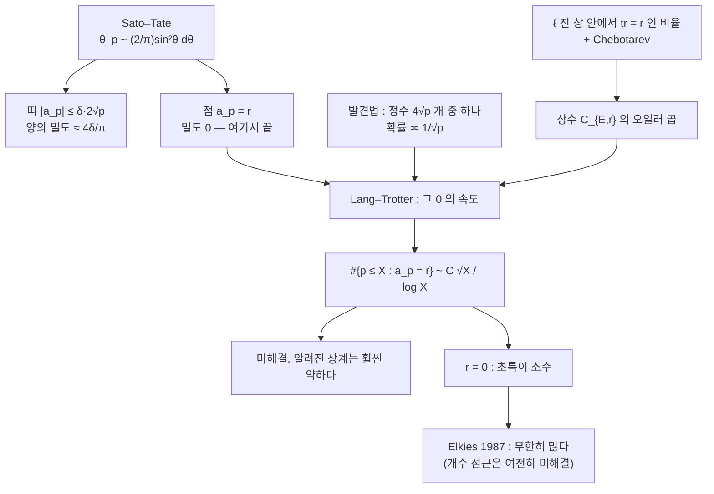

# Lang–Trotter 추측과 초특이 소수

# 개요

[Sato–Tate 분포](sato-tate.md)는 Frobenius 각 $\theta_p$ 가 $\frac2\pi\sin^2\theta\,d\theta$ 를 따른다고 말한다. 연속측도다. 그러므로 한 점의 질량이 $0$ 이고, 특정한 정수값

$$
a_p=r\qquad(r\ \text{고정})
$$

를 갖는 소수의 **밀도가 $0$ 이다**. Sato–Tate 는 여기서 말을 멈춘다. 밀도가 $0$ 이라는 것은 개수가 $\pi(X)$ 보다 작게 자란다는 뜻일 뿐, 유한한지 무한한지조차 말해 주지 않는다.

Lang 과 Trotter 는 1976 년에 그 빈자리를 채우는 추측을 냈다.

$$
\#\{p\le X:\ a_p=r\}\ \sim\ C_{E,r}\,\frac{\sqrt X}{\log X}
$$

$\sqrt X/\log X$ 다. $\pi(X)\approx X/\log X$ 에 비해 제곱근만큼 작다. $r=0$ 인 경우가 **초특이 소수**의 개수이고, 여기에는 별도의 상수와 별도의 역사가 있다.

왜 $\sqrt X$ 인가. 확률적 발견법이 명쾌하다. $a_p$ 는 길이 $4\sqrt p$ 인 구간 위에 Sato–Tate 측도로 흩어진 정수다. 그 구간 안의 정수가 $4\sqrt p$ 개쯤이므로 특정한 값 하나를 맞출 확률이 $\asymp1/\sqrt p$ 다. 그러면

$$
\sum_{p\le X}\frac1{\sqrt p}\ \asymp\ \frac{\sqrt X}{\log X}
$$

가 된다. 상수 $C_{E,r}$ 는 이 발견법을 $\ell$ 진 표현의 상으로 보정한 것이고, $a_p\equiv r$ 이 $\bmod\ell$ 에서 얼마나 자주 일어나는지를 모든 $\ell$ 에 걸쳐 곱한 오일러 곱이다.

추측은 열려 있다. 알려진 것은 상계뿐이고, 그나마도 예상보다 훨씬 약하다. 다만 $r=0$ 에서는 **무한성**이 증명되어 있다. Elkies 가 1987 년에 $\mathbb Q$ 위의 모든 타원곡선이 무한히 많은 초특이 소수를 가짐을 보였다.

# 직관

## 띠와 점

Sato–Tate 와 Lang–Trotter 의 차이는 **띠와 점**의 차이다.

$|a_p|\le\delta\cdot2\sqrt p$ 라는 조건은 각의 **구간**을 지정한다. $\delta$ 가 작아도 구간의 길이는 양수이므로 Sato–Tate 측도가 양의 질량을 주고, 그런 소수는 양의 밀도로 존재한다. 질량은 대략

$$
\int_{\pi/2-\arcsin\delta}^{\pi/2+\arcsin\delta}\frac2\pi\sin^2\theta\,d\theta\ \approx\ \frac{4\delta}\pi
$$

다. 아래 계산에서 $\delta=0.02$ 로 이 값을 확인한다.

반면 $a_p=0$ 은 **점**이다. $p$ 가 커질수록 $a_p$ 가 놓일 수 있는 자리가 $4\sqrt p$ 개로 늘어나므로 한 자리를 맞출 확률이 $1/\sqrt p$ 로 줄어든다. 띠는 폭이 $\sqrt p$ 에 비례해 늘어나지만 점은 늘어나지 않는다. 이 차이가 전부다.

그러므로 Sato–Tate 가 아무리 정밀해져도 Lang–Trotter 는 따라 나오지 않는다. 연속측도는 점의 질량을 $0$ 이라고만 말하고, $0$ 으로 가는 **속도**는 말하지 않는다. 속도를 알려면 $\bmod\ell$ 정보를 모든 $\ell$ 에서 모아야 한다.

## 상수가 왜 오일러 곱인가

$a_p=r$ 을 확인하려면 모든 $\ell$ 에서 $a_p\equiv r\pmod\ell$ 이어야 한다. [Galois 표현](galois-representations.md) $\rho_{E,\ell}$ 의 상 안에서 대각합이 $r$ 인 원소의 비율이 그 확률을 준다. 상이 $\mathrm{GL}\_2(\mathbb F_\ell)$ 전체라면(CM 이 없으면 거의 모든 $\ell$ 에서 그렇다, Serre) 그 비율은 초등적으로 계산된다.

그리고 [Chebotarev 밀도 정리](chebotarev.md)가 각 $\ell$ 에서의 밀도를 실제 소수의 밀도로 바꿔 준다. 서로 다른 $\ell$ 들이 독립이라 가정하면 확률이 곱해지고, 아르키메데스 쪽의 $1/\sqrt p$ 와 합쳐

$$
C_{E,r}=\frac2\pi\cdot\prod_\ell(\text{국소 인자})
$$

꼴이 나온다. 구조가 Hardy–Littlewood 의 쌍둥이 소수 상수와 똑같다. 국소 조건을 곱하고 아르키메데스 밀도를 곱한다. 어려움도 같은 곳에 있다. 독립성을 증명할 방법이 없다.

## 왜 r=0 만 풀렸는가

초특이 소수는 특별하다. $a_p=0$ 이라는 조건이 $p$ 에서 곡선이 **초특이**라는 기하적 조건이고, 그것이 [Newton 다각형](newton-polygon.md)의 기울기가 $\tfrac12,\tfrac12$ 라는 것, 형식군의 높이가 $2$ 라는 것과 같다. 순수한 산술 조건이 아니라 환원의 유형에 관한 조건이다.

Elkies 의 증명은 이 기하를 쓴다. 초특이 소수가 유한하다고 가정하고, 허수이차 차수(order)의 Hilbert 유체론과 힐베르트 류다항식을 써서 모순을 끌어낸다. 핵심은 초특이 $j$ 불변량이 $\mathbb F_{p^2}$ 에 살고 그 개수가 대략 $p/12$ 라는 사실, 그리고 복소곱셈을 가진 곡선의 환원이 초특이가 되는 소수를 이차 상호법칙으로 통제할 수 있다는 사실이다. $r\ne0$ 에는 이런 기하가 없다.



# 정의

## Lang–Trotter 추측

$E/\mathbb Q$ 를 복소곱셈이 없는 타원곡선, $r\in\mathbb Z$ 를 고정한다.

$$
\pi_{E,r}(X)=\#\{p\le X:\ p\ \text{좋은 환원},\ a_p=r\}
$$

> **추측 (Lang–Trotter, 1976).** $r\ne0$ 이거나 $r=0$ 이면
> $$\pi_{E,r}(X)\sim C_{E,r}\frac{\sqrt X}{\log X}\qquad(X\to\infty)$$
> 단 $C_{E,r}=0$ 인 자명한 경우(합동 조건 때문에 $a_p=r$ 이 유한 번만 가능한 경우)는 제외한다.

$r$ 이 홀수인지 짝수인지, $E$ 가 어떤 유리 등분점을 갖는지에 따라 $C_{E,r}$ 가 $0$ 이 될 수 있다. 예를 들어 $E$ 가 유리 2 등분점을 가지면 $a_p$ 가 항상 짝수라 홀수 $r$ 은 나오지 않는다.

## 초특이 소수

$p$ 가 **초특이 소수**라 함은 $E$ 의 $\bmod p$ 환원이 초특이라는 것, 곧 $a_p\equiv0\pmod p$ 라는 뜻이다. $p>3$ 이고 좋은 환원이면 Hasse 한계 $|a_p|\le2\sqrt p<p$ 때문에 이것은 $a_p=0$ 과 같다.

> **정리 (Elkies, 1987).** $\mathbb Q$ 위의 모든 타원곡선은 무한히 많은 초특이 소수를 갖는다.

개수의 점근은 여전히 추측이다. Lang–Trotter 는 $\sim C\sqrt X/\log X$ 를 예측하고, Elkies 는 $\gg\log\log X$ 정도의 하계만 준다.

## 알려진 상계

무조건적으로 알려진 것은 이 정도다.

$$
\pi_{E,r}(X)\ \ll\ \frac{X\,(\log\log X)^2}{(\log X)^2}
$$

추측값 $\sqrt X/\log X$ 와 비교하면 거의 $\sqrt X$ 만큼 멀다. 일반화 Riemann 가설을 가정하면 $X^{4/5}$ 규모까지 내려가지만, 여전히 $\sqrt X$ 에는 못 미친다. CM 이 있는 경우는 사정이 낫다. 허수이차체의 Hecke 지표로 환원되어 $\pi_{E,0}(X)\sim\frac12\pi(X)$ 처럼 정확한 답이 나온다.

# 성질

## 세 층위

이 저장소에서 다룬 $a_p$ 에 관한 진술을 층으로 정리하면 이렇다.

| 층위 | 진술 | 상태 |
|---|---|---|
| 크기 | $\lvert a_p\rvert\le2\sqrt p$ | [Hasse, Deligne](deligne-weil-conjectures.md) — 정리 |
| 분포(띠) | $\theta_p\sim\frac2\pi\sin^2\theta\,d\theta$ | [Sato–Tate](sato-tate.md) — 정리 |
| 분포(점) | $\#\{a_p=r\}\sim C\sqrt X/\log X$ | Lang–Trotter — 미해결 |
| 점의 무한성 | $a_p=0$ 이 무한히 많다 | Elkies — 정리 |

아래로 갈수록 미세하고 어렵다. 위 층이 아래 층을 함의하지 않는다는 점이 중요하다. Sato–Tate 를 아무리 정밀한 오차항과 함께 얻어도 Lang–Trotter 는 나오지 않는다. 연속측도의 한 점이기 때문이다.

## 관련 추측들

같은 $\sqrt X/\log X$ 꼴이 여러 곳에 나타난다.

- **고정된 자취.** 위의 $a_p=r$ 인 경우다.
- **Koblitz 추측.** $\#E(\mathbb F_p)$ 가 소수인 $p$ 의 개수가 $\asymp X/(\log X)^2$ 라는 추측. 이쪽은 $X/(\log X)^2$ 라 층위가 다르다. 암호에서 좋은 곡선을 찾는 비용을 예측한다.
- **고정된 환원 유형.** $\mathrm{End}(E\bmod p)$ 가 주어진 차수가 되는 소수의 개수. 역시 $\sqrt X/\log X$ 다.

공통점은 "밀도 $0$ 인 조건의 개수를 세는" 문제이고, 전부 Chebotarev 를 무한히 많은 확대에 걸쳐 균등하게 적용해야 한다는 같은 장벽에 걸려 있다.

# 활용

## √X/log X 규모를 관측한다

$p\le60000$ 에서 $a_p$ 를 전부 계산하고, $a_p=r$ 인 소수의 개수를 $X$ 를 키워 가며 센다. 개수를 $\sqrt X/\log X$ 로 나눈 값이 거의 일정하면 그 규모가 맞는 것이고, $X/\log X$ 로 나눈 값이 $0$ 으로 줄면 $\pi(X)$ 규모는 아니라는 뜻이다.

```python
from math import isqrt, log, sqrt

X = 60000
sieve = bytearray([1]) * (X + 1); sieve[0:2] = b"\0\0"
for i in range(2, isqrt(X) + 1):
    if sieve[i]: sieve[i*i::i] = bytearray(len(sieve[i*i::i]))
PRIMES = [i for i in range(2, X + 1) if sieve[i]]

def a_p(p, a, b):
    """제곱잉여 표를 한 번 만들고 x 를 훑는다.  O(p)."""
    qr = bytearray(p)
    for t in range(1, p // 2 + 1): qr[t * t % p] = 1
    s = 0
    for x in range(p):
        c = (x * x % p * x + a * x + b) % p
        s += 0 if c == 0 else (1 if qr[c] else -1)
    return -s

A, B = 1, 1                                   # E : y^2 = x^3 + x + 1, CM 없음
D = -16 * (4 * A ** 3 + 27 * B ** 2)
print(f"E : y^2 = x^3 + x + 1,  판별식 {D},  p <= {X}")
good, ap = [], {}
for p in PRIMES:
    if p < 5 or D % p == 0: continue
    good.append(p); ap[p] = a_p(p, A, B)
print(f"좋은 환원의 소수 {len(good)} 개\n")

CUTS = [5000, 10000, 20000, 40000, 60000]
print(f"{'r':>4} " + " ".join(f"{'N(' + str(c) + ')':>9}" for c in CUTS))
for r in [0, 1, -1, 2, -2]:
    print(f"{r:>4} " + " ".join(
        f"{sum(1 for p in good if p <= c and ap[p] == r):>9}" for c in CUTS))

print("\n  비율 N(X) / (√X/log X) 가 거의 일정하면 √X/log X 규모다.")
print(f"{'r':>4} " + " ".join(f"{c:>9}" for c in CUTS))
for r in [0, 1, -1, 2, -2]:
    print(f"{r:>4} " + " ".join(
        f"{sum(1 for p in good if p <= c and ap[p] == r)/(sqrt(c)/log(c)):>9.3f}"
        for c in CUTS))

print("\n  대조 : 만약 X/log X 규모라면 이 비율은 0 으로 빨리 줄어야 한다.")
for r in [0, 1]:
    print(f"{r:>4} " + " ".join(
        f"{sum(1 for p in good if p <= c and ap[p] == r)/(c/log(c)):>9.5f}"
        for c in CUTS))

# E : y^2 = x^3 + x + 1,  판별식 -496,  p <= 60000
# 좋은 환원의 소수 6054 개
#
#    r   N(5000)  N(10000)  N(20000)  N(40000)  N(60000)
#    0         6         9        13        15        16
#    1         5         8         8        11        12
#   -1         3         5         6         9        10
#    2         8        11        16        21        25
#   -2         8        14        19        23        24
#
#   비율 N(X) / (√X/log X) 가 거의 일정하면 √X/log X 규모다.
#    r      5000     10000     20000     40000     60000
#    0     0.723     0.829     0.910     0.795     0.719
#    1     0.602     0.737     0.560     0.583     0.539
#   -1     0.361     0.461     0.420     0.477     0.449
#    2     0.964     1.013     1.120     1.113     1.123
#   -2     0.964     1.289     1.331     1.219     1.078
#
#   대조 : 만약 X/log X 규모라면 이 비율은 0 으로 빨리 줄어야 한다.
#    0   0.01022   0.00829   0.00644   0.00397   0.00293
#    1   0.00852   0.00737   0.00396   0.00291   0.00220
```

$X$ 가 $5000$ 에서 $60000$ 으로 열두 배 커지는 동안 $\sqrt X/\log X$ 로 정규화한 값은 $r$ 마다 대체로 한 자리에 머문다. 반면 $X/\log X$ 로 정규화하면 값이 $3$ 배 이상 줄어든다. 표본이 작아 흔들림이 크지만($r=0$ 에서 소수가 $16$ 개뿐이다) 두 규모 가운데 어느 쪽인지는 분명하다.

$r=\pm2$ 의 상수가 $r=\pm1$ 보다 눈에 띄게 크다. 상수가 $r$ 에 의존한다는 것이 Lang–Trotter 의 오일러 곱이 말하는 바이고, 홀짝에 따른 국소 인자의 차이가 가장 큰 몫을 한다.

## 초특이 소수를 나열한다

```python
ss = [p for p in good if ap[p] == 0]
print(f"  {len(ss)} 개 : {ss}")
print(f"  밀도 {len(ss)}/{len(good)} = {len(ss)/len(good):.5f}  →  Sato–Tate 는 0 을 예측")
print(f"  √X/log X = {sqrt(X)/log(X):.2f},  개수/그 값 = {len(ss)/(sqrt(X)/log(X)):.3f}")

#   16 개 : [17, 179, 227, 523, 1031, 3767, 6131, 6551, 6679, 11519, 13421,
#            14449, 16007, 31771, 35507, 52859]
#   밀도 16/6054 = 0.00264  →  Sato–Tate 는 0 을 예측
#   √X/log X = 22.26,  개수/그 값 = 0.719
```

$p=17$ 은 [Kedlaya 문서](kedlaya-algorithm.md)에서 Hasse 불변량이 $0$ 으로 나왔던 그 소수다. 여기서 목록의 첫 원소로 다시 나타난다. 소수 $6054$ 개 가운데 $16$ 개, 비율 $0.0026$ 이다. 밀도가 $0$ 으로 가는 중이지만 Elkies 의 정리대로 결코 끊기지 않는다.

## 띠와 점을 나란히 놓는다

```python
band = [p for p in good if abs(ap[p]) <= 0.02 * 2 * sqrt(p)]
print(f"  띠 |a_p| <= 0.02·2√p : {len(band)}/{len(good)} = {len(band)/len(good):.4f}"
      f"   (ST 예측 ≈ 4·0.02/π = {4*0.02/3.141592653589793:.4f})")
print(f"  점 a_p = 0        : {len(ss)}/{len(good)} = {len(ss)/len(good):.5f}")

#   띠 |a_p| <= 0.02·2√p : 155/6054 = 0.0256   (ST 예측 ≈ 4·0.02/π = 0.0255)
#   점 a_p = 0        : 16/6054 = 0.00264
```

띠의 관측 비율 $0.0256$ 이 Sato–Tate 예측 $0.0255$ 와 소수점 셋째 자리까지 맞는다. 같은 자료에서 점의 비율은 $0.0026$ 으로 열 배 작고, $X$ 를 키우면 계속 줄어든다. **띠는 Sato–Tate 가 정확히 예측하고 점은 예측하지 못한다.** 두 추측이 다른 층위라는 말의 구체적 내용이 이 두 줄이다.

## 어디에 쓰이는가

- **암호에서의 곡선 선택.** 초특이 곡선은 MOV 공격으로 [이산로그](discrete-logarithm.md)가 유한체 이산로그로 환원되므로 배제해야 한다. 무작위 곡선이 초특이일 확률이 $\asymp1/\sqrt p$ 라는 것이 위 계산의 실무적 의미다. 사실상 걱정할 일이 없다는 뜻이고, 그래도 검사는 한다.
- **초특이 동종사상 암호.** 반대로 초특이 곡선만 모아 그 사이의 동종사상 그래프를 쓰는 암호 계열(SIDH/SIKE 및 그 후속)이 있다. 초특이 $j$ 불변량이 $\mathbb F_{p^2}$ 에 $\approx p/12$ 개라는 사실이 설계의 근거다.
- **수치 실험의 표준 대상.** Lang–Trotter 상수의 수치 검증은 대량의 $a_p$ 표를 요구하고, 그 표를 [SEA](sea-algorithm.md) 알고리즘이 만든다. 추측을 정밀하게 검증하려면 $X$ 를 $10^{10}$ 이상으로 올려야 한다.
- **일반화.** 아벨 다양체와 모듈러 형식의 $a_p$ 와 수체 위의 곡선으로 같은 꼴의 추측이 확장되어 있고 대부분 열려 있다.

[^1]: S. Lang, H. Trotter, *Frobenius Distributions in GL₂-Extensions*, Lecture Notes in Math. 504 (1976). 초특이 소수의 무한성은 N. Elkies, *The existence of infinitely many supersingular primes for every elliptic curve over Q*, Invent. Math. **89** (1987), 561–567. 상계는 E. Fouvry, M. R. Murty 및 V. K. Murty 의 일련의 논문, 요약은 A. Cojocaru, *Questions about the reductions modulo primes of an elliptic curve*, in *Number Theory* (CRM Proc. 36, 2004). 초특이 동종사상 그래프는 D. Jao, L. De Feo, PQCrypto 2011. 본문의 수치 계산은 직접 한 것이다.

# 연관 문서

## 선수지식

- [Sato–Tate 분포](sato-tate.md)

## 더 알아보기

- [초특이 동종사상 그래프와 SIDH](supersingular-isogeny-graphs.md)

#number_theory #probability #cryptography #computation
