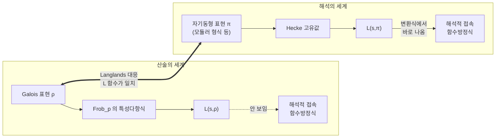
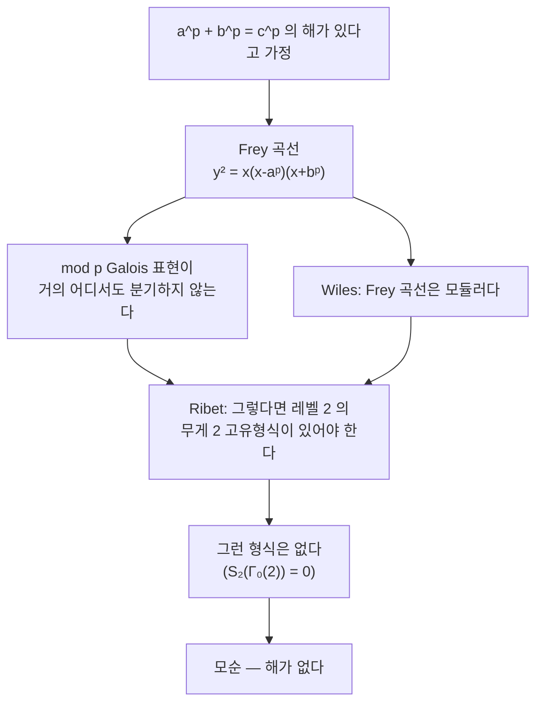

# Langlands 강령

# 개요

[유체론](class-field-theory.md)은 수체 `K` 의 아벨 확대를 `K` 안의 산술로 완전히 분류했다. 그 성공의 열쇠는 Galois 군이 아벨일 때 Frobenius 원소가 소 아이디얼 하나마다 잘 정의된다는 사실이었다. 비아벨 확대에서는 이 사상이 무너진다. `\mathrm{Frob}_{\mathfrak p}` 가 원소가 아니라 켤레류이기 때문이다.

Langlands 강령은 이 벽을 정면으로 넘는다. 켤레류에서 수를 뽑는 표준적인 방법은 [표현의 지표](group-representations.md)를 취하는 것이므로, Galois 군의 표현 `\rho\colon\mathrm{Gal}(\bar K/K)\to\mathrm{GL}_n` 을 대상으로 삼는다. 그리고 각 `\rho` 에 전혀 다른 세계의 대상, 곧 `\mathrm{GL}_n(\mathbb A_K)` 위의 자기동형 표현 `\pi` 가 대응한다고 예측한다.

$$
\rho \;\longleftrightarrow\; \pi,\qquad L(s,\rho)=L(s,\pi)
$$

`n=1` 이 유체론이다. `n=2` 이고 `K=\mathbb Q` 인 경우의 자기동형 쪽 대상은 [모듈러 형식](modular-forms.md)이고, 그 안의 한 조각이 모듈러성 정리다. 유리수체 위의 모든 [타원곡선](elliptic-curves.md)이 모듈러 형식에서 온다는 그 정리가 Fermat 마지막 정리의 증명을 완성했다. 강령 전체는 여전히 열려 있고, 정수론에서 가장 큰 조직 원리로 받아들여진다.

네 선수 문서가 각각 다른 자리를 맡는다. 유체론은 `n=1` 의 이미 증명된 사례이자 강령이 일반화하려는 대상이고, 군의 표현은 Galois 쪽 대상을 만드는 도구이며, 모듈러 형식은 자기동형 쪽의 가장 구체적인 실물이고, 타원곡선은 대응이 실제로 성립함을 확인할 수 있는 검증 사례다.

# 직관

## 왜 표현을 보는가

분기하지 않는 `\mathfrak p` 에 대해 `\mathrm{Frob}_{\mathfrak p}` 는 켤레류다. 켤레류에서 얻을 수 있는 불변량은 켤레불변 함수의 값뿐이고, 유한군에서 그런 함수는 지표들이 생성한다. 표현을 잡는 것은 선택이 아니라 필연이다.

표현 `\rho` 를 하나 고정하면 소수마다 행렬 `\rho(\mathrm{Frob}_{\mathfrak p})` 가 켤레를 빼고 정해지고, 그 특성다항식은 완전히 정해진다. 이 데이터를 Euler 곱으로 묶은 것이 Artin `L` 함수다.

$$
L(s,\rho)=\prod_{\mathfrak p}\det\big(1-\rho(\mathrm{Frob}_{\mathfrak p})\,N\mathfrak p^{-s}\big)^{-1}
$$

`n=1` 이면 이것이 Hecke `L` 함수이고, `K=\mathbb Q` 로 내려오면 [Dirichlet L 함수](dirichlet-l-functions.md)다. Galois 쪽에서 만들 수 있는 것은 여기까지다.

## 해석적 성질이 보이지 않는다

`L(s,\rho)` 의 정의는 `\mathrm{Re}(s)>1` 에서만 수렴한다. Artin 은 `\rho` 가 자명하지 않은 기약 표현이면 `L(s,\rho)` 가 복소평면 전체로 정함수가 되어야 한다고 추측했지만, Galois 쪽 정의만으로는 해석적 접속조차 보이지 않는다. Euler 곱은 국소 정보를 모아 놓은 것일 뿐 대역적인 해석 구조를 갖고 있지 않다.

반대편의 상황은 정확히 뒤집혀 있다. 모듈러 형식의 `L` 함수는 해석적 접속과 함수방정식이 거의 공짜다. 형식의 변환 규칙에 Mellin 변환을 적용하면 바로 나오기 때문이다. 대신 그 계수들이 어떤 산술적 의미를 갖는지가 보이지 않는다.



대응이 성립하면 양쪽이 서로의 약점을 메운다. Galois 쪽은 해석적 성질을 얻고(Artin 추측), 자기동형 쪽은 계수의 산술적 의미를 얻는다.

## 왜 대응이 있어야 하는가

두 세계가 주는 데이터의 모양이 같다. Galois 쪽은 소수마다 `n` 개의 근(Frobenius 고윳값)을 주고, 자기동형 쪽은 소수마다 `n` 개의 [Satake 매개변수](satake-isomorphism.md)를 준다. 유체론이 `n=1` 에서 이 둘이 실제로 같음을 이미 증명했다.

유일성도 보장된다. 강한 다중도 1 정리에 따르면 거의 모든 자리에서 국소 성분이 같은 두 자기동형 표현은 같다. 따라서 어떤 `\rho` 에 대응하는 `\pi` 는 존재한다면 하나뿐이다. 남은 것은 존재뿐이며, 그것이 강령의 내용이다.

# 정의

## Galois 표현

`G_K=\mathrm{Gal}(\bar K/K)` 는 무한 Galois 군이고 자연스러운 profinite 위상을 갖는다. 연속 준동형

$$
\rho\colon G_K\to\mathrm{GL}_n(E)
$$

를 Galois 표현이라 한다. 계수체 `E` 를 무엇으로 잡는지가 중요하다.

- `E=\mathbb C` : 상이 반드시 유한군이다. `\mathrm{GL}_n(\mathbb C)` 에 1 의 근방에 자명하지 않은 부분군이 없기 때문이다. 이런 `\rho` 를 **Artin 표현**이라 하고, 유한 Galois 확대의 표현과 같다.
- `E=\bar{\mathbb Q}_\ell` : 상이 무한할 수 있다. `\ell` 진 위상이 profinite 위상과 어울리기 때문이다. 기하에서 나오는 표현은 대부분 이쪽이며, 대수다양체의 에탈 코호몰로지가 표준적인 공급원이다.

유한 개의 소수를 뺀 모든 `\mathfrak p` 에서 `\rho` 가 불분기여야 하고, 그런 `\mathfrak p` 에서 `\rho(\mathrm{Frob}_{\mathfrak p})` 의 특성다항식이 `L(s,\rho)` 의 국소 인자를 준다.

## 자기동형 표현

`\mathbb A_K` 를 `K` 의 아델 환이라 하자. `\mathrm{GL}_n(K)` 는 `\mathrm{GL}_n(\mathbb A_K)` 의 이산 부분군이고, 그 몫 위의 함수공간

$$
L^2\big(\mathrm{GL}_n(K)\backslash\mathrm{GL}_n(\mathbb A_K)\big)
$$

에 `\mathrm{GL}_n(\mathbb A_K)` 가 오른쪽 평행이동으로 작용한다. 이 작용의 기약 성분을 **자기동형 표현**이라 한다. 특히 상수항이 사라지는 부분공간에서 나오는 것을 첨점 표현이라 하고, 이쪽이 Galois 표현에 대응한다.

모든 자기동형 표현은 국소 표현의 제한 텐서곱 `\pi=\bigotimes'_v\pi_v` 로 분해되고, 거의 모든 `v` 에서 `\pi_v` 가 불분기라 `n` 개의 복소수 **[Satake 매개변수](satake-isomorphism.md)** `\alpha_{1,v},\dots,\alpha_{n,v}` 로 결정된다. `L` 함수는 이들로 만든다.

$$
L(s,\pi)=\prod_v\prod_{i=1}^n\big(1-\alpha_{i,v}\,q_v^{-s}\big)^{-1}
$$

`n=1` 일 때 `\mathrm{GL}_1(\mathbb A_K)/K^\times` 가 곧 이델류군이므로 자기동형 표현은 Hecke 지표이고, 유체론이 정확히 Galois 쪽과의 대응을 준다. **유체론은 `\mathrm{GL}_1` Langlands 다.**

## 상호성 추측

> **Langlands 상호성.** 적당한 조건(기약, 대수적, 국소 조건)을 만족하는 `n` 차원 Galois 표현 `\rho` 마다 `\mathrm{GL}_n(\mathbb A_K)` 의 첨점 자기동형 표현 `\pi` 가 존재해 `L(s,\rho)=L(s,\pi)` 이고, 국소 인자들이 모든 자리에서 일치한다.

`L(s,\pi)` 쪽의 해석적 성질은 자기동형 표현론에서 증명되어 있으므로, 대응이 성립하면 `L(s,\rho)` 의 정함수성, 곧 Artin 추측이 즉시 따라온다.

## 함자성

상호성보다 더 근본적인 추측이 함자성이다. 각 환원군 `G` 에 **`L`-군** `{}^LG` 라는 이중군을 붙이는데, 근계를 뒤집어 만든 쌍대군 `\hat G` 에 Galois 군을 반직적으로 붙인 것이다. 예를 들어 `{}^L\mathrm{GL}_n=\mathrm{GL}_n(\mathbb C)\times G_K` 이고 `{}^L\mathrm{SO}_{2n+1}=\mathrm{Sp}_{2n}(\mathbb C)\times G_K` 다.

> **함자성.** `L`-군 준동형 `{}^LH\to{}^LG` 가 있으면, `H` 의 자기동형 표현을 `G` 의 자기동형 표현으로 보내는 옮김이 있어야 하고 `L` 함수가 대응해야 한다.

상호성은 특수한 경우로 흡수된다. `H` 를 자명군으로 두면 `{}^LH=G_K` 이고, `G_K\to\mathrm{GL}_n(\mathbb C)\times G_K` 준동형이 바로 Galois 표현이기 때문이다. 함자성이 주는 구체적 결과의 목록이 길다.

- **밑변경**: 확대 `K'/K` 를 따라 자기동형 표현을 올린다. Wiles 의 증명에서 핵심 도구였다.
- **대칭 거듭제곱**: `\mathrm{GL}_2` 의 `\pi` 에서 `\mathrm{Sym}^k\pi` 를 `\mathrm{GL}_{k+1}` 의 자기동형 표현으로 만든다. Sato–Tate 추측이 여기서 나온다.
- **자기동형 유도**: `H` 를 부분체의 군으로 두면 유체론의 유도 표현 이야기가 일반화된다.

# 성질

## 어디까지 증명되었나

| 경우 | 상태 |
|---|---|
| `n=1`, 모든 수체 | 증명 (유체론) |
| `n=2`, `K=\mathbb Q`, 홀수 기약 | 대부분 증명 (Serre 추측, Khare–Wintenberger 2009) |
| `\mathbb Q` 위 타원곡선 | 증명 (Wiles–Taylor 1995, Breuil–Conrad–Diamond–Taylor 2001) |
| 함수체 `\mathbb F_q(X)`, 모든 `n` | 증명 (Drinfeld `n=2`, L. Lafforgue 일반 `n`) |
| 일반 수체, `n\ge2` | 열림 |

함수체에서 먼저 풀린 것이 우연이 아니다. 함수체의 Galois 군은 곡선의 기본군이라 기하학적 대상이고, 모듈라이 공간 위에서 논증을 펼 수 있다. 이 기하적 관점을 복소 곡선으로 옮긴 것이 기하적 Langlands 강령이며, 물리의 게이지 이론과의 연결로도 연구된다.

## 모듈러 형식과 `\mathrm{GL}_2`

`K=\mathbb Q`, `n=2` 의 자기동형 표현은 고전적인 모듈러 형식으로 번역된다. 무게 `k`, 레벨 `N` 의 첨점형식은 상반평면 위의 정칙함수 `f` 로

$$
f\Big(\frac{az+b}{cz+d}\Big)=(cz+d)^kf(z)\quad\Big(\begin{smallmatrix}a&b\\c&d\end{smallmatrix}\Big)\in\Gamma_0(N)
$$

를 만족하고 첨점에서 0 이 되는 것이다. Hecke 작용소의 동시 고유벡터를 잡고 `q=e^{2\pi iz}` 전개 `f=\sum a_nq^n` 을 `a_1=1` 로 정규화하면, 고유값이 곧 `a_p` 이고

$$
L(s,f)=\sum_{n\ge1}\frac{a_n}{n^s}=\prod_p\big(1-a_pp^{-s}+p^{k-1-2s}\big)^{-1}
$$

가 된다. 오른쪽의 이차 인자가 2 차원 표현의 특성다항식과 같은 모양임이 대응의 첫 신호다.

Deligne 은 무게 `k\ge2` 의 고유형식마다 2 차원 `\ell` 진 Galois 표현이 있어 `\mathrm{tr}\,\rho_f(\mathrm{Frob}_p)=a_p` 임을 증명했다. 모듈러 곡선의 코호몰로지에서 잘라내는 방식이다. 이것이 자기동형에서 Galois 로 가는 방향이고, 어려운 것은 반대 방향이다.

## 모듈러성 정리와 Fermat

> `\mathbb Q` 위의 모든 타원곡선 `E` 는 모듈러다. 곧 무게 2, 레벨 `N=\mathrm{cond}(E)` 의 고유형식 `f` 가 있어 모든 `p\nmid N` 에서 `a_p(E)=a_p(f)` 다.

`a_p(E)=p+1-\#E(\mathbb F_p)` 이므로 좌변은 점 개수를 세는 순수한 유한체 계산이고, 우변은 복소해석적 대상의 Fourier 계수다. 두 수열이 같다는 주장이다.

Fermat 마지막 정리로 가는 길은 다음과 같다.



Frey 곡선의 판별식이 `(abc)^{2p}` 라 도체가 극도로 작아지고, Ribet 의 준위 내림 정리가 이를 존재하지 않는 형식의 존재로 바꾼다. Wiles 가 메운 것은 "Frey 곡선이 모듈러다" 라는 한 칸이다. 그 증명 자체가 `R=T` 라는 변형환과 Hecke 대수의 동형을 세우는 방식이고, 오늘날 모듈러성 올림 정리라 불리는 기법의 출발점이 되었다.

## Sato–Tate 분포

모듈러성은 `a_p` 의 값을 하나씩 말해 주지만 분포는 말해 주지 않는다. Hasse 정리가 `|a_p|\le2\sqrt p` 를 주므로 `a_p=2\sqrt p\cos\theta_p` 로 쓸 수 있고, 복소곱셈이 없는 `E` 에서 `\theta_p` 가 어떻게 퍼지는지를 묻는 것이 Sato–Tate 추측이다.

$$
\mu_{ST}=\frac2\pi\sin^2\theta\,d\theta,\qquad \theta\in[0,\pi]
$$

증명의 구조가 강령의 위력을 그대로 보여준다. `\mathrm{Sym}^k` 함자성으로 `\mathrm{Sym}^k\pi_E` 가 자기동형임을 보이면 그 `L` 함수가 `\mathrm{Re}(s)=1` 에서 0 이 되지 않고, 그러면 표준적인 Tauber 논증이 분포를 준다. 2011 년에 모든 `k` 에 대해 필요한 자기동형성이 증명되면서 추측이 정리가 되었다.

# 활용

## 모듈러성을 눈으로 확인한다

도체 11 의 타원곡선 `E\colon y^2+y=x^3-x^2` 은 `X_0(11)` 자신이고, 대응하는 고유형식은 에타 곱으로 명시된다.

$$
f(z)=q\prod_{n\ge1}(1-q^n)^2(1-q^{11n})^2=\sum_{n\ge1}a_nq^n
$$

왼쪽은 유한체에서 점을 세는 계산이고 오른쪽은 무한곱의 전개다. 두 수열이 같아야 한다.

```python
def primes(n):
    return [p for p in range(2, n) if all(p % d for d in range(2, int(p**0.5) + 1))]

def a_p(p):
    """E: y²+y = x³-x² 에서 a_p = p + 1 - #E(F_p).
    (2y+1)² = 4x³-4x²+1 로 완전제곱을 만들면 해의 개수가 Legendre 기호로 세어진다."""
    if p == 2:
        pts = 1 + sum(1 for x in range(2) for y in range(2)
                      if (y*y + y - x*x*x + x*x) % 2 == 0)
        return p + 1 - pts
    s = 0
    for x in range(p):
        t = (4*x**3 - 4*x**2 + 1) % p
        s += 0 if t == 0 else (1 if pow(t, (p - 1)//2, p) == 1 else -1)
    return -s                                     # #E = p+1+s 이므로 a_p = -s

def eta_coeffs(N):
    """f = q ∏(1-qⁿ)²(1-q^{11n})² 의 계수 a_1..a_N.
    (1-q^{mn}) 을 곱하는 것은 c[j] -= c[j-mn] 을 j 내림차순으로 한 번 훑는 것이다."""
    c = [0]*(N + 1); c[1] = 1                     # 맨 앞의 q
    for m in (1, 1, 11, 11):                      # 인자 두 개씩
        for n in range(1, N + 1):
            if m*n > N: break
            for j in range(N, m*n - 1, -1):
                c[j] -= c[j - m*n]
    return c

N = 100
f = eta_coeffs(N)
print("f 의 계수 a_1..a_15 :", f[1:16])
print("  p   a_p(E)  a_p(f)")
for p in primes(32):
    print(f"  {p:3}  {a_p(p):5}  {f[p]:6}   {a_p(p) == f[p]}")
print("p<100 의 모든 소수에서 일치 :", all(a_p(p) == f[p] for p in primes(N)))

# f 의 계수 a_1..a_15 : [1, -2, -1, 2, 1, 2, -2, 0, -2, -2, 1, -2, 4, 4, -1]
#   p   a_p(E)  a_p(f)
#     2     -2      -2   True
#     3     -1      -1   True
#     5      1       1   True
#     7     -2      -2   True
#    11      1       1   True
#    13      4       4   True
#    17     -2      -2   True
#    19      0       0   True
#    23     -1      -1   True
#    29      0       0   True
#    31      7       7   True
# p<100 의 모든 소수에서 일치 : True
```

`a_{13}=4` 라는 값이 `\#E(\mathbb F_{13})=10` 이라는 사실과 무한곱 전개의 13 번째 계수에서 동시에 나온다. 두 계산 사이에 아무 관계도 보이지 않는데 답이 같다. 이 일치가 모든 소수에서, 그리고 `\mathbb Q` 위의 모든 타원곡선에서 일어난다는 것이 모듈러성 정리다.

## Sato–Tate 분포를 세어 본다

같은 `a_p` 수열로 `\theta_p=\arccos\big(a_p/2\sqrt p\big)` 를 계산해 분포를 확인한다. `\mathbb Q` 위의 도체 11 곡선은 복소곱셈이 없으므로 `\frac2\pi\sin^2\theta\,d\theta` 를 따라야 한다.

```python
import math

buckets = [0]*6
for p in primes(20000):
    if p == 11: continue                          # 나쁜 환원
    theta = math.acos(max(-1, min(1, a_p(p)/(2*math.sqrt(p)))))
    buckets[min(5, int(theta/math.pi*6))] += 1

total = sum(buckets)
print("구간            관측     Sato-Tate 예측")
for i, b in enumerate(buckets):
    lo, hi = i*math.pi/6, (i + 1)*math.pi/6
    exp = (2/math.pi)*((hi - lo)/2 - (math.sin(2*hi) - math.sin(2*lo))/4)
    print(f"[{i}π/6, {i+1}π/6)   {b/total:.4f}       {exp:.4f}")

# 구간            관측     Sato-Tate 예측
# [0π/6, 1π/6)   0.0274       0.0288
# [1π/6, 2π/6)   0.1685       0.1667
# [2π/6, 3π/6)   0.2950       0.3045
# [3π/6, 4π/6)   0.3189       0.3045
# [4π/6, 5π/6)   0.1659       0.1667
# [5π/6, 6π/6)   0.0243       0.0288
```

소수 2261 개로 이미 반원 법칙이 보인다. 이 분포가 `\mathrm{Sym}^k` 함자성에서 나온다는 것이 요점이다. 국소 데이터의 통계가 `L` 함수의 대역적 해석 성질에 지배되고, 그 성질은 자기동형 쪽에서만 보이는 것이었다.

## 강령이 조직하는 것들

강령이 참이라면 따라 나오는 고전적 추측들의 목록이 길다.

- **Artin 추측**: 자명하지 않은 기약 Artin 표현의 `L` 함수는 정함수다. 2 차원 홀수 경우는 모듈러성으로 해결되었다.
- **Ramanujan–Petersson 추측**: 첨점형식의 계수 상계. 무게 `k` 고유형식에서 `|a_p|\le2p^{(k-1)/2}` 이고, Deligne 이 Weil 추측에서 유도했다.
- **Birch–Swinnerton-Dyer 추측**: `L(s,E)` 의 `s=1` 에서의 영점 차수가 계수와 같다는 추측. 모듈러성이 있어야 `L(s,E)` 가 `s=1` 에서 정의되기부터 한다.

수체의 산술을 해석과 표현론의 언어로 옮기는 일관된 사전이 있다는 것이 강령의 주장이고, 그 사전의 첫 항목이 유체론이었다. `\mathrm{GL}_1` 에서 확인된 원리를 모든 환원군으로 옮기려는 시도가 반세기 넘게 정수론의 지도를 그려 왔다.

# 연관 문서

## 선수지식

- [유체론](class-field-theory.md)
- [군의 표현과 지표](group-representations.md)
- [모듈러 형식](modular-forms.md)
- [타원곡선과 군 구성](elliptic-curves.md)

## 더 알아보기

- [Galois 표현과 에탈 코호몰로지](galois-representations.md)
- [Godement–Jacquet 적분](godement-jacquet.md)

#number_theory #group_theory #field_theory
