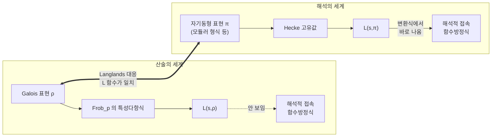

# Langlands 강령

# 개요

[유체론](class-field-theory.md)은 수체 $K$ 의 아벨 확대를 $K$ 안의 산술로 완전히 분류했다. 이 분류는 Galois 군이 아벨일 때 Frobenius 원소가 소 [아이디얼](ideals-quotient-rings.md) 하나마다 잘 정의된다는 점에 기댄다. 비아벨 확대에서는 이 사상이 무너진다. $\mathrm{Frob}\_{\mathfrak p}$ 가 원소가 아니라 켤레류이기 때문이다.

Langlands 강령은 켤레류를 다룰 수 있는 대상으로 바꾼다. 켤레류에서 수를 뽑는 표준적인 방법은 [표현의 지표](group-representations.md)를 취하는 것이므로, Galois 군의 표현 $\rho\colon\mathrm{Gal}(\bar K/K)\to\mathrm{GL}\_n$ 을 대상으로 삼는다. 그리고 각 $\rho$ 에 전혀 다른 세계의 대상, 곧 $\mathrm{GL}\_n(\mathbb A_K)$ 위의 자기동형 표현 $\pi$ 가 대응한다고 예측한다.

$$
\rho \thickspace\longleftrightarrow\thickspace \pi,\qquad L(s,\rho)=L(s,\pi)
$$

$n=1$ 이 유체론이다. $n=2$ 이고 $K=\mathbb Q$ 인 경우의 자기동형 쪽 대상은 [모듈러 형식](modular-forms.md)이고, 그 안의 한 조각이 모듈러성 정리다. 유리수체 위의 모든 [타원곡선](elliptic-curves.md)이 모듈러 형식에서 온다는 그 정리가 Fermat 마지막 정리의 증명을 완성했다. 일반 수체의 $n\ge2$ 는 증명되지 않았다[^1].

# 직관

## 켤레류와 표현

분기하지 않는 $\mathfrak p$ 에 대해 $\mathrm{Frob}\_{\mathfrak p}$ 는 켤레류다. 켤레류에서 얻을 수 있는 불변량은 켤레불변 함수의 값뿐이고 유한군에서 그런 함수는 지표들이 생성하므로, 표현이 대상이 된다.

표현 $\rho$ 를 하나 고정하면 소수마다 행렬 $\rho(\mathrm{Frob}\_{\mathfrak p})$ 가 켤레를 빼고 정해지고, 그 특성다항식은 완전히 정해진다. 이 데이터를 Euler 곱으로 묶은 것이 Artin $L$ 함수다.

$$
L(s,\rho)=\prod_{\mathfrak p}\det\big(1-\rho(\mathrm{Frob}\_{\mathfrak p})\thinspace N\mathfrak p^{-s}\big)^{-1}
$$

$n=1$ 이면 Hecke $L$ 함수이고 $K=\mathbb Q$ 로 내려오면 [Dirichlet L 함수](dirichlet-l-functions.md)다.

## 두 세계의 비대칭

$L(s,\rho)$ 의 정의는 $\mathrm{Re}(s)\gt 1$ 에서만 수렴한다. Artin 은 $\rho$ 가 자명하지 않은 기약 표현이면 $L(s,\rho)$ 가 복소평면 전체의 정함수라고 추측했지만, Euler 곱은 국소 정보를 모아 놓은 것이라 Galois 쪽 정의만으로는 해석적 접속이 보이지 않는다.

모듈러 형식의 $L$ 함수는 반대다. 형식의 변환 규칙에 Mellin 변환을 적용하면 해석적 접속과 함수방정식이 바로 나오지만, 계수의 산술적 의미가 보이지 않는다.

대응이 성립하면 Galois 쪽이 해석적 성질을 얻고(Artin 추측) 자기동형 쪽이 계수의 산술적 의미를 얻는다.

## 대응의 근거

두 세계가 주는 데이터의 모양이 같다. Galois 쪽은 소수마다 $n$ 개의 Frobenius 고윳값을 주고 자기동형 쪽은 소수마다 $n$ 개의 [Satake 매개변수](satake-isomorphism.md)를 주며, $n=1$ 에서 유체론이 둘의 일치를 증명했다.

강한 다중도 1 정리에 따르면 거의 모든 자리에서 국소 성분이 같은 두 자기동형 표현은 같으므로, $\rho$ 에 대응하는 $\pi$ 는 존재하면 하나뿐이다. 남은 것은 존재이고 그것이 강령의 내용이다.

# 정의

## Galois 표현

$G_K=\mathrm{Gal}(\bar K/K)$ 는 무한 Galois 군이고 자연스러운 profinite 위상을 갖는다. 연속 준동형

$$
\rho\colon G_K\to\mathrm{GL}\_n(E)
$$

를 **Galois 표현**이라 한다. 계수체 $E$ 의 선택이 표현의 성격을 정한다.

- $E=\mathbb C$ : 상이 반드시 유한군이다. $\mathrm{GL}\_n(\mathbb C)$ 에 1 의 근방에 자명하지 않은 부분군이 없기 때문이다. 이런 $\rho$ 를 **Artin 표현**이라 하고, 유한 Galois 확대의 표현과 같다.
- $E=\bar{\mathbb Q}\_\ell$ : 상이 무한할 수 있다. $\ell$ 진 위상이 profinite 위상과 어울리기 때문이다. 기하에서 나오는 표현은 대부분 이쪽이며, 대수다양체의 에탈 코호몰로지가 표준적인 공급원이다.

유한 개의 소수를 뺀 모든 $\mathfrak p$ 에서 $\rho$ 가 불분기여야 하고, 그런 $\mathfrak p$ 에서 $\rho(\mathrm{Frob}\_{\mathfrak p})$ 의 특성다항식이 $L(s,\rho)$ 의 국소 인자를 준다.

## 자기동형 표현

$\mathbb A_K$ 를 $K$ 의 아델 환이라 하자. $\mathrm{GL}\_n(K)$ 는 $\mathrm{GL}\_n(\mathbb A_K)$ 의 이산 부분군이고, 그 몫 위의 함수공간

$$
L^2\big(\mathrm{GL}\_n(K)\backslash\mathrm{GL}\_n(\mathbb A_K)\big)
$$

에 $\mathrm{GL}\_n(\mathbb A_K)$ 가 오른쪽 평행이동으로 작용한다. 이 작용의 기약 성분을 **자기동형 표현**이라 한다. 특히 상수항이 사라지는 부분공간에서 나오는 것을 첨점 표현이라 하고, 이쪽이 Galois 표현에 대응한다.

모든 자기동형 표현은 국소 표현의 제한 [텐서곱](tensor-products.md) $\pi=\bigotimes'\_v\pi_v$ 로 분해되고, 거의 모든 $v$ 에서 $\pi_v$ 가 불분기라 $n$ 개의 복소수 **[Satake 매개변수](satake-isomorphism.md)** $\alpha_{1,v},\dots,\alpha_{n,v}$ 로 결정된다. $L$ 함수는 이들로 만든다.

$$
L(s,\pi)=\prod_v\prod_{i=1}^n\big(1-\alpha_{i,v}\thinspace q_v^{-s}\big)^{-1}
$$

$n=1$ 일 때 $\mathrm{GL}\_1(\mathbb A_K)/K^\times$ 가 이델류군이므로 자기동형 표현이 Hecke 지표이고, 유체론이 Galois 쪽과의 대응을 준다. 유체론이 $\mathrm{GL}\_1$ 의 Langlands 대응이다.

## 상호성 추측

> **Langlands 상호성.** 적당한 조건(기약, 대수적, 국소 조건)을 만족하는 $n$ 차원 Galois 표현 $\rho$ 마다 $\mathrm{GL}\_n(\mathbb A_K)$ 의 첨점 자기동형 표현 $\pi$ 가 존재해 $L(s,\rho)=L(s,\pi)$ 이고, 국소 인자들이 모든 자리에서 일치한다.

$L(s,\pi)$ 의 해석적 성질은 자기동형 표현론에서 증명되어 있으므로, 대응이 성립하면 $L(s,\rho)$ 의 정함수성인 Artin 추측이 따라온다.

## 함자성

함자성은 상호성보다 일반적인 추측이다. 각 환원군 $G$ 에 **$L$ 군** ${}^LG$ 를 붙이는데, 근계를 뒤집어 만든 쌍대군 $\hat G$ 에 Galois 군을 반직적으로 붙인 것이다. 예를 들어 ${}^L\mathrm{GL}\_n=\mathrm{GL}\_n(\mathbb C)\times G_K$ 이고 ${}^L\mathrm{SO}\_{2n+1}=\mathrm{Sp}\_{2n}(\mathbb C)\times G_K$ 다.

> **함자성.** $L$ 군 준동형 ${}^LH\to{}^LG$ 가 있으면, $H$ 의 자기동형 표현을 $G$ 의 자기동형 표현으로 보내는 옮김이 있어야 하고 $L$ 함수가 대응해야 한다.

$H$ 를 자명군으로 두면 ${}^LH=G_K$ 이고 $G_K\to\mathrm{GL}\_n(\mathbb C)\times G_K$ 준동형이 Galois 표현이므로, 상호성이 함자성의 특수한 경우다. 함자성이 주는 결과는 다음과 같다.

- **밑변경**: 확대 $K'/K$ 를 따라 자기동형 표현을 올린다. Wiles 의 증명에서 핵심 도구였다.
- **대칭 거듭제곱**: $\mathrm{GL}\_2$ 의 $\pi$ 에서 $\mathrm{Sym}^k\pi$ 를 $\mathrm{GL}\_{k+1}$ 의 자기동형 표현으로 만든다. Sato–Tate 추측이 이 함자성에서 따라온다.
- **자기동형 유도**: $H$ 를 부분체의 군으로 두면 유체론의 유도 표현 이야기가 일반화된다.

# 성질

## 증명된 범위

| 경우 | 상태 |
|---|---|
| 모든 수체의 $n=1$ | 증명 (유체론) |
| $n=2$ 이고 $K=\mathbb Q$ 인 홀수 기약 | 대부분 증명 (Serre 추측, Khare–Wintenberger 2009) |
| $\mathbb Q$ 위 타원곡선 | 증명 (Wiles–Taylor 1995, Breuil–Conrad–Diamond–Taylor 2001) |
| 함수체 $\mathbb F_q(X)$ 의 모든 $n$ | 증명 (Drinfeld 가 $n=2$ 를, L. Lafforgue 가 일반 $n$ 을) |
| 일반 수체, $n\ge2$ | 증명되지 않음[^1] |

함수체의 Galois 군은 곡선의 기본군이라 기하학적 대상이고 모듈라이 공간 위에서 논증을 펼 수 있어 먼저 풀렸다. 이 관점을 복소 곡선으로 옮긴 것이 기하적 Langlands 강령이고 물리의 게이지 이론과도 연결된다.

## 모듈러 형식과 $\mathrm{GL}\_2$

$K=\mathbb Q$ 이고 $n=2$ 인 자기동형 표현은 고전적인 모듈러 형식으로 번역된다. 무게 $k$ 와 레벨 $N$ 의 첨점형식은 상반평면 위의 정칙함수 $f$ 로

$$
f\Big(\frac{az+b}{cz+d}\Big)=(cz+d)^kf(z)\quad\Big(\begin{smallmatrix}a&b\cr c&d\end{smallmatrix}\Big)\in\Gamma_0(N)
$$

를 만족하고 첨점에서 0 이 되는 것이다. Hecke 작용소의 동시 고유벡터를 잡고 $q=e^{2\pi iz}$ 전개 $f=\sum a_nq^n$ 을 $a_1=1$ 로 정규화하면, 고유값이 곧 $a_p$ 이고

$$
L(s,f)=\sum_{n\ge1}\frac{a_n}{n^s}=\prod_p\big(1-a_pp^{-s}+p^{k-1-2s}\big)^{-1}
$$

가 된다. 오른쪽의 이차 인자가 2 차원 표현의 특성다항식과 같은 모양이다.

Deligne 은 모듈러 곡선의 코호몰로지에서 잘라내는 방식으로, 무게 $k\ge2$ 의 고유형식마다 $\mathrm{tr}\thinspace\rho_f(\mathrm{Frob}\_p)=a_p$ 인 2 차원 $\ell$ 진 Galois 표현이 있음을 증명했다. 자기동형에서 Galois 로 가는 방향이고, 어려운 것은 반대 방향이다.

## 모듈러성 정리와 Fermat

> $\mathbb Q$ 위의 모든 타원곡선 $E$ 는 모듈러다. 곧 무게 2, 레벨 $N=\mathrm{cond}(E)$ 의 고유형식 $f$ 가 있어 모든 $p\nmid N$ 에서 $a_p(E)=a_p(f)$ 다.

$a_p(E)=p+1-\char35{}E(\mathbb F_p)$ 이므로 좌변은 유한체 위의 점 개수이고 우변은 복소해석적 대상의 Fourier 계수다.

Fermat 마지막 정리로 가는 길은 다음과 같다.

1. $a^p+b^p=c^p$ 의 자명하지 않은 해를 가정하고 Frey 곡선 $y^2=x(x-a^p)(x+b^p)$ 을 만든다.
2. 판별식이 $(abc)^{2p}$ 라 도체가 작아지고, mod $p$ Galois 표현이 거의 어느 소수에서도 분기하지 않는다.
3. Ribet 의 준위 내림 정리에서 레벨 2, 무게 2 의 고유형식이 있어야 하는데 $S_2(\Gamma_0(2))=0$ 이다.
4. Wiles 가 Frey 곡선이 모듈러임을 증명해 3 의 전제를 채운다. 모순이므로 해가 없다.

Wiles 가 메운 칸은 Frey 곡선이 모듈러라는 부분이다. 그 증명은 변형환과 Hecke 대수의 동형 $R=T$ 를 세우는 방식이고 모듈러성 올림 정리의 시작이 되었다.

## Sato–Tate 분포

모듈러성은 $a_p$ 의 값을 하나씩 주지만 분포는 주지 않는다. Hasse 정리의 $|a_p|\le2\sqrt p$ 에서 $a_p=2\sqrt p\cos\theta_p$ 로 쓰고, 복소곱셈이 없는 $E$ 에서 $\theta_p$ 의 분포를 묻는 것이 [Sato–Tate 추측](sato-tate.md)이다.

$$
\mu_{ST}=\frac2\pi\sin^2\theta\thinspace d\theta,\qquad \theta\in[0,\pi]
$$

$\mathrm{Sym}^k$ 함자성으로 $\mathrm{Sym}^k\pi_E$ 가 자기동형임을 보이면 그 $L$ 함수가 $\mathrm{Re}(s)=1$ 에서 0 이 되지 않고, Tauber 논증이 분포를 준다. 2011 년에 모든 $k$ 에 대한 자기동형성이 증명되면서 추측이 정리가 되었다.

# 활용

## 따라 나오는 추측

강령이 참이면 다음 고전적 추측이 따라 나온다.

- **Artin 추측**: 자명하지 않은 기약 Artin 표현의 $L$ 함수는 정함수다. 2 차원 홀수 경우는 모듈러성으로 해결되었다.
- **Ramanujan–Petersson 추측**: 첨점형식의 계수 상계. 무게 $k$ 고유형식에서 $|a_p|\le2p^{(k-1)/2}$ 이고, Deligne 이 Weil 추측에서 유도했다.
- **[Birch–Swinnerton-Dyer 추측](birch-swinnerton-dyer.md)**: $L(s,E)$ 의 $s=1$ 에서의 영점 차수가 계수와 같다는 추측. 모듈러성이 있어야 $L(s,E)$ 가 $s=1$ 에서 정의되기부터 한다.

수체의 산술을 해석과 표현론의 언어로 옮기는 사전이 있다는 것이 강령의 주장이고 그 사전의 첫 항목이 유체론이다. $\mathrm{GL}\_1$ 에서 확인된 원리를 모든 환원군으로 옮기려는 시도가 반세기 넘게 이어지고 있다.

[^1]: S. Gelbart, "An elementary introduction to the Langlands program", Bulletin of the AMS 10 (1984), 177–219. 상호성 추측의 진술과 당시까지 증명된 경우를 정리한다. 함수체의 해결은 L. Lafforgue, "Chtoucas de Drinfeld et correspondance de Langlands", Inventiones Mathematicae 147 (2002), 1–241.

# 연관 문서

## 선수지식

- [유체론](class-field-theory.md)
- [군의 표현](group-representations.md)
- [모듈러 형식](modular-forms.md)
- [타원곡선](elliptic-curves.md)

## 더 알아보기

- [Galois 표현](galois-representations.md)
- [Godement–Jacquet 적분](godement-jacquet.md)
- [Vogan L 꾸러미와 순수 내부형식](vogan-packets.md)
- [Jacquet–Langlands 대응과 사원수 대수 위의 형식](jacquet-langlands.md)

#number_theory #group_theory #field_theory
