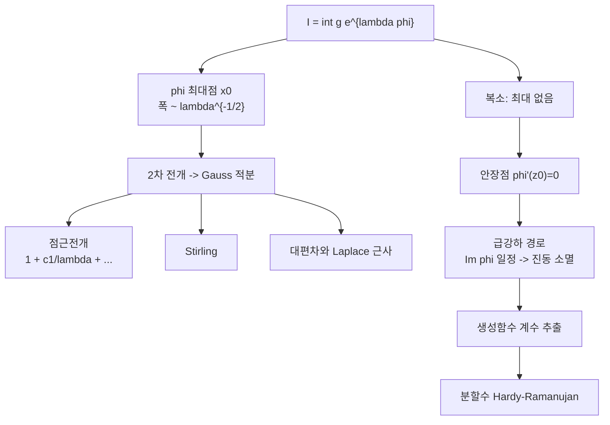

# Laplace 방법과 안장점

# 개요

큰 매개변수가 들어간 적분

$$
I(\lambda)=\int_a^{b}g(x)\thinspace e^{\lambda\varphi(x)}\thinspace dx\qquad(\lambda\to\infty)
$$

의 크기는 한 점이 결정한다. $e^{\lambda\varphi}$ 가 $\varphi$ 의 최대점에서 다른 모든 곳을 압도하므로 적분 전체가 그 점 주위의 좁은 창에서 나온다. 창 안에서 $\varphi$ 를 2 차까지 전개해 Gauss 적분으로 바꾸면 주도항이 나오고, 더 전개하면 점근전개가 나온다. 이것이 **Laplace 방법**이다.

$$
I(\lambda)\sim g(x_0)e^{\lambda\varphi(x_0)}\sqrt{\frac{2\pi}{\lambda|\varphi''(x_0)|}}
$$

정칙함수의 절대값은 내부에서 최대를 갖지 못하므로 피적분함수가 복소수면 최대점이 없다. 대신 $\varphi'(z_0)=0$ 인 **안장점**이 있고, 그 점을 지나는 경로 중 $\operatorname{Im}\varphi$ 가 일정한 것을 골라 [윤곽을 변형](residue-theorem.md)하면 진동이 사라져 실수 Laplace 방법이 적용된다. 이것이 **최대급강하법**이다.

[Euler–Maclaurin](euler-maclaurin.md)이 합과 적분의 차이를 다루고 Laplace 방법이 적분 자체의 크기를 다룬다. 둘을 합치면 [생성함수](generating-functions.md)의 계수, [감마 함수](gamma-function.md)의 Stirling 근사, 확률의 대편차가 같은 도구로 처리된다.

# 직관

## 최대점 주위의 창

$\varphi$ 의 최대값이 $x_0$ 에서 $\varphi(x_0)$ 라 하자. 다른 점 $x$ 의 기여는 $e^{\lambda(\varphi(x)-\varphi(x_0))}$ 배로 줄어들고, 지수가 음수이므로 $\lambda$ 가 커지면 기하급수적으로 사라진다. 살아남는 폭은 $\lambda(\varphi(x)-\varphi(x_0))\approx-1$ 인 범위, 곧

$$
|x-x_0|\ \lesssim\ \frac1{\sqrt{\lambda|\varphi''(x_0)|}}
$$

이다. 폭이 $\lambda^{-1/2}$ 로 줄므로 그 안에서 $\varphi$ 를 2 차 다항식으로, $g$ 를 상수로 바꿔도 오차가 남지 않는다. 남는 것은 Gauss 적분 하나다.

$$
\int e^{-\lambda|\varphi''|(x-x_0)^{2}/2}dx=\sqrt{\frac{2\pi}{\lambda|\varphi''|}}
$$

## 안장점

$\varphi$ 가 정칙이면 최대값 원리 때문에 $|e^{\varphi}|$ 가 영역 내부에서 최대가 되지 못한다. $\varphi'(z_0)=0$ 인 점에서 $\operatorname{Re}\varphi$ 는 한 방향으로 올라가고 수직 방향으로 내려가는 말안장 모양이다.

Cauchy 정리로 경로를 옮길 수 있으므로 안장점을 내려가는 방향으로 지나도록 경로를 잡으면 그 경로 위에서 $\operatorname{Re}\varphi$ 가 최대가 되고, 그 방향으로 $\operatorname{Im}\varphi$ 가 일정해 피적분함수의 진동이 사라진다. 진동하는 적분은 상쇄 때문에 크기를 가늠하기 어려우므로 경로를 골라 상쇄를 없앤다.

## 계수 추출

생성함수 $F(z)=\sum a_nz^{n}$ 의 계수는 윤곽적분이다.

$$
a_n=\frac1{2\pi i}\oint\frac{F(z)}{z^{n+1}}dz=\frac1{2\pi i}\oint e^{\log F(z)-(n+1)\log z}dz
$$

지수에 $n$ 이 곱해진 꼴이라 안장점법이 그대로 적용된다. 안장점 조건 $zF'(z)/F(z)=n$ 은 평균이 $n$ 이 되도록 $z$ 를 고른다는 뜻이고, 이 확률적 해석이 조합수의 점근을 구하는 지침이 된다.



# 정의

## Laplace 방법

$\varphi$ 가 $[a,b]$ 내부의 유일한 점 $x_0$ 에서 최대이고 $\varphi''(x_0)<0$ 이며 $g(x_0)\ne0$ 이면

$$
\int_a^{b}g(x)e^{\lambda\varphi(x)}dx
= e^{\lambda\varphi(x_0)}\sqrt{\frac{2\pi}{\lambda|\varphi''(x_0)|}}
\left(g(x_0)+\frac{c_1}{\lambda}+\frac{c_2}{\lambda^{2}}+\cdots\right)
$$

계수 $c_k$ 는 $\varphi$ 와 $g$ 의 $x_0$ 에서의 고계 도함수로 쓰인다. 최대가 끝점에서 일어나면 Gauss 적분의 절반만 남고, $\varphi'(a)\ne0$ 이면 $1/\lambda$ 차수로 떨어진다. 주도항의 차수가 최대점의 위치와 차수에 따라 달라진다.

## Watson 보조정리

$$
\int_0^{\infty}e^{-\lambda t}\thinspace h(t)\thinspace dt\ \sim\ \sum_{k\ge0}\frac{a_k\thinspace\Gamma(k+\alpha)}{\lambda^{k+\alpha}}
\qquad\big(h(t)\sim t^{\alpha-1}\textstyle\sum_ka_kt^{k}\big)
$$

원점 근방의 Taylor 전개를 항별로 적분한 것이 점근전개라는 정리다. Laplace 방법을 정당화하는 도구이고 여기서 감마 함수가 나온다.

## 안장점법

$\varphi$ 가 정칙이고 $\varphi'(z_0)=0$ 이며 $\varphi''(z_0)\ne0$ 이면 경로를 $z_0$ 을 지나는 급강하 경로로 변형해

$$
\oint g\thinspace e^{\lambda\varphi}\thinspace dz\ \sim\ g(z_0)\thinspace e^{\lambda\varphi(z_0)}\sqrt{\frac{2\pi}{\lambda\thinspace|\varphi''(z_0)|}}\thickspace e^{i\theta}
$$

를 얻는다. $\theta$ 는 급강하 방향의 각도로 $\varphi''(z_0)=|\varphi''|e^{i\psi}$ 일 때 $\theta=-\psi/2$ 또는 거기에 $\pi$ 를 더한 값이고, 이 위상이 답의 부호를 결정한다.

# 성질

## Stirling 전개

$n!=\int_0^\infty t^{n}e^{-t}dt$ 에 적용한다. $\varphi(t)=\log t-t/n$ 의 최대점이 $t=n$ 이고 $\varphi''=-1/n^{2}$ 이므로 주도항이 Stirling 이고, 전개를 이어 가면

$$
n!=\sqrt{2\pi n}\left(\frac ne\right)^{n}\left(1+\frac1{12n}+\frac1{288n^{2}}-\frac{139}{51840n^{3}}-\cdots\right)
$$

```python
from math import sqrt, pi, exp, factorial

for n in (5, 10, 20, 50):
    lead = sqrt(2 * pi * n) * (n / exp(1)) ** n
    rel = lambda v: abs(v - factorial(n)) / factorial(n)
    print(n, "%.2e %.2e %.2e" % (rel(lead),
                                 rel(lead * (1 + 1 / (12 * n))),
                                 rel(lead * (1 + 1 / (12 * n) + 1 / (288 * n * n)))))
# 5   1.65e-02 1.15e-04 2.12e-05
# 10  8.30e-03 3.18e-05 2.67e-06
# 20  4.16e-03 8.31e-06 3.35e-07
# 50  1.67e-03 1.37e-06 2.15e-08
```

각 열의 오차가 $1/(12n)$ , $1/(288n^{2})$ , $139/(51840n^{3})$ 에 자릿수까지 맞는다. 이 급수는 발산하며 최적 절단은 Euler–Maclaurin 쪽과 같은 $K\approx\pi n$ 이다.

## 안장점의 선택

안장점이 여럿이면 어느 것을 지나는 경로로 변형할 수 있는지가 문제다. 급강하 경로들은 계곡을 따라 이어지고, 주어진 끝점을 잇는 경로에 어떤 안장점이 포함되는지가 매개변수에 따라 불연속적으로 바뀐다. 그 전환이 [Stokes 현상](stokes-phenomenon.md)이고, 전환선 근처에서 지수적으로 작은 항이 같은 크기로 올라온다. [Euler–Maclaurin](euler-maclaurin.md)의 점근전개가 놓치는 항이 여기서는 다른 안장점의 기여다.

두 안장점이 합쳐지는 자리에서는 2 차 전개가 무너지고 3 차 항이 주도해 Gauss 적분 대신 Airy 적분이 나온다. 무지개의 밝기 분포, 파동의 초점 근처, 랜덤행렬 스펙트럼의 가장자리에 같은 Airy 꼴이 나타난다.

## 확률에서의 두 얼굴

$X_1,\dots,X_n$ 이 독립이고 $M(\theta)=\mathbb E[e^{\theta X}]$ 일 때

$$
\mathbb P\negthinspace\left(\frac1n\sum X_i\approx a\right)\approx e^{-nI(a)},
\qquad
I(a)=\sup_\theta\big(\theta a-\log M(\theta)\big)
$$

이 Cramér 의 대편차 원리다. 증명의 뼈대가 안장점법이고 $\sup$ 을 주는 $\theta^{*}$ 가 안장점이다. 안장점 조건 $M'(\theta)/M(\theta)=a$ 는 평균이 $a$ 가 되도록 분포를 기울인다는 뜻이고, 이 지수 기울이기가 [집중부등식](concentration-inequalities.md)의 Chernoff 한계와 같은 계산이다. 중심에서 2 차 전개를 하면 [중심극한정리](central-limit-theorem.md)의 국소판이, 꼬리에서 전개하면 대편차가 나온다.

# 활용

## 조합수의 점근

생성함수의 계수 적분에 안장점법을 쓰는 절차는 기계적이다. $F$ 가 반경 $R$ 에서 특이점을 가지면 안장점이 $R$ 에 가까이 붙고, $F$ 가 정함수면 안장점이 $n$ 과 함께 무한대로 간다. 후자의 예가 Bell 수와 분할수다.

## 분할수와 원법

$p(n)$ 의 생성함수는 $\prod(1-q^{k})^{-1}$ 이고 단위원 위의 모든 유리점이 특이점이라 안장점 하나로 끝나지 않는다. Hardy–Ramanujan 의 원법은 각 유리점 근방에서 [Dedekind eta](theta-functions.md)의 모듈러 변환으로 함수를 뒤집고, 각 조각에 안장점 평가를 적용한 뒤 전부 더한다.

$$
p(n)\sim\frac1{4n\sqrt3}\exp\negthinspace\left(\pi\sqrt{\frac{2n}3}\right)
$$

$q=1$ 근방의 기여가 주도항을 주고 나머지 유리점이 보정을 준다. 계산은 [분할수와 원법](partitions.md)에 있다. 모듈러성으로 함수를 뒤집고 안장점으로 평가하는 두 단계가 해석적 수론의 표준 전술이다.

## Bayes 추론의 Laplace 근사

사후분포 $\pi(\theta\mid D)\propto e^{\log p(D\mid\theta)+\log\pi(\theta)}$ 에서 표본 수 $n$ 이 큰 매개변수 역할을 한다. 최대점이 최대사후추정량이고 2 차 전개의 Hessian 이 공분산이 되므로

$$
\pi(\theta\mid D)\approx\mathcal N\negthinspace\left(\hat\theta,\ \big(-\nabla^{2}\log p\big)^{-1}\right),
\qquad
\log p(D)\approx\log p(D\mid\hat\theta)-\frac{d}2\log n+\cdots
$$

두 번째 식의 $-\tfrac d2\log n$ 이 BIC 의 벌점항이고, 모형 선택 기준이 Gauss 적분의 부피에서 나온다. [Bayes 추론](bayesian-inference.md)의 실무 계산과 [최대가능도](maximum-likelihood.md)의 점근 정규성이 같은 전개의 두 면이다.

## 통계역학의 최대항 방법

분배함수 $Z=\sum_{E}\Omega(E)e^{-\beta E}$ 를 적분으로 바꾸면 지수의 최대점이 평형 상태를 준다. 자유에너지 $F=E-TS$ 의 최소화가 안장점 조건이고, 요동의 크기는 $\varphi''$ 의 역수인 감수율이다. 열역학 극한의 존재가 Laplace 방법의 유효성이고, $\varphi''\to0$ 이 되는 자리가 상전이점이다.[^1]

[^1]: 표준 참고는 N. G. de Bruijn, *Asymptotic Methods in Analysis* 4–5 장, R. Wong, *Asymptotic Approximations of Integrals*, 그리고 P. Flajolet, R. Sedgewick, *Analytic Combinatorics* 8 장(안장점법의 조합론적 적용). Stokes 현상과 Airy 꼴은 M. V. Berry 의 해설이 있다.

# 연관 문서

## 선수지식

- [감마 함수와 Stirling 근사](gamma-function.md)
- [생성함수](generating-functions.md)

## 더 알아보기

- [분할수와 원법](partitions.md)
- [Stokes 현상과 재합산](stokes-phenomenon.md)
- [정상위상법과 안장점 근사](stationary-phase.md)

#analysis #combinatorics #computation
