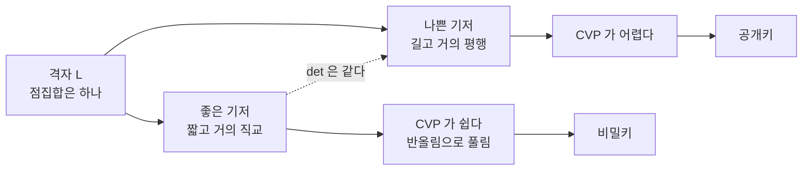

# 격자와 최단벡터 문제

# 개요

`\mathbb R^n` 안에 정수 좌표점들을 놓으면 규칙적인 격자무늬가 생긴다. 이것을 일반화해, 선형독립인 벡터 `b_1,\dots,b_n` 의 정수 결합 전체를 격자라 한다. 연속적인 [벡터공간](vector-spaces.md)에서 정수 계수만 허용해 이산화한 대상이다.

한 격자를 만드는 기저는 무수히 많고, 그중에는 짧고 거의 직교하는 좋은 기저도 있고 길고 거의 평행한 나쁜 기저도 있다. 둘은 같은 점집합을 나타내지만 쓸모가 전혀 다르다. 좋은 기저가 있으면 임의의 점에 가장 가까운 격자점을 쉽게 찾을 수 있고, 나쁜 기저만 있으면 그 계산이 사실상 불가능해진다. 이 비대칭이 격자 기반 암호의 전부다.

두 [선수](inner-product-spaces.md) [문서](determinants.md)가 각각 한 축을 담당한다. 내적이 "짧다" 와 "직교한다" 를 정의하고 Gram–Schmidt 직교화를 주며, 행렬식이 기저를 바꿔도 변하지 않는 단 하나의 양인 기본영역의 부피를 준다. 짧은 벡터의 길이와 이 부피 사이의 관계가 격자 이론의 첫 정리들이다.

# 직관

## 같은 격자, 다른 기저

`\mathbb Z^2` 를 생각하자. `(1,0),(0,1)` 이 기저이지만 `(201,37),(409,75)` 도 기저다. 행렬식이 `\pm1` 인 정수행렬을 곱한 것이기 때문이며, 역행렬도 정수행렬이라 서로를 정수 결합으로 표현할 수 있다.

두 번째 기저에서 격자를 보면 원점 근처에 짧은 벡터가 있다는 사실이 전혀 보이지 않는다. 실제로 두 기저벡터의 길이가 200 이 넘는데 격자에는 길이 1 인 벡터가 있다. 나쁜 기저는 격자의 구조를 감추는 위장이다.



## 부피는 변하지 않는다

기저가 만드는 평행육면체의 부피는 `|\det B|` 다. 기저를 바꾸는 행렬의 행렬식이 `\pm1` 이므로 이 값은 기저에 무관하다. 격자 자체의 불변량이고, 격자점의 밀도가 `1/|\det B|` 라는 뜻이다.

여기서 자연스러운 질문이 나온다. 격자가 촘촘하면(부피가 작으면) 짧은 벡터가 있어야 하지 않을까. Minkowski 의 정리가 그 직관을 정량화한다.

## 큰 볼록체는 격자점을 품는다

원점 대칭인 [볼록](convexity.md) 집합 `S` 의 부피가 `2^n\det L` 보다 크면, `S` 는 원점이 아닌 격자점을 반드시 포함한다.

증명은 [비둘기집 원리](pigeonhole-principle.md)의 연속판이다. `S` 를 절반으로 축소한 `\frac12S` 를 기본영역들로 잘라 한 칸에 겹쳐 쌓으면, 총 부피가 칸의 부피보다 크므로 어딘가 두 조각이 겹친다. 겹치는 두 점 `\frac12 x,\frac12 y` 의 차 `\frac12(x-y)` 가 격자점이고, 대칭성과 볼록성이 그것이 `S` 안에 있음을 보장한다.

공 `\|v\|\le r` 에 적용하면 최단벡터의 길이 상계가 나온다. 존재만 말해 줄 뿐 어디 있는지는 알려 주지 않는 전형적인 비구성적 정리이며, 실제로 찾는 문제가 계산적으로 어렵다는 것이 이 분야의 출발점이다.

# 정의

## 격자와 기저

`b_1,\dots,b_m\in\mathbb R^n` 이 선형독립일 때 다음 집합이 격자다.

$$
L=\Big\{\sum_{i=1}^m z_ib_i\ :\ z_i\in\mathbb Z\Big\}
$$

`B` 를 `b_i` 를 행으로 갖는 행렬이라 하면 `L=\{zB:z\in\mathbb Z^m\}` 이다. `m=n` 이면 완전계수라 하고, 이 문서는 그 경우만 다룬다.

동치인 정의로, 격자는 `\mathbb R^n` 의 이산 부분군이다. 이산성이 핵심이다. `(1,\sqrt2)` 가 생성하는 `\mathbb Z` 결합은 `\mathbb R^2` 에서 조밀해 격자가 아니다.

## 행렬식과 기본영역

$$
\det L=|\det B|,\qquad \mathcal P(B)=\Big\{\sum t_ib_i:t_i\in[0,1)\Big\}
$$

`\mathcal P(B)` 가 기본영역이고 그 부피가 `\det L` 이다. 두 기저 `B,B'` 가 같은 격자를 만들 필요충분조건은 `B'=UB` 인 정수행렬 `U` 로 `\det U=\pm1` 인 것이 존재하는 것이며, 그런 `U` 를 단모듈러 행렬이라 한다.

Gram 행렬 `G=BB^{\mathsf T}` 를 쓰면 `\det L=\sqrt{\det G}` 다. 격자가 `\mathbb R^n` 에 어떻게 놓였는지와 무관하게 내적 정보만으로 결정된다.

## 연속 최소

$$
\lambda_k(L)=\min\{r>0:\ \dim\mathrm{span}(L\cap \bar B(0,r))\ge k\}
$$

`\lambda_1` 이 0 이 아닌 최단벡터의 길이다. `\lambda_k` 는 선형독립인 격자벡터 `k` 개를 반지름 `r` 공 안에서 찾을 수 있는 최소 반지름이다.

`\lambda_1,\dots,\lambda_n` 을 달성하는 벡터들이 기저가 되지 않을 수 있다는 점이 격자 이론의 고질적인 어려움이며, 차원 4 이상에서 반례가 있다.

## 쌍대격자

$$
L^*=\{y\in\mathrm{span}(L):\ \langle y,x\rangle\in\mathbb Z\ \ \forall x\in L\}
$$

기저로는 `(B^{-1})^{\mathsf T}` 가 `L^*` 의 기저이고 `\det L^*=1/\det L` 이다. `L` 이 촘촘하면 `L^*` 가 성기다. 전이 정리들이 `\lambda_1(L)` 과 `\lambda_n(L^*)` 를 묶으며, 암호의 어려움 증명에서 두 격자를 오가는 논증이 자주 쓰인다.

## 계산 문제

- SVP: `L` 의 기저가 주어질 때 최단 비영 벡터를 찾아라.
- CVP: 기저와 목표점 `t` 가 주어질 때 `t` 에 가장 가까운 격자점을 찾아라.
- `\gamma`-근사판: 최적의 `\gamma` 배 이내인 답을 찾아라.
- GapSVP`_\gamma`: `\lambda_1\le1` 인지 `\lambda_1>\gamma` 인지 판정하라(둘 중 하나는 보장된다).

암호는 근사판, 그중에서도 `\gamma` 가 `n` 의 다항식인 영역에 놓인다.

# 성질

## Minkowski 의 정리

원점 대칭인 볼록집합 `S` 에 대해 `\mathrm{vol}(S)>2^n\det L` 이면 `S\cap L\ne\{0\}` 이다. 반지름 `r` 인 공에 적용하면

$$
\lambda_1(L)\le 2\Big(\frac{\det L}{V_n}\Big)^{1/n},\qquad V_n=\mathrm{vol}(B(0,1))
$$

이고, `V_n\approx(2\pi e/n)^{n/2}` 를 넣으면 `\lambda_1=O(\sqrt n)(\det L)^{1/n}` 이 된다. 차원에 대해 `\sqrt n` 배까지만 손해 본다는 뜻이다.

Hermite 상수를 써서 `\lambda_1\le\sqrt{\gamma_n}(\det L)^{1/n}` 로도 쓰는데, `\gamma_n` 의 정확한 값은 `n\le8` 과 `n=24` 에서만 알려져 있다. 이 차원들에서 최적값을 주는 격자가 `E_8` 과 Leech 격자이고, 구 채우기 문제의 답이 나온 차원과 정확히 일치한다.

둘째 정리는 연속 최소 전체를 묶는다.

$$
\frac{2^n}{n!}\det L\le\prod_{k=1}^n\lambda_k\cdot V_n\le 2^n\det L
$$

## Gauss 추정

무작위 격자에서는 반지름 `r` 공 안의 격자점 개수가 대략 `V_nr^n/\det L` 이다. 이것이 1 이 되는 지점을 최단벡터의 길이로 예상하면

$$
\lambda_1(L)\approx\sqrt{\frac n{2\pi e}}\,(\det L)^{1/n}
$$

Minkowski 상계와 상수배만 다르다. 실제 무작위 격자에서 매우 잘 맞으며, 암호 파라미터를 고르는 기준으로 쓰인다. 반대로 이 추정보다 훨씬 짧은 벡터를 심어 둔 격자가 암호 구성에서 "비밀" 의 역할을 한다.

## LLL 축소

좋은 기저를 실제로 찾는 문제는 어렵지만, 어느 정도 좋은 기저는 다항시간에 찾을 수 있다. Gram–Schmidt 직교화를 `b_i^*`, 계수를 `\mu_{ij}` 라 할 때 다음 두 조건을 만족하면 LLL 축소 기저다.

$$
|\mu_{ij}|\le\tfrac12\ (j<i),\qquad
\delta\|b_{k-1}^*\|^2\le\|b_k^*\|^2+\mu_{k,k-1}^2\|b_{k-1}^*\|^2
$$

둘째가 Lovász 조건으로, 인접한 두 벡터의 순서가 크게 잘못되지 않았음을 요구한다. `\delta=3/4` 로 잡으면 다음 보장이 나온다.

$$
\|b_1\|\le 2^{(n-1)/2}\lambda_1(L)
$$

근사비가 지수적이지만 차원이 작으면 충분히 쓸모 있고, 실제 입력에서는 보장보다 훨씬 잘 작동한다. 알고리즘은 크기 축소와 교환을 번갈아 하며, `\prod\|b_i^*\|^{n-i}` 꼴의 정수 퍼텐셜이 교환마다 상수배로 줄어든다는 사실로 다항시간이 증명된다.

지수 근사비를 줄이려면 블록 단위로 정확히 푸는 BKZ 계열을 쓴다. 블록 크기 `\beta` 에서 근사비가 대략 `\beta^{n/\beta}` 이고 비용이 `2^{O(\beta)}` 라, 실무의 파라미터 선택은 이 절충 곡선 위에서 이루어진다.

## 직접 구현

```python
from fractions import Fraction as F

def gram_schmidt(B):
    n = len(B)
    Bs, mu = [], [[F(0)] * n for _ in range(n)]
    for i in range(n):
        v = list(B[i])
        for j in range(i):
            mu[i][j] = (sum(a * b for a, b in zip(B[i], Bs[j]))
                        / sum(x * x for x in Bs[j]))
            v = [x - mu[i][j] * y for x, y in zip(v, Bs[j])]
        Bs.append(v)
    return Bs, mu

def lll(B, delta=F(3, 4)):
    B = [[F(x) for x in b] for b in B]
    n = len(B)
    Bs, mu = gram_schmidt(B)
    k = 1
    while k < n:
        for j in range(k - 1, -1, -1):                    # 크기 축소
            q = round(mu[k][j])
            if q:
                B[k] = [x - q * y for x, y in zip(B[k], B[j])]
                Bs, mu = gram_schmidt(B)
        if (sum(x * x for x in Bs[k])
                >= (delta - mu[k][k-1] ** 2) * sum(x * x for x in Bs[k-1])):
            k += 1                                        # Lovasz 조건 만족
        else:
            B[k], B[k-1] = B[k-1], B[k]                   # 교환
            Bs, mu = gram_schmidt(B)
            k = max(k - 1, 1)
    return [[int(x) for x in b] for b in B]

norms = lambda B: [round(float(sum(x*x for x in b)) ** 0.5, 2) for b in B]

bad = [[201, 37], [409, 75]]                              # det = -58 인 나쁜 기저
good = lll(bad)
print("2차원 전:", bad, norms(bad))
print("2차원 후:", good, norms(good))

bad4 = [[1, 0, 0, 1345], [0, 1, 0, 3129], [0, 0, 1, 5678], [0, 0, 0, 9901]]
red = lll(bad4)
print("4차원 전:", norms(bad4))
print("4차원 후:", norms(red), "최단벡터", red[0])

# 2차원 전: [[201, 37], [409, 75]] [204.38, 415.82]
# 2차원 후: [[7, 1], [-2, 8]] [7.07, 8.25]
# 4차원 전: [1345.0, 3129.0, 5678.0, 9901.0]
# 4차원 후: [7.07, 8.37, 12.92, 14.21] 최단벡터 [-4, 4, -3, 3]
```

2 차원 격자의 행렬식은 `58` 이고 Minkowski 상계가 `2\sqrt{58/\pi}\approx8.59` 다. 축소된 첫 벡터의 길이 `7.07` 이 이를 만족하며, 실제로 이것이 최단벡터다. 길이 400 짜리 기저가 같은 격자를 나타내고 있었다는 사실이 눈으로 확인된다.

4 차원 예는 마지막 좌표를 크게 만들어 `1345,3129,5678` 의 작은 정수 관계를 찾게 한 것이다. 답 `(-4,4,-3,3)` 은 `-4\cdot1345+4\cdot3129-3\cdot5678+3\cdot9901=0` 을 뜻한다. 짧은 벡터를 찾는 문제가 정수 관계를 찾는 문제로 번역되는 전형적인 수법이다.

## 어려움

SVP 는 무작위 환산 아래 NP 난해다. 정확판뿐 아니라 `1+1/n^\epsilon` 이내의 근사판까지 그렇다. 반면 `\sqrt{n/\log n}` 배 이상의 근사판은 `\mathrm{NP}\cap\mathrm{coNP}` 에 있어 NP 난해일 가능성이 낮다.

암호가 쓰는 다항식 근사 영역은 이 둘 사이에 있다. NP 난해성이 증명되지는 않았지만 최선의 알고리즘이 `2^{\Theta(n)}` 시간을 쓴다. 결정적인 점은 양자 알고리즘도 상수의 이득만 준다는 것이다. [이산로그](discrete-logarithm.md)와 소인수분해를 다항시간에 푸는 Shor 알고리즘은 아벨 숨은 부분군 문제의 Fourier 구조를 쓰는데, 격자 문제에는 그 구조가 없다.

그리고 최악 경우와 평균 경우를 잇는 환산이 있다. 무작위로 뽑은 문제 하나만 풀어도 모든 격자의 근사 SVP 를 풀 수 있다는 정리이며, 다른 어떤 암호 가정에도 없는 성질이다. 파라미터를 잘못 뽑아 쉬운 사례에 걸릴 위험이 구조적으로 배제된다.

# 활용

## 정수론의 존재 정리들

Fermat 의 두 제곱수 정리를 Minkowski 로 증명할 수 있다. `p\equiv1\pmod4` 이면 `x^2\equiv-1\pmod p` 인 `x` 가 있고, `(1,x),(0,p)` 가 생성하는 격자는 행렬식이 `p` 이며 모든 격자점 `(a,b)` 가 `a^2+b^2\equiv0\pmod p` 를 만족한다. 반지름 `\sqrt{2p}` 인 원의 넓이 `2\pi p>4p` 이므로 그 안에 격자점이 있고, `0<a^2+b^2<2p` 이면서 `p` 의 배수이므로 `a^2+b^2=p` 다.

같은 도구가 대수적 수체에서 유수의 유한성과 Dirichlet 단원 정리를 준다. 수의 기하학이라는 분야 전체가 "격자와 볼록체" 라는 한 문장에서 나온다.

## LLL 이 깨뜨린 것들

LLL 은 1982 년에 유리계수 다항식의 인수분해를 다항시간에 하기 위해 만들어졌다. 근을 수치로 구한 뒤 인수의 계수 벡터를 짧은 격자벡터로 찾아내는 방식이다.

암호 해독에서의 성과가 더 유명하다. 배낭 암호 계열은 거의 전부 LLL 로 무너졌고, Coppersmith 의 방법은 RSA 의 지수가 작거나 비밀키 `d<N^{0.292}` 이거나 소인수의 상위 비트가 새면 [RSA](rsa-cryptosystem.md) 를 깬다. 난수생성기의 출력 일부만 알아도 상태를 복원하는 공격도 같은 틀이다.

"짧은 벡터를 찾으면 풀리는 문제" 로 번역되는 순간 LLL 이 적용된다는 점에서, 격자는 공격 도구이자 방어 수단이라는 이중적 위치에 있다.

## 부호와 채움

격자는 [오류정정부호](error-correcting-codes.md)의 연속판이다. 부호가 Hamming 거리로 떨어진 점들을 고르듯, 격자는 Euclid 거리로 떨어진 점들을 고른다. 최소거리가 `\lambda_1` 이고, 복호가 곧 CVP 다.

Gauss 잡음 채널에서 격자 부호가 용량에 접근하며, `E_8` 과 Leech 격자가 각 차원에서 최적의 구 채우기를 준다는 사실이 2016 년과 2017 년에 증명되었다. 통신의 변조 설계와 구 채우기 문제가 같은 최적화의 두 얼굴이다.

## 후양자 암호로

나쁜 기저를 공개키로, 좋은 기저를 비밀키로 쓴다는 착상이 격자 암호의 원형이다. 현대적 구성은 기저 대신 잡음 섞인 선형방정식을 쓰지만, 어려움의 근원은 여전히 격자의 근사 SVP 다. 양자 내성과 최악 경우 환산이라는 두 성질 때문에 표준화된 후양자 알고리즘의 주류가 되었다.

# 연관 문서

## 선수지식

- [내적 공간](inner-product-spaces.md)
- [행렬식](determinants.md)

## 더 알아보기

- [격자 기반 후양자 암호](post-quantum-cryptography.md)
- [구 채우기와 E8, Leech 격자](sphere-packing.md)

#number_theory #linear_algebra #cryptography
