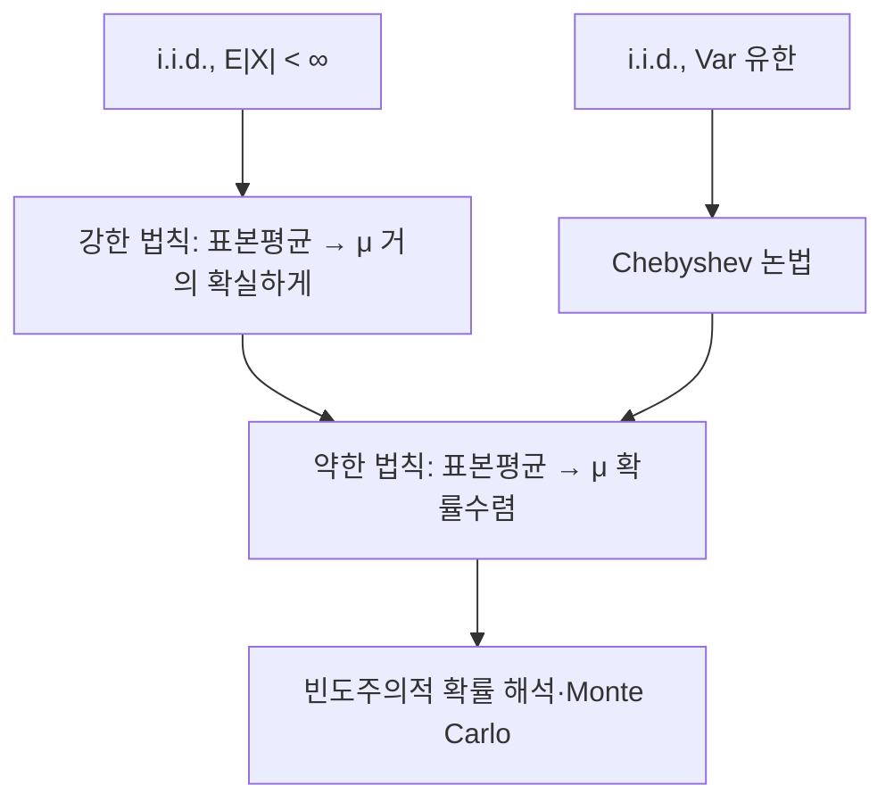

# 큰 수의 법칙

# 개요

큰 수의 법칙은 독립 확률변수들의 표본평균이 기댓값으로 수렴한다는 정리다. "확률이란 긴 시행에서의 상대빈도"라는 직관을 정리로 만든 것이며, 확률 모형과 데이터를 잇는 최초의 연결점이다. 약한 법칙은 확률수렴을, 강한 법칙은 거의 확실한 수렴을 주장한다. 두 결론이 갈리는 지점을 보면 확률론의 여러 수렴 개념이 왜 구별되어야 하는지 알 수 있다. Monte Carlo 적분과 통계적 추정의 일치성이 모두 이 정리에 기댄다.

# 직관

동전을 n번 던져 앞면 비율을 기록한다. n이 커지면 비율이 1/2 근처에 머문다. 왜인가. 표본평균의 분산은 개별 분산을 n으로 나눈 값이므로 n이 커질수록 분포가 평균 주위로 좁아진다. Chebyshev 부등식은 이 "좁아짐"을 편차 확률의 상한으로 바꿔 준다.

$$
\operatorname{Var}\negthinspace\left(\frac{X_1+\cdots+X_n}{n}\right)=\frac{\sigma^2}{n}
$$

약한 법칙과 강한 법칙의 차이는 "언제 벗어나는가"를 보는 방식이다. 약한 법칙은 각 n마다 따로 "지금 벗어나 있을 확률"을 보고, 그것이 0으로 간다고 말한다. 강한 법칙은 한 번 뽑힌 무한 수열 하나를 끝까지 따라가며 "이 수열 자체가 수렴한다"고 말한다. 후자가 더 강하다. 각 n에서 벗어날 확률이 작아도, 무한히 여러 n에서 한 번씩 벗어나는 일은 여전히 일어날 수 있다.



# 정의

확률변수열 $X_1,X_2,\dots$ 가 서로 독립이고 같은 분포를 따를 때 i.i.d.라 부른다. 표본평균을 다음으로 쓴다.

$$
\overline X_n=\frac1n\sum_{i=1}^n X_i
$$

## 수렴 개념

확률변수열 $Y_n$ 과 확률변수 $Y$ 에 대해 세 가지 수렴을 구별한다.

확률수렴(convergence in probability):

$$
\forall \varepsilon>0:\quad \lim_{n\to\infty}P\big(|Y_n-Y|>\varepsilon\big)=0
$$

거의 확실한 수렴(almost sure convergence):

$$
P\negthinspace\left(\left\lbrace\omega\in\Omega:\ \lim_{n\to\infty}Y_n(\omega)=Y(\omega)\right\rbrace\right)=1
$$

L2 수렴(제곱평균 수렴):

$$
\lim_{n\to\infty}\mathbb E\big[|Y_n-Y|^2\big]=0
$$

거의 확실한 수렴은 확률수렴을 함의하고, L2 수렴도 확률수렴을 함의한다. 반대 방향은 일반적으로 성립하지 않으며, 거의 확실한 수렴과 L2 수렴 사이에는 어느 쪽 함의도 없다.

## 두 법칙의 진술

약한 큰 수의 법칙(weak law, WLLN): $X_i$ 가 i.i.d.이고 기댓값 $\mu$ 가 존재하면(절댓값의 기댓값이 유한하면) 표본평균이 $\mu$ 로 확률수렴한다.

$$
\overline X_n\ \xrightarrow{\ P\ }\ \mu
$$

강한 큰 수의 법칙(Kolmogorov, strong law, SLLN): 같은 조건, 즉 i.i.d.이고 절댓값의 기댓값이 유한하면 표본평균이 $\mu$ 로 거의 확실하게 수렴한다[^1].

$$
P\negthinspace\left(\lim_{n\to\infty}\overline X_n=\mu\right)=1
$$

두 정리 모두 분산의 유한성을 요구하지 않는다. 분산 조건은 아래 Chebyshev 증명에 필요한 편의상의 강화일 뿐이다.

# 성질

## Chebyshev 논법으로 보는 약한 법칙

추가로 분산이 유한하다고 가정하면 증명이 두 줄이다. 독립성에서 분산은 가법적이므로 표본평균의 분산이 n으로 나뉘고, 여기에 Chebyshev 부등식을 적용한다.

$$
P\big(|\overline X_n-\mu|\ge\varepsilon\big)
\le\frac{\operatorname{Var}(\overline X_n)}{\varepsilon^2}
=\frac{\sigma^2}{n\varepsilon^2}\ \xrightarrow[n\to\infty]{}\ 0
$$

이 부등식은 실제로 L2 수렴까지 보여 준다. 또한 독립성을 완전히 쓰지 않았음에 주의한다. 쌍마다 상관이 없다는 조건만으로 충분하다. 분산이 무한한 경우의 약한 법칙(Khinchin)은 절단 논법을 쓴다. 상수 c에 대해 절댓값이 c를 넘는 부분을 잘라낸 변수에 위 논법을 적용하고, 잘라낸 꼬리의 기여가 적분 가능성에 의해 c를 키우면 0으로 감을 이용한다.

## 강한 법칙의 증명 개요

가장 간단한 경로는 4차 모멘트가 유한하다는 가정 아래의 논법이다. 중심화한 합의 4차 모멘트를 전개하면 독립성 때문에 살아남는 항의 개수가 n의 제곱 규모이므로 다음을 얻는다.

$$
\mathbb E\big[(\overline X_n-\mu)^4\big]=O\negthinspace\left(\frac1{n^2}\right),\qquad
\sum_{n\ge1}P\big(|\overline X_n-\mu|>\varepsilon\big)\le\sum_{n\ge1}\frac{O(n^{-2})}{\varepsilon^4}<\infty
$$

급수가 수렴하므로 Borel–Cantelli 보조정리에 의해 편차 사건이 무한히 자주 일어날 확률은 0이고, 따라서 거의 확실한 수렴을 얻는다. 일반적인 경우(절댓값의 기댓값만 유한)는 절단과 Kolmogorov의 최대부등식, 또는 역마팅게일 수렴 정리를 쓴다[^2].

## 조건의 필요성

절댓값의 기댓값이 무한하면 결론이 깨진다. Cauchy 분포를 따르는 i.i.d. 표본의 표본평균은 다시 같은 Cauchy 분포를 따르므로 n이 커져도 전혀 집중하지 않는다. 더 일반적으로 절댓값의 기댓값이 무한한 i.i.d.열에서는 표본평균의 절댓값의 상극한이 거의 확실하게 무한대다.

독립성도 필수는 아니지만 대체 조건이 필요하다. 예를 들어 $X_i$ 가 모두 같은 하나의 변수 $X$ 와 같다면 표본평균은 항상 $X$ 이고 상수로 수렴하지 않는다. 에르고딕 정리는 독립성을 정상성과 에르고딕성으로 바꾼 일반화이며, [Markov chain](markov-chains.md)의 시간평균에 관한 결과가 그 전형적인 사례다.

## 수렴 속도는 말해 주지 않는다

큰 수의 법칙은 "수렴한다"만 말하고 "얼마나 빨리"는 말하지 않는다. 편차의 크기를 재는 것이 [중심극한정리](central-limit-theorem.md)의 역할이며, 표본평균의 오차는 전형적으로 n의 제곱근의 역수 규모다.

# 활용

## Monte Carlo 적분

계산하려는 적분을 기댓값으로 바꾸고 표본평균으로 근사한다. 예를 들어 구간 $[0,1]$ 에서 함수 $g$ 의 적분은 균등분포 $U$ 에 대한 $g(U)$ 의 기댓값이므로 다음과 같다.

$$
\int_0^1 g(t)\thinspace dt=\mathbb E[g(U)]\approx\frac1n\sum_{i=1}^n g(U_i)
$$

강한 법칙이 이 근사가 거의 확실하게 옳은 값으로 간다는 보장을 준다. 차원이 높아져도 오차 규모가 차원에 직접 의존하지 않는다는 점이 격자 기반 수치적분과 대비되는 장점이다.

```python
import random, math

def mc_pi(n):
    inside = sum(1 for _ in range(n)
                 if random.random() ** 2 + random.random() ** 2 <= 1)
    return 4 * inside / n   # 지시함수의 기댓값 = pi/4

for n in (10**3, 10**5, 10**7):
    print(n, mc_pi(n), math.pi)
```

## 통계적 추정의 일치성

표본평균은 모평균의 일치추정량(consistent estimator)이다. 같은 논리를 함수에 적용하면 표본적률이 모적률로 수렴하고, 이것이 적률법과 [최대가능도 추정](maximum-likelihood.md)의 일치성 증명의 출발점이다. 경험적 누적분포함수가 참 분포함수로 균등하게 수렴한다는 Glivenko–Cantelli 정리도 큰 수의 법칙을 각 점에서 적용한 뒤 단조성으로 균등화한 결과다.

## 빈도주의적 해석

[유한 확률 공간](probability.md)에서 확률을 "같은 가능성을 가진 경우의 비율"로 정의했다면, 강한 법칙은 그 정의가 실제 반복 시행의 극한 빈도와 일치한다는 정합성 진술로 읽힌다. 확률 개념 자체를 빈도로 정의하려는 시도(von Mises)는 순환에 빠지므로, 오늘날은 Kolmogorov 공리에서 출발해 큰 수의 법칙을 정리로 얻는 쪽을 택한다.

[^1]: Manjunath Krishnapur, "Strong law of large numbers", Probability Theory lecture notes, IISc, §2.10 (i.i.d.와 절댓값 기댓값 유한 조건 아래 거의 확실한 수렴). https://math.iisc.ac.in/~manju/Old/ProbTheory/Notes/10-13%20SLLN%20to%20Hoeffding.pdf
[^2]: Terence Tao, "275A, Notes 3: The weak and strong law of large numbers". https://terrytao.wordpress.com/2015/10/23/275a-notes-3-the-weak-and-strong-law-of-large-numbers/

# 연관 문서

## 선수지식

- [확률변수와 기댓값](random-variables.md)
- [수열의 극한](limits.md)

## 더 알아보기

- [중심극한정리](central-limit-theorem.md)
- [집중부등식](concentration-inequalities.md)

#probability #theorem
