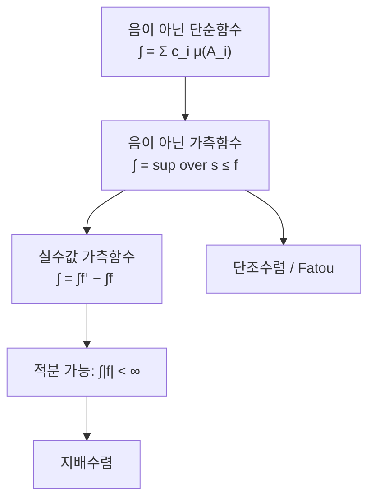

# Lebesgue 적분

# 개요

[Riemann 적분](riemann-integral.md)은 정의역을 잘랐다. 각 조각 위에서 함수가 거의 일정하기를 바라는 방식이라, 함수가 어디서나 요동치면 무너진다. Lebesgue 의 발상은 자르는 방향을 바꾸는 것이다. 정의역이 아니라 치역을 잘라, "함수값이 $c$ 근처인 점들의 집합" 이 얼마나 큰지를 재고 그 크기에 $c$ 를 곱해 더한다.

이 전환이 가능하려면 임의의 집합의 크기를 잴 수 있어야 하고, 그것이 [측도](measure.md)다. 재는 대상이 잘 정의되려면 함수가 [가측](measurable-functions.md)이어야 한다. 두 선수 개념을 갖추고 나면 Riemann 적분이 다루지 못하던 함수들이 들어오고, 더 중요하게는 극한과 적분을 교환하는 강력한 정리들이 생긴다. 적분의 값이 아니라 이 교환 가능성이 Lebesgue 이론의 진짜 성과다.

# 직관

## 동전을 세는 두 가지 방법

책상 위의 동전 더미의 총액을 구한다고 하자. Riemann 은 왼쪽부터 순서대로 집어 액면가를 더한다. Lebesgue 는 먼저 액면가별로 쌓아 놓고, 각 더미의 개수에 액면가를 곱해 더한다.

두 방법의 답은 같다. 그러나 동전이 뒤죽박죽 놓여 있을수록 두 번째 방법이 안정적이다. 순서가 아무리 엉망이어도 "500 원짜리가 몇 개인가" 는 여전히 셀 수 있기 때문이다. 함수가 아무리 심하게 진동해도 $\lbrace x:f(x)>c\rbrace$ 의 측도만 알면 적분이 정의되는 것이 이와 같다.

## 아래에서 쌓아 올린다

정의는 두 단계다. 먼저 유한 개의 값만 갖는 단순함수에 대해 "값 × 그 값을 갖는 집합의 측도" 로 적분을 정한다. 그다음 일반적인 음이 아닌 함수의 적분은, 그 아래에 놓인 모든 단순함수의 적분값 중 최소 상계로 정한다.

상한만 쓰고 하한을 쓰지 않는 것이 Riemann 의 Darboux 정의와 결정적으로 다르다. 위아래에서 조여 만나기를 요구하지 않으므로, 값이 무한대여도 정의가 그대로 성립하고 "적분 가능" 과 "적분값이 정의됨" 이 분리된다. 이 느슨함이 극한 정리들의 근거가 된다.



# 정의

## 단순함수의 적분

측도 공간 $(X, \Sigma, \mu)$ 를 고정한다. 지시함수 $\mathbf{1}_A$ 는 $A$ 위에서 값이 $1$ 이고 바깥에서 $0$ 이다. 서로소 가측집합 $A_1, \dots, A_n$ 과 음이 아닌 유한 실수 $c_1, \dots, c_n$ 으로 만든 단순함수 $s$ 에 대해

$$
s=\sum_{i=1}^n c_i\mathbf{1}_{A_i},\qquad
\int_X s\thinspace d\mu=\sum_{i=1}^n c_i\thinspace\mu(A_i)
$$

로 정한다. 여기서 $0 \cdot \infty = 0$ 으로 약속한다. 이 값이 $s$ 의 표현 방식에 의존하지 않는다는 것은 공통 세분을 취해 확인한다.

## 일반 함수의 적분

음이 아닌 가측함수 $f$ 에 대해

$$
\int_X f\thinspace d\mu=\sup\Bigl\lbrace\int_X s\thinspace d\mu\ :\ 0\le s\le f,\ s\text{ 단순}\Bigr\rbrace
$$

로 정의하며 값으로 $\infty$ 를 허용한다. 실수값 가측함수는 $f^+ = \max(f, 0)$ 과 $f^- = \max(-f, 0)$ 으로 쪼개

$$
\int_X f\thinspace d\mu=\int_X f^+\thinspace d\mu-\int_X f^-\thinspace d\mu
$$

로 정한다. 두 항이 모두 무한대면 정의되지 않는다. $\int \lvert f \rvert\thinspace d\mu < \infty$ 일 때 $f$ 가 적분 가능하다고 하고, 그런 함수들의 모임을 $L^1(\mu)$ 라 쓴다. 가측집합 $E$ 위의 적분은 $\int f \cdot \mathbf{1}_E\thinspace d\mu$ 다.

## 거의 어디서나

측도 $0$ 인 집합을 제외하고 성립하는 성질을 거의 어디서나 성립한다고 한다. $f = g$ 가 거의 어디서나이면 두 적분이 같으므로, Lebesgue 적분은 측도 $0$ 집합 위의 값 변화를 보지 않는다. 이것이 Riemann 적분과의 가장 눈에 띄는 차이이자 $L^1$ 을 함수들의 동치류 공간으로 다루는 이유다.

# 성질

## 기본 성질

- 단조성: $0 \le f \le g$ 이면 $\int f \le \int g$ 다. $f$ 아래의 단순함수는 모두 $g$ 아래에도 있기 때문이다.
- 선형성: $\int (af + bg) = a\int f + b\int g$ 다. 음이 아닌 경우는 단조수렴 정리를 거쳐 증명하며, 정의에서 곧바로 나오지 않는다는 점이 Riemann 과 다르다.
- 삼각부등식: $\lvert \int f \rvert \le \int \lvert f \rvert$ 다.
- $\int \lvert f \rvert\thinspace d\mu = 0$ 인 것과 $f = 0$ 이 거의 어디서나인 것은 동치다.

## 수렴 정리

세 정리가 이 이론의 핵심이다.

| 정리 | 가정 | 결론 |
|---|---|---|
| [단조수렴](monotone-convergence.md) | $0 \le f_1 \le f_2 \le \cdots$ 이고 $f_n \to f$ | $\int f_n \to \int f$ |
| Fatou | $f_n \ge 0$ | $\int \liminf f_n \le \liminf \int f_n$ |
| [지배수렴](dominated-convergence.md) | $f_n \to f$ 거의 어디서나이고 $\lvert f_n \rvert \le g \in L^1$ | $\int f_n \to \int f$ 이고 $\int \lvert f_n - f \rvert \to 0$ |

가정이 점별 수렴이라는 점이 결정적이다. Riemann 적분에서는 균등수렴을 요구해야 했는데, 여기서는 단조성이나 적분 가능한 지배함수만 있으면 된다. 이 완화 덕분에 급수와 적분의 교환, 매개변수 미분과 적분의 교환이 실용적인 도구가 된다.

단조수렴 정리의 따름정리로 음이 아닌 항의 급수와 적분을 항상 교환할 수 있다.

$$
\int_X\sum_{n=1}^\infty f_n\thinspace d\mu=\sum_{n=1}^\infty\int_X f_n\thinspace d\mu\qquad(f_n\ge0)
$$

## Riemann 적분과의 관계

유계함수가 $[a,b]$ 에서 Riemann 적분 가능하면 Lebesgue 적분도 가능하고 두 값이 같다. 따라서 Lebesgue 적분은 진짜 확장이다.

역은 성립하지 않는다. $[0,1]$ 에서 유리수의 지시함수는 유리수 집합의 측도가 $0$ 이므로 Lebesgue 적분이 $0$ 이지만, 모든 부분구간에 유리수와 무리수가 있어 상합이 $1$ 이고 하합이 $0$ 이라 Riemann 적분이 존재하지 않는다.

한 방향의 예외가 있다. 이상적분으로 정의되는 $\int_0^\infty \frac{\sin x}{x}\thinspace dx$ 는 수렴하지만 $\int \frac{\lvert \sin x \rvert}{x}\thinspace dx = \infty$ 라 Lebesgue 적분 가능하지 않다. Lebesgue 적분은 절대적분이므로 조건수렴을 담지 못하며, 이 경우에는 이상적분을 따로 다뤄야 한다.

## 완비성

$L^1(\mu)$ 는 $\lVert f \rVert_1 = \int \lvert f \rvert\thinspace d\mu$ 로 완비 노름공간이 된다. 이것이 Riesz–Fischer 정리이고, 지배수렴 정리가 그 증명의 핵심 도구다. Riemann 적분으로 같은 노름을 주면 완비가 되지 않는다는 점에서, Lebesgue 이론은 해석학에 "빠진 극한을 채워 넣는" 역할을 한다. 같은 방식으로 $L^2$ 가 Hilbert 공간이 되고 Fourier 해석의 무대가 마련된다.

## 측도를 바꾸면 다른 것이 된다

정의에 등장하는 것은 $\mu$ 뿐이므로 측도를 갈아 끼우면 전혀 다른 대상이 나온다.

```python
def simple_integral(pieces):
    """pieces: (값 c_i, 측도 μ(A_i)) 목록. 0 * inf = 0 규약."""
    total = 0.0
    for c, m in pieces:
        if c == 0 or m == 0:
            continue
        total += c * m
    return total


# 셈측도: 각 점의 측도가 1 -> 적분이 급수가 된다
print(simple_integral([(1 / 2 ** n, 1) for n in range(1, 30)]))   # ~1.0

# 확률측도: 측도의 합이 1 -> 적분이 기댓값이 된다
print(simple_integral([(1, 1 / 6), (2, 1 / 6), (3, 1 / 6),
                       (4, 1 / 6), (5, 1 / 6), (6, 1 / 6)]))      # 3.5
```

# 활용

## 하나의 정의로 급수와 기댓값을

셈측도를 쓰면 적분이 급수가 되고, 확률측도를 쓰면 [기댓값](random-variables.md)이 된다. 그래서 급수의 교환 정리와 확률의 수렴 정리를 따로 증명할 필요가 없다. 이산분포와 연속분포가 섞인 확률변수도, 밀도가 없는 특이분포도 같은 정의로 다뤄진다. 확률론이 측도론 위에 세워진 실질적인 이유가 이것이다.

## 밀도와 측도의 비교

두 측도 사이의 관계를 함수 하나로 표현할 수 있는지를 묻는 것이 [Radon–Nikodym 정리](radon-nikodym.md)다. 절대연속이면 밀도가 존재하고, 그 밀도가 확률에서는 확률밀도함수, 통계에서는 [우도비](change-of-measure.md), 정보이론에서는 [KL divergence](kl-divergence.md)의 피적분함수가 된다.

## 교환은 여전히 조건부다

수렴 정리들은 극한과 적분의 교환을 넉넉하게 허용하지만 무조건은 아니다. $f_n = n \cdot \mathbf{1}_{(0,1/n)}$ 은 점별로 $0$ 에 수렴하지만 모든 $n$ 에서 적분이 $1$ 이다. 지배함수가 없기 때문이며, Fatou 의 부등식이 등호가 아닌 이유를 보여 주는 표준 예다. 적분 기호와 극한 기호의 순서를 바꿀 때는 어떤 정리의 어떤 가정을 쓰는지 매번 명시해야 한다.[^1]

[^1]: Terence Tao, *245A Notes 3: Integration on abstract measure spaces and the convergence theorems*, §4 정의 10·11·13. 단순함수에서 일반 가측함수로의 확장과 수렴 정리. https://terrytao.wordpress.com/2010/09/25/245a-notes-3-integration-on-abstract-measure-spaces-and-the-convergence-theorems/

# 연관 문서

## 선수지식

- [측도](measure.md)
- [Riemann 적분](riemann-integral.md)
- [가측함수](measurable-functions.md)

## 더 알아보기

- [단조 수렴 정리](monotone-convergence.md)
- [Radon–Nikodym 정리](radon-nikodym.md)
- [확률변수와 기댓값](random-variables.md)

#measure_theory
