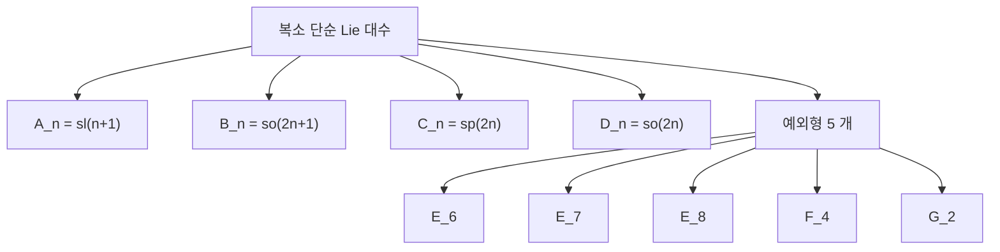

# Lie 대수

# 개요

$\mathrm{SO}(3)$ , $\mathrm{U}(n)$ , $\mathrm{GL}\_n$ 같은 연속 대칭군은 [다양체](manifolds.md)이면서 군이다. 항등원의 접공간은 벡터공간이고, 군 곱셈의 비가환성은 그 위의 쌍선형 연산 하나로 압축된다.

$$
[X,Y]=XY-YX
$$

이 **괄호**를 갖춘 벡터공간이 **Lie 대수**다. 결합법칙 대신 Jacobi 항등식을 만족하는 비결합 대수이며, Lie 군의 문제를 [선형사상](linear-maps.md)의 문제로 옮긴다. 군의 부분군은 부분대수에, 정규부분군은 아이디얼에, 준동형은 준동형에 대응하고, 단연결 Lie 군에 대해서는 이 대응이 범주 동치다.

$$
\lbrace\text{단연결 Lie 군}\rbrace\ \simeq\ \lbrace\text{유한차원 실 Lie 대수}\rbrace
$$

복소수 위의 단순 Lie 대수는 완전히 분류되어 있고, 목록은 네 개의 무한 계열 $A_n,B_n,C_n,D_n$ 과 다섯 개의 예외 $E_6,E_7,E_8,F_4,G_2$ 다. 이 목록은 [군의 표현](group-representations.md)에서 유한군의 지표표가 하는 역할을 연속군 쪽에서 맡는다.

# 직관

## 교환자

$X$ 방향으로 시간 $t$ , $Y$ 방향으로 $t$ , 다시 $X$ 로 $-t$ , $Y$ 로 $-t$ 만큼 흐르면 가환인 경우에만 제자리로 돌아온다. 남는 오차의 최저차항이 교환자다.

$$
e^{tX}e^{tY}e^{-tX}e^{-tY}=e^{t^2[X,Y]+O(t^3)}
$$

$[X,Y]$ 는 군의 비가환성을 무한소 수준에서 재는 양이다. $x$ 축 회전과 $y$ 축 회전을 번갈아 하면 $z$ 축 회전이 남고, 그래서 $\mathfrak{so}(3)$ 의 괄호는 벡터곱이다.

$$
[e_1,e_2]=e_3,\quad [e_2,e_3]=e_1,\quad [e_3,e_1]=e_2
$$

Baker–Campbell–Hausdorff 공식은 군 곱셈을 괄호만으로 복원한다.

$$
\log\left(e^Xe^Y\right)=X+Y+\tfrac12[X,Y]+\tfrac1{12}\big([X,[X,Y]]-[Y,[X,Y]]\big)+\cdots
$$

오른쪽에는 괄호밖에 없으므로 국소적으로 군의 정보가 대수에 전부 들어 있다.

## Jacobi 항등식의 Leibniz 형태

괄호는 결합적이지 않고 $[[X,Y],Z]\ne[X,[Y,Z]]$ 다. 대신 성립하는 것이 Jacobi 항등식이다.

$$
[X,[Y,Z]]+[Y,[Z,X]]+[Z,[X,Y]]=0
$$

$\mathrm{ad}\_X(Y)=[X,Y]$ 로 두면 같은 식이 다음이 된다.

$$
\mathrm{ad}\_X([Y,Z])=[\mathrm{ad}\_XY,Z]+[Y,\mathrm{ad}\_XZ]
$$

곧 $\mathrm{ad}\_X$ 는 괄호에 대한 도함수다. 대칭의 무한소 작용이 미분이라는 관점에서 Jacobi 항등식은 Leibniz 규칙이다.

## $\mathfrak{sl}_2$ 의 사다리

$\mathfrak{sl}_2$ 는 대각합이 0 인 $2\times2$ 행렬들이고, 기저와 괄호가 다음과 같다.

$$
H=\begin{pmatrix}1&0\cr 0&-1\end{pmatrix},\quad
E=\begin{pmatrix}0&1\cr 0&0\end{pmatrix},\quad
F=\begin{pmatrix}0&0\cr 1&0\end{pmatrix}
$$

$$
[H,E]=2E,\qquad [H,F]=-2F,\qquad [E,F]=H
$$

표현 $V$ 에서 $H$ 의 [고유벡터](eigenvalues.md) $v$ 의 고유값을 $\lambda$ 라 하면

$$
H(Ev)=EHv+[H,E]v=(\lambda+2)Ev
$$

이므로 $E$ 는 고유값을 $2$ 올리고 $F$ 는 $2$ 내린다. 유한차원이면 올리다가 멈추므로 최고무게 벡터가 있고, 거기서 $F$ 를 반복 적용한 사다리가 표현 전체다. 각 차원마다 기약표현이 정확히 하나씩이다.

이 사다리가 양자역학의 각운동량 올림·내림 연산자다. 일반 반단순 Lie 대수의 표현론은 근계를 따라 $\mathfrak{sl}_2$ 부분대수 여러 개를 붙인 것으로 다룬다.

# 정의

## Lie 대수

체 $k$ 위의 벡터공간 $\mathfrak g$ 와 쌍선형 사상 $[\cdot,\cdot]:\mathfrak g\times\mathfrak g\to\mathfrak g$ 가 다음을 만족하면 **Lie 대수**다.

- 교대성: 모든 $X$ 에 대해 $[X,X]=0$ 이다. 따라서 $[X,Y]=-[Y,X]$ 다.
- Jacobi 항등식: $[X,[Y,Z]]+[Y,[Z,X]]+[Z,[X,Y]]=0$ 이다.

결합대수 $A$ 는 $[a,b]=ab-ba$ 로 Lie 대수가 된다. $\mathfrak{gl}\_n=M_n(k)$ 가 그런 예이고, Ado 정리에 의해 모든 유한차원 Lie 대수는 어떤 $\mathfrak{gl}\_n$ 의 부분대수다.

**부분대수**는 괄호에 닫힌 부분공간, **아이디얼** $\mathfrak a$ 는 $[\mathfrak g,\mathfrak a]\subset\mathfrak a$ 인 부분공간이다. 아이디얼로 몫 $\mathfrak g/\mathfrak a$ 를 만들며, 군의 정규부분군에 대응한다.

## 딸림표현과 Killing 형식

$\mathrm{ad}:\mathfrak g\to\mathfrak{gl}(\mathfrak g)$ , $\mathrm{ad}\_X(Y)=[X,Y]$ 가 **딸림표현**이다. Jacobi 항등식이 이것이 Lie 대수 준동형임을 보장하며, 핵은 중심 $Z(\mathfrak g)$ 다.

딸림표현에서 만든 대칭 쌍선형형식이 **Killing 형식**이다.

$$
\kappa(X,Y)=\mathrm{tr}\left(\mathrm{ad}\_X\circ\mathrm{ad}\_Y\right)
$$

구조상수만으로 계산되고 불변성 $\kappa([X,Y],Z)=\kappa(X,[Y,Z])$ 을 만족한다.

## 가해, 멱영, 반단순

유도열과 하향 중심열을 다음으로 정의한다.

$$
\mathfrak g^{(0)}=\mathfrak g,\quad \mathfrak g^{(k+1)}=[\mathfrak g^{(k)},\mathfrak g^{(k)}]
$$

$$
\mathfrak g^{1}=\mathfrak g,\quad \mathfrak g^{k+1}=[\mathfrak g,\mathfrak g^{k}]
$$

어떤 $k$ 에서 $\mathfrak g^{(k)}=0$ 이면 **가해**, $\mathfrak g^{k}=0$ 이면 **멱영**이다. 멱영이면 가해다. 상삼각행렬이 가해의 표준 예이고, 대각성분이 0 인 엄격 상삼각행렬이 멱영의 예다.

가해 아이디얼 중 최대인 것이 **근기** $\mathrm{rad}\mathfrak g$ 다. $\mathrm{rad}\mathfrak g=0$ 이면 **반단순**이고, 진아이디얼이 $0$ 뿐이며 가환이 아니면 **단순**이다.

# 성질

## Cartan 판정법

Killing 형식이 가해성과 반단순성을 판정한다.

$$
\mathfrak g\ \text{가해}\iff \kappa(\mathfrak g,[\mathfrak g,\mathfrak g])=0
$$

$$
\mathfrak g\ \text{반단순}\iff \kappa\ \text{가 비퇴화}
$$

반단순이면 단순 아이디얼의 직합으로 유일하게 분해된다.

$$
\mathfrak g=\mathfrak g_1\oplus\cdots\oplus\mathfrak g_r
$$

일반 Lie 대수는 Levi 분해 $\mathfrak g=\mathrm{rad}\mathfrak g\rtimes\mathfrak s$ 로 가해 부분과 반단순 부분으로 나뉜다. 분류는 반단순 쪽에서 근계로 완결되고, 가해 쪽은 낮은 차원에서만 목록이 있다.

## 근계와 Dynkin 도표

복소 반단순 $\mathfrak g$ 에서 극대 가환 부분대수 $\mathfrak h$ (Cartan 부분대수)를 잡으면 $\mathrm{ad}\mathfrak h$ 가 동시대각화되어 근공간 분해를 준다.

$$
\mathfrak g=\mathfrak h\oplus\bigoplus_{\alpha\in\Phi}\mathfrak g_\alpha,\qquad \mathfrak g_\alpha=\lbrace X:[H,X]=\alpha(H)X\ \forall H\in\mathfrak h\rbrace
$$

$\Phi\subset\mathfrak h^\ast$ 가 **근계**이고 각 $\dim\mathfrak g_\alpha=1$ 이다. 근계는 Weyl 군이 작용하는 조합적 대상이라 조합론으로 분류되며, 단순근 사이의 각도를 그린 그래프가 **Dynkin 도표**다.

$E_8$ 은 248 차원이고 근이 240 개다. 그 240 개의 근이 이루는 [격자](lattices.md)가 8 차원 [구 채우기](sphere-packing.md)의 최적 격자이며, [theta 급수](theta-functions.md)에서 $\Theta_{E_8}=E_4$ 로 나타나는 대상이다.

## 무한차원 확장

- **affine Kac–Moody 대수.** 유한차원 $\mathfrak g$ 에 Laurent 다항식환을 텐서하고 중심 확대를 붙인 $\hat{\mathfrak g}=\mathfrak g\otimes\mathbb C[t,t^{-1}]\oplus\mathbb Cc$ 다. 확장된 Dynkin 도표로 분류되며 표현의 지표가 [모듈러 형식](modular-forms.md)이 된다.
- **Virasoro 대수.** 원 위의 벡터장 대수의 중심 확대다.

$$
[L_m,L_n]=(m-n)L_{m+n}+\frac{c}{12}m(m^2-1)\delta_{m+n,0}
$$

중심원소 $c$ 가 **중심전하**다. 이 두 대수가 2 차원 등각장론의 대칭이고, 그 표현론을 공리화한 것이 정점작용소대수다. [괴물 달빛](monstrous-moonshine.md)의 $V^\natural$ 은 중심전하 24 의 그런 대수이며, Borcherds 의 일반화된 Kac–Moody 대수도 이 계보에 있다.

# 활용

- **양자역학.** 각운동량 대수가 $\mathfrak{su}(2)\cong\mathfrak{sl}_2$ 이고 스핀 $j$ 표현이 $2j+1$ 차원 기약표현이다. 사다리 연산자가 $E,F$ 다.
- **게이지 이론.** $\mathfrak{su}(3)\times\mathfrak{su}(2)\times\mathfrak u(1)$ 이 표준모형의 대칭이고, 매개 입자의 개수가 대수의 차원이다. $\mathfrak{su}(3)$ 이 8 차원이라 글루온이 8 개다.
- **미분방정식.** 방정식을 보존하는 무한소 변환이 Lie 대수를 이루고, 그 구조에서 적분인자와 해의 축소가 나온다. [Galois 이론](galois-theory.md)이 대수방정식에 대해 하는 일의 연속군 판이다.
- **조화해석.** $\mathrm{SO}(3)$ 의 기약표현 분해가 [구면조화함수](spherical-harmonics.md)이고 각 표현의 차원이 $2\ell+1$ 이다.
- **Langlands 강령.** [Langlands 강령](langlands-program.md)의 쌍대군 ${}^L\negthinspace G$ 는 근계의 근과 쌍대근을 맞바꿔 얻는다.
- **대수기하.** 반단순군의 깃발다양체와 Schubert 셈법이 근계 조합론 위에서 계산된다.

# 연관 문서

## 선수지식

- [선형사상](linear-maps.md)
- [다양체](manifolds.md)
- [추상대수 개관](abstract-algebra-overview.md)

## 더 알아보기

- [Lie 군과 지수사상](lie-groups.md)
- [근계와 Weyl 군](root-systems.md)
- [정점작용소대수](vertex-operator-algebras.md)
- [Wess–Zumino–Witten 모형과 벌크–경계 대응](wess-zumino-witten.md)
- [범주 O 와 BGG 상반성](category-o.md)

#algebra #linear_algebra #group_theory
