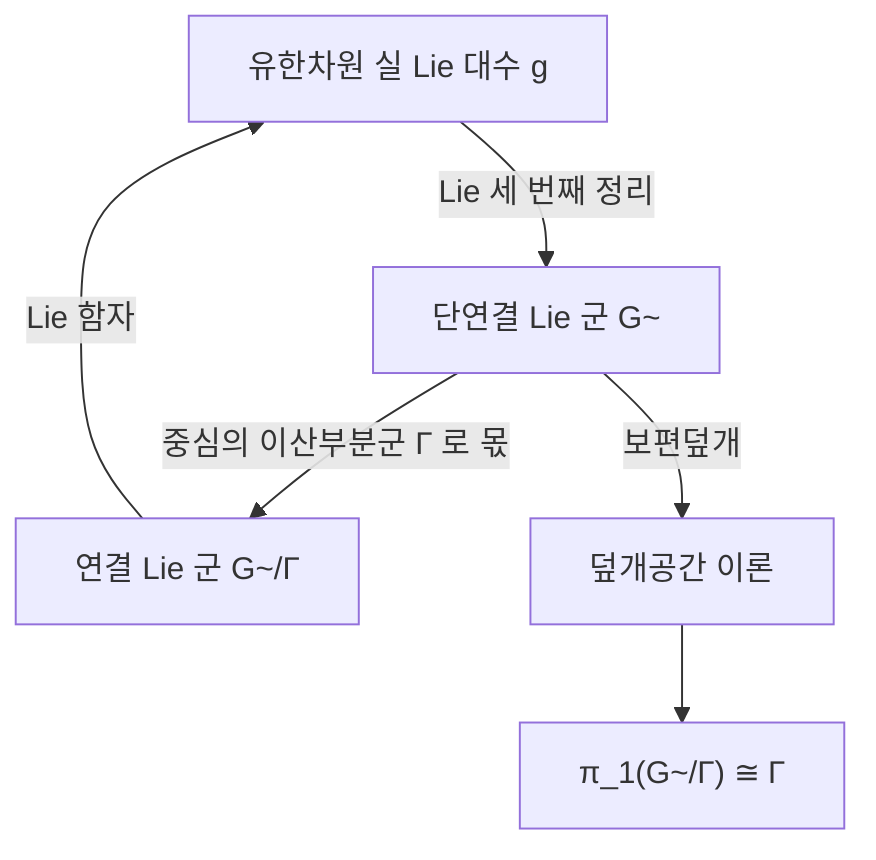

# Lie 군과 지수사상

# 개요

[Lie 대수](lie-algebras.md)는 연속 대칭군을 항등원 근처에서 선형화한 것이다. 반대 방향으로 대수에서 군을 복원하는 사상이 **지수사상**이다.

$$
\exp:\mathfrak g\to G,\qquad \exp(X)=\sum_{k\ge0}\frac{X^k}{k!}
$$

$\exp$ 는 $0$ 의 근방에서 미분동형이므로 국소적으로는 완전한 사전이다. 전역적으로는 두 가지로 어긋난다. $\mathrm{SL}_2(\mathbb R)$ 처럼 $\exp$ 가 전사가 아닌 군이 있고, $\mathrm{SU}(2)$ 와 $\mathrm{SO}(3)$ 처럼 같은 Lie 대수를 갖는 서로 다른 군이 있다.

남는 차이는 위상적이다. 같은 Lie 대수를 갖는 연결 Lie 군들은 하나의 보편덮개를 공유하고 서로는 이산 중심부분군에 의한 몫이므로, [덮개공간](covering-spaces.md) 이론이 대응 정리의 뼈대가 된다.

$$
\lbrace\text{단연결 Lie 군}\rbrace\ \xrightarrow{\ \sim\ }\ \lbrace\text{유한차원 실 Lie 대수}\rbrace
$$

단연결을 요구하면 이 대응이 범주 동치다.

# 직관

## 1-매개변수 부분군

$X\in\mathfrak g$ 를 왼쪽불변 벡터장으로 보면 $G$ 위의 흐름이 생기고, 항등원에서 출발해 그 흐름을 시간 $t$ 만큼 따라간 점이 $\exp(tX)$ 다. 정의하는 성질은 다음이다.

$$
\gamma(0)=e,\quad \gamma'(t)=\gamma(t)X,\quad \gamma(s+t)=\gamma(s)\gamma(t)
$$

$t\mapsto\exp(tX)$ 는 이 조건을 만족하는 유일한 **1-매개변수 부분군**이다. 행렬군에서는 급수가 그대로 이 미분방정식의 해다.

$\exp$ 의 $0$ 에서의 미분이 항등사상이므로 역함수 정리에 의해 $0$ 의 어떤 근방에서 미분동형이고, 그 근방에서 BCH 공식이 곱셈을 괄호로 복원한다.

## 같은 대수를 갖는 다른 군

$\mathrm{SU}(2)$ 와 $\mathrm{SO}(3)$ 은 둘 다 3 차원이고 Lie 대수가 같다.

$$
\mathfrak{su}(2)\cong\mathfrak{so}(3)
$$

군으로는 다르다. $\mathrm{SU}(2)$ 는 $S^3$ 이라 단연결이고 $\mathrm{SO}(3)$ 은 $\mathbb{RP}^3$ 이라 $\pi_1=\mathbb Z/2$ 다. 둘을 잇는 것이 이중덮개다.

$$
1\to\lbrace\pm I\rbrace\to\mathrm{SU}(2)\to\mathrm{SO}(3)\to1
$$

물리에서 이 부호가 스핀 $1/2$ 이다. $\theta=2\pi$ 의 회전은 $\mathrm{SO}(3)$ 에서 항등이지만 $\mathrm{SU}(2)$ 에서는 $-I$ 이므로 전자의 파동함수는 부호가 뒤집히고, 두 바퀴를 돌아야 제자리로 온다.

일반적으로 연결 Lie 군 $G$ 의 보편덮개 $\tilde G$ 도 Lie 군이고 같은 Lie 대수를 가지며

$$
G\cong\tilde G/\Gamma,\qquad \Gamma\subset Z(\tilde G)\ \text{이산}
$$

이다. Lie 대수가 결정하는 것은 $\tilde G$ 이고, 나머지 자유도는 중심의 이산 부분군을 고르는 것뿐이다.

## 지수사상의 상

$\mathrm{SL}_2(\mathbb R)$ 에서 $X$ 는 대각합이 0 이므로 고유값이 $\pm\lambda$ 다. $\lambda$ 가 실수면 $\exp X$ 의 대각합이 $2\cosh\lambda\ge2$ 이고, $\lambda=i\mu$ 가 순허수면 $2\cos\mu\in[-2,2]$ 이며, $X$ 가 멱영이면 $2$ 다. 어느 경우든 다음이 성립한다.

$$
\operatorname{tr}(\exp X)\ge-2
$$

$\operatorname{diag}(-2,-\tfrac12)$ 는 $\mathrm{SL}_2(\mathbb R)$ 의 원소이지만 대각합이 $-\tfrac52<-2$ 라 $\exp$ 의 상 밖에 있다. $\exp$ 의 상이 항등원의 근방을 포함하므로 유한 번 곱하면 모든 원소에 닿는다.

콤팩트 연결 Lie 군에는 양불변 Riemann 계량이 존재하고 지수사상이 측지선의 지수사상과 일치하므로, Hopf–Rinow 정리에 의해 $\exp$ 가 전사다.

# 정의

## Lie 군

**Lie 군**은 매끄러운 [다양체](manifolds.md) $G$ 이면서 군이고, 곱셈 $G\times G\to G$ 와 역원 $G\to G$ 가 매끄러운 것이다.

$\mathfrak g=T_eG$ 의 괄호는 왼쪽불변 벡터장으로 정의한다. $X\in T_eG$ 에 대해 $X^L_g=(dL_g)_eX$ 로 벡터장을 만들면 벡터장의 Lie 괄호가 다시 왼쪽불변이므로 $T_eG$ 위의 괄호가 유도된다. 이것이 $\operatorname{Lie}(G)=\mathfrak g$ 이고, 행렬군에서는 교환자 $XY-YX$ 와 일치한다.

## 지수사상과 딸림표현

$X\in\mathfrak g$ 에 대해 $\gamma_X(0)=e$ , $\gamma_X'(t)=(dL_{\gamma_X(t)})_eX$ 인 유일한 곡선으로 지수사상을 정의한다.

$$
\exp(X)=\gamma_X(1)
$$

$G\subset\mathrm{GL}\_n$ 이면 행렬 지수함수와 같다.

**딸림표현**은 켤레 작용의 미분이다.

$$
\operatorname{Ad}:G\to\mathrm{GL}(\mathfrak g),\quad \operatorname{Ad}(g)X=\left.\frac{d}{dt}\right|_{t=0}g\exp(tX)g^{-1}
$$

이것을 다시 미분하면 Lie 대수의 $\operatorname{ad}$ 가 나오고, 둘은 지수사상으로 이어진다.

$$
\operatorname{Ad}(\exp X)=e^{\operatorname{ad}\_X}
$$

# 성질

## 대응 정리

- **함자성.** Lie 군 준동형 $\varphi:G\to H$ 는 Lie 대수 준동형 $d\varphi:\mathfrak g\to\mathfrak h$ 를 유도하고 $\varphi(\exp X)=\exp(d\varphi\thinspace X)$ 가 성립한다.
- **단연결에서의 역방향.** $G$ 가 단연결이면 임의의 Lie 대수 준동형 $\psi:\mathfrak g\to\mathfrak h$ 에 대해 $d\varphi=\psi$ 인 군 준동형 $\varphi:G\to H$ 가 유일하게 존재한다.
- **부분대수 대응.** 부분대수 $\mathfrak h\subset\mathfrak g$ 마다 $\operatorname{Lie}(H)=\mathfrak h$ 인 연결 부분군 $H\subset G$ 가 유일하게 대응한다. $H$ 가 닫힌 부분군일 필요는 없고, 비합리 기울기의 원환면 감기가 반례다.
- **Lie 세 번째 정리.** 모든 유한차원 실 Lie 대수는 어떤 Lie 군의 Lie 대수다. Ado 정리로 행렬대수에 넣은 뒤 부분대수 대응을 쓴다.
- **Cartan 닫힌 부분군 정리.** 위상적으로 닫힌 부분군은 자동으로 매끄러운 부분다양체, 곧 Lie 부분군이다.

둘째 항목에서 단연결 Lie 군의 범주와 유한차원 실 Lie 대수의 범주가 $\operatorname{Lie}$ 함자로 동치임이 따른다.



## 이중덮개 $\mathrm{SU}(2)\to\mathrm{SO}(3)$ 의 계산

Pauli 행렬로 $\mathfrak{su}(2)$ 의 원소를 지수화하고 딸림표현을 회전행렬로 읽는다.

```python
import math

I2 = [[1, 0], [0, 1]]
sx = [[0, 1], [1, 0]]
sy = [[0, -1j], [1j, 0]]
sz = [[1, 0], [0, -1]]
sig = [sx, sy, sz]

def mm(A, B):
    return [[sum(A[i][k] * B[k][j] for k in range(2)) for j in range(2)]
            for i in range(2)]

def dag(A):
    return [[A[j][i].conjugate() for j in range(2)] for i in range(2)]

def su2(n, th):
    """exp(-i (th/2) n·sigma) = cos(th/2) I - i sin(th/2) n·sigma"""
    c, s = math.cos(th / 2), math.sin(th / 2)
    U = [[c + 0j, 0j], [0j, c + 0j]]
    for k in range(3):
        for i in range(2):
            for j in range(2):
                U[i][j] += -1j * s * n[k] * sig[k][i][j]
    return U

def adjoint_rot(U):
    """Ad(U) 를 sigma 기저로 읽으면 SO(3) 행렬. R_jk = (1/2) tr(sigma_j U sigma_k U†)"""
    R = [[0.0] * 3 for _ in range(3)]
    for j in range(3):
        for k in range(3):
            M = mm(sig[j], mm(U, mm(sig[k], dag(U))))
            R[j][k] = round((0.5 * (M[0][0] + M[1][1])).real, 12) or 0.0
    return R

n = [0, 0, 1]
for th in [math.pi, 2 * math.pi]:
    U = su2(n, th)
    print(round(th, 4), [[complex(round(x.real, 4), round(x.imag, 4)) for x in r] for r in U])
    print("   ", adjoint_rot(U))
# 3.1416 [[-1j, 0j], [0j, 1j]]
#     [[-1.0, 0.0, 0.0], [0.0, -1.0, 0.0], [0.0, 0.0, 1.0]]
# 6.2832 [[(-1-0j), 0j], [0j, (-1+0j)]]
#     [[1.0, 0.0, 0.0], [0.0, 1.0, 0.0], [0.0, 0.0, 1.0]]
```

$\theta=2\pi$ 에서 $U=-I$ 이지만 대응하는 회전은 항등이고, $U$ 와 $-U$ 는 언제나 같은 회전을 준다. $\mathrm{SU}(2)$ 에서는 $\theta$ 가 $4\pi$ 까지 가야 닫힌 고리가 되고 $\mathrm{SO}(3)$ 에서는 $2\pi$ 면 닫힌다. 그 차이가 $\pi_1(\mathrm{SO}(3))=\mathbb Z/2$ 다.

## 콤팩트 군

콤팩트 Lie 군에서는 [군의 표현](group-representations.md)의 유한군 이론이 거의 그대로 성립한다.

- Haar 측도로 평균을 낼 수 있어 모든 유한차원 표현이 완전가약이다(Weyl 의 유니터리 트릭).
- 기약표현이 전부 유한차원이고 가산개다.
- Peter–Weyl 정리에 의해 $L^2(G)$ 가 기약표현들의 행렬계수로 분해된다.
- 극대 원환면 $T\subset G$ 가 있고 모든 원소가 어떤 극대 원환면의 켤레에 속한다. 표현은 $T$ 의 무게로 분류된다.

$G=\mathrm{SO}(3)$ 에서 이 분해가 [구면조화함수](spherical-harmonics.md)이고 $G=S^1$ 에서는 [Fourier 급수](fourier-series.md)다.

# 활용

## 스핀과 게이지장

$\mathrm{SU}(2)$ 의 표현이 스핀이다. 반정수 스핀은 $\mathrm{SO}(3)$ 이 아니라 그 이중덮개의 표현이고, 그래서 페르미온이 $2\pi$ 회전에서 부호를 바꾼다. 상대론에서는 $\mathrm{SL}_2(\mathbb C)\to\mathrm{SO}^+(3,1)$ 가 같은 역할을 하며 Weyl 스피너를 준다.

게이지 이론에서 주다발의 구조군이 Lie 군이고 게이지장이 Lie 대수값 접속이며, 곡률의 지수가 Wilson 고리로 관측된다.

## 수치 계산과 공학

강체의 자세는 $\mathrm{SO}(3)$ 의 원소, 위치까지 포함하면 $\mathrm{SE}(3)$ 의 원소다. 이 공간은 벡터공간이 아니므로 덧셈으로 상태를 갱신하지 못하고, 대신 Lie 대수에서 갱신량을 만들어 지수사상으로 올린다.

$$
g_{k+1}=g_k\exp(\xi_k)
$$

로봇 자세추정과 SLAM 이 이 형태를 쓴다. 해가 군 위에 머물도록 보장하는 Lie 군 적분기(Magnus 전개, Runge–Kutta–Munthe-Kaas)도 같은 원리이고, 사원수 회전 표현은 $\mathrm{SU}(2)\cong S^3$ 을 쓰는 것이다.

## 표현론과 정수론

콤팩트 군의 Peter–Weyl 분해를 비콤팩트 군과 산술 몫으로 확장하면 자기동형 형식이 된다. [Langlands 강령](langlands-program.md)이 그 위에서 서술되고, 실 Lie 군의 무한차원 표현론(Harish-Chandra 이론)이 아르키메데스 자리의 국소 성분을 담당한다.[^1]

[^1]: B. Hall, *Lie Groups, Lie Algebras, and Representations* (2판, 2015) 가 행렬군 중심이다. 다양체 관점은 J. Lee, *Introduction to Smooth Manifolds* (2판, 2012) 7, 8, 20 장. 콤팩트 군과 Peter–Weyl 은 T. Bröcker, T. tom Dieck, *Representations of Compact Lie Groups* (1985).

# 연관 문서

## 선수지식

- [Lie 대수](lie-algebras.md)
- [덮개공간](covering-spaces.md)
- [미분기하 개관](differential-geometry-overview.md)

## 더 알아보기

- [Peter–Weyl 정리](peter-weyl.md)
- [Chern–Simons 이론과 레벨 양자화](chern-simons.md)

#differential_geometry #group_theory #linear_algebra
