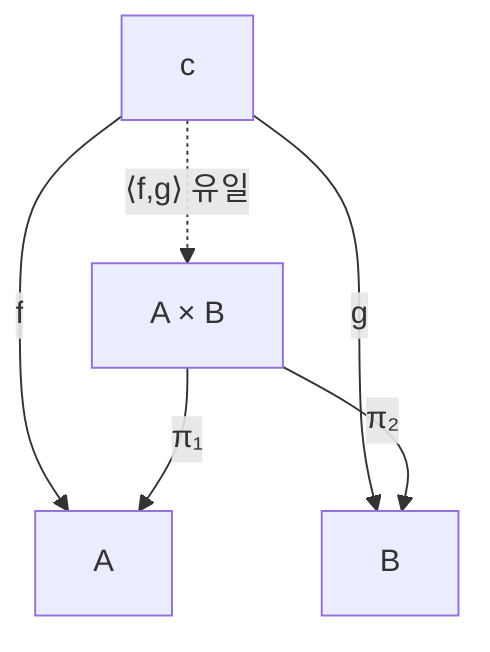
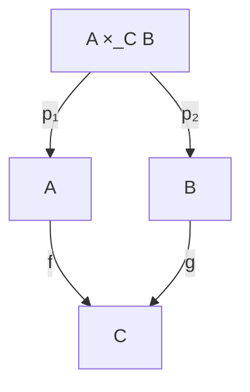

# 제한과 쌍대제한

# 개요

곱, 교집합, 당김, 몫, 붙임은 서로 다른 분야에서 따로 배우는 구성이지만 범주론에서는 하나의 문장의 사례다. 그 문장은 "어떤 도형에 맞춰지는 대상들 가운데 가장 보편적인 것" 이다. 이 대상이 극한(limit)이고, 화살표를 모두 뒤집은 쌍대 개념이 쌍대극한(colimit)이다.

도형은 [함자](functors.md) $D : J \to C$ 로 정의한다. 그러면 도형 위에 얹히는 원뿔이 [자연변환](natural-transformations.md)이 되고, 극한은 원뿔들의 범주에서 종단대상이라는 한 줄 정의가 된다.

# 직관

두 집합 $A$ 와 $B$ 의 정보를 모두 담되 그 이상은 덧붙이지 않는 대상이 곱집합 $A \times B$ 다. 이 조건을 검증하는 것이 보편성질이다. $A$ 로도 가고 $B$ 로도 가는 사상을 가진 대상 $c$ 는 반드시 $A \times B$ 를 한 번 경유해야 하고 그 경유 방법은 하나뿐이다.

$A \times B \times \mathbb{Z}$ 는 $A$ 와 $B$ 로 가는 사상을 갖지만 보편적이지 않다. $c$ 에서 오는 사상을 만들려면 $\mathbb{Z}$ 성분을 임의로 정해야 해서 유일성이 깨진다. $A$ 혼자서는 $B$ 로 갈 방법이 없어 후보가 아니다.

쌍대극한은 화살표를 뒤집은 것이다. 곱이 정보를 나란히 담는다면 합(coproduct)은 두 대상을 겹치지 않게 붙인다. 동등자가 식이 성립하는 부분을 잘라 내는 반면 쌍대동등자는 식이 성립하도록 원소를 동일시해 몫을 만든다. 부분구조를 만드는 구성은 대개 극한 쪽에, 몫을 만드는 구성은 쌍대극한 쪽에 있다.

# 정의

## 도형과 원뿔

작은 범주 $J$ 가 도형의 모양이고, 함자 $D : J \to C$ 가 $C$ 안의 $J$ 모양 도형이다. 대상 $c \in C$ 에 대해 모든 대상을 $c$ 로, 모든 사상을 $\mathrm{id}\_c$ 로 보내는 상수 함자를 $\Delta c : J \to C$ 로 쓴다.

$D$ 위의 원뿔(cone)은 자연변환 $\lambda : \Delta c \Rightarrow D$ 다. 성분으로 풀면 $J$ 의 각 대상 $j$ 마다 사상 $\lambda_j : c \to D(j)$ 가 있고 $J$ 의 각 사상 $u : j \to j'$ 마다 다음이 성립한다.

$$
D(u)\circ\lambda_j=\lambda_{j'}
$$

$\Delta c$ 가 $u$ 를 항등사상으로 보내므로 자연성 사각형의 한 변이 사라져 이 삼각형 조건만 남는다. 곧 원뿔의 면들이 모두 가환이다.

## 극한

$D$ 의 극한은 다음 보편성질을 만족하는 원뿔 $\lambda : \Delta(\lim D) \Rightarrow D$ 다. 임의의 원뿔 $\mu : \Delta c \Rightarrow D$ 에 대해 사상 $h : c \to \lim D$ 가 유일하게 존재해 모든 $j$ 에서 다음이 성립한다.

$$
\lambda_j\circ h=\mu_j
$$

원뿔들을 대상으로 하고 이 등식을 만족하는 $h$ 를 사상으로 하는 범주에서 극한은 종단대상이다. 쌍대극한은 반대 범주 $C^{\mathrm{op}}$ 에서의 극한이며, 성분으로 쓰면 여원뿔 $D(j) \to \mathrm{colim} D$ 들 가운데 시작대상이다.

## 이름이 붙은 사례

| $J$ 의 모양 | 극한 | 쌍대극한 |
|---|---|---|
| 대상 둘, 사상 없음 | 곱 $A \times B$ | 합 $A + B$ |
| 대상 없음 | 종단대상 $1$ | 시작대상 $0$ |
| $f, g : a \rightrightarrows b$ | 동등자 $\mathrm{eq}(f,g)$ | 쌍대동등자 $\mathrm{coeq}(f,g)$ |
| $a \to c \leftarrow b$ 와 $a \leftarrow c \to b$ | 당김 $A \times_C B$ | 밀어냄 $A +\_C B$ |
| 사슬 $a_0 \to a_1 \to \cdots$ | 역극한 | 직접극한 |

집합의 범주에서 당김은 다음과 같다.

$$
A\times_C B=\lbrace(a,b)\in A\times B\mid f(a)=g(b)\rbrace
$$

# 성질

## 동형을 제외한 유일성

극한은 종단대상이므로 두 극한 $L$ 과 $L'$ 사이에 원뿔을 보존하는 사상이 양방향으로 유일하게 존재하고, 그 합성은 유일성에 의해 항등사상이다. 따라서 $L \cong L'$ 이고, "그" 극한이라는 표현이 정당화된다.

## 곱과 동등자에 의한 구성

$C$ 에 모든 작은 곱과 모든 동등자가 있으면 임의의 작은 도형의 극한이 존재한다.

$$
\lim D=\mathrm{eq}\Big(\prod_{j}D(j)\ \rightrightarrows\ \prod_{u:j\to j'}D(j')\Big)
$$

두 사상은 $u : j \to j'$ 성분에서 각각 $D(u) \circ \pi_j$ 와 $\pi_{j'}$ 다. 두 사상이 일치하는 부분이 원뿔 조건을 만족하는 성분들의 모음이다. 유한 극한만 필요하면 유한 곱과 동등자로 충분하고, 당김과 종단대상만 있어도 같은 결론이 나온다.

## Hom 함자의 극한 보존

극한의 정의를 $\mathrm{Hom}$ 으로 읽으면 다음 자연동형이 된다.

$$
\mathrm{Hom}\_C(c,\lim D)\cong\lim_j\mathrm{Hom}\_C(c,D(j))
$$

왼쪽은 $c$ 에서 극한으로 가는 사상, 오른쪽은 $c$ 위의 원뿔들의 집합이고, 보편성질이 이 둘의 일대일 대응이다. 집합의 극한은 구체적으로 계산되므로 이 식이 추상적 극한을 집합 수준의 계산으로 내린다. 반변 쪽에서는 화살표가 뒤집혀 쌍대극한을 극한으로 바꾼다.

$$
\mathrm{Hom}\_C(\mathrm{colim}D,c)\cong\lim_j\mathrm{Hom}\_C(D(j),c)
$$

## 극한과 쌍대극한의 비대칭

극한은 성분마다 독립적으로 계산된다. 집합의 곱에서 원소를 고르는 일이 좌표마다 따로 일어나는 것과 같다. 쌍대극한은 그렇지 않다. 군의 합은 원소쌍이 아니라 자유곱이고 위상공간의 밀어냄은 붙임 공간이다. 극한 쪽이 계산하기 쉬운 이유가 이 차이다.

# 활용

- **익숙한 구성의 재해석.** 군 준동형 $f : G \to H$ 의 핵은 $f$ 와 상수 사상 $e$ 의 동등자, 부분공간 위상은 포함사상을 따라 만든 당김, 두 부분집합의 교집합은 포함사상들의 당김이다. [곱집합](sets.md)마다 따로 검증하던 유일성이 하나의 보편성질로 정리된다.
- **극한 보존의 검사.** 망각 함자가 극한을 보존한다는 사실이 "군의 곱은 바탕집합의 곱" 을 준다. [수반](adjunctions.md)에서 오른쪽 수반은 극한을, 왼쪽 수반은 쌍대극한을 보존하므로, 극한을 깨뜨리는 예 하나가 어떤 구성이 수반이 아님을 보인다.
- **계산과 데이터.** 관계형 데이터베이스의 동등 조인은 두 표를 키 집합으로 보내는 함수의 당김이고, 타입 시스템의 곱 타입과 합 타입은 각각 곱과 합이다. 조각을 붙여 전체를 만드는 작업은 밀어냄의 계산이다.

# 연관 문서

## 선수지식

- [자연변환](natural-transformations.md)

## 더 알아보기

- [토포스](topos-theory.md)

#category_theory #set_theory #algebra #construction
