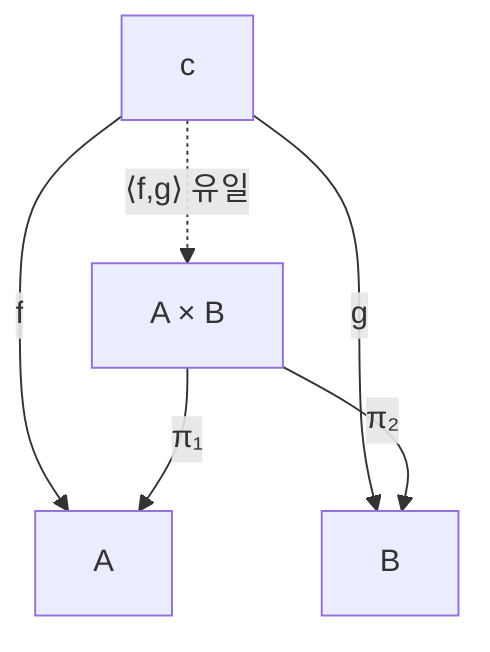
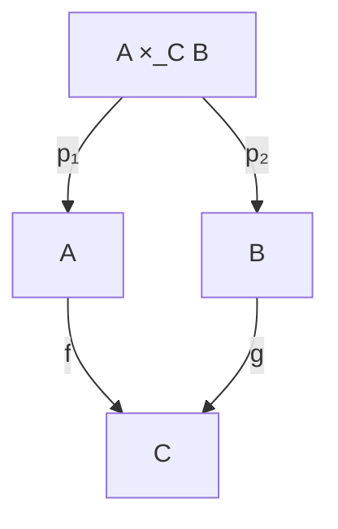

# 제한과 쌍대제한

# 개요

곱, 교집합, 당김, 몫, 붙임은 서로 다른 분야에서 따로 배우는 구성이지만 범주론에서는 전부 같은 문장의 사례다. 그 문장은 "어떤 도형에 맞춰지는 대상들 가운데 가장 보편적인 것" 이다. 이 보편적인 대상을 극한(limit), 화살표를 모두 뒤집은 쌍대 개념을 쌍대극한(colimit)이라 한다.

도형을 "대상 몇 개와 그 사이 화살표 몇 개" 라고 뭉뚱그리지 않고 [functor](functors.md) `D : J → C` 로 정의하는 것이 핵심이다. 그러면 도형 위에 얹히는 원뿔은 [자연변환](natural-transformations.md)이 되고, 극한은 원뿔들의 범주에서 종단대상이라는 한 줄 정의로 끝난다. 이 문서가 자연변환을 선수지식으로 두는 이유가 여기에 있다.

# 직관

두 집합 `A`, `B` 를 동시에 다루고 싶다고 하자. 둘의 정보를 모두 담되 그 이상은 아무것도 덧붙이지 않는 대상이 곱집합 `A × B` 다. "그 이상은 덧붙이지 않는다" 를 검증할 방법이 보편성질이다. `A` 로도 가고 `B` 로도 가는 사상을 가진 대상 `c` 가 있으면, `c` 는 반드시 `A × B` 를 한 번 경유해야 하고 그 경유 방법은 하나뿐이다.



점선 화살표의 유일한 존재가 곱을 곱으로 만든다. `A × B × ℤ` 는 `A` 와 `B` 로 가는 사상을 갖지만 보편적이지 않다. `c` 에서 오는 사상을 만들려면 `ℤ` 성분을 임의로 정해야 하고 유일성이 깨지기 때문이다. 반대로 `A` 혼자서는 `B` 로 갈 방법이 없어 아예 후보가 아니다. 극한은 이렇게 "부족하지도 넘치지도 않는" 지점을 집어낸다.

쌍대극한은 화살표를 뒤집은 것이다. 곱이 정보를 나란히 담는다면 쌍대극한인 합(coproduct)은 두 대상을 겹치지 않게 붙인다. 동등자가 "식이 성립하는 부분" 을 잘라 내는 반면, 쌍대동등자는 "식이 성립하도록 원소를 동일시" 해 몫을 만든다. 부분구조를 만드는 구성은 대개 극한 쪽에, 몫을 만드는 구성은 쌍대극한 쪽에 있다.

# 정의

## 도형과 원뿔

작은 범주 `J` 를 도형의 모양, functor `D : J → C` 를 `C` 안의 `J` 모양 도형이라 한다. 대상 `c ∈ C` 에 대해 모든 것을 `c` 로 보내고 모든 사상을 `id_c` 로 보내는 상수 functor 를 `Δc : J → C` 라 쓴다.

`D` 위의 원뿔(cone)은 자연변환 `λ : Δc ⇒ D` 다. 성분으로 풀면 `J` 의 각 대상 `j` 마다 사상 `λ_j : c → D(j)` 가 있고, `J` 의 각 사상 `u : j → j'` 마다 다음이 성립한다.

$$
D(u)\circ\lambda_j=\lambda_{j'}
$$

`Δc` 는 `u` 를 항등사상으로 보내므로 naturality 사각형의 한 변이 사라져 위 삼각형 조건만 남는다. 즉 원뿔의 면들이 모두 가환이라는 뜻이다.

## 극한

`D` 의 극한은 원뿔 `λ : Δ(lim D) ⇒ D` 로서 다음 보편성질을 만족하는 것이다. 임의의 원뿔 `μ : Δc ⇒ D` 에 대해 사상 `h : c → lim D` 가 유일하게 존재해 모든 `j` 에서 다음이 성립한다.

$$
\lambda_j\circ h=\mu_j
$$

원뿔들을 대상으로 하고 위 등식을 만족하는 `h` 를 사상으로 하는 범주를 만들면, 극한은 그 범주의 종단대상이다. 쌍대극한은 `C` 의 화살표를 전부 뒤집은 반대 범주 `C^op` 에서의 극한이다. 성분으로 쓰면 여원뿔 `D(j) → colim D` 들 가운데 시작대상이다.

## 이름이 붙은 사례

| `J` 의 모양 | 극한 | 쌍대극한 |
|---|---|---|
| 대상 둘, 사상 없음 | 곱 `A × B` | 합 `A + B` |
| 대상 없음 | 종단대상 `1` | 시작대상 `0` |
| `f, g : a ⇉ b` | 동등자 `eq(f,g)` | 쌍대동등자 `coeq(f,g)` |
| `a → c ← b` / `a ← c → b` | 당김 `A ×_C B` | 밀어냄 `A +_C B` |
| 사슬 `a₀ → a₁ → ⋯` | 역극한 | 직접극한 |

집합의 범주에서 당김은 다음과 같이 구체적으로 쓰인다.

$$
A\times_C B=\{(a,b)\in A\times B\mid f(a)=g(b)\}
$$



# 성질

## 동형을 무시하면 유일하다

극한은 종단대상이므로 두 극한 `L`, `L'` 사이에는 원뿔을 보존하는 사상이 양방향으로 유일하게 존재하고, 그 합성은 유일성 때문에 항등사상일 수밖에 없다. 따라서 `L ≅ L'` 이다. "그" 극한이라고 정관사를 붙여 말해도 되는 근거가 이것이다.

## 곱과 동등자면 충분하다

`C` 에 모든 작은 곱과 모든 동등자가 있으면 임의의 작은 도형의 극한이 존재한다. `D : J → C` 에 대해 두 곱 사이의 사상 두 개를 만들고 그 동등자를 취하면 된다.

$$
\lim D=\operatorname{eq}\Big(\prod_{j}D(j)\ \rightrightarrows\ \prod_{u:j\to j'}D(j')\Big)
$$

두 사상은 각각 `u : j → j'` 성분에서 `D(u)∘π_j` 와 `π_{j'}` 로 준다. 두 사상이 일치하는 부분이 바로 원뿔 조건을 만족하는 성분들의 모음이다. 유한 극한만 필요하면 유한 곱과 동등자로 충분하고, 당김과 종단대상만 있어도 같은 결론이 나온다.

## Hom functor 는 극한을 보존한다

극한의 정의를 $\operatorname{Hom}$ 으로 읽으면 다음 자연동형이 된다.

$$
\operatorname{Hom}_C(c,\lim D)\cong\lim_j\operatorname{Hom}_C(c,D(j))
$$

왼쪽은 `c` 에서 극한으로 가는 사상, 오른쪽은 `c` 위의 원뿔들의 집합이고, 보편성질이 바로 이 둘의 일대일 대응이다. 집합의 극한은 구체적으로 계산되므로 이 식은 추상적인 극한을 집합 수준의 계산으로 끌어내리는 통로가 된다. 반변 쪽에서는 화살표가 뒤집혀 쌍대극한을 극한으로 바꾼다.

$$
\operatorname{Hom}_C(\operatorname{colim}D,c)\cong\lim_j\operatorname{Hom}_C(D(j),c)
$$

## 성분별로 계산된다

극한은 성분마다 독립적으로 계산된다. 집합의 곱에서 원소를 고르는 일이 좌표마다 따로 일어나는 것과 같다. 반면 쌍대극한은 그렇지 않다. 예를 들어 군의 합은 원소쌍이 아니라 자유곱이고, 위상공간의 밀어냄은 붙임 공간이다. 극한 쪽이 계산하기 쉽고 쌍대극한 쪽이 어려운 비대칭은 여기서 온다.

## 유한 집합에서 확인

유한 집합의 범주에서 곱, 동등자, 당김을 직접 만들고, 당김이 곱과 동등자로부터 나온다는 것을 확인한다.

```python
def product(A, B):
    return [(a, b) for a in A for b in B]

def equalizer(A, f, g):
    return [a for a in A if f(a) == g(a)]

def pullback(A, B, f, g):
    # 곱을 만든 뒤 두 성분이 C에서 일치하는 부분만 남긴다
    return equalizer(product(A, B), lambda p: f(p[0]), lambda p: g(p[1]))

A = [1, 2, 3, 4]
B = ["x", "y"]
f = lambda a: a % 2           # A → {0, 1}
g = lambda b: 0 if b == "x" else 1

print(pullback(A, B, f, g))
# [(1, 'y'), (2, 'x'), (3, 'y'), (4, 'x')]

# 보편성질 확인: c에서 온 원뿔은 당김을 유일하게 경유한다
C = ["p", "q"]
u = lambda c: 2 if c == "p" else 3      # C → A
v = lambda c: "x" if c == "p" else "y"  # C → B
assert all(f(u(c)) == g(v(c)) for c in C)      # 원뿔 조건
h = lambda c: (u(c), v(c))                     # 유일한 매개 사상
assert all(h(c) in pullback(A, B, f, g) for c in C)
```

# 활용

## 익숙한 구성의 재해석

부분군, 부분공간, 핵은 모두 극한이다. 군 준동형 `f : G → H` 의 핵은 `f` 와 상수 사상 `e` 의 동등자이고, 부분공간 위상은 포함사상을 따라 만든 당김이며, 두 부분집합의 교집합은 포함사상들의 당김이다. [곱집합](sets.md)에서 시작해 매번 새로 검증하던 "유일하게 결정된다" 는 성질이 한 번의 보편성질로 정리된다.

## 극한 보존이라는 검사 도구

어떤 구성이 극한을 보존하는지 여부는 그 구성의 성격을 드러낸다. 망각 functor 가 극한을 보존한다는 사실은 "군의 곱은 바탕집합의 곱" 처럼 계산을 옮겨 준다. [Adjunction](adjunctions.md)에서는 오른쪽 수반이 항상 극한을 보존하고 왼쪽 수반이 쌍대극한을 보존하는데, 이 명제는 어떤 구성이 수반일 수 없음을 보이는 가장 빠른 반증 도구다. 극한을 깨뜨리는 예 하나만 찾으면 된다.

## 계산과 데이터

관계형 데이터베이스의 동등 조인은 두 표를 키 집합으로 보내는 함수의 당김이고, 타입 시스템의 곱 타입과 합 타입은 각각 곱과 합이다. 여러 모듈의 부분 정보를 모순 없이 합치는 작업은 대개 당김을, 조각을 붙여 전체를 만드는 작업은 밀어냄을 계산하는 일로 번역된다.

# 연관 문서

## 선수지식

- [자연변환](natural-transformations.md)

## 더 알아보기

아직 연결한 문서가 없다.

#category_theory #construction
