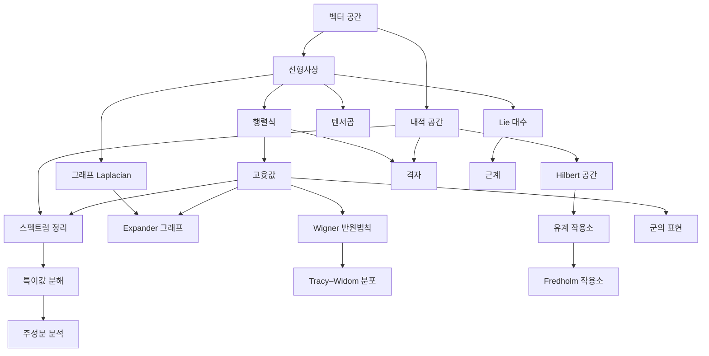

# 선형대수 개관

# 개요

선형대수는 벡터 공간과 선형사상을 다룬다. 물음은 "선형사상 하나를 어디까지 단순하게 볼 수 있는가" 로 모인다. 행렬식은 부피 배율을, 고윳값은 불변 방향을, 스펙트럼 정리와 특이값 분해는 사상을 회전·늘림·회전으로 쪼갠다. 선형대수는 여러 분야에서 도구로 쓰이므로 갈래의 대부분이 응용이다. 그래프의 스펙트럼, 통계의 주성분, 무한차원 작용소, 랜덤 행렬, 격자와 부호, 그리고 표현론이 모두 여기서 갈라진다.

시작점은 [벡터 공간](vector-spaces.md)과 [선형사상](linear-maps.md)이다. [행렬식](determinants.md)과 [고윳값](eigenvalues.md)을 거쳐 [내적 공간](inner-product-spaces.md) 위의 [스펙트럼 정리](spectral-theorem.md)까지가 기초이고, 그 뒤는 관심사에 따라 고른다.

# 지도

# 갈래

## 기초

- [벡터 공간](vector-spaces.md) → [선형사상](linear-maps.md): 기저, 차원, 행렬 표현
- [행렬식](determinants.md) → [고윳값과 고유벡터](eigenvalues.md): 부피와 불변 방향
- [Jordan 표준형](jordan-canonical-form.md): 대각화가 안 되는 행렬의 유사 불변량
- [Perron–Frobenius 정리](perron-frobenius.md): 음이 아닌 행렬의 최대 고윳값과 양의 고유벡터
- [내적 공간](inner-product-spaces.md) → [스펙트럼 정리](spectral-theorem.md) → [특이값 분해](singular-value-decomposition.md)
- [행렬 분해](matrix-factorizations.md): LU, Cholesky, QR 분해와 조건수, 연립방정식을 푸는 계산
- [Krylov 부분공간 방법](krylov-subspace-methods.md): 행렬-벡터 곱만 쓰는 반복법, 공액기울기법과 Lanczos 반복
- [전처리](preconditioning.md): 스펙트럼을 모아 반복 횟수를 줄이는 행렬의 선택
- [Schur 보수](schur-complement.md): 블록 소거가 남기는 작은 계, 행렬식과 양의 정부호성의 분리
- [다중격자](multigrid.md): 주파수대마다 격자 단계를 맡기는 V 사이클, 격자 간격과 무관한 수렴률
- [영역 분할법](domain-decomposition.md): 부분영역마다 작은 계를 풀어 더하는 가법 Schwarz, 성긴 공간이 주는 조건수 상한
- [쌍대 공간](dual-space.md): 벡터를 재는 범함수와 전치
- [텐서곱](tensor-products.md): 다중선형을 선형으로
- [외대수](exterior-algebra.md): 반대칭 곱과 좌표 없는 행렬식

## 통계와 데이터

- [주성분 분석](principal-component-analysis.md) → [확률적 PCA](probabilistic-pca.md)(principal component analysis), [커널 PCA](kernel-pca.md)
- [선형회귀와 최소제곱법](linear-regression.md): 사영으로 푸는 추정
- [이산 Fourier 변환](fourier.md): 순환 구조의 대각화

## 그래프의 스펙트럼

- [그래프 Laplacian](graph-laplacian.md) → [유효저항](effective-resistance.md) → [스펙트럼 희소화](spectral-sparsification.md)
- [Expander 그래프](expander-graphs.md): 두 번째 고윳값이 연결성을 잰다

## 무한차원

- [Hilbert 공간](hilbert-spaces.md) → [유계 작용소](bounded-operators.md) → [Fredholm 작용소](fredholm-operators.md) → [Fredholm 행렬식](fredholm-determinant.md)
- [비유계 작용소](unbounded-operators.md): 미분 작용소의 자기수반성

## 랜덤 행렬

- [Wigner 반원법칙](wigner-semicircle.md) → [Marchenko–Pastur 법칙](marchenko-pastur.md), [Tracy–Widom 분포](tracy-widom.md)
- [결정점과정](determinantal-point-process.md): 고윳값의 반발을 행렬식으로

## 격자와 부호

- [격자](lattices.md) → [최단벡터 문제](shortest-vector-problem.md) → [격자 기반 후양자 암호](post-quantum-cryptography.md)
- [오류정정부호](error-correcting-codes.md): 유한체 위의 선형 부분공간
- [질량 공식](mass-formula.md) → [Niemeier 격자](niemeier-lattices.md)

## 표현론

- [군의 표현](group-representations.md): 군을 행렬로
- [Lie 대수](lie-algebras.md) → [근계](root-systems.md), [Lie 군](lie-groups.md)
- [Schur–Weyl 쌍대성](schur-weyl-duality.md), [Schur 다항식](schur-polynomials.md): 텐서 거듭제곱의 분해
- [Hecke 작용소](hecke-operators.md), [Sen 이론](sen-theory.md), [Reidemeister 비틀림](reidemeister-torsion.md): 다른 분야가 선형대수를 쓰는 자리

# 연관 문서

## 선수지식

- [집합](sets.md)

## 더 알아보기

- [벡터 공간](vector-spaces.md)

#linear_algebra #overview
