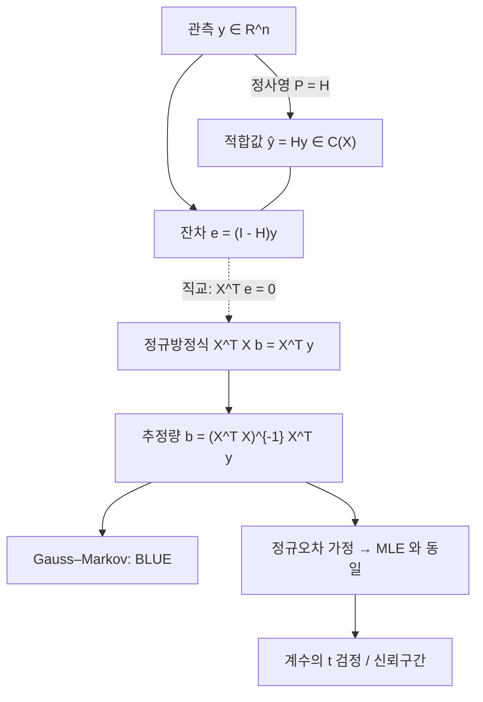

# 선형회귀와 최소제곱법

# 개요

선형회귀는 반응변수의 조건부평균을 설명변수들의 선형결합으로 모형화하고, 계수를 잔차제곱합 최소화로 정하는 방법이다. 같은 계산이 두 가지 언어로 읽힌다. 기하학적으로는 관측 벡터를 설계행렬의 열공간 위로 정사영하는 것이고([내적 공간](inner-product-spaces.md)), 확률적으로는 오차가 정규분포일 때의 [최대가능도 추정](maximum-likelihood.md)이다.

이 이중성이 선형회귀를 통계학의 중심에 놓는다. 정사영 쪽에서는 유일성, 직교분해, 수치적 안정성이 나오고, 가능도 쪽에서는 추정량의 분포, 검정, 신뢰구간이 나온다. Gauss–Markov 정리는 그 사이에 걸쳐 있다. 분포 가정 없이 2차 모멘트 가정만으로도 최소제곱추정량이 선형불편추정량 중 최소분산임을 말한다.

# 직관

점들의 구름에 직선을 긋는 문제로 시작하자. "잘 맞는" 직선의 기준을 세로 거리의 제곱합으로 잡으면 계산이 가장 단순해지고, 답이 유일하며, 해가 닫힌 형태로 나온다.

`n` 차원에서 보면 그림이 달라진다. 관측값 전체를 벡터 `y ∈ R^n` 로, 설계행렬의 각 열을 역시 `R^n` 의 벡터로 본다. 계수를 바꿔 만들 수 있는 예측벡터들의 집합은 열들이 생성하는 부분공간이다. 잔차제곱합은 `y` 와 그 부분공간 위 점 사이의 거리 제곱이므로, 최소제곱해는 `y` 에서 부분공간으로 수선의 발을 내린 점이다. 최적성의 조건은 "잔차가 모든 설명변수와 직교한다"로 요약되고, 이것이 정규방정식이다.



# 정의

## 모형과 설계행렬

관측 `i = 1, …, n` 에 대해

$$
y_i \;=\; \beta_0 + \beta_1 x_{i1} + \cdots + \beta_{p-1} x_{i,p-1} + \varepsilon_i
$$

를 가정한다. 행렬로 쓰면

$$
y = X\beta + \varepsilon, \qquad y \in \mathbb{R}^{n},\; X \in \mathbb{R}^{n \times p},\; \beta \in \mathbb{R}^{p}.
$$

`X` 를 설계행렬이라 하고, 절편을 쓰면 첫 열이 1 벡터다. 여기서 "선형"은 계수에 대한 선형이지 변수에 대한 선형이 아니다. 열에 `x²`, `log x`, 두 변수의 곱, 기저함수 값을 넣어도 모형은 여전히 선형회귀다. 범주형 변수는 지시변수 열로 부호화한다.

Gauss–Markov 가정은 다음 세 가지다.

$$
\mathbb{E}[\varepsilon] = 0, \qquad \mathrm{Var}(\varepsilon) = \sigma^2 I_n, \qquad \mathrm{rank}(X) = p \le n .
$$

두 번째 가정은 오차의 등분산성과 무상관을 함께 요구한다. 정규성은 아직 필요 없다.

## 최소제곱 문제와 정사영

최소제곱추정량은

$$
\hat\beta \;=\; \arg\min_{b \in \mathbb{R}^{p}} \; \lVert y - Xb \rVert^{2}
$$

로 정의된다. `Xb` 의 집합은 `X` 의 열공간 `C(X)` 이므로, 이 문제는 "부분공간 위의 최근접점 찾기"다. [내적 공간](inner-product-spaces.md)의 정사영 정리에 의해 최근접점은 유일하게 존재하고, 그 점 `ŷ` 는

$$
y - \hat{y} \;\perp\; C(X), \qquad \text{즉}\quad X^{\top}(y - X\hat\beta) = 0
$$

으로 특징지어진다. 이를 정리하면 정규방정식

$$
X^{\top}X\,\hat\beta \;=\; X^{\top}y
$$

이고, `rank(X) = p` 이면 `XᵀX` 가 가역이므로

$$
\hat\beta = (X^{\top}X)^{-1}X^{\top}y, \qquad \hat{y} = X\hat\beta = Hy .
$$

## Hat matrix

$$
H \;=\; X(X^{\top}X)^{-1}X^{\top}
$$

를 hat matrix 또는 사영행렬이라 한다. 성질은 정사영의 성질 그대로다.

$$
H^{\top} = H, \qquad H^{2} = H, \qquad HX = X, \qquad \mathrm{tr}(H) = p .
$$

대칭이며 멱등이므로 [고윳값](eigenvalues.md)은 0 과 1 뿐이고, 1 의 중복도가 `rank(X) = p` 라서 대각합이 `p` 다. 잔차는 `e = (I - H)y` 이며 `I - H` 역시 사영행렬로 `C(X)` 의 직교여공간에 대응한다. 대각원소 `h_ii` 를 관측 `i` 의 leverage 라 하고, `0 ≤ h_ii ≤ 1`, 합이 `p` 다. leverage 가 큰 점은 설계공간에서 멀리 떨어져 있어 적합값을 혼자 끌고 갈 수 있다.

## 잔차제곱합과 분산추정

$$
\mathrm{RSS} = \lVert e \rVert^{2} = y^{\top}(I - H)y, \qquad
\hat\sigma^{2} = \frac{\mathrm{RSS}}{n - p}.
$$

`E[RSS] = (n-p)σ²` 이므로 이 추정량은 불편이다. 나누는 수가 `n` 이 아니라 `n - p` 인 이유는 잔차가 `p` 개의 선형제약(`Xᵀe = 0`)을 받아 자유도가 `n - p` 이기 때문이다.

# 성질

## 정사영 정리와 유일성

`b` 가 임의의 계수벡터일 때

$$
\lVert y - Xb \rVert^{2} = \lVert y - \hat{y} \rVert^{2} + \lVert \hat{y} - Xb \rVert^{2}
$$

가 성립한다. `y - ŷ` 가 `C(X)` 와 직교하고 `ŷ - Xb ∈ C(X)` 이므로 Pythagoras 정리를 쓴 것이다. 오른쪽 둘째 항은 `Xb = ŷ` 일 때만 0 이므로 `ŷ` 는 유일하고, 열이 일차독립이면 `β̂` 도 유일하다. 열이 일차종속이면 `ŷ` 는 여전히 유일하지만 `β̂` 는 유일하지 않다(그때는 Moore–Penrose 유사역행렬로 최소노름해를 고른다).

## Gauss–Markov 정리

Gauss–Markov 가정 아래에서 `β̂` 는 불편이고

$$
\mathbb{E}[\hat\beta] = \beta, \qquad \mathrm{Var}(\hat\beta) = \sigma^{2}(X^{\top}X)^{-1}
$$

이며, 임의의 `c ∈ R^p` 에 대해 `cᵀβ` 의 선형불편추정량 중 분산이 최소인 것은 `cᵀβ̂` 다(BLUE, best linear unbiased estimator).

증명 스케치: 다른 선형불편추정량을 `ã = aᵀy` 라 하고 `a = X(XᵀX)^{-1}c + d` 로 분해한다. 불편성은 모든 `β` 에 대해 `aᵀXβ = cᵀβ` 를 요구하므로 `Xᵀd = 0`, 즉 `d ⊥ C(X)` 다. 그러면

$$
\mathrm{Var}(a^{\top}y) = \sigma^{2}\lVert a \rVert^{2} = \sigma^{2}\big(\lVert X(X^{\top}X)^{-1}c \rVert^{2} + \lVert d \rVert^{2}\big) \;\ge\; \mathrm{Var}(c^{\top}\hat\beta),
$$

등호는 `d = 0` 일 때만 성립한다. 정규성도, 오차의 분포도 쓰지 않았다는 점이 이 정리의 힘이다. 반대로 "선형"과 "불편"이라는 제약을 풀면 더 좋은 추정량이 있을 수 있다. ridge 추정량은 편향을 감수하고 평균제곱오차를 줄인다.

## 정규오차 아래의 최대가능도

`ε ~ N(0, σ²I)` 를 추가로 가정하면 로그가능도는

$$
\ell(\beta, \sigma^{2}) = -\frac{n}{2}\log(2\pi\sigma^{2}) - \frac{1}{2\sigma^{2}}\lVert y - X\beta \rVert^{2}
$$

이다. `β` 에 대한 부분은 `-RSS/(2σ²)` 뿐이므로 가능도 최대화는 잔차제곱합 최소화와 정확히 같은 문제다. 즉 **최소제곱추정량은 정규오차 모형의 MLE** 다. 분산에 대해서는 미분해서

$$
\hat\sigma^{2}_{\mathrm{MLE}} = \frac{\mathrm{RSS}}{n}
$$

을 얻는데, 이는 아래로 편향되어 있어 실무에서는 `n - p` 로 나눈 값을 쓴다. 오차가 정규가 아니라 Laplace 분포라면 같은 논리가 절대편차합 최소화(중앙값 회귀)를 준다. 손실함수의 선택은 오차분포 가정의 선택이다.

## 추정량의 분포와 추론

정규 가정 아래

$$
\hat\beta \sim N\!\big(\beta,\; \sigma^{2}(X^{\top}X)^{-1}\big), \qquad
\frac{\mathrm{RSS}}{\sigma^{2}} \sim \chi^{2}_{n-p},
$$

이고 둘은 독립이다(직교하는 두 사영에 대한 정규벡터의 상이므로). 따라서 `(XᵀX)^{-1}` 의 `j` 번째 대각원소를 `v_j` 라 할 때

$$
\frac{\hat\beta_j - \beta_j}{\hat\sigma \sqrt{v_j}} \sim t_{n-p}
$$

가 피벗량이 되어 계수의 [신뢰구간](confidence-intervals.md)과 t 검정이 나온다. 여러 계수를 동시에 검정하려면 F 통계량을 쓴다. 모형 비교의 F 검정은 두 사영의 잔차제곱합 차이를 자유도로 정규화한 것이다.

## 분해와 결정계수

절편이 모형에 있으면 잔차의 합이 0 이고, 총제곱합이 직교분해된다.

$$
\underbrace{\sum_i (y_i - \bar{y})^{2}}_{\mathrm{TSS}} = \underbrace{\sum_i (\hat{y}_i - \bar{y})^{2}}_{\mathrm{ESS}} + \underbrace{\sum_i (y_i - \hat{y}_i)^{2}}_{\mathrm{RSS}}, \qquad
R^{2} = 1 - \frac{\mathrm{RSS}}{\mathrm{TSS}} = \frac{\mathrm{ESS}}{\mathrm{TSS}}.
$$

`R²` 는 설명된 분산의 비율이고, 절편만 있는 모형 대비 개선의 척도다. 열을 추가하면 `R²` 는 절대 줄지 않으므로 모형 선택 기준으로는 부적절하고, 자유도로 보정한 조정 `R²` 나 AIC, 교차검증을 쓴다. 단순회귀에서는 `R²` 가 표본상관계수의 제곱과 같다.

## 다중공선성과 수치 문제

설명변수들이 서로 거의 선형종속이면 `XᵀX` 가 거의 특이해진다. 그 결과가 계수 분산의 폭발이다. `j` 번째 변수를 나머지 변수들로 회귀했을 때의 결정계수를 `R_j²` 라 하면 분산팽창계수는

$$
\mathrm{VIF}_j = \frac{1}{1 - R_j^{2}}
$$

이고, `Var(β̂_j)` 가 그만큼 커진다. 적합값 `ŷ` 는 여전히 안정적이지만 개별 계수의 해석이 불안정해진다. 대응은 변수 제거, 주성분 사용([특이값 분해](singular-value-decomposition.md)), 또는 ridge 처럼 `XᵀX + λI` 로 대각을 키우는 정규화다.

수치적으로도 정규방정식을 그대로 푸는 것은 좋지 않다. `XᵀX` 의 조건수가 `X` 의 조건수의 제곱이기 때문이다. 실무 구현은 `X` 의 QR 분해나 SVD 를 써서 제곱을 피한다.

# 활용

## 코드

정사영 구조와 추론량을 직접 계산해 라이브러리 없이 확인한다.

```python
import numpy as np

rng = np.random.default_rng(1)
n, sigma = 60, 0.7
x1 = rng.normal(size=n)
x2 = rng.normal(size=n)
X = np.column_stack([np.ones(n), x1, x2, x1 * x2])   # 절편 + 교호작용 항
beta = np.array([1.0, 2.0, -0.5, 0.3])
y = X @ beta + rng.normal(0, sigma, size=n)

# QR 로 푼다(정규방정식을 직접 역행렬로 푸는 것보다 안정적)
Q, R = np.linalg.qr(X)
bhat = np.linalg.solve(R, Q.T @ y)

H = X @ np.linalg.solve(X.T @ X, X.T)               # hat matrix
resid = y - X @ bhat
p = X.shape[1]
rss = resid @ resid
s2 = rss / (n - p)
se = np.sqrt(s2 * np.diag(np.linalg.inv(X.T @ X)))
r2 = 1 - rss / ((y - y.mean()) @ (y - y.mean()))

print("계수      ", np.round(bhat, 3))
print("표준오차  ", np.round(se, 3))
print("t 값      ", np.round(bhat / se, 2))
print("R^2 = %.3f,  sigma^2 hat = %.3f" % (r2, s2))
print("직교성 |X^T e| =", np.abs(X.T @ resid).max())   # 0 에 가깝다
print("멱등성 |H^2 - H| =", np.abs(H @ H - H).max())
print("trace(H) =", round(np.trace(H), 6), " (= p =", p, ")")
print("leverage 최대 =", round(np.diag(H).max(), 3))
```

`Xᵀe` 가 수치오차 수준이라는 것, `H` 가 멱등이고 대각합이 `p` 라는 것이 이 문서의 기하학적 주장 전부를 수치로 확인해 준다.

## 확장과 연결

- **일반화선형모형**: 반응이 이항이나 계수(count)면 정규 가정이 맞지 않는다. [지수족과 충분통계량](exponential-families.md)의 분포족에 연결함수를 붙이면 로지스틱 회귀, Poisson 회귀가 나오고, 추정은 반복 가중최소제곱(IRLS)으로 귀결된다. 닫힌 해가 없어 [경사하강법](gradient-descent.md)이나 Newton 계열 최적화를 쓴다.
- **정규화와 Bayes**: 계수에 `N(0, τ²)` 사전분포를 두면 MAP 추정이 ridge 회귀가 되고, Laplace 사전분포는 lasso 가 된다. [Bayes 추론과 사후분포](bayesian-inference.md)의 축소 구조가 그대로 나타난다.
- **가중최소제곱과 GLS**: 오차의 분산이 다르거나 상관이 있으면 `Var(ε) = σ²Σ` 로 두고 `Σ^{-1}` 을 내적으로 쓰는 정사영을 한다. 즉 내적을 바꾸면 같은 기하가 유지된다.
- **분산분석**: ANOVA 는 지시변수로 부호화한 선형회귀이고, 제곱합의 분해가 중첩된 부분공간들의 직교분해다.
- **진단**: 잔차 대 적합값 그림으로 비선형성과 이분산을, leverage 와 Cook 거리로 영향점을, QQ 플롯으로 정규성을 본다. 회귀계수는 다른 변수를 통제한 조건부 연관이며, 관측 데이터에서 인과로 읽으려면 설계에 대한 별도의 가정이 필요하다.[^1]

[^1]: T. Hastie, R. Tibshirani, J. Friedman, *The Elements of Statistical Learning*, 2nd ed., Springer, https://hastie.su.domains/ElemStatLearn/

# 연관 문서

## 선수지식

- [내적 공간](inner-product-spaces.md)
- [최대가능도 추정](maximum-likelihood.md)

## 더 알아보기

아직 연결한 문서가 없다.

#statistics
