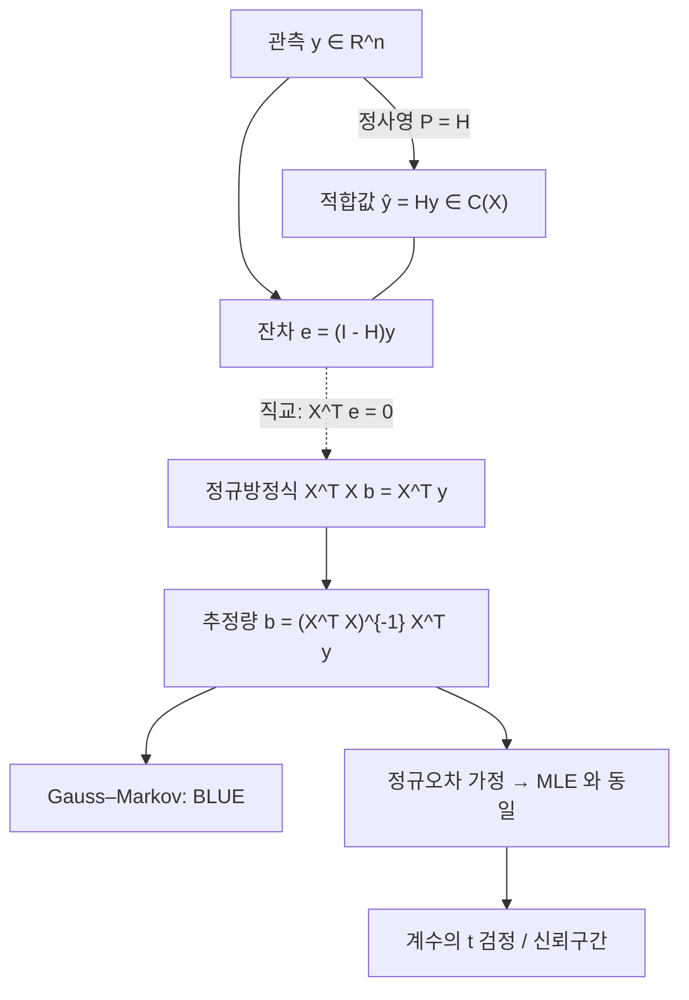

# 선형회귀와 최소제곱법

# 개요

선형회귀는 반응변수의 조건부평균을 설명변수들의 선형결합으로 모형화하고 계수를 잔차제곱합 최소화로 정하는 방법이다. 같은 계산을 두 언어로 읽는다. 기하학적으로는 관측 벡터를 설계행렬의 열공간 위로 정사영하는 것이고([내적 공간](inner-product-spaces.md)), 확률적으로는 오차가 정규분포일 때의 [최대가능도 추정](maximum-likelihood.md)이다.

정사영 쪽에서 유일성, 직교분해, 수치적 안정성이 나오고 가능도 쪽에서 추정량의 분포, 검정, 신뢰구간이 나온다. Gauss–Markov 정리는 분포 가정 없이 2 차 모멘트 가정만으로 최소제곱추정량이 선형불편추정량 중 최소분산임을 말한다.

# 직관

점들의 구름에 직선을 긋는 문제에서 적합의 기준을 세로 거리의 제곱합으로 잡으면 답이 유일하고 닫힌 형태로 나온다.

$n$ 차원에서는 관측값 전체를 벡터 $y\in\mathbb{R}^n$ 로 보고 설계행렬의 각 열도 $\mathbb{R}^n$ 의 벡터로 본다. 계수를 바꿔 만들 수 있는 예측벡터들의 집합이 열들이 생성하는 부분공간이고, 잔차제곱합은 $y$ 와 그 부분공간 위 점 사이의 거리 제곱이다. 최소제곱해는 $y$ 에서 부분공간으로 내린 수선의 발이고, 최적성의 조건은 잔차가 모든 설명변수와 직교한다는 것, 곧 정규방정식이다.

# 정의

## 모형과 설계행렬

관측 $i=1,\dots,n$ 에 대해

$$
y_i \thickspace=\thickspace \beta_0 + \beta_1 x_{i1} + \cdots + \beta_{p-1} x_{i,p-1} + \varepsilon_i
$$

를 가정한다. 행렬로 쓰면

$$
y = X\beta + \varepsilon, \qquad y \in \mathbb{R}^{n},\thickspace X \in \mathbb{R}^{n \times p},\thickspace \beta \in \mathbb{R}^{p}.
$$

$X$ 가 **설계행렬**이고 절편을 쓰면 첫 열이 1 벡터다. 선형은 계수에 대한 선형이지 변수에 대한 선형이 아니다. 열에 $x^2$ , $\log x$ , 두 변수의 곱, 기저함수 값을 넣어도 선형회귀이고, 범주형 변수는 지시변수 열로 부호화한다.

Gauss–Markov 가정은 다음 세 가지다.

$$
\mathbb{E}[\varepsilon] = 0, \qquad \mathrm{Var}(\varepsilon) = \sigma^2 I_n, \qquad \mathrm{rank}(X) = p \le n .
$$

두 번째 가정은 오차의 등분산성과 무상관을 함께 요구하고, 정규성은 여기서 쓰지 않는다.

## 최소제곱 문제와 정사영

최소제곱추정량은

$$
\hat\beta \thickspace=\thickspace \arg\min_{b \in \mathbb{R}^{p}} \thickspace \lVert y - Xb \rVert^{2}
$$

로 정의된다. $Xb$ 의 집합이 $X$ 의 열공간 $C(X)$ 이므로 이 문제는 부분공간 위의 최근접점 찾기다. [내적 공간](inner-product-spaces.md)의 정사영 정리에 의해 최근접점이 유일하게 존재하고, 그 점 $\hat y$ 는

$$
y - \hat{y} \thickspace\perp\thickspace C(X), \qquad \text{즉}\quad X^{\top}(y - X\hat\beta) = 0
$$

으로 특징지어진다. 이를 정리하면 정규방정식

$$
X^{\top}X\thinspace\hat\beta \thickspace=\thickspace X^{\top}y
$$

이고, $\mathrm{rank}(X)=p$ 이면 $X^{\mathsf T}X$ 가 가역이므로

$$
\hat\beta = (X^{\top}X)^{-1}X^{\top}y, \qquad \hat{y} = X\hat\beta = Hy .
$$

## Hat matrix

$$
H \thickspace=\thickspace X(X^{\top}X)^{-1}X^{\top}
$$

를 hat matrix 또는 사영행렬이라 한다. 성질은 정사영의 성질 그대로다.

$$
H^{\top} = H, \qquad H^{2} = H, \qquad HX = X, \qquad \mathrm{tr}(H) = p .
$$

대칭이고 멱등이므로 [고윳값](eigenvalues.md)이 0 과 1 뿐이고, 1 의 중복도가 $\mathrm{rank}(X)=p$ 라 대각합이 $p$ 다. 잔차는 $e=(I-H)y$ 이고 $I-H$ 역시 $C(X)$ 의 직교여공간으로 가는 사영행렬이다. 대각원소 $h_{ii}$ 가 관측 $i$ 의 leverage 이고 $0\le h_{ii}\le1$ 이며 합이 $p$ 다. leverage 가 큰 점은 설계공간에서 멀리 떨어져 적합값을 혼자 끌고 간다.

## 잔차제곱합과 분산추정

$$
\mathrm{RSS} = \lVert e \rVert^{2} = y^{\top}(I - H)y, \qquad
\hat\sigma^{2} = \frac{\mathrm{RSS}}{n - p}.
$$

$\mathbb{E}[\mathrm{RSS}]=(n-p)\sigma^2$ 이므로 이 추정량은 불편이다. 잔차가 $X^\top e=0$ 이라는 $p$ 개의 선형제약을 받아 자유도가 $n-p$ 이므로 $n$ 이 아니라 $n-p$ 로 나눈다.

# 성질

## 정사영 정리와 유일성

$b$ 가 임의의 계수벡터일 때

$$
\lVert y - Xb \rVert^{2} = \lVert y - \hat{y} \rVert^{2} + \lVert \hat{y} - Xb \rVert^{2}
$$

가 성립한다. $y-\hat{y}$ 가 $C(X)$ 와 직교하고 $\hat{y}-Xb\in C(X)$ 이므로 Pythagoras 정리가 적용된다. 오른쪽 둘째 항은 $Xb = \hat{y}$ 일 때만 0 이므로 $\hat{y}$ 는 유일하고, 열이 일차독립이면 $\hat\beta$ 도 유일하다. 열이 일차종속이면 $\hat{y}$ 는 여전히 유일하지만 $\hat\beta$ 는 유일하지 않다(그때는 Moore–Penrose 유사역행렬로 최소노름해를 고른다).

## Gauss–Markov 정리

Gauss–Markov 가정 아래에서 $\hat\beta$ 는 불편이고

$$
\mathbb{E}[\hat\beta] = \beta, \qquad \mathrm{Var}(\hat\beta) = \sigma^{2}(X^{\top}X)^{-1}
$$

이며, 임의의 $c \in \mathbb{R}^p$ 에 대해 $c^\top \beta$ 의 선형불편추정량 중 분산이 최소인 것은 $c^\top \hat\beta$ 다(BLUE, best linear unbiased estimator).

증명 스케치: 다른 선형불편추정량을 $\tilde{a} = a^\top y$ 라 하고 $a = X(X^\top X)^{-1}c + d$ 로 분해한다. 불편성은 모든 $\beta$ 에 대해 $a^\top X\beta = c^\top \beta$ 를 요구하므로 $X^\top d = 0$ 이고, 즉 $d \perp C(X)$ 다. 그러면

$$
\mathrm{Var}(a^{\top}y) = \sigma^{2}\lVert a \rVert^{2} = \sigma^{2}\big(\lVert X(X^{\top}X)^{-1}c \rVert^{2} + \lVert d \rVert^{2}\big) \thickspace\ge\thickspace \mathrm{Var}(c^{\top}\hat\beta),
$$

등호는 $d=0$ 일 때만 성립한다. 증명에 오차의 분포를 쓰지 않았다. 선형과 불편이라는 제약을 풀면 더 좋은 추정량이 있을 수 있고, ridge 추정량은 편향을 감수하고 평균제곱오차를 줄인다.

## 정규오차 아래의 최대가능도

$\varepsilon \sim N(0, \sigma^2 I)$ 를 추가로 가정하면 로그가능도는

$$
\ell(\beta, \sigma^{2}) = -\frac{n}{2}\log(2\pi\sigma^{2}) - \frac{1}{2\sigma^{2}}\lVert y - X\beta \rVert^{2}
$$

이다. $\beta$ 에 대한 부분이 $-\mathrm{RSS}/(2\sigma^2)$ 뿐이므로 가능도 최대화가 잔차제곱합 최소화와 같은 문제이고, **최소제곱추정량이 정규오차 모형의 MLE**(maximum likelihood estimation)다. 분산에 대해서는 미분해서

$$
\hat\sigma^{2}\_{\mathrm{MLE}} = \frac{\mathrm{RSS}}{n}
$$

을 얻는데 아래로 편향되어 있어 실무에서는 $n-p$ 로 나눈 값을 쓴다. 오차가 Laplace 분포이면 같은 논리가 절대편차합 최소화(중앙값 회귀)를 주므로, 손실함수의 선택이 오차분포 가정의 선택이다.

## 추정량의 분포와 추론

정규 가정 아래

$$
\hat\beta \sim N\negthinspace\big(\beta,\thickspace \sigma^{2}(X^{\top}X)^{-1}\big), \qquad
\frac{\mathrm{RSS}}{\sigma^{2}} \sim \chi^{2}\_{n-p},
$$

이고 둘은 독립이다(직교하는 두 사영에 대한 정규벡터의 상이므로). 따라서 $(X^{\mathsf T}X)^{-1}$ 의 $j$ 번째 대각원소를 $v_j$ 라 할 때

$$
\frac{\hat\beta_j - \beta_j}{\hat\sigma \sqrt{v_j}} \sim t_{n-p}
$$

가 피벗량이 되어 계수의 [신뢰구간](confidence-intervals.md)과 t 검정이 나온다. 여러 계수를 동시에 검정하려면 F 통계량을 쓴다. 모형 비교의 F 검정은 두 사영의 잔차제곱합 차이를 자유도로 정규화한 것이다.

## 분해와 결정계수

절편이 모형에 있으면 잔차의 합이 0 이고, 총제곱합이 직교분해된다.

$$
\underbrace{\sum_i (y_i - \bar{y})^{2}}\_{\mathrm{TSS}} = \underbrace{\sum_i (\hat{y}\_i - \bar{y})^{2}}\_{\mathrm{ESS}} + \underbrace{\sum_i (y_i - \hat{y}\_i)^{2}}\_{\mathrm{RSS}}, \qquad
R^{2} = 1 - \frac{\mathrm{RSS}}{\mathrm{TSS}} = \frac{\mathrm{ESS}}{\mathrm{TSS}}.
$$

$R^2$ 는 설명된 분산의 비율이고 절편만 있는 모형 대비 개선의 척도다. 열을 추가하면 $R^2$ 가 줄지 않으므로 모형 선택 기준으로는 쓰지 않고, 자유도로 보정한 조정 $R^2$ 나 AIC, 교차검증을 쓴다. 단순회귀에서 $R^2$ 는 표본상관계수의 제곱이다.

## 다중공선성과 수치 문제

설명변수들이 서로 거의 선형종속이면 $X^\top X$ 가 거의 특이해져 계수의 분산이 커진다. $j$ 번째 변수를 나머지 변수들로 회귀했을 때의 결정계수를 $R_j^2$ 라 하면 분산팽창계수는

$$
\mathrm{VIF}\_j = \frac{1}{1 - R_j^{2}}
$$

이고 $\mathrm{Var}(\hat\beta_j)$ 가 그만큼 커진다. 적합값 $\hat{y}$ 는 안정적이지만 개별 계수의 해석이 불안정해진다. 대응은 변수 제거, 주성분 사용([특이값 분해](singular-value-decomposition.md)), ridge 처럼 $X^\top X+\lambda I$ 로 대각을 키우는 정규화다.

## 확장과 연결

- **일반화선형모형**: 반응이 이항이나 계수(count)면 정규 가정이 맞지 않는다. [지수족과 충분통계량](exponential-families.md)의 분포족에 연결함수를 붙이면 로지스틱 회귀, Poisson 회귀가 나오고, 추정은 반복 가중최소제곱(IRLS)으로 귀결된다. 닫힌 해가 없어 [경사하강법](gradient-descent.md)이나 Newton 계열 최적화를 쓴다.
- **정규화와 Bayes**: 계수에 $N(0, \tau^2)$ 사전분포를 두면 MAP 추정이 ridge 회귀가 되고, Laplace 사전분포는 lasso 가 된다. [Bayes 추론과 사후분포](bayesian-inference.md)의 축소 구조가 그대로 나타난다.
- **가중최소제곱과 GLS**: 오차의 분산이 다르거나 상관이 있으면 $\mathrm{Var}(\varepsilon) = \sigma^2 \Sigma$ 로 두고 $\Sigma^{-1}$ 을 내적으로 쓰는 정사영을 한다. 즉 내적을 바꾸면 같은 기하가 유지된다.
- **분산분석**: ANOVA 는 지시변수로 부호화한 선형회귀이고, 제곱합의 분해가 중첩된 부분공간들의 직교분해다.
- **진단**: 잔차 대 적합값 그림으로 비선형성과 이분산을, leverage 와 Cook 거리로 영향점을, QQ 플롯으로 정규성을 본다. 회귀계수는 다른 변수를 통제한 조건부 연관이며, 관측 데이터에서 인과로 읽으려면 설계에 대한 별도의 가정이 필요하다.[^1]

[^1]: T. Hastie, R. Tibshirani, J. Friedman, *The Elements of Statistical Learning*, 2nd ed., Springer, https://hastie.su.domains/ElemStatLearn/

# 연관 문서

## 선수지식

- [내적 공간](inner-product-spaces.md)
- [최대가능도 추정](maximum-likelihood.md)

## 더 알아보기

아직 연결한 문서가 없다.

#statistics #linear_algebra #optimization
