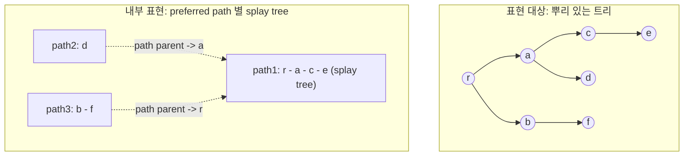

# Link-cut tree

# 개요

Link-cut tree는 뿌리 있는 forest를 동적으로 유지하면서 간선 추가(link), 간선 삭제(cut), 뿌리 찾기(findroot), 경로 질의(path aggregate)를 모두 분할상환 $O(\log n)$ 에 처리하는 자료구조다. Sleator와 Tarjan이 최대유량 알고리즘의 병목을 없애기 위해 고안했다[^1].

핵심 아이디어는 두 단계다.

- forest의 각 트리를 서로소인 **preferred path**들로 쪼갠다. 경로 하나는 정점의 나열이므로 균형 이진 탐색 트리에 담을 수 있다.
- 각 경로를 splay tree로 저장하고, 경로들 사이는 **path parent** 포인터로 잇는다. 질의는 `access`라는 단일 연산으로 환원되며, 그 비용이 splay tree의 자기조정 성질[^2] 덕분에 분할상환 $O(\log n)$ 이 된다.

[서로소 집합 자료구조](union-find.md)가 간선 추가만 있는 연결성을 거의 상수 시간에 처리한다면, link-cut tree는 삭제까지 허용하는 대신 로그 시간을 치른다. 다만 forest(사이클 없음)라는 제약이 있으며, 일반 그래프의 [동적 연결성](dynamic-connectivity.md)은 이 구조를 부품으로 쓰거나 다른 분해를 쓴다.

# 직관

트리에서 경로 질의를 빠르게 하는 정적 기법은 heavy-light 분해다. 각 정점에서 부분트리 크기가 가장 큰 자식으로 가는 간선을 heavy로 정하면, 뿌리에서 임의의 정점까지 가는 길에 light 간선은 $O(\log n)$ 개뿐이다. 크기가 작은 쪽으로 내려갈 때마다 부분트리 크기가 절반 이하로 줄기 때문이다. 따라서 경로를 $O(\log n)$ 개의 연속 구간으로 자를 수 있다.

Link-cut tree는 이 분해를 동적으로, 그리고 "크기"가 아니라 "최근 접근"을 기준으로 수행한다. 각 정점은 마지막으로 접근된 자식을 preferred child로 기억하고, preferred 간선들이 이어져 preferred path를 이룬다. 질의가 들어올 때마다 분해가 재편되므로 정적 heavy-light처럼 미리 계산해 둘 필요가 없다.

여기에 splay tree를 쓰는 이유가 있다. 경로를 깊이 순서로 담되, 최근 접근한 정점을 뿌리로 끌어올리는 자기조정 성질이 "재편 비용"을 상쇄한다. 균형을 명시적으로 유지하지 않고도 분할상환 로그 시간이 나온다.



굵은 경로 하나가 splay tree 하나가 되고, 경로 밖으로 나가는 간선은 자식 포인터가 아닌 **단방향** path parent 포인터로만 표현된다. 이 비대칭이 구현의 모든 조건 분기(`is_root` 판정)를 설명한다.

# 정의

## 표현 대상과 연산

자료구조가 유지하는 것은 정점마다 값이 붙은 뿌리 있는 forest다. 지원 연산은 다음과 같다.

- `link(v, w)`: 서로 다른 트리에 속한 $v$ (자기 트리의 뿌리)를 $w$ 의 자식으로 붙인다.
- `cut(v)`: $v$ 와 그 부모 사이의 간선을 끊는다. 두 정점을 받는 형태 `cut(v, w)`도 흔히 쓴다.
- `findroot(v)`: $v$ 가 속한 트리의 뿌리를 반환한다. 두 정점의 뿌리를 비교하면 연결성 판정이 된다.
- `evert(v)` (= `makeroot`): $v$ 를 트리의 뿌리로 바꾼다. 뿌리 없는 forest를 다룰 때 필요하다.
- `path(v, w)`: $v$ 에서 $w$ 까지의 경로 위 값들의 결합값(합, 최댓값 등)을 반환하거나 그 경로에 일괄 갱신을 가한다.

결합값은 결합법칙을 만족하는 연산이어야 하며, 경로 뒤집기를 지원하려면 교환적이거나 좌우 두 방향의 값을 함께 들고 있어야 한다.

## Preferred path 분해

각 정점은 자식 중 하나를 **preferred child**로 가질 수 있다(없을 수도 있다). 그 간선을 preferred edge라 하고, preferred edge들의 극대 사슬을 **preferred path**라 한다. 정의상 preferred path들은 정점을 서로소로 분할한다.

`access(v)`가 실행되면 뿌리에서 $v$ 까지의 모든 간선이 preferred가 되고, $v$ 아래쪽의 preferred child는 해제된다. 즉 preferred 분해는 접근 이력에 따라 계속 바뀐다.

## 보조 트리(splay tree) 표현

각 preferred path를 splay tree 하나로 저장한다. 정렬 기준(key)은 경로 위에서의 **깊이**이며, 키를 실제로 저장하지는 않고 중위 순회 순서가 얕은 쪽에서 깊은 쪽 순서가 되도록 유지한다.

- splay tree 내부의 부모-자식 포인터는 양방향이다.
- 한 preferred path의 splay tree 뿌리는 그 경로의 가장 얕은 정점의 부모(다른 경로에 속한다)를 가리키는 **path parent** 포인터를 갖는다. 이 포인터는 단방향이다. 부모 쪽에서 자식 포인터로 가리키지 않는다.

따라서 어떤 노드가 자기 splay tree의 뿌리인지는 다음으로 판정한다. 부모가 없거나, 부모의 두 자식 포인터 중 어느 것도 자신을 가리키지 않으면 뿌리다.

## access 연산

`access(v)`는 다음을 수행한다.

1. $v$ 를 자기 splay tree에서 splay해 뿌리로 올린다.
2. $v$ 의 오른쪽 부분트리(경로 상 $v$ 보다 깊은 부분)를 잘라내 별도의 preferred path로 만든다. 잘린 부분트리의 뿌리는 $v$ 를 path parent로 갖는다.
3. $v$ 의 path parent $u$ 가 있으면 $u$ 를 splay하고, $u$ 의 오른쪽 부분트리를 $v$ 의 splay tree로 교체한다(두 경로를 잇는다). $v$ 를 $u$ 자리로 옮겨 1번부터 반복한다.
4. 뿌리에 도달하면 마지막으로 $v$ 를 다시 splay한다.

끝나면 뿌리에서 $v$ 까지가 하나의 preferred path가 되고, 그 splay tree의 뿌리가 $v$ 다. 나머지 연산은 모두 `access`의 조합이다.

$$
\texttt{findroot}(v) : \ \texttt{access}(v) \ \text{후 splay tree에서 가장 왼쪽 노드}.
$$

$$
\texttt{path}(v, w) : \ \texttt{evert}(v) \ \text{후} \ \texttt{access}(w) \ \text{하면 뿌리의 결합값이 답}.
$$

`evert(v)`는 `access(v)` 뒤 splay tree 전체에 뒤집기 표시(lazy reversal)를 달아 구현한다. 깊이 순서가 거꾸로 되는 것이 곧 뿌리 교체이기 때문이다.

# 성질

## 분할상환 복잡도

**정리.** $n$ 개의 정점에 대해 $m$ 번의 연산을 수행하면 총 시간은 $O((n+m)\log n)$ 이다. 즉 연산당 분할상환 $O(\log n)$ 이다.

증명은 두 부분으로 나뉜다.

**(1) preferred child 변경 횟수.** 정적 heavy-light 논법을 동적으로 옮긴다. 부분트리 크기가 부모의 절반을 넘는 자식으로 가는 간선을 heavy, 나머지를 light라 하면 어떤 뿌리-정점 경로에도 light 간선은 $O(\log n)$ 개다.

- 한 번의 `access`에서 preferred child가 바뀌는 횟수를 센다. light 간선이 preferred가 되는 경우는 경로당 $O(\log n)$ 번뿐이다.
- heavy 간선이 preferred가 되는 경우는 잠재함수 논법으로 상쇄한다. "preferred가 아닌 heavy 간선의 개수"를 잠재함수로 두면, heavy 간선이 preferred가 될 때마다 잠재가 1 줄고, 잠재가 늘어나는 것은 light 간선이 preferred가 되는 순간(경로당 $O(\log n)$ 번)과 `link`/`cut`으로 트리 모양이 바뀌는 순간뿐이다.

결론적으로 $m$ 번의 access에서 preferred child 변경의 총합은 $O((n+m)\log n)$ 이다.

**(2) splay의 비용.** 각 변경은 splay 한 번에 대응한다. splay tree의 접근 정리(access lemma)에 따라 크기 $k$ 의 splay tree에서 splay 한 번의 분할상환 비용은 $O(\log k)$ 이며, 여러 splay tree를 오가는 경우에도 전체 정점 수를 가중치로 삼는 잠재함수를 쓰면 각 splay가 $O(\log n)$ 으로 묶인다. 이 부분이 Sleator–Tarjan 분석의 기술적 핵심이다[^1].

두 결과를 합치면 연산당 $O(\log n)$ 이 나온다. 여기서 $O(\log n)$ 은 분할상환이며 한 번의 연산은 최악의 경우 선형 시간이 걸릴 수 있다. 최악의 경우에도 $O(\log n)$ 을 보장하려면 splay 대신 globally biased search tree를 쓰면 되지만, 구현이 훨씬 복잡하고 상수가 크다.

## 연산별 비용

- **경로 질의는 쉽다.** 합, 최댓값, 최솟값, 그리고 lazy 전파를 통한 경로 일괄 갱신이 모두 자연스럽다. `access` 뒤 splay tree 뿌리 하나만 읽으면 되기 때문이다.
- **부분트리 질의는 어렵다.** 부분트리는 여러 preferred path에 흩어지므로, 각 노드가 "preferred가 아닌 자식들의 결합값"(virtual subtree)을 따로 유지해야 한다. 갱신 가능한 결합 연산(예: 합)에서는 가능하지만, 최댓값처럼 값을 빼기 어려운 연산에서는 다중집합을 들고 있어야 해 상수가 커진다.
- **경로 뒤집기는 지연 표시로 처리한다.** 결합값이 교환적이 아니면 정방향·역방향 두 값을 함께 유지한다.
- 사이클을 허용하지 않는다. 일반 그래프에서는 신장 forest만 이 구조로 유지하고, 나머지 간선은 별도로 관리한다.

## 다른 구조와의 비교

| 구조 | 경로 질의 | 부분트리 질의 | 비고 |
| --- | --- | --- | --- |
| Link-cut tree | 지원 | 추가 구현 필요 | 분할상환 $O(\log n)$ |
| Euler tour tree | 어려움 | 지원 | 구현이 단순, 무뿌리 forest에 적합 |
| Top tree | 지원 | 지원 | 일반적이지만 무겁다 |
| Heavy-light 분해 | 지원 | 지원 | 트리가 고정된 경우에만 |

[동적 연결성](dynamic-connectivity.md)의 일반 그래프 문제에서는 Euler tour tree를 계층적으로 쌓는 방법이 분할상환 $O(\log^2 n)$ 을 준다. Link-cut tree는 forest에 특화된 대신 경로 정보를 직접 다룰 수 있다는 장점이 있다.

## 구현 골격

아래는 경로 합과 경로 뒤집기를 지원하는 최소 구현이다. 무작위 연산열을 단순 구현과 대조하는 테스트를 통과한다.

```python
class Node:
    __slots__ = ("ch", "par", "rev", "val", "agg")

    def __init__(self, val=0):
        self.ch = [None, None]   # splay tree 의 왼쪽(얕은 쪽)/오른쪽(깊은 쪽) 자식
        self.par = None          # splay 부모 또는 path parent
        self.rev = False         # 경로 뒤집기 지연 표시
        self.val = val
        self.agg = val           # 이 splay 부분트리(= 경로 조각)의 합


def is_root(x):
    """splay tree 의 뿌리인가. path parent 간선은 자식 포인터를 갖지 않는다."""
    p = x.par
    return p is None or (p.ch[0] is not x and p.ch[1] is not x)


def pull(x):
    x.agg = x.val + sum(c.agg for c in x.ch if c)


def push(x):
    if x.rev:
        x.ch[0], x.ch[1] = x.ch[1], x.ch[0]
        for c in x.ch:
            if c:
                c.rev = not c.rev
        x.rev = False


def rotate(x):
    p, g = x.par, x.par.par
    p_was_root = is_root(p)              # 회전 전에 판정해야 한다
    d = 1 if p.ch[1] is x else 0
    gd = 1 if (g is not None and g.ch[1] is p) else 0
    p.ch[d] = x.ch[d ^ 1]
    if x.ch[d ^ 1]:
        x.ch[d ^ 1].par = p
    x.ch[d ^ 1] = p
    p.par, x.par = x, g
    if g is not None and not p_was_root:
        g.ch[gd] = x                     # path parent 면 자식 포인터를 건드리지 않는다
    pull(p)
    pull(x)


def splay(x):
    stack, y = [x], x
    while not is_root(y):                # 지연 표시를 위에서부터 내린다
        y = y.par
        stack.append(y)
    while stack:
        push(stack.pop())
    while not is_root(x):
        p = x.par
        if not is_root(p):
            g = p.par
            rotate(p if (g.ch[0] is p) == (p.ch[0] is x) else x)
        rotate(x)


def access(x):
    """뿌리에서 x 까지를 하나의 preferred path 로 만들고 x 를 splay 뿌리로 올린다."""
    last, y = None, x
    while y:
        splay(y)
        y.ch[1] = last                   # 깊은 쪽 자식을 새 preferred child 로 교체
        pull(y)
        last, y = y, y.par
    splay(x)
    return last                          # 마지막 교체 지점 = 두 정점의 LCA 계산에 쓰인다


def make_root(x):
    access(x)
    x.rev = not x.rev
    push(x)


def find_root(x):
    access(x)
    while x.ch[0]:
        push(x)
        x = x.ch[0]
    splay(x)
    return x


def connected(x, y):
    return x is y or find_root(x) is find_root(y)


def link(x, y):
    make_root(x)
    if find_root(y) is x:
        return False                     # 이미 같은 트리. 붙이면 사이클이 생긴다
    make_root(x)
    x.par = y                            # path parent 간선만 추가한다
    return True


def cut(x, y):
    make_root(x)
    access(y)
    if y.ch[0] is not x or x.ch[1] is not None:
        return False                     # x-y 는 간선이 아니다
    y.ch[0], x.par = None, None
    pull(y)
    return True


def path_sum(x, y):
    make_root(x)
    access(y)
    return y.agg
```

# 활용

## 동적 forest 연결성

`connected(v, w)`는 `find_root` 두 번으로 끝난다. 간선 추가와 삭제가 섞여 들어오는 온라인 질의를 그래프가 forest인 한 $O(\log n)$ 에 처리한다. 간선 추가만 있다면 [서로소 집합 자료구조](union-find.md)가 훨씬 빠르므로, link-cut tree를 쓰는 이유는 삭제 또는 경로 질의가 필요할 때다.

## 동적 최소 신장 트리

[최소 신장트리](minimum-spanning-tree.md)를 온라인으로 유지하는 문제에서 link-cut tree는 교환 논법을 그대로 구현한다. 간선 가중치를 경로 최댓값 질의가 가능한 형태로 얹고(간선을 정점으로 치환하는 기법을 쓴다), 새 간선 $(u,w)$ 가 들어오면 다음을 수행한다.

1. $u$ 와 $w$ 가 다른 트리면 그냥 `link`한다.
2. 같은 트리면 $u$ 에서 $w$ 까지 경로의 최대 가중치 간선을 찾는다.
3. 그 간선이 새 간선보다 무거우면 `cut`하고 새 간선을 `link`한다. 아니면 새 간선을 버린다.

각 단계가 $O(\log n)$ 이므로 간선당 로그 시간이다. 이 교환 규칙의 정당성은 [Matroid](matroids.md)의 순환 성질(cycle property)에서 온다. 사이클에서 가장 무거운 간선은 어떤 최소 신장 트리에도 속하지 않는다.

## 최대유량

Link-cut tree가 처음 만들어진 동기가 이것이다[^1]. Dinic 류 알고리즘에서 blocking flow를 찾을 때, 단순 구현은 증가 경로를 한 간선씩 따라가며 병목을 찾고 잔여 용량을 갱신하므로 경로 길이에 비례하는 시간이 든다. Link-cut tree에 현재 탐색 forest를 담아 두면 다음이 가능하다.

- 경로 위 최소 잔여 용량 찾기: 경로 최솟값 질의.
- 그 경로 전체의 용량을 한꺼번에 줄이기: 경로 일괄 갱신(lazy).
- 포화된 간선 제거: `cut`.

그 결과 blocking flow 한 단계가 $O(E\log V)$ 가 되고 전체가 $O(VE\log V)$ 가 된다. 같은 아이디어가 [네트워크 흐름과 최대유량 최소절단 정리](network-flow.md)의 여러 변형과 최소비용 유량에도 쓰인다.

## 그 밖의 쓰임

- **트리 경로 질의의 온라인 버전.** 트리 모양이 고정이면 heavy-light 분해로 충분하지만, 간선이 바뀌면 link-cut tree가 필요하다. LCA도 `access`의 반환값으로 얻는다.
- **동적 그래프 알고리즘의 부품.** 신장 forest를 link-cut tree로 유지하고 나머지 간선을 계층적으로 관리하는 방식이 [동적 연결성](dynamic-connectivity.md)과 동적 이중연결성 알고리즘의 표준 구성이다.
- **계산 기하와 구간 문제.** 구간 병합, 오프라인 질의의 온라인화 등에서 트리 구조 갱신이 필요한 경우에 등장한다.
- **그래프 알고리즘의 일반화.** [그래프](graphs.md) 위의 흐름·매칭 알고리즘에서 "경로를 따라가며 상태를 갱신"하는 단계는 대부분 이 구조로 가속할 수 있다.

[^1]: D. D. Sleator, R. E. Tarjan, "A Data Structure for Dynamic Trees", Journal of Computer and System Sciences 26(3):362–391, 1983, https://doi.org/10.1016/0022-0000(83)90006-5
[^2]: D. D. Sleator, R. E. Tarjan, "Self-Adjusting Binary Search Trees", Journal of the ACM 32(3):652–686, 1985, https://doi.org/10.1145/3828.3835

# 연관 문서

## 선수지식

- [동적 연결성](dynamic-connectivity.md)

## 더 알아보기

아직 연결한 문서가 없다.

#data_structures #algorithms
