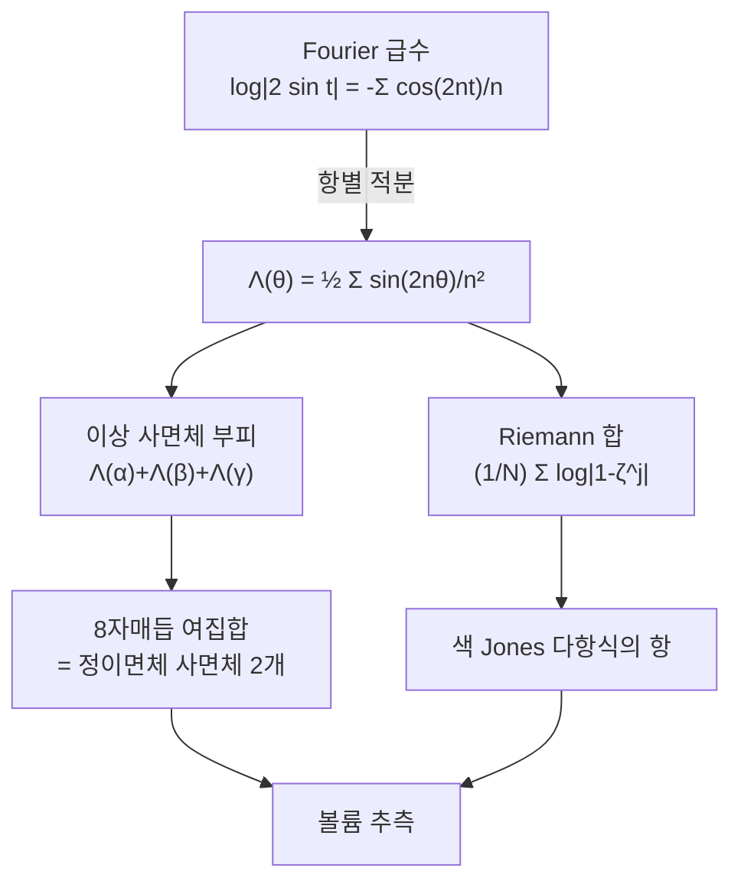

# Lobachevsky 함수와 쌍곡 사면체의 부피

# 개요

쌍곡 3 차원 공간에서 사면체의 부피를 구하려면 무엇이 필요한가. Euclid 공간에서는 밑면 곱하기 높이로 끝나지만 쌍곡 공간에서는 그렇지 않다. 답은 초등함수로 쓰이지 않고 새 함수 하나를 필요로 한다.

$$
\Lambda(\theta)=-\int_0^\theta\log\big|2\sin t\big|\,dt
$$

이것이 Lobachevsky 함수다. [Fourier 급수](fourier-series.md)로 보면 정체가 분명해진다.

$$
\Lambda(\theta)=\frac12\sum_{n=1}^{\infty}\frac{\sin2n\theta}{n^2}
$$

$\log|2\sin t|=-\sum_n\cos(2nt)/n$ 이라는 고전적 전개를 항별로 적분한 것이다. 곧 $\Lambda$ 는 **계수가 $1/n^2$ 인 사인 급수**이고, 그래서 주기적이고 홀함수이며 $\pi$ 의 배수에서 0 이 된다.

이 함수가 흥미로운 이유는 두 세계에서 따로 나타나기 때문이다. 기하 쪽에서는 이상 사면체의 부피가 $\Lambda$ 의 값 세 개의 합이고, 조합 쪽에서는 1 의 거듭제곱근들의 곱 $\prod(1-\zeta^j)$ 의 로그가 $\Lambda$ 의 Riemann 합이다. [볼륨 추측](volume-conjecture.md)이 조합적 불변량에서 쌍곡 부피를 끌어내는 통로가 정확히 이 일치다.

# 직관

## 왜 $\log\sin$ 인가

상반공간 모형에서 쌍곡 계량은 $ds=|dx|/x_3$ 이다. 부피형식이 $dV=dx_1dx_2dx_3/x_3^3$ 이므로, 무한대로 뻗은 영역의 부피를 재면 $x_3$ 에 대한 적분에서 $1/x_3^3$ 이 나오고, 밑면의 넓이가 각도에 따라 $\sin$ 으로 변한다. 두 효과가 합쳐져 $\int\log\sin$ 꼴이 나온다.

**이상 사면체**(꼭짓점이 전부 무한원점에 있는 사면체)에서 이 계산이 가장 깨끗하게 끝난다. 이상 사면체는 마주 보는 모서리의 이면각이 같고, 세 각 $\alpha,\beta,\gamma$ 가 $\alpha+\beta+\gamma=\pi$ 를 만족한다. 모양은 그 각들로 완전히 결정되고, 부피가

$$
\mathrm{Vol}=\Lambda(\alpha)+\Lambda(\beta)+\Lambda(\gamma)
$$

가 된다. 세 각의 합이 $\pi$ 라는 제약 아래 이 합을 최대화하면 $\alpha=\beta=\gamma=\pi/3$ 에서 최대이고, 그것이 **정이면체 사면체**다. 쌍곡 3 차원에서 어떤 사면체도 이보다 부피가 클 수 없다는 사실이 여기서 나온다.

## 조합 쪽에서 나타나는 경로

1 의 $N$ 제곱근 $\zeta=e^{2\pi i/N}$ 에 대해 $\prod_{j=1}^{k}|1-\zeta^j|$ 를 생각하자. 로그를 취하면

$$
\sum_{j=1}^{k}\log\big|1-e^{2\pi ij/N}\big|
=\sum_{j=1}^{k}\log\Big(2\sin\frac{\pi j}N\Big)
$$

이다. $|1-e^{i\theta}|=2|\sin(\theta/2)|$ 을 쓴 것이다. 오른쪽은 $\log(2\sin)$ 의 **Riemann 합**이므로 $N\to\infty$ 에서

$$
\frac1N\sum_{j=1}^{k}\log\Big(2\sin\frac{\pi j}N\Big)\ \longrightarrow\ \frac1\pi\int_0^{\pi k/N}\log(2\sin t)\,dt=-\frac1\pi\Lambda\Big(\frac{\pi k}N\Big)
$$

가 된다. **양자 불변량의 유한합에서 $\Lambda$ 가 이렇게 들어온다.** 색 Jones 다항식의 항들이 이런 곱이고, 합의 최대항을 찾는 것이 $\Lambda$ 를 최대화하는 문제가 되며, 그 최대점이 사면체의 이면각을 정한다. 조합적 합의 안장점 조건과 사면체 붙임 방정식이 같은 식이 되는 지점이다.



# 정의

## 함수와 그 성질

> **정의.** $\Lambda(\theta)=-\displaystyle\int_0^\theta\log|2\sin t|\thinspace dt$

피적분함수가 $t=0$ 에서 $-\infty$ 로 발산하지만 로그 특이점이라 적분은 수렴한다. 기본 성질은 다음과 같다.

- **홀함수이고 주기가 $\pi$ 다.** 곧 $\Lambda(-\theta)=-\Lambda(\theta)$ 이고 $\Lambda(\theta+\pi)=\Lambda(\theta)$ 다.
- **$\pi$ 의 배수에서 영.** 곧 $\Lambda(0)=\Lambda(\pi/2)=\Lambda(\pi)=0$ 이다.
- **최대와 최소.** $\theta=\pi/6$ 에서 최대 $0.5074708\ldots$ 이고 $\theta=5\pi/6$ 에서 최소다.
- **배각 공식.** $\Lambda(2\theta)=2\Lambda(\theta)+2\Lambda\big(\theta+\tfrac\pi2\big)$ 다. 이 관계가 여러 부피 항등식의 출처다.

$\Lambda$ 는 이중로그 $\mathrm{Li}_2$ 의 허수부와 같다. 정확히는 $\Lambda(\theta)=\tfrac12\operatorname{Im}\mathrm{Li}_2(e^{2i\theta})$ 이고, 그래서 쌍곡 부피가 이중로그의 값으로 표현되는 현상(Bloch 군, Borel 조절자)의 가장 구체적인 사례가 된다.

## 사면체의 부피

> **정리 (Lobachevsky, Milnor).** 이상 사면체의 이면각이 $\alpha+\beta+\gamma=\pi$ 를 만족하는 $\alpha,\beta,\gamma$ 이면
> $$
> \mathrm{Vol}=\Lambda(\alpha)+\Lambda(\beta)+\Lambda(\gamma)
> $$
> 이고, 최대값은 $\alpha=\beta=\gamma=\pi/3$ 에서 $3\Lambda(\pi/3)=1.0149416\ldots$ 다.

꼭짓점이 유한한 일반 사면체에서도 여섯 개의 이면각으로 쓰이는 공식이 있지만 훨씬 복잡하다. 3 차원 다양체를 이상 사면체로 분할하는 것이 표준적인 이유가 이 단순함이다.

## 8 자매듭

Thurston 의 계산이 이 이론의 출발점이다.

> $S^3\setminus4_1$ 은 정이면체 사면체 **두 개**를 붙여 만들어진다. 따라서
> $$
> \mathrm{Vol}(S^3\setminus4_1)=6\,\Lambda(\pi/3)=2.0298832128\ldots
> $$

이 수가 쌍곡 매듭 가운데 가장 작은 부피이고, 볼륨 추측의 수치 실험이 늘 이 매듭에서 시작하는 까닭이다.

# 성질

## 부피 스펙트럼

쌍곡 3 다양체의 부피 전체가 이루는 집합은 실수 전체가 아니다. 순서형이 $\omega^\omega$ 인 정렬집합이고, 각 부피를 실현하는 다양체는 유한개다(Jørgensen–Thurston). 이 이산성 덕분에 부피가 분류에 쓸모 있는 불변량이 된다.

최소값들도 알려져 있다. 첨점이 있는 것 중 최소가 8 자매듭과 그 자매 다양체의 $2.0298\ldots$ 이고, 닫힌 것 중 최소가 Weeks 다양체의 $0.9427\ldots$ 다.

## 왜 초월적인가

$\Lambda(\pi/3)$ 같은 값이 초등적으로 닫히지 않는다는 것은 이중로그의 성질에서 온다. $\mathrm{Li}_2$ 의 특수값은 대개 알려진 상수로 표현되지 않고, 쌍곡 부피가 "새로운 수" 인 이유가 그것이다. 부피와 Chern–Simons 불변량을 묶은 복소수 $\mathrm{CS}+i\mathrm{Vol}/2\pi$ 가 Bloch 군의 원소로 해석되고, 이것이 대수적 K 이론의 조절자와 이어진다. 수론과 3 차원 위상수학이 만나는 자리다.

# 활용

## 급수와 적분, 그리고 8 자매듭

정의(적분)와 Fourier 급수가 같은 함수인지 확인하고, 정이면체 사면체의 부피에서 8 자매듭의 부피를 얻는다.

```python
from math import sin, log, pi

def lob_series(theta, terms=200000):
    """Lambda(theta) = (1/2) sum sin(2 n theta)/n^2"""
    return 0.5*sum(sin(2*n*theta)/(n*n) for n in range(1, terms+1))

def lob_integral(theta, n=2000000):
    """-int_0^theta log|2 sin t| dt. t=0 의 로그 특이점은 중점법으로 피한다"""
    h = theta/n
    return -sum(log(abs(2*sin((i+0.5)*h))) for i in range(n))*h

for th, name in [(pi/6, "pi/6 (최대)"), (pi/4, "pi/4"), (pi/3, "pi/3"),
                 (0.7, "0.7"), (pi/2, "pi/2 (영점)")]:
    print(f"  theta = {name:12s} 급수 {lob_series(th):+.8f}   적분 {lob_integral(th):+.8f}")

print()
print(f"정이면체 사면체의 부피  3*Lambda(pi/3) = {3*lob_series(pi/3):.10f}")
print(f"8자매듭 여집합 (사면체 2 개)          = {6*lob_series(pi/3):.10f}")
print(f"알려진 값                            = 2.0298832128")

#   theta = pi/6 (최대)   급수 +0.50747080   적분 +0.50747071
#   theta = pi/4          급수 +0.45798280   적분 +0.45798266
#   theta = pi/3          급수 +0.33831387   적분 +0.33831369
#   theta = 0.7           급수 +0.48371601   적분 +0.48371589
#   theta = pi/2 (영점)   급수 +0.00000000   적분 -0.00000027
#
# 정이면체 사면체의 부피  3*Lambda(pi/3) = 1.0149416064
# 8자매듭 여집합 (사면체 2 개)          = 2.0298832128
# 알려진 값                            = 2.0298832128
```

**급수와 적분이 일곱째 자리까지 맞는다.** 두 계산은 성격이 아주 다르다. 적분 쪽은 $t\to0$ 에서 피적분함수가 발산해 중점법으로 특이점을 비껴가야 하고, 급수 쪽은 계수가 $1/n^2$ 이라 수렴이 느려 20 만 항을 쓴다. 남은 차이 $10^{-7}$ 은 급수의 꼬리 $\sim1/N$ 과 적분의 이산화 오차가 각각 남긴 것이지, 두 정의가 다른 것이 아니다. $\pi/2$ 에서 둘 다 0 이 나오는 것이 좋은 점검인데, 급수 쪽은 $\sin(n\pi)=0$ 이라 항별로 정확히 0 이고 적분 쪽은 양의 부분과 음의 부분이 상쇄되어 0 이다. **같은 값이 한쪽에서는 자명하게, 다른 쪽에서는 상쇄로 나온다.**

**8 자매듭 부피가 소수 열째 자리까지 재현된다.** 계산에 들어간 것은 $\sin(2n\pi/3)/n^2$ 의 합뿐이다. 매듭도, 계량도, 사면체도 코드에 없다. Thurston 의 정리 — 그 여집합이 정이면체 사면체 두 개라는 — 하나가 기하 전체를 $\Lambda(\pi/3)$ 이라는 수 하나로 압축했기 때문이다.

이 수가 볼륨 추측 문서에서 색 Jones 다항식의 증가율로 다시 나온다. 거기서는 1 의 거듭제곱근의 곱을 더하는 순수한 조합 계산이었고 여기서는 사인 급수였다. 같은 수에 이르는 두 길이 만나는 것이 그 추측의 내용이다.

## 어디에 쓰는가

- **부피 계산.** 3 다양체를 이상 사면체로 분할하고 각 사면체의 각을 붙임 방정식으로 푼 뒤 $\Lambda$ 를 더하는 것이 표준 알고리즘이다. SnapPy 같은 도구가 하는 일이 이것이다.
- **강직성의 확인.** Mostow 강직성 때문에 부피는 위상 불변량이므로, 두 다양체의 부피가 다르면 동형이 아니다. 계산 가능한 완전 불변량에 가까운 도구다.
- **양자 위상수학과의 다리.** 조합적 합의 점근에서 $\Lambda$ 가 나타나는 현상이 볼륨 추측, 양자 이중로그, 재정리 이론으로 이어진다.

[^1]: 이상 사면체의 부피 공식과 8 자매듭의 분할은 W. Thurston, *The Geometry and Topology of Three-Manifolds* (강의록, 1978), 특히 4 장과 7 장. $\Lambda$ 의 성질에 대한 표준 참고문헌은 J. Milnor, *Hyperbolic geometry: the first 150 years*, Bull. AMS 6 (1982).
[^2]: 이중로그 및 Bloch 군과의 관계는 D. Zagier, *The dilogarithm function*, in *Frontiers in Number Theory, Physics and Geometry II* (2007). 부피 스펙트럼의 정렬성은 Jørgensen–Thurston 의 결과다. 본문의 수치 계산은 직접 한 것이다.

# 연관 문서

## 선수지식

- [Fourier 급수](fourier-series.md)

## 더 알아보기

- [쌍곡 3 다양체와 Mostow 강직성](hyperbolic-3-manifolds.md)
- [볼륨 추측과 색 Jones 다항식](volume-conjecture.md)

#analysis #differential_geometry #topology #computation
