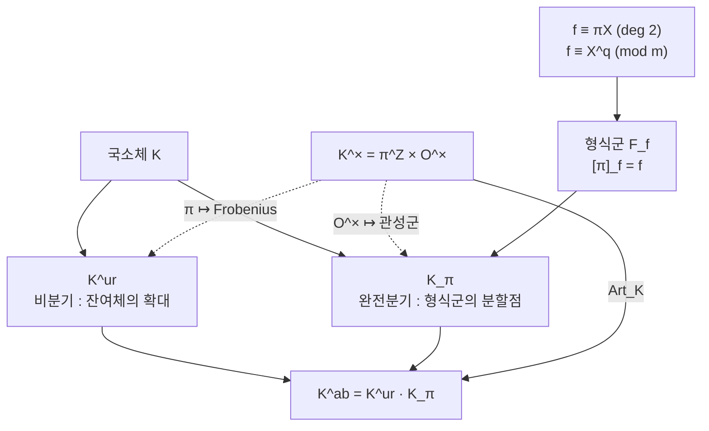

# 국소 유체론과 Lubin–Tate 형식군

# 개요

[유체론](class-field-theory.md)은 수체 $K$ 의 아벨 확대를 $K$ 안의 산술로 분류한다. 그런데 그 서술에는 불편한 구멍이 있다. 존재정리는 모든 광선유체가 존재한다고 말하지만 그 체를 만드는 다항식은 주지 않는다. $K=\mathbb Q$ 에서 원분체라는 답을 아는 것은 Kronecker–Weber 정리 덕분이고, 일반 $K$ 에서 그런 명시적 구성은 열린 문제다.

한 자리에서만 보면 사정이 완전히 달라진다. [$p$ 진수](p-adic-numbers.md)를 완비화해 얻는 국소체 $K$ 에 대해서는 아벨 확대 전체를 손으로 만들 수 있다.

$$
\mathrm{Art}_K\colon K^\times\longrightarrow\mathrm{Gal}(K^{\mathrm{ab}}/K),\qquad
K^{\mathrm{ab}}=K^{\mathrm{ur}}\cdot K_\pi
$$

왼쪽이 국소 상호법칙이고, 오른쪽이 Lubin–Tate 의 명시적 구성이다. 비분기 부분 $K^{\mathrm{ur}}$ 은 잔여체의 확대에서 오므로 이미 완전히 이해된 대상이고, 나머지 분기 부분 $K_\pi$ 를 **형식군의 분할점**으로 만든다. $K=\mathbb Q_p$ 에서 이 구성은 정확히 $1$ 의 $p^n$ 제곱근을 붙이는 일이 된다.

국소 유체론은 대역 유체론의 조각이 아니라 그 재료다. 대역 상호사상은 국소 상호사상들의 곱으로 정의되고, 대역 상호법칙은 그 곱이 $K^\times$ 에서 자명하다는 정합성 조건이다.

# 직관

## 국소체의 아벨 확대는 두 조각뿐이다

국소체 $K$ 에는 부치 $v$ 와 잔여체 $k=\mathcal O/\mathfrak m\cong\mathbb F_q$ 가 있다. 확대 $L/K$ 를 볼 때 두 가지 일만 일어날 수 있다. 잔여체가 커지거나(비분기), 소원이 잘게 쪼개지거나(분기)다. 이 이분법이 곱군의 분해에 그대로 나타난다.

$$
K^\times\;\cong\;\pi^{\mathbb Z}\times\mathcal O^\times
$$

소원 $\pi$ 가 생성하는 무한순환군과 단원군이다. 국소 유체론의 핵심은 이 분해가 Galois 쪽의 분해와 정확히 맞물린다는 것이다. $\pi$ 는 Frobenius 로 가고 $\mathcal O^\times$ 는 관성군으로 간다.

$$
\begin{array}{ccc}
\pi^{\mathbb Z} & \longrightarrow & \mathrm{Gal}(K^{\mathrm{ur}}/K)\cong\hat{\mathbb Z}\\
\mathcal O^\times & \longrightarrow & I_K^{\mathrm{ab}}=\mathrm{Gal}(K^{\mathrm{ab}}/K^{\mathrm{ur}})
\end{array}
$$

비분기 쪽은 잔여체 $\mathbb F_q$ 의 확대 이론이므로 이미 안다. 유한체의 확대는 차수마다 하나뿐이고 Galois 군이 Frobenius로 생성되는 순환군이다. 그러니 남은 일은 $\mathcal O^\times$ 에 대응하는 완전분기 확대를 실제로 만드는 것뿐이다.

## 원분체를 흉내 낼 수 있는가

$K=\mathbb Q_p$ 에서는 답을 안다. $\mathbb Q_p(\mu_{p^n})$ 이 완전분기이고 $\mathrm{Gal}\cong(\mathbb Z/p^n)^\times$ 이며, 비분기 확대와 합치면 $\mathbb Q_p^{\mathrm{ab}}$ 가 전부 나온다. 이것이 국소 Kronecker–Weber 정리다.

일반 국소체 $K$ 로 옮기면 곧바로 막힌다. $\mu_{p^n}$ 에 해당하는 표준적인 대상이 없다. $1$ 의 거듭제곱근이란 곱군 $\mathbb G_m$ 에서 $p^n$ 을 곱하는 사상의 핵인데, $K$ 의 산술에 맞춰진 곱군이 따로 있는 것이 아니기 때문이다.

Lubin 과 Tate 의 해법은 **곱군을 새로 만드는 것**이다[^1]. 정확히는 좌표 하나짜리 형식적 군법칙

$$
F(X,Y)\in\mathcal O[[X,Y]],\qquad F(X,Y)=X+Y+(\text{고차항})
$$

을 만든다. 이것은 대수다양체가 아니라 원점 근방의 멱급수일 뿐이지만, $\bar K$ 의 극대 아이디얼 $\mathfrak m_{\bar K}$ 에 대입하면 실제로 수렴해 그 위에 아벨군 구조를 준다. 곱군의 형식판은 $F(X,Y)=X+Y+XY$ 이고, 좌표를 $x=\zeta-1$ 로 잡으면 $\zeta$ 들의 곱셈이 바로 이 식이다.

## 소원 하나가 형식군 하나를 고른다

만들고 싶은 것은 $\mathcal O$ 가 자기준동형으로 작용하는 형식군이다. 그 중 $\pi$ 배 사상 $[\pi]$ 를 미리 지정해 버리면 나머지가 전부 결정된다는 것이 Lubin–Tate 의 발견이다. 지정할 $f$ 의 조건은 두 줄이다.

$$
f(X)\equiv\pi X \pmod{\deg 2},\qquad f(X)\equiv X^q\pmod{\mathfrak m}
$$

첫 줄은 $[\pi]$ 의 미분이 $\pi$ 여야 한다는 요구이고, 둘째 줄은 잔여체에서 Frobenius 가 되라는 요구다. 완전분기 확대에서 $\pi$ 를 곱하는 일과 Frobenius 가 겹쳐 보이는 것이 국소체의 특징이며, $f$ 는 그 겹침을 멱급수로 적은 것이다. 가장 간단한 선택 두 가지가 $f=\pi X+X^q$ 와, $K=\mathbb Q_p$ 에서 $f=(1+X)^p-1$ 이다. 후자가 주는 형식군이 정확히 $X+Y+XY$ 다.

$f$ 의 선택은 임의적으로 보이지만 결과인 체 $K_n$ 은 $f$ 에 의존하지 않는다. 의존하는 것은 소원 $\pi$ 뿐이다. $\pi$ 를 바꾸면 $K_\pi$ 가 바뀌지만 $K^{\mathrm{ur}}\cdot K_\pi$ 는 그대로다. 대칭성이 이 자리에 숨어 있다.



# 정의

## 국소체와 비분기 확대

**국소체**는 이산 부치를 갖는 완비 체로 잔여체가 유한한 것이다. 표수 0 이면 $\mathbb Q_p$ 의 유한 확대, 표수 $p$ 면 $\mathbb F_q((T))$ 다. 정수환 $\mathcal O$ 와 극대 아이디얼 $\mathfrak m=(\pi)$ 와 잔여체 $k=\mathbb F_q$ 를 쓴다.

각 $n$ 에 대해 차수 $n$ 의 **비분기 확대**가 유일하게 존재한다. $k$ 의 차수 $n$ 확대 $\mathbb F_{q^n}$ 을 올린 것이고, 그 Galois 군이 잔여체의 Galois 군과 같다.

$$
\mathrm{Gal}(K_n^{\mathrm{ur}}/K)\;\xrightarrow{\ \sim\ }\;\mathrm{Gal}(\mathbb F_{q^n}/\mathbb F_q)=\langle\mathrm{Frob}\rangle\cong\mathbb Z/n,
\qquad
\mathrm{Gal}(K^{\mathrm{ur}}/K)\cong\hat{\mathbb Z}
$$

## 국소 상호사상

> **국소 상호법칙.** 연속 준동형
> $$
> \mathrm{Art}_K\colon K^\times\to\mathrm{Gal}(K^{\mathrm{ab}}/K)
> $$
> 가 유일하게 존재해 다음을 만족한다.
> 1. $\mathrm{Art}\_K(\pi)|\_{K^{\mathrm{ur}}}=\mathrm{Frob}$ 이 모든 소원 $\pi$ 에서 성립한다.
> 2. 유한 아벨 확대 $L/K$ 마다 동형 $K^\times/N_{L/K}L^\times\cong\mathrm{Gal}(L/K)$ 를 유도한다.
> 3. $\mathrm{Art}_K(\mathcal O^\times)$ 가 관성군 $\mathrm{Gal}(K^{\mathrm{ab}}/K^{\mathrm{ur}})$ 이다.

$\mathrm{Art}_K$ 자체는 동형이 아니다. $K^\times$ 의 부치 부분이 $\mathbb Z$ 인데 Galois 쪽은 $\hat{\mathbb Z}$ 라 상이 조밀하기만 하다. 노름군에 대한 완비화를 취하면 동형이 된다.

$$
\widehat{K^\times}=\varprojlim_{L}K^\times/N_{L/K}L^\times\;\cong\;\hat{\mathbb Z}\times\mathcal O^\times\;\cong\;\mathrm{Gal}(K^{\mathrm{ab}}/K)
$$

**존재정리**는 이 대응의 반대 방향이다. $K^\times$ 의 유한지표 열린 부분군과 $K$ 의 유한 아벨 확대가 일대일로 대응하며, 대응은 포함관계를 뒤집고 교차와 합성을 보존한다.

## 형식군 법칙

$\mathcal O$ 위의 **일차원 가환 형식군 법칙**은 $F\in\mathcal O[[X,Y]]$ 로 다음을 만족하는 것이다.

$$
F(X,0)=X,\qquad F(X,Y)=F(Y,X),\qquad F(F(X,Y),Z)=F(X,F(Y,Z))
$$

첫 조건에서 $F(X,Y)=X+Y+(\deg\ge2)$ 가 따라 나온다. $\mathfrak m_{\bar K}$ 의 원소를 대입하면 급수가 수렴하므로 $x+\_Fy=F(x,y)$ 가 $\mathfrak m_{\bar K}$ 위의 실제 아벨군 구조를 준다. 역원과 결합법칙은 형식적 항등식에서 그대로 따라온다.

준동형 $g\colon F\to G$ 는 $g(F(X,Y))=G(g(X),g(Y))$ 를 만족하는 $g\in X\mathcal O[[X]]$ 다. $\mathrm{End}(F)$ 는 환이 되고, 항상 $\mathbb Z$ 를 포함한다.

## Lubin–Tate 형식군

$\mathcal F_\pi$ 를 위 두 조건 $f\equiv\pi X\ (\deg2)$ 와 $f\equiv X^q\ (\mathfrak m)$ 을 만족하는 $f\in\mathcal O[[X]]$ 의 집합이라 하자.

> **Lubin–Tate.** $f\in\mathcal F_\pi$ 마다 형식군 법칙 $F_f$ 가 유일하게 존재해 $f$ 가 $F_f$ 의 자기준동형이 된다. 나아가 환 준동형 $\mathcal O\to\mathrm{End}(F_f)$ 곧 $a\mapsto[a]_f$ 가 유일하게 있어 $[a]_f(X)\equiv aX\ (\deg2)$ 이고 $[\pi]_f=f$ 다.

구성은 차수에 대한 귀납이다. $F\equiv X+Y$ 에서 시작해, $\Delta=f(F)-F(f(X),f(Y))$ 의 $n$ 차 동차부분을 $\pi^n-\pi$ 로 나눈 것을 더한다. 이 나눗셈이 $\mathcal O$ 안에서 되는 이유가 $f\equiv X^q\ (\mathfrak m)$ 이다. 잔여체에서 $f$ 가 Frobenius 이므로 $\Delta\equiv0\ (\mathfrak m)$ 이고, $\pi^n-\pi=\pi(\pi^{n-1}-1)$ 의 $\pi$ 가 정확히 그 만큼 상쇄된다.

**분할점**은 $[\pi^n]$ 의 핵이다.

$$
\Lambda_n=\{x\in\mathfrak m_{\bar K}:[\pi^n]_f(x)=0\},\qquad
\Lambda_n\cong\mathcal O/\pi^n\ (\mathcal O\text{-가군으로})
$$

$K_{\pi,n}=K(\Lambda_n)$ 으로 두고 $K_\pi=\bigcup_nK_{\pi,n}$ 이라 쓴다.

# 성질

## Lubin–Tate 정리

> 1. $K_{\pi,n}/K$ 는 완전분기 아벨 확대이고 $\mathcal O$ 작용이 동형 $\mathrm{Gal}(K_{\pi,n}/K)\cong(\mathcal O/\pi^n)^\times$ 를 준다.
> 2. $u\in\mathcal O^\times$ 에 대해 $\mathrm{Art}_K(u)$ 가 $\Lambda_n$ 위에서 $[u^{-1}]_f$ 로 작용한다.
> 3. $K^{\mathrm{ab}}=K^{\mathrm{ur}}\cdot K_\pi$ 이고, $K_{\pi,n}$ 은 $f$ 의 선택에 의존하지 않는다.

첫 줄의 $\Lambda_n\cong\mathcal O/\pi^n$ 은 $[\pi^n]\_f$ 가 차수 $q^n$ 의 멱급수이고 $\Lambda_1$ 의 원소가 $f(X)/X$ 의 근이라는 사실에서 나온다. $f=\pi X+X^q$ 이면 $f(X)/X=\pi+X^{q-1}$ 이 Eisenstein 다항식이므로 $K_{\pi,1}$ 이 차수 $q-1$ 의 완전분기 확대다. $|(\mathcal O/\pi)^\times|=q-1$ 과 맞는다.

둘째 줄에 있는 역원 $u^{-1}$ 은 정규화의 문제다. $\mathrm{Art}_K(\pi)$ 를 Frobenius 로 둘 것인지 그 역으로 둘 것인지에 따라 부호가 뒤집히며, 문헌마다 규약이 갈린다.

## 원분체와의 비교

$K=\mathbb Q_p$ 와 $\pi=p$ 와 $f(X)=(1+X)^p-1$ 을 넣으면 모든 것이 익숙한 대상으로 돌아온다.

| Lubin–Tate | $K=\mathbb Q_p,\ f=(1+X)^p-1$ |
|---|---|
| $F_f(X,Y)$ | 형식 곱군 $\hat{\mathbb G}_m$ 의 $X+Y+XY$ |
| $[a]_f(X)$ | $(1+X)^a-1$ |
| $\Lambda_n$ | $\lbrace\zeta-1:\zeta^{p^n}=1\rbrace$ |
| $K_{\pi,n}$ | $\mathbb Q_p(\mu_{p^n})$ |
| $\mathrm{Gal}\cong(\mathcal O/\pi^n)^\times$ | $(\mathbb Z/p^n)^\times$ |
| $K^{\mathrm{ab}}=K^{\mathrm{ur}}K_\pi$ | 국소 Kronecker–Weber |

일반 $K$ 에서 Lubin–Tate 는 이 표의 왼쪽 열을 만들어 준다. 다만 대역적으로는 사정이 다르다. 국소 구성들을 이어 붙여 $K$ 의 대역 아벨 확대를 명시적으로 얻는 것이 Hilbert 의 12번 문제이고, $K=\mathbb Q$ 와 허수 이차체를 빼면 여전히 열려 있다.

## 분기 여과와의 정합성

$\mathcal O^\times$ 의 여과 $U^{(0)}=\mathcal O^\times\supset U^{(n)}=1+\mathfrak m^n$ 이 Galois 쪽의 상첨자 분기군으로 정확히 옮겨 간다.

$$
\mathrm{Art}_K\big(U^{(n)}\big)=G^n\quad(\text{상첨자 번호매김})
$$

$n=0$ 이 관성군, $n\ge1$ 이 야생 분기다. 상호사상이 군 동형일 뿐 아니라 분기 구조까지 보존한다는 뜻이고, 국소 $\varepsilon$ 인자나 도체 계산이 여기에 기댄다. 지표 $\chi$ 의 도체 지수는 $\chi(U^{(n)})=1$ 이 되는 최소의 $n$ 으로 정의되며, 이것이 대응하는 Galois 표현의 도체와 일치한다.

## 대역 이론과의 접합

대역 상호사상은 국소 사상들을 이어 붙여 만든다.

$$
\psi_K\colon\mathbb A_K^\times\to\mathrm{Gal}(K^{\mathrm{ab}}/K),\qquad
\psi_K\big((x_v)_v\big)=\prod_v\mathrm{Art}_{K_v}(x_v)
$$

거의 모든 자리에서 $x_v\in\mathcal O_v^\times$ 이고 그 자리가 비분기이므로 곱이 유한하다. 대역 상호법칙은 이 곱이 $K^\times$ 의 대각선 원소에서 자명하다는 진술이며, 곧 $\psi_K$ 가 이델류군 $K^\times\backslash\mathbb A_K^\times$ 에서 정의된다는 것이다. 이차체로 내려 보면 $\prod_v|x|_v=1$ 과 같은 모양의 곱 공식이고, 실제로 이차 상호법칙의 Hilbert 기호 형태가 정확히 이 진술이다.

증명 순서가 국소에서 대역으로 간다는 점이 중요하다. 국소 유체론을 먼저 세우고(Galois 코호몰로지로 $H^2(\mathrm{Gal}(L/K),L^\times)\cong\frac1{[L:K]}\mathbb Z/\mathbb Z$ 를 계산한다), 그 위에서 대역 정리를 얻는다. Lubin–Tate 는 그 국소 단계를 코호몰로지 없이 명시적으로 해내는 길이다.

# 활용

## 형식군을 직접 만들어 본다

$K=\mathbb Q_3$ 와 $\pi=3$ 과 $q=3$ 에서 $F_f$ 를 차수 $6$ 미만까지 귀납으로 구성한다. 확인할 것은 네 가지다. 군법칙의 공리, 함수방정식 $f(F(X,Y))=F(f(X),f(Y))$ 가 성립하는 것, 계수가 $\mathbb Z_3$ 안에 있다는 것, 그리고 $f=(1+X)^3-1$ 을 넣으면 $X+Y+XY$ 가 그대로 나온다는 것이다.

```python
from fractions import Fraction as Q

N, p, pi = 6, 3, 3          # K = Q_3, 소원 π = 3, 전체 차수 N 미만만 유지

def mul(a, b):
    c = {}
    for (i, j), u in a.items():
        for (k, l), v in b.items():
            if i + j + k + l < N:
                c[(i + k, j + l)] = c.get((i + k, j + l), Q(0)) + u * v
    return {m: v for m, v in c.items() if v}

def add(*gs):
    c = {}
    for g in gs:
        for m, v in g.items():
            c[m] = c.get(m, Q(0)) + v
    return {m: v for m, v in c.items() if v}

def scal(a, s):
    return {m: v * s for m, v in a.items() if v * s}

X, Y = {(1, 0): Q(1)}, {(0, 1): Q(1)}

def subst(f, g):                              # f(T) 에 g 를 대입
    out, power = {}, {(0, 0): Q(1)}
    for k in range(N + 1):
        if k:
            power = mul(power, g)
        if k in f and power:
            out = add(out, scal(power, Q(f[k])))
    return out

def compose_outer(F, f):                      # F(f(X), f(Y))
    fx, fy, out = subst(f, X), subst(f, Y), {}
    for (i, j), c in F.items():
        t = {(0, 0): c}
        for _ in range(i): t = mul(t, fx)
        for _ in range(j): t = mul(t, fy)
        out = add(out, t)
    return out

def lubin_tate(f):                            # F ≡ X+Y 에서 시작해 차수별로 보정
    F = add(X, Y)
    for n in range(2, N):
        delta = {m: v for m, v in add(subst(f, F), scal(compose_outer(F, f), Q(-1))).items()
                 if sum(m) == n}
        F = add(F, scal(delta, Q(1, pi ** n - pi)))   # 유일한 보정항
    return F

def report(name, f):
    F = lubin_tate(f)
    terms = " + ".join(f"{v}·X^{i}Y^{j}" for (i, j), v in sorted(F.items()))
    print(f"{name}\n  F = {terms}")
    print("  F(X,Y) = F(Y,X)          :", {(j, i): v for (i, j), v in F.items()} == F)
    print("  F(X,0) = X               :", {m: v for m, v in F.items() if m[1] == 0} == X)
    print("  f(F(X,Y)) = F(f(X),f(Y)) :", subst(f, F) == compose_outer(F, f))
    print("  모든 계수가 Z_3 안에     :", all(v.denominator % p for v in F.values()))

report("f(X) = 3X + X^3", {1: pi, p: 1})
report("f(X) = (1+X)^3 - 1", {1: 3, 2: 3, 3: 1})

# f(X) = 3X + X^3
#   F = 1·X^0Y^1 + 1·X^1Y^0 + 1/8·X^1Y^2 + -1/128·X^1Y^4 + 1/8·X^2Y^1 + -1/128·X^4Y^1
#   F(X,Y) = F(Y,X)          : True
#   F(X,0) = X               : True
#   f(F(X,Y)) = F(f(X),f(Y)) : True
#   모든 계수가 Z_3 안에     : True
# f(X) = (1+X)^3 - 1
#   F = 1·X^0Y^1 + 1·X^1Y^0 + 1·X^1Y^1
#   F(X,Y) = F(Y,X)          : True
#   F(X,0) = X               : True
#   f(F(X,Y)) = F(f(X),f(Y)) : True
#   모든 계수가 Z_3 안에     : True
```

두 번째 출력이 핵심이다. 귀납적 구성이 $(1+X)^p-1$ 에서 형식 곱군을 정확히 복원하므로, 원분체 이론이 이 구성의 특수한 경우임이 계산으로 확인된다. 첫 번째 출력의 계수 $1/8$ 과 $-1/128$ 은 분모가 $2$ 의 거듭제곱이라 $\mathbb Z_3$ 의 단원이다. 나눗셈에 쓰인 $\pi^n-\pi=3(3^{n-1}-1)$ 의 $3$ 이 매번 정확히 상쇄되었다는 증거다.

## 두 형식군이 같은 체를 준다

$f=3X+X^3$ 의 분할점을 직접 구해 본다. $f(x)=x(3+x^2)=0$ 이므로 $\Lambda_1=\lbrace 0,\pm\sqrt{-3}\rbrace$ 이고

$$
K_{\pi,1}=\mathbb Q_3(\sqrt{-3})
$$

다. 한편 $f=(1+X)^3-1$ 쪽은 $\Lambda_1=\lbrace\zeta_3-1\rbrace$ 이므로 $K_{\pi,1}=\mathbb Q_3(\zeta_3)$ 인데, $\zeta_3=\frac{-1+\sqrt{-3}}2$ 이므로 두 체가 같다. 형식군은 서로 다른데 분할점이 만드는 체는 같다. 정리의 셋째 줄이 말하는 $f$ 독립성이 눈앞에서 확인된다.

차수도 맞는다. 둘 다 $\mathbb Q_3$ 위 차수 $2$ 의 완전분기 확대이고 $|(\mathbb Z_3/3)^\times|=2$ 다.

## 어디에 쓰이는가

국소 유체론은 그 자체보다 도구로 더 많이 쓰인다.

- **Galois 표현의 국소 조건.** $\mathrm{Gal}(\bar K_v/K_v)$ 의 표현을 분류할 때 아벨 부분은 $K_v^\times$ 의 지표로 번역된다. 대역 [Galois 표현](galois-representations.md)의 도체와 $L$ 인자를 자리마다 계산하는 근거가 이것이다.
- **국소 $\varepsilon$ 인자.** 자기동형 $L$ 함수의 함수방정식에 나오는 근 수는 분기 지표의 Gauss 합으로 주어지며, 그 계산이 분기 여과 위에서 이루어진다.
- **$p$ 진 Hodge 이론.** $K_\pi$ 를 붙여 만든 탑은 $p$ 진 표현을 $\varphi$ 가군으로 바꾸는 장의 원형이다. Fontaine 의 주기환과 Coleman 의 노름 사상이 모두 Lubin–Tate 탑 위에서 세워진다.
- **국소 Langlands 대응.** $\mathrm{GL}_1$ 국소 Langlands 대응이 곧 국소 상호법칙이다. $\mathrm{GL}_n$ 으로 올린 진술이 Harris–Taylor 와 Henniart 가 증명한 국소 Langlands 대응이고, [Langlands 강령](langlands-program.md)의 국소 성분을 이룬다.

[^1]: Jonathan Lubin, John Tate, *Formal Complex Multiplication in Local Fields*, Annals of Mathematics 81 (1965), 380–387. 형식군의 존재와 유일성은 Lemma 1 과 그 따름정리, 분할점의 $\mathcal O$ 가군 구조와 Galois 군 계산은 Theorem 2 다. 본문의 멱급수 구성과 분할점 계산은 직접 확인한 것이다.

# 연관 문서

## 선수지식

- [p 진수와 부치](p-adic-numbers.md)
- [유체론](class-field-theory.md)

## 더 알아보기

- [p 진 Hodge 이론과 Fontaine 주기환](p-adic-hodge-theory.md)
- [Poitou–Tate 완전열과 대역 상호법칙](poitou-tate.md)

#number_theory #field_theory #construction
