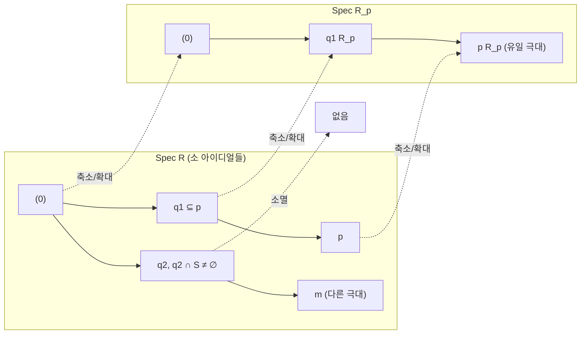

# 환의 국소화

# 개요

국소화(localization)는 [환](rings.md)에서 "분모를 허용하는" 조작을 일반화한 것이다. 정수환에서 0이 아닌 모든 원소를 분모로 허용하면 유리수체가 나오고, 홀수만 분모로 허용하면 짝수/홀수 정보만 남은 환이 나온다. 일반적으로 가환환 $R$ 과 곱셈에 닫힌 부분집합 $S$ 가 주어지면, $S$ 의 원소를 전부 가역원으로 만드는 가장 경제적인 환 $S^{-1}R$ 과 표준 환준동형 $R \to S^{-1}R$ 이 존재한다.

이 구성이 중요한 이유는 두 가지다. 첫째, [소 아이디얼](prime-ideals.md) $p$ 에서의 국소화 $R_p$ 는 유일한 극대 아이디얼을 갖는 국소환이어서, 환을 "한 점 근방"에서만 들여다보게 해 준다. 둘째, 국소화는 아이디얼과 [가군](modules.md)에 대해 매우 순한 연산이다 — 완전열을 보존하고, 소 아이디얼을 부분집합으로 잘라내며, 그 결과 "국소적으로 참이면 대역적으로 참"이라는 형태의 정리들이 성립한다. 이 국소-대역 원리는 가환대수와 대수기하의 기본 작업 방식이다.

이 문서에서 환은 모두 가환환이고 곱셈 항등원 $1$ 을 갖는다. 준동형은 $1$ 을 $1$ 로 보낸다.

# 직관

유리수를 만드는 절차를 그대로 떠올리면 된다. 정수 쌍 $(a, s)$ 를 분수 $a/s$ 로 읽고, $a/s$ 와 $b/t$ 를 $at = bs$ 일 때 같다고 선언한 뒤 덧셈과 곱셈을 평소의 분수 규칙으로 정의한다. 국소화는 이 절차에서 분모로 쓸 수 있는 집합을 $S$ 로 한정한 것이다.

한 가지 조정이 필요하다. $R$ 에 영인자가 있으면 $at = bs$ 라는 관계는 추이적이지 않다. 그래서 동치관계를 어떤 $u$ 가 $S$ 에 있어 $u(at - bs) = 0$ 이 되는 것으로 느슨하게 잡는다. 정역에서는 $S$ 가 $0$ 을 포함하지 않는 한 이 조건이 원래 조건과 같다.

$S$ 의 선택이 만들어 낼 환을 결정한다. 세 가지 전형적인 선택이 있다.

- $S$ 가 $R$ 의 모든 비영인자 — 전분수환(total quotient ring). 정역이면 분수체가 된다.
- $S=\lbrace 1,f,f^2,\dots\rbrace$ — 한 원소 $f$ 를 가역으로 만든 환. 기하적으로는 $f$ 가 0이 되지 않는 열린 영역만 남긴다.
- $S=R\setminus p$ ($p$ 는 소 아이디얼) — 이것이 $R_p$ 다. 소 아이디얼의 정의가 곧 이 여집합이 곱닫힘이라는 말이다.

세 번째가 "국소화"라는 이름의 유래다. $R_p$ 에서 가역이 아닌 원소는 정확히 분자가 $p$ 에 들어 있는 분수들이고, 이들이 아이디얼을 이루므로 극대 아이디얼이 하나뿐이다. 비가역원 전체가 아이디얼을 이루는 환을 국소환(local ring)이라 한다. 국소환에서는 "$x$ 가 가역이거나, 아니면 $1 - x$ 가 가역" 같은 편리한 이분법이 성립한다.

기하적 비유로는, $R$ 을 어떤 공간 위의 함수들의 환으로 보았을 때 $R_p$ 는 점 $p$ 근방에서의 함수의 싹(germ)들의 환이다. 점에서 값이 0이 아닌 함수는 근방에서 나눌 수 있으니 가역이 된다.

# 정의

## 곱닫힌 집합과 분수환

**정의.** $R$ 의 부분집합 $S$ 가 **곱닫힌 집합**(multiplicatively closed set)이라는 것은 $1$ 이 $S$ 에 속하고, $s, t$ 가 $S$ 에 속하면 $st$ 도 $S$ 에 속한다는 뜻이다.

집합 $R\times S$ 위에 관계를 다음과 같이 준다.

$$
(a, s) \sim (b, t) \iff \exists u \in S,\ u(at - bs) = 0 .
$$

반사성과 대칭성은 자명하고, 추이성은 $u(at-bs)=0$ 과 $v(bw-ct)=0$ 에서 $uvt(aw-cs)=0$ 를 얻어 나온다. 동치류를 $a/s$ 로 적고 전체 집합을 $S^{-1}R$ 로 쓴다. 연산은

$$
\frac{a}{s} + \frac{b}{t} = \frac{at + bs}{st}, \qquad \frac{a}{s}\cdot\frac{b}{t} = \frac{ab}{st}
$$

로 정의한다. 대표원 선택에 무관함을 확인하면 $S^{-1}R$ 은 영원 $0/1$ 과 항등원 $1/1$ 을 갖는 가환환이 된다.

**표준 사상**은

$$
\iota : R \longrightarrow S^{-1}R, \qquad \iota(a) = \frac{a}{1}
$$

이며 환준동형이다. 핵은 $\lbrace a : ua = 0 \text{ 인 } u \text{ 가 } S \text{ 에 존재}\rbrace$ 이다. 따라서 $S$ 가 비영인자들로만 이루어지면 $\iota$ 는 단사이고, $0$ 이 $S$ 에 속하면 $S^{-1}R$ 은 영환이다.

## 보편성질

**정리 (보편성질).** $f : R \to A$ 가 환준동형이고 $f(S)$ 가 전부 $A$ 의 가역원이면, $g \circ \iota = f$ 를 만족하는 환준동형 $g : S^{-1}R \to A$ 가 유일하게 존재한다.

$$
g\negthinspace\left(\frac{a}{s}\right) = f(a)\thinspace f(s)^{-1}.
$$

well-definedness는 동치관계의 정의에서 나오고, 유일성은 $g(a/s)$ 가 $g(a/1)g(1/s)$ 로 강제되기 때문이다. 이 성질이 $S^{-1}R$ 를 동형을 제외하고 결정한다. [범주](category.md)의 언어로는 $S^{-1}R$ 이 $S$ 를 가역으로 만드는 $R$ 대수들 가운데 시작대상이다.

## 국소환

**정의.** 극대 아이디얼을 정확히 하나 갖는 환을 **국소환**이라 하고, 그 극대 아이디얼을 $m$ 으로, 몫체 $R/m$ 를 잉여체(residue field)라 한다.

$p$ 가 소 아이디얼이면 $S=R\setminus p$ 는 곱닫힘이고, 이때의 국소화를 $R_p$ 로 쓴다. $R_p$ 의 원소 $a/s$ 는 $a$ 가 $p$ 에 속할 때 정확히 비가역이며, 그런 원소들의 집합

$$
pR_p = \left\lbrace \frac{a}{s} : a \in p,\ s \notin p \right\rbrace
$$

은 아이디얼이다. 비가역원 전체가 아이디얼이므로 $R_p$ 는 국소환이고 극대 아이디얼은 $pR_p$ 다. 잉여체는 $R_p/pR_p \cong \mathrm{Frac}(R/p)$ 로, $p$ 에서의 함수체다.

## 가군의 국소화

$R$ 가군 $M$ 에 대해서도 같은 구성을 한다. $M \times S$ 를 $(m,s) \sim (n,t) \iff \exists u \in S,\ u(tm - sn) = 0$ 으로 나눈 것을 $S^{-1}M$ 이라 하며 $S^{-1}R$ 가군이 된다. 자연스러운 동형

$$
S^{-1}M \thickspace\cong\thickspace S^{-1}R \otimes_R M
$$

이 성립한다([텐서곱](tensor-products.md)). 즉 국소화는 $S^{-1}R$ 과의 텐서곱 함자이며, 아래에서 보듯 완전(exact)하다.

# 성질

## 아이디얼의 확대와 축소

$\iota : R \to S^{-1}R$ 을 따라 아이디얼을 옮기는 두 연산을 쓴다. $R$ 의 아이디얼 $I$ 에 대한 **확대**(extension)는 $I^e = S^{-1}I = \lbrace a/s : a \in I,\ s \in S\rbrace$ 이고, $S^{-1}R$ 의 아이디얼 $J$ 에 대한 **축소**(contraction)는 $J^c = \iota^{-1}(J)$ 다.

**명제.** $S^{-1}R$ 의 모든 아이디얼은 확대 아이디얼이다. 즉 $J = (J^c)^e$ 이다.

증명 스케치. $a/s \in J$ 이면 $a/1 = (s/1)(a/s) \in J$ 이므로 $a \in J^c$ 이고, 따라서 $a/s \in (J^c)^e$ 다. 역포함은 자명하다.

반대 방향은 손실이 있다. $I^{ec} = \lbrace a \in R : sa \in I \text{ 인 } s \text{ 가 } S \text{ 에 존재}\rbrace$ 이고, 이는 일반적으로 $I$ 보다 크다. 특히 $I \cap S$ 가 비어 있지 않으면 $I^e$ 는 전체 환이다.

**정리 (소 아이디얼의 대응).** 확대와 축소는 서로 역인 전단사

$$
\lbrace\thinspace q \subseteq R \text{ 소 아이디얼},\ q \cap S = \varnothing \thinspace\rbrace \thickspace\longleftrightarrow\thickspace \lbrace\thinspace \text{$S^{-1}R$ 의 소 아이디얼} \thinspace\rbrace
$$

를 준다. 이 대응은 포함관계를 보존한다([부분순서](partial-orders.md) 동형이다).

증명 스케치. $q \cap S = \emptyset$ 인 소 아이디얼 $q$ 에 대해 $S^{-1}q$ 가 소임을 보이고, $(S^{-1}q)^c = q$ 임을 소성, 즉 $sa \in q$ 이고 $s \notin q$ 이면 $a \in q$ 라는 사실로 얻는다. 반대로 $J$ 가 소이면 $J^c$ 는 소이고 $S$ 와 만나지 않는다.

$S=R\setminus p$ 를 넣으면 $R_p$ 의 소 아이디얼은 $p$ 에 포함된 $R$ 의 소 아이디얼과 일대일 대응한다. 즉 $R_p$ 는 $p$ 아래쪽의 소 아이디얼 구조만 남긴 환이다.

## 완전성

**정리.** $S^{-1}(-)$ 는 완전 함자다. 즉 $R$ 가군의 완전열 $M' \to M \to M''$ 에 대해 $S^{-1}M' \to S^{-1}M \to S^{-1}M''$ 도 완전하다.

증명 스케치. 합성이 0임은 명백하다. $m/s$ 가 오른쪽 사상의 핵에 있으면 $g(m)/s = 0$ 이므로 어떤 $u \in S$ 에 대해 $g(um) = 0$ 이고, 즉 $um = f(m')$ 인 $m'$ 이 있어 $m/s = f(m')/(us)$ 이다.

완전성의 대수적 의미는 $S^{-1}R$ 이 평탄(flat) $R$ 대수라는 것이다. 부분가군, 몫, 유한 교집합, 유한 합이 모두 국소화와 교환한다.

## 국소-대역 원리

**정리.** $M$ 이 $R$ 가군일 때 다음은 동치다.

1. $M = 0$ 이다.
2. 모든 소 아이디얼 $p$ 에 대해 $M_p = 0$ 이다.
3. 모든 극대 아이디얼 $m$ 에 대해 $M_m = 0$ 이다.

증명 스케치. $1\Rightarrow2\Rightarrow3$ 은 자명하다. $3\Rightarrow1$ 은 다음과 같다. $M \ne 0$ 이면 원소 $x \in M$ 을 $x \ne 0$ 이 되게 잡고 소멸자 $\mathrm{Ann}(x) = \lbrace a : ax = 0\rbrace$ 를 본다. 이는 진아이디얼이므로 어떤 극대 아이디얼 $m$ 에 포함된다([선택공리](axiom-of-choice.md)에 기반한 Krull 정리). 그러면 $M_m$ 에서 $x/1 \ne 0$ 인데, $x/1 = 0$ 이려면 $m$ 밖의 어떤 $u$ 가 $ux = 0$ 을 만족해야 하고 그런 $u$ 는 $\mathrm{Ann}(x) \subseteq m$ 에 들어 있어야 하므로 모순이다.

완전성과 결합하면 곧바로 따름정리가 나온다. $f : M \to N$ 이 단사(전사, 동형)인 것과 모든 극대 아이디얼 $m$ 에 대해 $f_m$ 이 단사(전사, 동형)인 것은 동치다. 핵과 여핵이 국소화와 교환하므로 위 정리를 $\ker f$ 와 $\mathrm{coker}f$ 에 적용하면 된다.

이것이 "국소적 판정"의 표준 형태다. 등식이나 포함관계 같은 진술은 모든 $R_m$ 에서 확인하면 충분하고, 국소환에서는 Nakayama 보조정리처럼 강한 도구를 쓸 수 있다.

## 그 밖의 보존 성질

- $S = \lbrace 1, f, f^2, \dots\rbrace$ 이면 $S^{-1}R \cong R[x]/(fx - 1)$ 이다. 보편성질로 양쪽이 같은 대상임을 보인다.
- $R$ 이 Noetherian이면 $S^{-1}R$ 도 Noetherian이다. 모든 아이디얼이 확대 아이디얼이고 생성원이 따라 올라가기 때문이다.
- $R$ 이 정역이면 $0 \notin S$ 인 한 $S^{-1}R$ 도 정역이고, 모두 분수체 $\mathrm{Frac}(R)$ 의 부분환으로 볼 수 있다. 이때 모든 극대 아이디얼에 걸친 교집합으로 $R = \bigcap_m R_m$ 이 성립한다.
- 유일분해정역(unique factorization domain, UFD)의 국소화는 UFD다.
- 국소화는 몫과 교환한다. 즉 $S^{-1}(R/I) \cong (S^{-1}R)/(S^{-1}I)$ 이며, 여기서 왼쪽의 곱닫힌 집합은 $S$ 의 상이다([몫환](ideals-quotient-rings.md)).

# 활용

## 정수환의 국소화

$R=\mathbb Z$ 의 곱닫힌 집합은 소수 집합의 선택으로 결정된다. 소수 $p$ 에서의 국소화는

$$
\mathbb{Z}\_{(p)} = \left\lbrace \frac{a}{b} \in \mathbb{Q} : p \nmid b \right\rbrace
$$

이고, 극대 아이디얼은 $p\mathbb Z_{(p)}$ 이고 잉여체는 $\mathbb Z/p\mathbb Z$ 라는 [유한체](finite-fields.md)다. 이 환의 모든 0이 아닌 아이디얼은 $p^n\mathbb Z_{(p)}$ 꼴이므로 이산 부치환(discrete valuation ring)이 되고, 이는 정수의 $p$ 진 자릿수 전개와 $p$ 진 부치 $v_p$ 의 대수적 기반이다([소수](primes.md)).

반대 극단으로 $S=\mathbb Z\setminus\lbrace 0\rbrace$ 을 취하면 유리수체 $\mathbb Q$ 가 나오고, $S=\lbrace 1,2,4,\dots\rbrace$ 를 취하면 이진 유리수의 환이 나온다. 서로 다른 $p$ 에 대한 $\mathbb Z_{(p)}$ 들의 교집합이 $\mathbb Z$ 라는 사실은 위 국소-대역 원리의 가장 익숙한 실례다. [합동식](modular-arithmetic.md)과 [중국인의 나머지 정리](chinese-remainder-theorem.md)가 소수별 정보를 모으는 것과 같은 구도다.

## 다항식환과 유리함수

$k$ 가 [체](fields.md)일 때 [다항식환](polynomial-rings.md) $k[x]$ 의 국소화는 대수기하의 기본 예다.

- $S=k[x]\setminus\lbrace 0\rbrace$ 이면 유리함수체 $k(x)$ 다.
- $S=\lbrace 1,f,f^2,\dots\rbrace$ : $f$ 의 영점을 뺀 열린 집합 위의 함수들.
- $S = k[x] \setminus (x - a)$ : 점 $a$ 에서의 국소환. 원소는 $a$ 에서 분모가 0이 되지 않는 유리함수이며, 극대 아이디얼은 $a$ 에서 값이 0인 함수들이다. 잉여체는 $k$ 이고 "$a$ 에서의 값을 읽는" 사상이 몫사상이다.

여러 변수로 넘어가면 $k[x_1, ..., x_n]$ 의 극대 아이디얼에서의 국소화가 아핀 대수다양체의 점 근방을 기술한다. $\mathrm{Spec}R$ 의 기본 열린 집합 $D(f)$ 에 $R[1/f]$ 를, 점 $p$ 의 줄기(stalk)에 $R_p$ 를 붙이는 것이 스킴의 구조층 정의다.

## $\mathbb Z_{(5)}$ 의 부치

$p=5$ 에서 유리수의 부치 $v_5$ 와 $\mathbb Z_{(5)}$ 에서의 가역 여부는 기약분수의 분모와 분자를 보면 정해진다.

| $q$ | $v_5(q)$ | $\mathbb Z_{(5)}$ 의 원소 | 가역 |
|---|---|---|---|
| $3/4$ | $0$ | O | O |
| $10/3$ | $1$ | O | |
| $1/5$ | $-1$ | | |
| $7/25$ | $-2$ | | |

부치가 $0$ 이상인 유리수 전체가 $\mathbb Z_{(p)}$ 이고, 부치가 양수인 것들이 극대 아이디얼 $p\mathbb Z_{(p)}$ 를 이룬다. 일반 환의 국소화도 분모에 무엇을 허용하는지를 정하는 같은 구성이다.

## 다른 분야와의 연결

- 대수기하: 아핀 스킴 $\mathrm{Spec}R$ 의 구조층은 국소화로 정의되고, 줄기 $\mathcal O_{X,p}=R_p$ 가 국소적 성질(정칙점, 차원, 중복도)을 재는 자리다.
- 대수적 수론: 대역체의 정수환을 각 소 아이디얼에서 국소화하면 이산 valuation ring이 되고, 여기서 완비화하면 국소체가 된다. 국소-대역 원리(Hasse 원리)의 대수적 바탕이 이 구성이다.[^1]
- 호몰로지 대수: 국소화가 완전 함자이므로 $\mathrm{Ext}$ 와 $\mathrm{Tor}$ 등의 계산이 국소화와 교환한다. 평탄성과 국소 판정은 가군 이론의 표준 기법이다.[^2]
- [체의 확대](field-extensions.md)와의 관계: 정역의 분수체는 국소화의 특수한 경우이며, 몫환과 국소화를 조합해 잉여체 $R_p/pR_p$ 를 만드는 것이 "점에서의 값"을 정의하는 방법이다.

[^1]: J. S. Milne, Algebraic Number Theory (course notes), https://www.jmilne.org/math/CourseNotes/ant.html
[^2]: M. F. Atiyah, I. G. Macdonald, Introduction to Commutative Algebra, Chapter 3 (Rings and Modules of Fractions), https://archive.org/details/introductiontoco0000atiy

# 연관 문서

## 선수지식

- [소 아이디얼](prime-ideals.md)

## 더 알아보기

- [Nakayama 보조정리](nakayama-lemma.md)
- [Dedekind 정역과 아이디얼의 유일분해](dedekind-domains.md)

#ring_theory #algebra #number_theory
