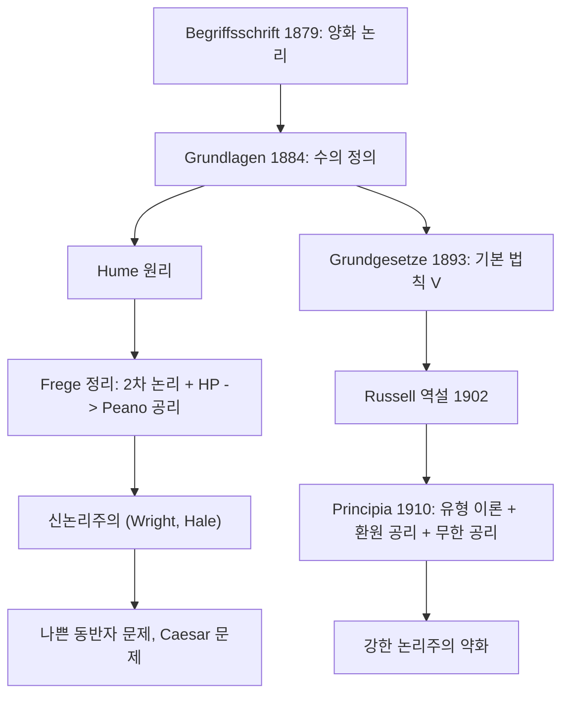

# 논리주의와 Frege 프로그램

# 개요

논리주의는 수학이, 적어도 산술이, 논리로 환원된다는 주장이다. 수학의 개념은 논리적 개념으로 정의되고 수학의 정리는 논리적 진리에서 도출된다는 것이다.

Frege 는 이 주장을 구호가 아니라 기술적 계획으로 만들었다. 그는 현대적 양화 논리를 발명하고, 수를 개념의 외연으로 정의하고, 산술의 공리를 그 정의에서 도출하려 했다. 이 계획은 Russell 이 발견한 역설로 무너졌지만, 무너진 지점이 정확히 어디였는지가 이후 백 년의 논의를 만들었다.

핵심은 두 원리를 구별하는 데 있다. 수를 다루는 Hume 원리는 무모순이고 그것만으로 산술 전체가 나온다. 외연을 다루는 기본 법칙 V 는 모순이다. Frege 는 후자를 통해 전자를 정당화하려 했고, 신논리주의는 전자를 직접 받아들이자고 제안한다.

# 직관

"수 3 이란 무엇인가"에 답하려면 3 이 무엇에 대해 말해지는지부터 봐야 한다. Frege 의 답은 수가 대상이 아니라 개념에 대해 술어된다는 것이다. "말이 세 마리 있다"는 말 각각의 성질이 아니라 "말임"이라는 개념의 성질이다.

그다음 질문은 언제 두 개념이 같은 수를 가지느냐다. 수를 세지 않고도 답할 수 있다. 짝을 지을 수 있으면 된다. 접시와 나이프를 하나씩 짝지어 남는 것이 없으면 개수가 같다. 이것이 동수성(equinumerosity)이며, 전단사 [함수](functions.md)의 존재로 정의된다.

여기서 Frege 의 전략이 나온다. 먼저 "같은 수를 가진다"를 정의하고, 그다음 그 동치관계의 추상화로 수라는 대상을 얻는다. 방향을 잡을 때 쓰는 비유가 직선의 방향이다. 두 직선이 평행하다는 관계를 먼저 정의하고 "직선의 방향"을 그 [동치류](relations.md)로 얻듯이, "개념의 수"를 동수성의 동치류로 얻는다.

문제는 이 추상화가 언제 정당한가다. Frege 는 개념에서 그 외연으로 가는 일반적 원리를 도입해 답하려 했는데, 그 일반 원리가 바로 모든 개념에 집합을 대응시키려는 시도였고 모순으로 이어졌다.

# 정의

## 동수성

**정의.** 개념 $F$ 와 $G$ 가 동수라 함은 $F$ 에 속하는 대상과 $G$ 에 속하는 대상 사이에 전단사 관계가 존재한다는 뜻이다. 이 조건은 [1차 논리](first-order-logic.md)의 2차 확장, 즉 관계 변항에 양화를 허용하는 언어에서 순수 논리적으로 쓸 수 있다.

$$
F \approx G \thickspace:=\thickspace \exists R \thinspace\big[\thinspace \text{R is a bijection between } F \text{ and } G \thinspace\big]
$$

여기에 집합 개념이 전혀 쓰이지 않는다는 점이 중요하다. 필요한 것은 관계에 대한 양화뿐이다.

## Hume 원리

**정의(HP).** 개념에 대상을 대응시키는 연산 $\char35{}$ 에 대해 다음이 성립한다는 것이 Hume 원리다.

$$
\char35{}F = \char35{}G \iff F \approx G
$$

이것은 추상화 원리(abstraction principle)의 한 예다. 좌변은 대상들의 동일성이고 우변은 개념들 사이의 동치관계다. 새 대상의 동일성 조건을 이미 이해된 관계로 규정한다는 형태다.

## 기본 법칙 V

**정의(Basic Law V).** 개념 $F$ 에 그 값범위 또는 외연 $ext(F)$ 를 대응시키는 연산에 대해 다음이 성립한다는 것이 기본 법칙 V 다.

$$
\mathrm{ext}(F) = \mathrm{ext}(G) \iff \forall x\thinspace(Fx \leftrightarrow Gx)
$$

형태는 Hume 원리와 같지만 우변의 동치관계가 훨씬 촘촘하다. 동수성은 개념들을 크기에 따라 거칠게 나누지만, 외연 동일성은 개념을 거의 낱낱으로 나눈다. 그만큼 많은 대상을 요구하고, 그것이 파국의 원인이 된다.

## Frege 의 수 정의

기본 법칙 V 를 쓸 수 있다면 수를 명시적으로 정의할 수 있다.

$$
\char35{}F \thickspace:=\thickspace \mathrm{ext}\big(\lambda G.\ G \approx F\big)
$$

즉 $F$ 의 수는 "$F$ 와 동수임"이라는 2계 개념의 외연이다. 이어서 다음을 정의한다.

$$
0 := \char35{}\big(\lambda x.\ x \ne x\big)
$$

후속자 관계는 "$F$ 에서 한 원소를 뺀 개념의 수가 $m$ 이고 $F$ 의 수가 $n$ 이면 $n$ 은 $m$ 의 후속자"로 정의하고, 자연수는 "0 에서 후속자 관계를 따라 도달 가능한 대상"으로 정의한다. 이 마지막 정의는 관계의 조상(ancestral) 개념을 2차 논리로 쓴 것이며, 수학적 귀납법이 정의에서 바로 따라 나오게 만드는 장치다. [명제와 증명](proofs.md)에서 귀납법을 공리로 받는 것과 대조적이다.

# 성질

## Russell 역설

**정리.** 2차 논리에서 기본 법칙 V 는 모순이다.

*증명 스케치.* 기본 법칙 V 는 서로 다른 개념마다 서로 다른 외연을 요구한다. 개념은 대상들의 부분모임만큼 많고 외연은 대상이므로, 이는 멱집합에서 원래 영역으로 가는 단사를 요구하는 셈이다. Cantor 의 대각선 논법이 이것을 금지한다. 구체적으로 "자기 자신의 외연에 속하지 않는다"는 개념을 잡아 그 외연을 물으면 즉시 모순이 나온다.

Russell 이 1902년 편지로 이를 알렸을 때 Frege 의 저작 2권은 인쇄 중이었다. Frege 는 부록에서 수정안을 제시했으나 그 수정안도 모순임이 뒤에 밝혀졌다. Frege 는 결국 프로그램을 포기했고 말년에는 기하학적 직관에서 산술을 찾으려 했다.

## Frege 정리

역설이 가린 사실이 하나 있다. Frege 가 실제로 수행한 도출에서 기본 법칙 V 는 오직 Hume 원리를 이끌어 내는 데만 쓰인다. 그 뒤로는 Hume 원리만 사용된다.

**정리(Frege 정리).** 2차 논리에 Hume 원리를 공리로 더한 체계(Frege 산술)에서 Dedekind–Peano 공리를 모두 도출할 수 있다[^1].

*증명 스케치.* 0 과 후속자를 위처럼 정의한다. 후속자의 단사성과 "0 은 어떤 수의 후속자가 아니다"는 동수성의 성질에서 나온다. 귀납법은 자연수를 조상 관계로 정의한 방식에서 정의적으로 따라 나온다. 가장 섬세한 부분은 모든 수가 후속자를 가진다는 주장인데, Frege 는 "0 부터 $n$ 까지의 수들"이라는 개념을 만들어 그 수를 취하는 방식으로 새 대상을 확보한다. 수 자신을 세는 대상으로 재사용하는 이 수법이 무한 공리를 별도로 요구하지 않게 해 준다.

**정리(Boolos, Heck).** Frege 산술은 2차 Peano 산술과 상호 해석 가능하며 무모순성이 동치다.

즉 Hume 원리는 안전하다. 모순은 외연 쪽에서만 왔다.

## Principia 의 유형 이론

Russell 과 Whitehead 는 다른 길을 택했다. 역설의 원인을 자기 지시적 정의(악순환)로 보고, 대상과 개념을 유형으로 층층이 나누어 "개념은 자기 자신에 적용될 수 없다"를 문법 차원에서 막았다. 여기에 같은 유형 안에서도 정의의 복잡도에 따라 단계를 나누는 분지(ramified) 구조를 더했다.

대가가 컸다. 분지 구조 때문에 실수의 상한 존재 같은 해석학의 기본 정리가 도출되지 않아 환원 공리(axiom of reducibility)를 도입해야 했고, 산술을 얻으려면 무한 공리가, 기수 이론을 얻으려면 선택공리에 해당하는 곱셈 공리가 필요했다. 이 셋은 어느 기준으로도 논리 법칙으로 보기 어렵다. 그 결과 "수학은 논리다"라는 강한 주장은 "수학은 논리와 몇 개의 존재 가정이다"로 약해졌다.

## 신논리주의

Wright 는 1983년에, 이후 Hale 과 함께, Frege 정리를 발판으로 프로그램을 재건하자고 제안했다. 요지는 기본 법칙 V 를 버리고 Hume 원리를 직접 공리로 채택하는 것이다. Hume 원리가 수 개념에 대한 분석적 진리이거나 적어도 개념 구성적(implicit definition) 원리라면, 산술의 인식론적 지위가 그로부터 설명된다는 주장이다[^2].

주요 반론은 셋이다.

**Caesar 문제.** Hume 원리는 수와 수를 비교하는 법만 말하고, "Julius Caesar 는 수 3 인가" 같은 물음에는 답하지 않는다. 대상의 동일성 조건을 온전히 규정하지 못한다면 대상을 도입한 것이라 할 수 있는가.

**나쁜 동반자 문제.** Hume 원리와 기본 법칙 V 는 형태가 같다. 하나는 무모순이고 하나는 모순인데, 형태만으로는 구별되지 않는다. 그렇다면 좋은 추상화 원리와 나쁜 추상화 원리를 가르는 기준이 별도로 필요하고, 그 기준 자체가 논리적이어야 한다. 게다가 각각은 무모순이면서 서로 양립 불가능한 추상화 원리 쌍도 알려져 있다.

**2차 논리의 지위.** Frege 정리는 2차 논리를 필요로 한다. 2차 논리는 표준 의미론에서 완전성과 compactness 를 모두 잃는다는 점에서([Compactness 정리와 Löwenheim–Skolem 정리](lowenheim-skolem.md)) 1차 논리와 성격이 다르다. Quine 은 이를 두고 2차 논리가 "양의 탈을 쓴 집합론"이라 했다. 2차 논리가 논리가 아니라면 논리주의의 환원은 논리로의 환원이 아니게 된다.

## Gödel 이후

[Gödel 불완전성 정리](godel-incompleteness.md)는 논리주의에도 타격을 준다. 산술의 모든 진리를 재귀적으로 열거되는 공리계에서 도출할 수 없으므로, "모든 산술적 진리는 논리적 진리"라는 강한 논리주의는 유지되기 어렵다. 다만 2차 논리의 표준 의미론에서는 2차 Peano 산술이 표준 모형을 유일하게 고정하므로, 의미론적 함의 수준에서는 완전성이 회복된다. 이 차이를 어떻게 평가하느냐가 논리주의 평가의 갈림길 중 하나다.

## 계산 예

Hume 원리가 수를 어떻게 만들어 내는지는 유한 우주에서 그대로 흉내 낼 수 있다. 개념을 부분집합으로, 수를 동수성 동치류로 두고 후속자를 정의한다.

Peano 공리 중 셋은 그대로 확인되지만 마지막이 실패한다. 유한 우주에서는 수가 바닥나기 때문이다. Frege 의 해법은 수 자신을 세어지는 대상으로 쓰는 것이었다. "0 부터 $n$ 까지"라는 개념의 수가 $n$ 의 후속자가 되므로, 대상의 공급이 끊기지 않는다. 이 지점이 Hume 원리가 무한을 스스로 낳는 대목이며, Principia 가 무한 공리를 따로 요구해야 했던 것과 대조된다.

# 활용

## 집합론과의 관계

기본 법칙 V 의 실패는 "모든 개념에 외연이 있다"는 무제한 내포 원리를 버려야 한다는 교훈으로 이어졌다. [ZFC 공리계](zfc-axioms.md)의 분리 공리꼴은 이미 있는 집합 안에서만 부분집합을 만들도록 제한해 같은 문제를 피한다. 논리주의가 실패한 자리에 공리적 [집합론](sets.md)이 들어선 셈이지만, 그 대가로 집합 존재 주장들은 논리적 진리라는 지위를 잃었다.

## 수리철학의 지형에서

논리주의는 수가 논리적 대상이라고 주장한다는 점에서 [수학적 플라톤주의](mathematical-platonism.md)와 겹치면서도 다르다. 플라톤주의는 수학적 대상이 독립적으로 존재한다고 말하지만 어떻게 그것을 인식하는지 설명하기 어렵다. 논리주의는 그 인식론적 부담을 논리로 옮겨 해결하려 한다. 추상화 원리가 대상을 추가 가정 없이 준다는 신논리주의의 주장이 정확히 이 전략이다.

[수학적 구조주의](mathematical-structuralism.md)와의 차이는 더 선명하다. 구조주의는 수가 무엇인지 묻지 말고 구조 안의 자리로 보라고 한다. 이 관점에서 Caesar 문제는 애초에 잘못된 질문이다. 반대로 논리주의는 수를 특정한 대상으로 지목하려 하므로 그 질문에 답할 의무를 진다.

[직관주의](intuitionism.md)와 [형식주의와 Hilbert 프로그램](formalism-hilbert-program.md)까지 포함하면 20세기 초 기초론의 세 갈래가 완성된다. 셋 모두 역설의 충격에 대한 대응이었고, 셋 모두 원래 형태로는 성공하지 못했으며, 셋 모두 지금 수학의 일부로 남았다.

## 기술적 유산

프로그램의 철학적 목표와 별개로 기술적 유산은 크다. 현대의 양화 논리 표기, 관계의 조상을 통한 귀납적 정의, 동치관계로부터 대상을 얻는 추상화 기법이 모두 Frege 에서 나왔다. 추상화 원리의 무모순성을 판정하는 문제는 지금도 활발히 연구되며, 어떤 원리가 안전한지에 대한 부분적 기준들이 알려져 있다.[^2] 역설이 프로그램을 무너뜨렸지만 도구는 남아 널리 쓰인다.

[^1]: Stanford Encyclopedia of Philosophy, "Frege's Theorem and Foundations for Arithmetic", https://plato.stanford.edu/entries/frege-theorem/
[^2]: Stanford Encyclopedia of Philosophy, "Logicism and Neologicism", https://plato.stanford.edu/entries/logicism/

# 연관 문서

## 선수지식

- [수학적 플라톤주의](mathematical-platonism.md)
- [1차 논리](first-order-logic.md)
- [수학기초론 개관](foundations-overview.md)

## 더 알아보기

아직 연결한 문서가 없다.

#philosophy_of_math #foundations
