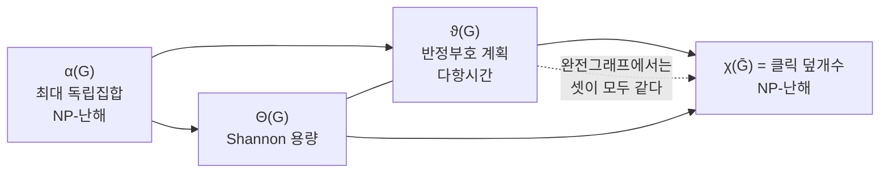

# Lovász 세타 함수

# 개요

그래프의 최대 독립집합 크기 $\alpha(G)$ 와 채색수 $\chi(G)$ 는 둘 다 계산이 NP-난해다. [그래프 색칠](graph-coloring.md) 문서에서 본 $\omega(G)\le\chi(G)$ 같은 부등식은 있지만, 두 값 사이의 간격이 얼마든지 커질 수 있어 쓸모가 제한적이다.

Lovász 가 1979 년에 이 둘 사이에 끼어 있으면서 다항시간에 계산되는 양을 찾았다.

$$
\alpha(G)\ \le\ \vartheta(G)\ \le\ \chi(\bar G)
$$

양 끝은 NP-난해인데 가운데는 [반정부호 계획법](semidefinite-programming.md)으로 임의의 정밀도까지 계산된다. 샌드위치 정리라 불리는 이 결과가 조합 최적화에서 반정부호 완화가 쓰인 첫 사례이며, 최대 절단의 0.878 근사가 나오기 15 년 전이다.

$\vartheta$ 는 애초에 조합 문제를 풀려고 만든 것이 아니었다. Shannon 이 1956 년에 제기한 잡음 채널의 무오류 용량 문제에서 `C_5` 의 답을 아무도 몰랐고, $\vartheta$ 가 그 답이 $\sqrt5$ 임을 증명하는 도구로 나왔다. 정보이론의 한 질문이 조합 최적화의 표준 도구를 낳은 셈이다.

# 직관

## 독립집합을 벡터로 옮긴다

각 정점 `i` 에 단위벡터 `u_i` 를 배정하되, 인접한 두 정점의 벡터는 직교하도록 한다. 그리고 모든 벡터와 각을 이루는 고정된 단위벡터 `c` 를 하나 잡는다.

독립집합 `S` 안의 벡터들은 서로 직교하지 않아도 되지만, 여집합 관계를 뒤집어 보면 `S` 에 대응하는 벡터들이 서로 직교하는 상황을 만들 수 있다. 직교하는 단위벡터 `k` 개에 대해 $\sum\langle c,u_i\rangle^2\le1$ 이므로, 각 $\langle c,u_i\rangle^2$ 가 `1/t` 이상이면 $k\le t$ 다. 이 `t` 의 최소값이 $\vartheta$ 이고 $\alpha(G)\le\vartheta(G)$ 가 따라온다.

핵심은 "정점을 고르거나 말거나" 라는 0–1 결정을 "정점에 벡터를 놓는다" 로 완화한 것이다. 실행가능 영역이 볼록해지고 최적화가 다항시간이 된다.

## 왜 위쪽도 막히는가

$\bar G$ 를 `k` 개의 색으로 칠한다는 것은 `G` 를 `k` 개의 클릭으로 덮는다는 뜻이다. 각 클릭에 벡터 하나씩을 배정하는 방식으로 위 완화의 실행가능해를 만들 수 있고, 그 값이 `k` 다. 따라서 $\vartheta(G)\le\chi(\bar G)$ 다.

두 부등식이 같은 완화에서 각각 아래와 위로 나온다는 점이 이 정리의 구조다. 정수 문제 둘이 하나의 볼록 완화를 사이에 두고 마주 보고 있다.



## 곱에서 무너지지 않는다

Shannon 용량을 다루려면 그래프의 강곱 $G\boxtimes H$ 에서의 행동을 알아야 한다. $\alpha$ 는 곱셈적이지 않다. $\alpha(G\boxtimes G)$ 가 $\alpha(G)^2$ 보다 클 수 있고, `C_5` 에서 실제로 그렇다($\alpha=2$ 인데 $\alpha(C_5\boxtimes C_5)=5$).

$\vartheta$ 는 정확히 곱셈적이다. $\vartheta(G\boxtimes H)=\vartheta(G)\vartheta(H)$ 이며, 벡터 표현의 텐서곱이 그대로 실행가능해가 되기 때문이다. 그래서 $\Theta(G)=\lim\alpha(G^{\boxtimes k})^{1/k}\le\vartheta(G)$ 가 나오고, 극한을 계산하지 않고도 상계를 얻는다.

# 정의

## 직교 표현

`G=(V,E)` 의 직교 표현은 각 정점에 배정된 단위벡터 $u_i\in\mathbb R^d$ 의 모임으로, $ij\notin E$ 일 때 $\langle u_i,u_j\rangle=0$ 인 것이다. 인접하지 않은 정점이 직교한다는 규약을 쓴다(반대 규약을 쓰는 문헌도 있다).

## 세타 함수

$$
\vartheta(G)=\min_{\{u_i\},\,c}\ \max_{i\in V}\frac1{\langle c,u_i\rangle^2}
$$

`\{u_i\}` 는 `G` 의 직교 표현이고 `c` 는 단위벡터다. 모든 정점이 `c` 와 되도록 가까운 방향을 갖도록 표현을 고르는 문제다.

## 반정부호 계획으로서의 정의

동치인 서술이 여럿 있으며, 다음이 계산에 쓰인다.

$$
\vartheta(G)=\max\ \{\,\mathrm{tr}(JX)\ :\ X\succeq0,\ \mathrm{tr}(X)=1,\ X_{ij}=0\ \ \forall ij\in E\,\}
$$

`J` 는 모든 성분이 1 인 행렬이다. `X` 가 랭크 1 인 $xx^{\mathsf T}$ 로 제한되면 독립집합 문제 그 자체가 되고, 랭크 제약을 푼 것이 이 완화다.

쌍대는 고윳값 문제다.

$$
\vartheta(G)=\min\ \{\,\lambda_{\max}(A)\ :\ A=A^{\mathsf T},\ A_{ij}=1\ \text{if}\ i=j\ \text{or}\ ij\notin E\,\}
$$

간선에 해당하는 성분만 자유롭게 고르고 나머지는 1 로 고정한 뒤 최대고윳값을 최소화한다. 강쌍대성이 성립해 두 값이 같다.

## Shannon 용량

잡음 채널의 혼동 그래프 `G` 에서, 서로 혼동되지 않는 길이 `k` 의 부호어를 최대 몇 개 보낼 수 있는가는 $\alpha(G^{\boxtimes k})$ 다. 무오류 용량은

$$
\Theta(G)=\lim_{k\to\infty}\alpha(G^{\boxtimes k})^{1/k}=\sup_k\alpha(G^{\boxtimes k})^{1/k}
$$

Fekete 보조정리로 극한이 존재한다. $\alpha(G)\le\Theta(G)$ 는 자명하다.

# 성질

## 샌드위치 정리

$$
\alpha(G)\le\Theta(G)\le\vartheta(G)\le\chi(\bar G)
$$

가운데 항만 다항시간에(정확히는 임의의 정밀도까지 다항시간에) 계산된다. $P\ne NP$ 라면 양 끝의 값을 $\vartheta$ 가 항상 정확히 맞힐 수는 없다.

주의할 점은 $\vartheta$ 가 무리수일 수 있다는 것이다. 반정부호 계획의 최적해가 유리수가 아닐 수 있고, `C_5` 의 $\sqrt5$ 가 그 예다. 그래서 "다항시간에 계산" 은 원하는 정밀도까지라는 단서가 붙는다.

## 완전그래프에서는 모두 같다

`G` 가 완전그래프(perfect graph)면 $\alpha(G)=\vartheta(G)=\chi(\bar G)$ 다. 곧 세 값이 붕괴하며, 완전그래프의 독립집합과 채색수를 다항시간에 계산하는 유일하게 알려진 방법이 이것이다.

조합적 알고리즘이 아니라 반정부호 계획을 거쳐야만 얻어지는 결과라는 점이 오랫동안 이 분야의 화제였다. 강한 완전그래프 정리(2002)가 완전그래프를 구조적으로 특징지은 뒤에도, 다항시간 채색 알고리즘은 여전히 $\vartheta$ 를 경유한다.

## 곱셈성과 보그래프

$$
\vartheta(G\boxtimes H)=\vartheta(G)\,\vartheta(H),\qquad
\vartheta(G)\,\vartheta(\bar G)\ge n
$$

정점추이적 그래프에서는 둘째 부등식이 등호가 된다. `C_5` 는 자기 보그래프와 동형이므로 $\vartheta(C_5)^2=5$, 곧 $\vartheta(C_5)=\sqrt5$ 다.

$\alpha(C_5\boxtimes C_5)=5$ 인 부호가 실제로 존재하므로 $\Theta(C_5)\ge\sqrt5$ 이고, 샌드위치 정리가 $\Theta(C_5)\le\sqrt5$ 를 주어 값이 확정된다. Shannon 이 1956 년에 던진 질문이 23 년 만에 이렇게 닫혔다.

`C_7` 의 Shannon 용량은 아직 모른다. $\vartheta(C_7)\approx3.3177$ 이 상계로 남아 있고 최선의 하계가 `3.2` 근처다. 홀수 순환이라는 가장 단순한 그래프족에서조차 미해결이다.

## 직접 계산

홀수 순환은 정점추이적이라 쌍대 형식의 자유 성분을 모두 같은 값으로 두어도 최적이 된다. 한 모수짜리 볼록 문제로 줄어들어 고윳값 계산만으로 풀린다.

```python
import numpy as np
from math import cos, pi

def cycle_adj(n):
    A = np.zeros((n, n))
    for i in range(n):
        A[i, (i + 1) % n] = A[(i + 1) % n, i] = 1
    return A

def theta_cycle(n):
    """홀수 순환 C_n 은 정점추이적이라 A = J + s·Adj 한 모수로 최적화가 끝난다.
       theta(G) = min { lambda_max(A) : A_ij = 1 for i=j or ij not in E }."""
    J, Adj = np.ones((n, n)), cycle_adj(n)
    lo, hi = -5.0, 0.0
    for _ in range(200):                         # 볼록 함수의 삼분 탐색
        m1, m2 = lo + (hi - lo) / 3, hi - (hi - lo) / 3
        f = lambda s: np.linalg.eigvalsh(J + s * Adj).max()
        if f(m1) < f(m2): hi = m2
        else: lo = m1
    s = (lo + hi) / 2
    return np.linalg.eigvalsh(J + s * Adj).max()

for n in (5, 7, 9, 11):
    exact = n * cos(pi / n) / (1 + cos(pi / n))
    print(f"C_{n:>2}: alpha = {n // 2} <= theta = {theta_cycle(n):.6f} <= "
          f"chi(complement) = {(n + 1) // 2}   (닫힌 형태 {exact:.6f})")

print(f"\nC_5 의 theta = {theta_cycle(5):.6f},  sqrt(5) = {5 ** 0.5:.6f}")

# C_ 5: alpha = 2 <= theta = 2.236068 <= chi(complement) = 3   (닫힌 형태 2.236068)
# C_ 7: alpha = 3 <= theta = 3.317667 <= chi(complement) = 4   (닫힌 형태 3.317667)
# C_ 9: alpha = 4 <= theta = 4.360090 <= chi(complement) = 5   (닫힌 형태 4.360090)
# C_11: alpha = 5 <= theta = 5.386303 <= chi(complement) = 6   (닫힌 형태 5.386303)
#
# C_5 의 theta = 2.236068,  sqrt(5) = 2.236068
```

수치해가 닫힌 형태 $\vartheta(C_n)=n\cos(\pi/n)/(1+\cos(\pi/n))$ 와 소수점 여섯 자리까지 일치한다. 샌드위치의 양 끝이 $\lfloor n/2\rfloor$ 와 $\lceil n/2\rceil$ 로 딱 1 만큼 벌어져 있고 $\vartheta$ 가 그 사이의 무리수라는 점이, 이 값이 조합적으로는 결코 나올 수 없는 양임을 보여 준다.

`n` 이 커질수록 $\vartheta(C_n)/\alpha(C_n)\to1$ 이라 완화가 점점 촘촘해진다. 반면 무작위 그래프에서는 $\alpha(G)\approx2\log_2n$ 인데 $\vartheta(G)\approx\sqrt n$ 이라 간격이 다항식 규모로 벌어진다. 완화의 품질이 그래프에 크게 의존한다는 뜻이다.

## 한계

$\vartheta$ 는 $\alpha$ 를 $n^{1-\epsilon}$ 배 이내로 근사하지 못한다. 독립집합 문제 자체가 그 정도 비율로 근사하는 것도 NP-난해이므로 당연한 결론이지만, 구체적으로 무작위 그래프가 그 간격을 실현한다는 점이 알려져 있다.

더 정밀한 완화를 얻으려면 SDP 에 유효부등식을 추가하거나($\vartheta'$, $\vartheta^+$) Lasserre 계층을 올린다. 계층을 `r` 단계 올리면 `n^{O(r)}` 크기의 SDP 가 되고, 그럼에도 독립집합 문제에서는 상수 단계로 근사비가 크게 개선되지 않는다는 하계가 알려져 있다. 유일 게임 추측 아래에서는 $\vartheta$ 계열의 완화가 이미 최선이라는 결과들이 있다.

# 활용

## 무오류 부호화

[채널 부호화 정리](channel-coding.md)의 용량은 오류 확률을 0 으로 보내는 극한에서 정의되지만 각 유한 길이에서는 오류가 남는다. 무오류 용량은 오류를 정확히 0 으로 요구하며, 두 양이 전혀 다른 조합적 성격을 가진다.

$\vartheta$ 가 무오류 용량의 유일하게 쓸 만한 일반 상계다. Shannon 자신이 제시한 분수 클릭 덮개수 상계보다 언제나 좋거나 같고, `C_5` 를 비롯한 여러 그래프에서 정확하다. 양자 정보이론에서도 얽힘을 허용한 무오류 용량의 상계로 같은 양이 쓰인다.

## 완전그래프와 조합 최적화

완전그래프에서 독립집합, 클릭, 채색, 클릭 덮개가 모두 다항시간에 풀린다. 구간 그래프, 현 그래프, 이분그래프의 여러 변형이 완전그래프이므로, 스케줄링과 자원 배정 문제의 상당수가 이 틀에 들어온다.

이 결과는 반정부호 계획이라는 연속 최적화가 조합 문제의 정확한 답을 주는 드문 사례이기도 하다. 보통 완화는 근사만 주는데, 완전그래프에서는 완화가 타이트하다.

## 부호와 설계의 상계

$\vartheta$ 를 연관 스킴 위의 부호에 적용하면 Delsarte 의 선형계획 상계가 나온다. 오류정정부호의 크기에 대한 고전적 상계들이 이 틀에서 통일되고, 반정부호 계획으로 강화하면 더 좋은 상계가 나온다.

구 채우기 밀도의 상계를 주는 Cohn–Elkies 선형계획법도 같은 사고방식이다. 8 차원과 24 차원에서 이 상계가 정확히 달성된다는 Viazovska 의 증명이 2016 년에 나왔고, $\vartheta$ 계열의 방법이 격자와 부호의 극단 문제에서 최적일 수 있음을 보여 준 사건이다.

## 양자 정보와의 연결

$\vartheta$ 의 반정부호 형식은 양자 상태의 집합에서 자연스럽게 나온다. 그래프의 정점을 측정 결과로 보고 비호환 결과를 간선으로 연결하면, $\vartheta$ 가 문맥성 부등식의 최대 양자 위반값과 정확히 일치한다.

Bell 부등식의 고전 한계가 $\alpha$, 양자 한계가 $\vartheta$, 상대론적 인과성만 요구한 한계가 분수 채색수에 대응한다. 순수 조합론에서 만들어진 세 양이 물리의 세 이론 층위와 정확히 짝을 이룬다.

# 연관 문서

## 선수지식

- [반정부호 계획법과 최대 절단](semidefinite-programming.md)
- [그래프 색칠](graph-coloring.md)

## 더 알아보기

- [완전그래프와 강한 완전그래프 정리](perfect-graphs.md)

#optimization #graph_theory #information_theory
