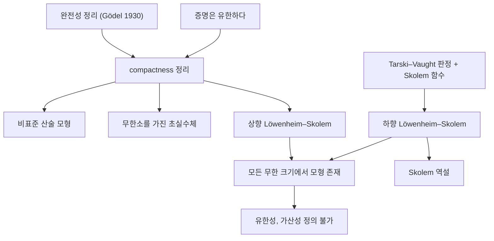

# Compactness 정리와 Löwenheim–Skolem 정리

# 개요

[1차 논리](first-order-logic.md)의 표현력을 위에서 누르는 두 정리가 있다. compactness 정리는 "유한하게 모순이 없으면 모형이 있다"고 말하고, Löwenheim–Skolem 정리는 "무한 모형이 있으면 온갖 크기의 모형이 있다"고 말한다.

두 정리는 같은 뿌리에서 나온다. 1차 논리의 증명은 유한한 대상이고, 언어의 기호 수도 통제되어 있다. 그래서 이론이 붙잡을 수 있는 정보에는 한계가 생긴다. 그 결과가 비표준 산술 모형, 무한소를 가진 실수체, 그리고 [ZFC 공리계](zfc-axioms.md)의 가산 모형이다.

이 정리들은 실패가 아니라 1차 논리의 정체성이다. Lindström 정리에 따르면 compactness 와 하향 Löwenheim–Skolem 성질을 모두 가지는 가장 표현력 있는 논리가 정확히 1차 논리다. 표현력을 더 원하면 두 정리 중 하나를 반드시 포기해야 한다.

# 직관

1차 논리의 증명은 유한히 많은 공리만 쓴다. 따라서 이론 전체가 모순이라면 그 모순은 이미 유한한 부분에서 드러났어야 한다. 대우를 취하면 "유한 부분마다 모형이 있으면 전체에도 모형이 있다"가 된다. 이것이 compactness 다.

이 단순한 관찰이 강력한 이유는 무한히 많은 조건을 한꺼번에 요구할 수 있기 때문이다. 새 상수 `c` 를 하나 들여와 "`c` 는 0보다 크다", "`c` 는 1보다 크다", ... 를 모두 요구하자. 유한 부분만 보면 `c` 를 충분히 큰 자연수로 해석하면 되므로 늘 만족 가능하다. 그러므로 전체도 모형을 가지며, 그 모형에는 모든 자연수보다 큰 원소가 있다. 자연수 전체를 참으로 만드는 문장들을 다 넣고도 이 일이 가능하다는 것이 요점이다.

Löwenheim–Skolem 은 같은 한계의 크기 판본이다. 1차 논리식은 개별 원소를 유한 개씩만 언급할 수 있으므로 이론은 "몇 개나 있는가"를 무한 영역에서 구별하지 못한다. 아래로는 언어 크기만큼 작은 기본 부분구조로 줄일 수 있고, 위로는 얼마든지 키울 수 있다.



# 정의

## 준비

언어 `L` 의 문장 집합 `T` 를 이론이라 한다. 구조 `M` 이 `T` 의 모든 문장을 만족하면 `M` 을 `T` 의 모형이라 하고, 모형이 존재하면 `T` 를 만족 가능하다고 한다. 구조의 크기는 논의 영역의 [기수](cardinality.md)로 잰다.

**정의(기본 부분구조).** `N` 이 `M` 의 부분구조이고, 모든 논리식과 `N` 의 원소들에 대한 모든 대입에서 다음이 성립하면 `N` 을 `M` 의 기본 부분구조(elementary substructure)라 하고 `N ≼ M` 으로 쓴다.

$$
N \models \varphi(\bar{a}) \iff M \models \varphi(\bar{a})
$$

단순한 부분구조보다 훨씬 강한 조건이다. 부분구조는 원자식만 보존하지만 기본 부분구조는 모든 양화를 포함해 보존한다.

## compactness 정리

**정리.** 1차 이론 `T` 의 모든 유한 부분집합이 만족 가능하면 `T` 도 만족 가능하다. 동치로, `T` 가 문장 `φ` 를 논리적으로 함의하면 `T` 의 어떤 유한 부분집합이 이미 `φ` 를 함의한다.

*완전성 정리로부터의 유도.* Gödel 의 완전성 정리는 함의와 도출 가능성이 일치한다고 말한다.

$$
T \models \varphi \iff T \vdash \varphi
$$

`T` 가 만족 가능하지 않다고 하자. 그러면 `T` 는 모순을 함의하므로 `T ⊢ ⊥` 다. 도출은 유한 길이의 문자열이므로 `T` 의 유한히 많은 문장만 사용한다. 그 유한 부분집합 `T_0` 에 대해 `T_0 ⊢ ⊥` 이고, 건전성에 의해 `T_0` 는 만족 가능하지 않다. 대우가 주장이다.

완전성을 거치지 않는 증명도 있다. 초필터로 구조들의 곱을 나누는 ultraproduct 구성이 대표적이며, [Boolean algebra](boolean-algebras.md) 의 언어로 정리를 순수 의미론적으로 증명한다. 이름이 말해 주듯 이 정리는 Stone 공간의 [compactness](compactness.md)와 같은 사실이기도 하다.

## Löwenheim–Skolem 정리

**정리(하향).** `M` 이 언어 `L` 의 무한 구조이고 `A ⊆ M` 이라 하자. 그러면 `A` 를 포함하는 기본 부분구조 `N ≼ M` 이 존재하며, 그 크기는 다음을 넘지 않는다.

$$
|N| \le \max\big(|A|,\ |L|,\ \aleph_0\big)
$$

**정리(상향).** `M` 이 무한 구조이고 기수 `κ` 가 `|M|` 과 `|L|` 이상이면, `M` 을 기본 부분구조로 가지는 크기 `κ` 의 구조가 존재한다.

**따름정리(통합).** 무한 모형을 가지는 이론은 `|L|` 과 가산무한 이상의 모든 기수에서 모형을 가진다.

# 성질

## 하향 정리의 증명

*증명 스케치.* Tarski–Vaught 판정이 열쇠다. 부분구조 `N` 이 기본 부분구조일 필요충분조건은, `N` 의 원소들을 매개변수로 하는 논리식 `∃x φ(x, ā)` 가 `M` 에서 참일 때마다 그것을 만족하는 증거가 `N` 안에 이미 있다는 것이다.

그러므로 각 논리식마다 증거를 골라 주는 함수(Skolem 함수)를 정하고, `A` 에서 출발해 이 함수들로 닫는다. 논리식은 언어 크기만큼, 각 단계는 유한 튜플에만 적용되므로 폐포의 크기가 위의 상한을 넘지 않는다. 증거를 "고른다"는 부분에서 [선택공리](axiom-of-choice.md)가 쓰인다.

## 상향 정리의 증명

*증명 스케치.* 크기 `κ` 의 새 상수 기호들을 언어에 추가하고, 서로 다른 두 상수가 다르다는 문장을 모두 이론에 넣는다. 임의의 유한 부분집합은 유한히 많은 상수만 언급하므로, 무한 구조 `M` 에서 서로 다른 원소들로 해석하면 만족된다. compactness 로 전체가 모형을 가지고, 그 모형은 적어도 `κ` 개의 원소를 가진다. 크기를 정확히 `κ` 로 맞추려면 하향 정리를 한 번 더 쓴다.

## 비표준 모형

**비표준 산술.** `Th(N)` 을 표준 자연수 구조에서 참인 모든 문장의 집합이라 하자. 새 상수 `c` 를 더하고 각 자연수 `n` 에 대해 `c` 가 `n` 보다 크다는 문장을 넣는다. 유한 부분집합은 `c` 를 큰 자연수로 해석해 만족되므로 compactness 에 의해 전체 이론의 모형 `M` 이 존재한다. `M` 은 `N` 과 정확히 같은 1차 문장들을 만족하지만 무한히 큰 원소를 가진다.

이 모형의 순서형은 표준 부분 뒤에 정수 사슬들이 조밀하게 늘어선 모양이다.

$$
\mathbb{N} \;+\; \mathbb{Z} \times \mathbb{Q}
$$

가산 비표준 모형에 대해서는 Tennenbaum 정리가 더 강한 말을 한다. 덧셈과 곱셈이 계산 가능한 가산 비표준 모형은 존재하지 않는다. 비표준 모형은 존재하지만 결코 손에 잡히게 구성되지는 않는다는 뜻이다.

**비표준 실수.** 같은 방법을 순서체 `R` 에 적용하면 모든 실수보다 큰 원소 `c` 를 가진 초실수체를 얻는다. 그 역수는 0 이 아니면서 모든 양의 실수보다 작은 무한소다. Robinson 의 비표준 해석학은 이 구조 위에서 극한과 미분을 무한소로 직접 다룬다[^1]. 이때 "Archimedes 성질"은 1차 문장이 아니므로 이전되지 않는다는 점이 핵심이다.

## Skolem 역설과 그 해소

**역설.** ZFC 가 무모순이면 ZFC 는 모형을 가지고(완전성 정리), 하향 Löwenheim–Skolem 에 의해 가산 모형 `M` 을 가진다. 그런데 ZFC 는 "비가산 집합이 존재한다"를 증명한다. 가산 모형 안에 비가산 집합이 있다는 말인가.

**해소.** 비가산성은 절대적 성질이 아니라 모형 상대적 성질이다. `M` 이 `x` 를 비가산이라고 판정한다는 것은 "`x` 와 `ω` 사이의 전단사가 `M` 안에 없다"는 뜻일 뿐이다. 바깥에서 보면 `x` 의 원소들은 가산 개이고 전단사도 실재하지만, 그 전단사가 `M` 의 원소가 아니다. `M` 은 자신에게 없는 함수를 볼 수 없다[^2].

따라서 역설은 두 가지를 가르쳐 준다. 첫째, [가산성](cardinality.md) 같은 개념은 집합론적 우주를 고정해야만 의미가 확정된다. 둘째, 1차 논리로 쓴 집합론은 자신의 의도한 해석을 유일하게 고정하지 못한다. 같은 한계가 [Gödel 불완전성 정리](godel-incompleteness.md)와는 다른 방향에서 형식체계의 힘을 제한한다.

## 1차 논리로 정의할 수 없는 것들

**유한성.** 모든 유한 구조에서만 참인 1차 문장 집합은 없다. 있다고 하면 그 이론에 "원소가 `n` 개 이상"이라는 문장들을 모두 더한 이론의 유한 부분집합이 모두 만족 가능하므로, compactness 에 의해 무한 모형이 생겨 모순이다.

**가산성.** "논의 영역이 가산이다"를 표현하는 1차 이론도 없다. 상향 정리가 즉시 비가산 모형을 만들어 내기 때문이다. 같은 이유로 실수체의 완비성, 군의 torsion 성, 그래프의 연결성도 1차로 잡히지 않는다.

**표준 모형의 유일성.** Peano 산술은 비표준 모형을 가지고, 순서체 공리계는 초실수체를 모형으로 가진다. 즉 무한 구조를 동형 차이까지 고정하는 일은 1차 논리의 능력 밖이다. 가능한 최선은 한 기수에서의 범주성이며, Morley 정리는 비가산 기수 하나에서 범주적이면 모든 비가산 기수에서 범주적임을 말한다.

2차 논리는 이 대상들을 정의할 수 있지만, 그 대가로 완전성과 compactness 를 모두 잃는다. Lindström 정리가 이 교환 관계를 정리로 만든다.

## 계산 예

compactness 의 전제인 "유한 부분집합의 만족 가능성"은 실제로 확인할 수 있는 조건이다. 비표준 모형을 만드는 이론에 대해 각 유한 조각의 증거를 직접 찾아본다.

```python
def finite_fragment(k):
    """이론 T = Th(N) + {c > 0, c > 1, ..., } 의 유한 조각: c 에 대한 조건만 남긴다."""
    return [n for n in range(k)]          # "c > n" 들

def witness(fragment):
    """표준 자연수 구조 안에서 조각을 만족시키는 c 의 해석을 찾는다."""
    return max(fragment) + 1 if fragment else 0

for k in [0, 1, 5, 100]:
    frag = finite_fragment(k)
    c = witness(frag)
    assert all(c > n for n in frag)
    print(f"조건 {k}개 -> c = {c} 로 해석하면 만족")

# 전체 이론은 표준 모형에서 만족될 수 없다: 어떤 자연수도 모든 n 보다 크지 않다.
def satisfied_in_standard_model(c, bound):
    return all(c > n for n in range(bound))

print("표준 모형에서 c = 10**9 가 모든 조건을 만족하는가:",
      satisfied_in_standard_model(10**9, 10**9 + 5))
```

각 유한 조각은 표준 모형 안에서 만족되지만 전체는 그렇지 않다. compactness 는 이 간극을 메우는 새 모형의 존재를 보장하며, 그 모형은 표준 모형과 1차 문장 수준에서 구별되지 않는다.

# 활용

## 모형론의 출발점

compactness 와 Löwenheim–Skolem 은 모형론이 다루는 대상의 지형을 결정한다. 이론이 무한 모형을 가지면 모형이 모든 크기에 존재하므로, 의미 있는 질문은 "모형이 있는가"가 아니라 "각 기수에서 모형이 몇 개인가"가 된다. 이 계수 문제가 안정성 이론과 분류 이론으로 이어진다[^3].

## 대수에서의 이전 원리

compactness 는 대수 문제를 유한 사례로 환원하는 도구로 자주 쓰인다. 예를 들어 "표수 0 의 대수적 닫힌체에서 성립하는 1차 문장은 충분히 큰 소수 `p` 마다 표수 `p` 의 대수적 닫힌체에서도 성립한다"는 Lefschetz 이전 원리는 compactness 의 직접적 결과다. 유한 그래프의 색칠 문제를 무한 그래프로 확장하는 de Bruijn–Erdős 정리도 같은 구조의 논증이다.

## 비표준 해석학

무한소를 원소로 가지는 체를 정당하게 다룰 수 있게 되면서, 극한 논증을 유한적 조작으로 바꾸어 쓰는 방식이 가능해졌다. 이전 원리는 1차로 쓸 수 있는 명제만 오간다는 제한을 명확히 해 주므로, 어떤 논증이 안전한지 판별하는 기준이 된다.

## 기초론에서의 함의

Skolem 역설은 형식 집합론이 "진짜 집합 우주"를 지목하지 못한다는 점을 보여 준다. 이 사실은 [연속체 가설](continuum-hypothesis.md)의 독립성과 결합해, 집합론적 진리를 공리로 고정하려는 시도에 구조적 한계가 있음을 시사한다. 동시에 가산 모형의 존재는 forcing 을 통해 독립성을 증명하는 기술적 출발점이기도 하다. 한계를 보여 주는 정리가 도구가 되는 전형적인 예다.

[^1]: Stanford Encyclopedia of Philosophy, "First-order Model Theory", https://plato.stanford.edu/entries/modeltheory-fo/
[^2]: Stanford Encyclopedia of Philosophy, "Skolem's Paradox", https://plato.stanford.edu/entries/paradox-skolem/
[^3]: Stanford Encyclopedia of Philosophy, "Model Theory", https://plato.stanford.edu/entries/model-theory/

# 연관 문서

## 선수지식

- [1차 논리](first-order-logic.md)
- [가산성과 비가산성](cardinality.md)

## 더 알아보기

아직 연결한 문서가 없다.

#logic #theorem
