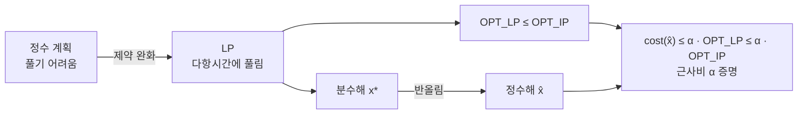

# LP 완화와 반올림

# 개요

[근사 알고리즘](approximation-algorithms.md)을 설계할 때 가장 곤란한 일은 최적해를 모르면서 근사비를 증명하는 것이다. 비교 대상이 없으면 "최적의 두 배 이내" 같은 주장을 할 수 없다.

LP 완화가 그 비교 대상을 만들어 준다. 정수 제약 $x_i \in \{0,1\}$ 을 $0 \le x_i \le 1$ 로 풀면 문제가 [선형계획법](linear-programming.md)이 되어 다항시간에 풀린다. 완화는 제약을 없앤 것이므로 그 최적값이 원래 최적값의 하한이고, 이 하한과 비교하면 근사비를 증명할 수 있다.

남은 일은 분수해를 정수해로 바꾸는 것, 곧 반올림이다. 임계값으로 자르거나 확률로 뽑거나 한 변수씩 고정하며 다시 푸는 여러 방법이 있다. 어떻게 반올림하든 넘을 수 없는 벽이 하나 있는데, 완화의 최적값과 진짜 최적값의 비인 적분성 간극이다. 이 간극이 이 기법 전체의 한계를 정한다.

# 직관

## 완화는 하한을 파는 가게다

최소화 문제에서 제약을 풀면 가능해가 늘어나므로 최적값이 내려간다.

$$
\mathrm{OPT}_{LP}\ \le\ \mathrm{OPT}_{IP}
$$

이 부등식이 전부다. 만든 정수해의 비용이 $\mathrm{OPT}\_{LP}$ 의 $\alpha$ 배 이하임을 보이면, 그것은 자동으로 $\mathrm{OPT}\_{IP}$ 의 $\alpha$ 배 이하이다. 최적 정수해가 무엇인지는 전혀 몰라도 된다.

## 분수해는 조언이다

LP 최적해 $x^*$ 의 값 $x^\ast\_i = 0.7$ 을 "이 변수는 아마 1 이어야 한다" 는 조언으로 읽는다. LP 는 제약 전체를 고려해 부담을 나눈 결과이므로, 이 값들이 무작위 추측보다 훨씬 좋은 정보다.

반올림은 이 조언을 어떻게 읽느냐의 문제다. $x^\ast\_i \ge 1/2$ 면 1 로 올리는 결정적 방법도 있고, 확률 $x^*_i$ 로 1 을 주는 무작위 방법도 있다. 전자는 제약이 만족되는 것을 논증으로 보장하고, 후자는 기댓값으로 보장한 뒤 반복으로 확률을 올린다.

## 간극이 벽이다

LP 를 하한으로 쓰는 논증은 $\mathrm{OPT}_{LP}$ 보다 정밀한 보장을 결코 줄 수 없다. 어떤 사례에서 $\mathrm{OPT}\_{IP}/\mathrm{OPT}\_{LP} = 2$ 라면, 그 사례에서 LP 와 비교하는 방식으로는 2 보다 좋은 근사비를 증명할 수 없다. 알고리즘이 실제로 더 좋을 수는 있어도 이 증명 방식으로는 보이지 못한다.

그래서 새 근사비를 얻으려면 반올림을 개선하기 전에 완화를 개선해야 하는 경우가 많다. 제약을 더 넣어 다면체를 좁히면 간극이 줄어든다.

# 정의

## 완화와 적분성 간극

정수 계획 $\min\{c^{\mathsf T}x : Ax \ge b,\ x \in \{0,1\}^n\}$ 의 LP 완화는 마지막 조건을 $x \in [0,1]^n$ 으로 바꾼 것이다.

적분성 간극은 문제의 모든 사례에 대한 최악의 비다.

$$
\mathrm{gap}=\sup_{I}\frac{\mathrm{OPT}_{IP}(I)}{\mathrm{OPT}_{LP}(I)}
$$

최대화 문제에서는 분자와 분모를 뒤집는다. 간극은 완화의 성질이지 알고리즘의 성질이 아니다. 같은 문제에 완화가 여럿 있으면 각각 다른 간극을 가진다.

## 반올림 기법

| 기법 | 방법 | 전형적 용도 |
|---|---|---|
| 임계값 반올림 | $x^*_i \ge \tau$ 면 1, 아니면 0 | 정점 덮개, 반정수해가 나오는 문제 |
| 무작위 반올림 | 확률 $x^*_i$ 로 독립적으로 1 | 집합 덮개, 제약이 많은 문제 |
| 규모 조정 무작위 반올림 | 확률 $\min(1, t\,x^*_i)$ 로 $t$ 배 부풀려 뽑기 | 실패 확률을 낮춰야 할 때 |
| 반복 반올림 | 1 에 가까운 변수를 고정하고 LP 를 다시 풀기 | 신장트리, 일반화 배정 |
| 필터링 | 임계값으로 후보를 걸러낸 뒤 배정 | 설비 입지, 군집 |

## 정점 덮개의 완화

간선 집합 $E$ 의 모든 간선에 적어도 한 끝점을 고르는 문제다.

$$
\min\ \sum_{v}w_vx_v\quad\text{s.t.}\quad x_u+x_v\ge1\ \ \forall(u,v)\in E,\qquad 0\le x_v\le1
$$

## 집합 덮개의 완화

원소 집합 $U$ 를 덮는 부분집합족 $\mathcal S$ 에서 비용이 최소인 덮개를 고르는 문제다.

$$
\min\ \sum_{S\in\mathcal S}c_Sx_S\quad\text{s.t.}\quad \sum_{S\ni e}x_S\ge1\ \ \forall e\in U,\qquad 0\le x_S\le1
$$

# 성질

## 정점 덮개: 임계값 반올림이 2-근사

LP 최적해 $x^*$ 에서 $x^\ast\_v \ge 1/2$ 인 정점을 모두 고른다.

실현가능성은 바로 나온다. 각 간선 $(u,v)$ 에 대해 $x^\ast\_u + x^\ast\_v \ge 1$ 이므로 둘 중 적어도 하나가 $1/2$ 이상이고, 그 정점이 선택된다.

비용은 두 배 이내다. 선택된 각 정점에서 $1 \le 2x^*_v$ 이므로

$$
\sum_{v:\,x^*_v\ge1/2}w_v\ \le\ 2\sum_vw_vx^*_v\ =\ 2\,\mathrm{OPT}_{LP}\ \le\ 2\,\mathrm{OPT}_{IP}
$$

가중치가 있어도 그대로 통한다. 매칭을 쓰는 조합적 2-근사는 가중치가 붙으면 곧바로 깨지므로, 이 부분이 LP 기법의 실질적 이득이다.

## 정점 덮개의 간극은 정확히 2 다

완전그래프 $K_n$ 을 보자. 모든 $x_v = 1/2$ 가 가능해이므로 $\mathrm{OPT}_{LP} \le n/2$ 이고, 실제로 등호다. 반면 정수해는 $n-1$ 개 미만을 고를 수 없다. 두 정점을 남기면 그 사이 간선이 덮이지 않기 때문이다.

$$
\frac{\mathrm{OPT}_{IP}}{\mathrm{OPT}_{LP}}=\frac{n-1}{n/2}=2-\frac2n\ \xrightarrow{\ n\to\infty\ }\ 2
$$

따라서 이 완화로는 $2-\epsilon$ 근사를 증명할 수 없다. 정점 덮개의 2-근사가 수십 년째 개선되지 않은 것과, 유일 게임 추측 아래에서 $2-\epsilon$ 이 불가능하다는 결과가 이 간극과 나란히 놓인다.

## 반정수성

정점 덮개 LP 의 최적해는 항상 모든 좌표가 $0$ 과 $1/2$ 과 $1$ 중 하나인 것을 하나 가진다. 임의의 최적해에서 $1/2$ 보다 작은 좌표와 큰 좌표를 각각 $\epsilon$ 만큼 움직여 목적값을 나쁘게 하지 않으면서 극점으로 밀 수 있기 때문이다.

이 성질 때문에 임계값 $1/2$ 가 자연스럽고, 반올림이 무손실에 가깝다. 일반적인 LP 의 최적해는 이렇게 친절하지 않다.

## 집합 덮개: 무작위 반올림이 $O(\log n)$ 근사

각 집합 $S$ 를 확률 $x^\ast\_S$ 로 독립적으로 고른다. 비용의 기댓값은 정확히 $\mathrm{OPT}\_{LP}$ 다.

원소 $e$ 가 덮이지 않을 확률은 $e$ 를 포함하는 집합들에 대해

$$
\prod_{S\ni e}(1-x^*_S)\ \le\ \exp\Big(-\sum_{S\ni e}x^*_S\Big)\ \le\ e^{-1}
$$

이다. 제약이 $\sum_{S\ni e}x^\ast\_S \ge 1$ 이기 때문이다. 한 번으로는 실패가 잦으므로 $t = \Theta(\log n)$ 번 독립 반복해 합집합을 취하면 실패 확률이 $n^{-\Theta(1)}$ 로 떨어지고, 비용의 기댓값은 $t \cdot \mathrm{OPT}\_{LP}$ 가 된다.

확률 $\min(1, t\,x^*_S)$ 로 한 번에 뽑는 것도 같은 효과다. 비용이 $t$ 배로 늘고 실패 확률이 $e^{-t}$ 로 줄어드는 교환이 이 기법의 뼈대다.

## 간극이 1 인 경우

제약행렬이 완전 단모듈러면 LP 의 모든 극점이 정수점이므로 간극이 1 이고 반올림이 필요하지 않다. 이분그래프의 정점 덮개와 매칭, [네트워크 흐름](network-flow.md)이 이 범주다. König 정리와 최대유량 최소절단 정리는 이 사실의 조합적 표현이다.

간극이 1 이면 LP 자체가 문제를 정확히 푼다. 그래서 "LP 완화" 가 근사 기법이 되는 것은 간극이 1 을 넘을 때뿐이다.

## 쌍대와의 관계

LP 쌍대해는 하한의 증명서다. 정점 덮개 LP 의 쌍대는 분수 매칭이고, 약쌍대성이 "어떤 분수 매칭의 크기도 어떤 덮개의 비용 이하" 를 말한다. 이 증명서를 명시적으로 키워 가며 원시해를 함께 만드는 것이 원시-쌍대 기법이며, LP 를 실제로 풀지 않고도 같은 근사비를 얻는다. 대신 계산이 훨씬 싸고 조합적이다.

[Lagrange 쌍대성](lagrange-duality.md)의 상보 여유 조건이 이때 설계 지침을 준다. 원시해에서 쓰인 변수에 대응하는 쌍대 제약을 빠듯하게 유지하면 근사비가 자동으로 따라온다.

## 간극을 줄이려면 완화를 고쳐야 한다

분수해가 정수해에서 너무 멀면 제약을 추가한다. 절단 평면, 홀수 집합 제약, 리프팅 계층 같은 기법이 다면체를 좁혀 간극을 줄인다. 선형 제약으로 부족하면 [반정부호 제약](semidefinite-programming.md)까지 허용하는데, 최대 절단의 0.878 근사가 그 대표적 결과다. 벡터를 무작위 초평면으로 자르는 반올림이 선형 완화로는 얻을 수 없는 근사비를 준다.

# 활용

## 표준 설계 절차

정수 계획으로 쓰고, 완화를 풀고, 반올림하고, 두 가지를 증명한다. 반올림된 해가 실현가능하다는 것과 비용이 $\mathrm{OPT}_{LP}$ 의 몇 배 이내라는 것이다. 이 절차가 근사 알고리즘 설계의 기본 골격이며, 새 문제를 만났을 때 가장 먼저 시도할 대상이다.

간극의 하한을 나쁜 사례로 먼저 찾아보는 것도 같은 절차의 일부다. 간극이 $\alpha$ 라면 반올림을 아무리 잘해도 $\alpha$ 보다 좋아질 수 없으므로, 목표를 헛되게 높이 잡는 일을 막는다.

## 실무에서의 쓰임

인력 배치, 차량 경로, 시설 배치, 광고 배분 같은 문제는 자연스럽게 정수 계획으로 쓰인다. 완화를 풀면 좋은 하한과 좋은 출발점을 동시에 얻으므로, 분기한정법의 가지치기 기준으로도 쓰이고 휴리스틱의 초기해로도 쓰인다.

실제 사례에서는 최악의 간극이 나타나지 않는 경우가 많다. 근사비는 최악의 보장이고, 실무에서는 완화해와 얻은 해의 비를 직접 계산해 그 사례에서의 품질 증명서로 쓴다.

## 분수해가 이미 답인 경우

문제에 따라 분수해 자체가 의미 있다. 자원을 실제로 나눌 수 있으면 반올림이 불필요하고, 확률적 배정으로 해석할 수 있으면 분수해가 곧 무작위 전략이다. 정수해를 요구하는 것이 문제의 본질인지 모형화의 선택인지를 먼저 확인하는 편이 좋다.

# 연관 문서

## 선수지식

- [근사 알고리즘](approximation-algorithms.md)
- [선형계획법](linear-programming.md)

## 더 알아보기

- [반정부호 계획법과 최대 절단](semidefinite-programming.md)

#algorithms #optimization #complexity
