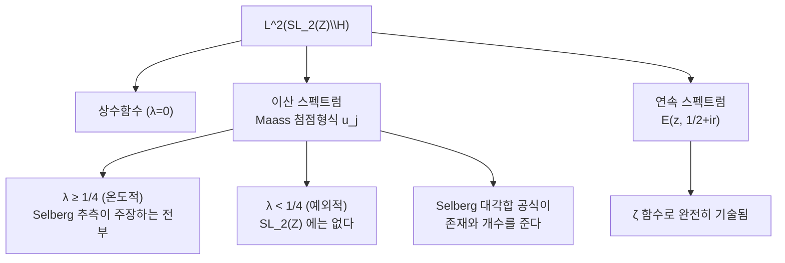

# Maass 형식과 Laplace 스펙트럼

# 개요

[Eisenstein 급수](eisenstein-series.md) 문서에서 `L^2(\mathrm{SL}_2(\mathbb Z)\backslash\mathbb H)` 가 두 조각으로 갈라지는 것을 보았다. 연속 스펙트럼은 실해석적 Eisenstein 급수 `E(z,\tfrac12+ir)` 가 전부 만들어 내고, `\zeta` 함수로 완전히 기술된다. 남는 것이 **이산 스펙트럼**이고, 그것을 이루는 함수가 **Maass 형식**이다.

$$
L^2(\mathrm{SL}_2(\mathbb Z)\backslash\mathbb H)=\mathbb C\oplus\underbrace{\bigoplus_j\mathbb C\,u_j}_{\text{Maass 첨점형식}}\oplus\underbrace{\int_{(1/2)}E(z,s)\,ds}_{\text{Eisenstein}}
$$

Maass 형식은 [모듈러 형식](modular-forms.md)과 나란한 자리에 있으면서 성격이 정반대다. 정칙 모듈러 형식은 `\mathbb H` 위의 정칙함수이고 `q` 전개가 있어 손에 잡힌다. Maass 형식은 정칙이 아니고, 대신 쌍곡 Laplace 작용소의 고유함수다.

$$
\Delta=-y^2\Big(\frac{\partial^2}{\partial x^2}+\frac{\partial^2}{\partial y^2}\Big),\qquad
\Delta u=\lambda u,\qquad \lambda=\tfrac14+r^2
$$

두 세계를 가르는 것이 딱 하나다. **정칙 첨점형식은 명시적으로 구성되고, Maass 첨점형식은 하나도 명시적으로 알려져 있지 않다.** `\Delta` 와 무게 `12` 를 알면 `\Delta(z)=q\prod(1-q^n)^{24}` 를 쓸 수 있지만, `\mathrm{SL}_2(\mathbb Z)` 의 첫 Maass 고윳값 `r_1=9.533695\dots` 는 오직 수치 계산으로만 얻어진다. 유리수인지, 초월수인지조차 모른다.

그런데도 이것들이 존재한다는 것은 안다. [Selberg 대각합 공식](selberg-trace-formula.md)이 개별 고윳값을 하나도 주지 않으면서 그 개수를 세어 주기 때문이다. 존재는 알고 정체는 모르는 대상이고, `L` 함수와 Langlands 강령에서 정칙 형식과 정확히 같은 자격으로 등장한다.

# 직관

## 왜 정칙성을 버리는가

`\mathrm{SL}_2(\mathbb R)` 의 작용에서 보면 이유가 분명해진다. 자기동형 형식은 `L^2(\Gamma\backslash\mathrm{SL}_2(\mathbb R))` 를 `\mathrm{SL}_2(\mathbb R)` 의 기약 표현으로 분해할 때 나오는 조각들이다. 그런데 `\mathrm{SL}_2(\mathbb R)` 의 유니터리 쌍대에는 서로 다른 계열이 있다.

| 표현 계열 | 대응하는 자기동형 형식 |
|---|---|
| 이산계열 `D_k` | 무게 `k` 의 정칙 첨점형식 |
| 주계열 `\pi_{ir}` | Maass 첨점형식 (`\lambda=\tfrac14+r^2`) |
| 여계열 | `\lambda<\tfrac14` 인 예외 형식 |
| 자명 표현 | 상수함수 |

정칙 형식만 보는 것은 **이산계열만 보는 것**이다. 주계열은 무게 0 자리에 최저 벡터가 있고, 그 벡터가 `\mathbb H` 위의 함수로 내려오면 정칙성 대신 Laplace 고유성만 남는다. 곧 Maass 형식은 빠뜨릴 수 없는 절반이고, 무게 0 이라는 조건 때문에 정칙성을 요구할 수가 없다.

## `1/4` 라는 문턱

고윳값을 `\lambda=s(1-s)` 로 쓰면 `s=\tfrac12+ir` 이고 `\lambda=\tfrac14+r^2` 이다. 두 경우가 갈린다.

- `\lambda\ge\tfrac14`: `r` 이 실수. 표현이 주계열(**온도적**)이다.
- `\lambda<\tfrac14`: `r` 이 순허수. 표현이 여계열(**예외적**)이다.

`\tfrac14` 는 쌍곡평면 `\mathbb H` 자체의 Laplace 스펙트럼의 바닥이다. `\Gamma\backslash\mathbb H` 의 고윳값이 그 아래로 내려간다는 것은 곡면이 "너무 좁은" 곳을 갖는다는 뜻이고, 산술적으로는 Ramanujan 추측이 깨진다는 뜻이다.

> **Selberg 의 `1/4` 추측.** 합동 부분군 `\Gamma_0(N)` 에 대해 모든 Maass 첨점형식의 고윳값이 `\lambda\ge\tfrac14` 다.

정칙 형식 쪽에서 Deligne 이 증명한 Ramanujan–Petersson 추측 `|a_p|\le2p^{(k-1)/2}` 의 **아르키메데스 자리 판본**이다. 유한 자리의 Satake 매개변수가 단위원 위에 있어야 한다는 조건이, 무한 자리에서는 `r` 이 실수여야 한다는 조건으로 나타난다. 유한 자리 쪽은 Weil 추측으로 해결되었지만 무한 자리 쪽은 열려 있다. 현재까지의 최선은 `\lambda\ge\tfrac14-(\tfrac7{64})^2` (Kim–Sarnak) 이다.



## `\zeta` 영점과의 닮음

Maass 형식의 `L` 함수를 쓰면 정칙 형식과 같은 모양이 나오고, 첫 고윳값들의 목록

$$
r_1=9.5336952\dots,\quad r_2=12.1730083\dots,\quad r_3=13.7797514\dots
$$

는 명시적 공식이 없이 수치적으로만 얻어진다. 이것이 `\zeta` 함수의 영점 허수부 `14.1347\dots,\ 21.0220\dots` 와 같은 성격의 목록이다. 둘 다 존재와 분포는 잘 알려져 있고, 개별 값은 계산으로만 안다. Selberg 가 대각합 공식을 `\zeta` 의 명시공식과 나란히 세운 것도 이 유비에서 나왔다.

# 정의

## Maass 형식

`\Gamma\subset\mathrm{SL}_2(\mathbb Z)` 를 유한 지표 부분군이라 하자. 함수 `u:\mathbb H\to\mathbb C` 가 다음 셋을 만족하면 **Maass 형식**이다.

1. `\Gamma` 불변: 모든 `\gamma\in\Gamma` 에 대해 `u(\gamma z)=u(z)`.
2. Laplace 고유함수: `\Delta u=\lambda u`, `\Delta=-y^2(\partial_x^2+\partial_y^2)`.
3. 다항 증가.

첨점에서 상수항까지 사라지면 **첨점형식**이라 하고, 이때 `u\in L^2(\Gamma\backslash\mathbb H)` 다. `\Delta` 가 쌍곡 계량에 대한 Laplace–Beltrami 작용소이고 `\mathrm{SL}_2(\mathbb R)` 작용과 가환이라는 점이 1 과 2 를 양립시킨다.

## Fourier 전개

`u(z+1)=u(z)` 이므로 `x` 에 대해 Fourier 전개할 수 있다. 계수함수가 만족하는 상미분방정식을 풀면 `y` 방향의 모양이 결정된다. `\lambda=\tfrac14+r^2` 일 때

$$
u(z)=\sqrt y\sum_{n\neq0}a_n\,K_{ir}(2\pi|n|y)\,e^{2\pi inx}
$$

가 된다. `K_\nu` 는 제2종 변형 Bessel 함수이고, 다음 적분으로 주어진다.

$$
K_{ir}(z)=\int_0^\infty e^{-z\cosh t}\cos(rt)\,dt
$$

`y\to\infty` 에서 `K_{ir}(y)\sim\sqrt{\pi/2y}\,e^{-y}` 로 지수적으로 감소하므로 첨점 조건이 자동으로 붙는다. 정칙 형식의 `q^n=e^{2\pi inz}` 자리에 이 Bessel 인자가 들어온 것이고, 지수적 감소라는 성질만 같고 함수 자체는 훨씬 다루기 어렵다.

`z\mapsto-\bar z` 에 대한 대칭으로 **짝**(`a_{-n}=a_n`)과 **홀**(`a_{-n}=-a_n`)로 나뉜다.

## Hecke 작용소와 `L` 함수

[Hecke 작용소](hecke-operators.md)는 `\Delta` 와 가환이므로 각 고윳값 공간에서 동시대각화할 수 있다. Hecke 고유형식으로 `a_1=1` 이 되게 정규화하면 계수가 곱셈적이 되고, `L` 함수가 정칙 형식과 같은 모양으로 나온다.

$$
L(s,u)=\sum_{n\ge1}\frac{a_n}{n^s}=\prod_p\bigl(1-a_pp^{-s}+p^{-2s}\bigr)^{-1}
$$

완비화에 들어가는 감마 인자가 정칙 형식과 다르다. 무게 `k` 정칙 형식이 `\Gamma_{\mathbb C}(s+\frac{k-1}2)` 하나를 갖는 반면, Maass 형식은 `r` 에 의존하는 감마 인자 두 개를 갖는다.

$$
\Lambda(s,u)=\pi^{-s}\Gamma\Big(\frac{s+\epsilon+ir}2\Big)\Gamma\Big(\frac{s+\epsilon-ir}2\Big)L(s,u)=(-1)^\epsilon\Lambda(1-s,u)
$$

`\epsilon` 은 짝이면 0, 홀이면 1 이다. **감마 인자가 무한 자리의 표현을 읽는 것**이고, 이산계열 대신 주계열이 앉아 있다는 사실이 여기에 나타난다.

# 성질

## Laplace 고유성을 직접 확인한다

전개에 나온 `\sqrt yK_{ir}(2\pi|n|y)e^{2\pi inx}` 가 실제로 고유값 `\tfrac14+r^2` 를 주는지 본다. Bessel 함수를 위의 적분 표시로 직접 계산하고, Laplace 작용소를 중심차분으로 적용한다.

```python
from math import exp, cosh, cos, sqrt, pi

def K(r, z, T=6.0, N=40000):
    """K_{ir}(z) = int_0^inf exp(-z cosh t) cos(rt) dt  를 Simpson 으로"""
    h, s = T/N, 0.0
    for i in range(N+1):
        t = i*h
        w = 1 if i in (0, N) else (4 if i % 2 else 2)
        s += w * exp(-z*cosh(t)) * cos(r*t)
    return s*h/3

def f(r, x, y, n):
    """Fourier 전개의 n 번째 항 (실수부)"""
    return sqrt(y) * K(r, 2*pi*abs(n)*y) * cos(2*pi*n*x)

def laplacian(r, x, y, n, h=1e-3):
    """-y^2 (f_xx + f_yy) 를 중심차분으로"""
    fxx = (f(r,x+h,y,n) - 2*f(r,x,y,n) + f(r,x-h,y,n)) / h**2
    fyy = (f(r,x,y+h,n) - 2*f(r,x,y,n) + f(r,x,y-h,n)) / h**2
    return -y*y*(fxx + fyy)

for r in [9.533695, 12.173008, 3.0]:      # 앞의 둘은 SL_2(Z) 의 실제 고윳값 매개변수
    for (x, y, n) in [(0.1, 1.0, 1), (0.3, 0.7, 1), (0.2, 1.3, 2)]:
        ratio = laplacian(r, x, y, n) / f(r, x, y, n)
        lam = 0.25 + r*r
        print(f"r={r:9.6f}  n={n}  (x,y)=({x},{y}):  "
              f"Du/u = {ratio:11.6f}   1/4+r^2 = {lam:11.6f}   상대오차 {abs(ratio-lam)/lam:.0e}")

# r= 9.533695  n=1  (x,y)=(0.1,1.0):  Du/u =   91.140083   1/4+r^2 =   91.141340   상대오차 1e-05
# r= 9.533695  n=1  (x,y)=(0.3,0.7):  Du/u =   91.139568   1/4+r^2 =   91.141340   상대오차 2e-05
# r= 9.533695  n=2  (x,y)=(0.2,1.3):  Du/u =   91.136575   1/4+r^2 =   91.141340   상대오차 5e-05
# r=12.173008  n=1  (x,y)=(0.1,1.0):  Du/u =  148.430057   1/4+r^2 =  148.432124   상대오차 1e-05
# r=12.173008  n=1  (x,y)=(0.3,0.7):  Du/u =  148.430904   1/4+r^2 =  148.432124   상대오차 8e-06
# r=12.173008  n=2  (x,y)=(0.2,1.3):  Du/u =  148.428297   1/4+r^2 =  148.432124   상대오차 3e-05
# r= 3.000000  n=1  (x,y)=(0.1,1.0):  Du/u =    9.249816   1/4+r^2 =    9.250000   상대오차 2e-05
# r= 3.000000  n=1  (x,y)=(0.3,0.7):  Du/u =    9.249950   1/4+r^2 =    9.250000   상대오차 5e-06
# r= 3.000000  n=2  (x,y)=(0.2,1.3):  Du/u =    9.243247   1/4+r^2 =    9.250000   상대오차 7e-04
```

`\Delta u/u` 가 위치와 `n` 에 무관하게 `\tfrac14+r^2` 로 나온다. 남은 오차는 중심차분의 절단오차이고, `h` 를 줄이면 줄어든다.

주목할 것은 **`r=3` 에서도 똑같이 성립한다**는 점이다. 이 함수는 Laplace 방정식을 풀지만 `\mathrm{SL}_2(\mathbb Z)` 불변은 아니다. 전개의 각 항은 어떤 `r` 에 대해서도 고유함수이고, `r` 을 제한하는 것은 미분방정식이 아니라 **모듈러 불변성**이다.

$$
u\Big(\frac{-1}z\Big)=u(z)
$$

이 한 줄이 연속체였던 `r` 을 이산 집합으로 잘라낸다. 그리고 그 잘라내기가 명시적으로 풀리지 않는다는 것이 Maass 형식이 어려운 이유의 전부다. 정칙 형식이라면 유한 차원 공간에서 기저를 써 내려가면 되는데, 여기서는 `r` 자체가 미지수다. 실제 계산은 전개를 유한 항에서 자르고 불변성을 최소제곱으로 강제해 `r` 을 찾는 방식(Hejhal 알고리즘)으로 이루어진다.

## Weyl 법칙

개별 고윳값을 모르는 대신 개수는 안다. [Selberg 대각합 공식](selberg-trace-formula.md)에 적당한 시험함수를 넣으면 나온다.

> **Weyl 법칙.** `\mathrm{SL}_2(\mathbb Z)` 에 대해
> $$
> \#\{j:r_j\le T\}=\frac{\mathrm{vol}(\Gamma\backslash\mathbb H)}{4\pi}T^2-\frac{2}\pi T\log T+O(T)
> $$

`\mathrm{vol}=\pi/3` 이므로 선행항이 `T^2/12` 다. 곧 Maass 형식이 **무한히 많다.** 이것이 존재성의 유일한 증명이다. 하나도 구성하지 않고 개수만 세어서 존재를 보였다.

여기가 정칙 형식과 결정적으로 다른 지점이다. 무게 `k` 첨점형식의 차원은 `k/12` 정도이고 명시적 기저가 있다. Maass 쪽은 차원 공식에 해당하는 것이 Weyl 법칙이지만 기저가 없다.

합동 부분군이 아닌 일반 격자에서는 사정이 더 나쁘다. Phillips–Sarnak 의 결과는 일반적인 격자를 변형하면 Maass 첨점형식이 대부분 사라진다는 것을 시사한다. **첨점형식이 풍부한 것은 산술적 격자의 특권이다.**

## 예외 고윳값

`\mathrm{SL}_2(\mathbb Z)` 자체에는 `\lambda<\tfrac14` 인 첨점형식이 없다(수치적으로도 확인되었고, 첫 고윳값이 `\tfrac14+9.53^2\approx91.14` 로 한참 위다). 문제는 준위 `N` 이 커질 때 균등하게 그런가이다. 응용에서 필요한 것은 보통 `N\to\infty` 에서의 균등한 하한이고, 그것이 Selberg 추측의 실질이다.

| 결과 | 하한 |
|---|---|
| Selberg (1965) | `\lambda\ge\tfrac3{16}` |
| Luo–Rudnick–Sarnak (1995) | `\lambda\ge\tfrac14-(\tfrac{5}{28})^2` |
| Kim–Sarnak (2003) | `\lambda\ge\tfrac14-(\tfrac7{64})^2` |
| Selberg 추측 | `\lambda\ge\tfrac14` |

Kim–Sarnak 의 `7/64` 는 `\mathrm{Sym}^4` 함수성에서 나왔다. 함수성의 진전이 곧바로 이 경계의 개선으로 옮겨진다는 점이 Langlands 강령이 해석적 문제에 작동하는 전형적인 방식이다.

# 활용

## 해석적 정수론의 도구

Maass 형식은 그 자체로 목적이면서 동시에 도구다. 산술 함수의 합을 다룰 때 자기동형 형식의 스펙트럼으로 전개하는 방법(Kuznetsov 공식)이 있고, 거기에는 정칙 형식뿐 아니라 Maass 형식과 Eisenstein 급수가 **모두** 나타난다. Kloosterman 합의 평균 거동, 첨점형식 계수의 부분합, 준위 측면의 아족 평균 같은 결과들이 이 전개에서 나온다. 예외 고윳값에 대한 하한이 필요한 것도 바로 이 스펙트럼 합에서 예외항이 주항을 압도하지 못하게 하기 위해서다.

## 산술 양자 혼돈

`\Gamma\backslash\mathbb H` 는 음곡률 곡면이므로 측지선 흐름이 혼돈적이다. 그 위의 Laplace 고유함수가 `\lambda\to\infty` 에서 어떻게 분포하는지가 양자 혼돈의 표준 물음이고, Maass 형식이 그 물음의 산술적 사례다.

> **양자 유일 에르고딕성 (Lindenstrauss 2006, Soundararajan–Holowinsky 2010).** `\mathrm{SL}_2(\mathbb Z)` 의 Hecke–Maass 형식에 대해 `|u_j(z)|^2d\mu` 가 `\lambda_j\to\infty` 에서 균등측도로 약수렴한다.

곧 고유함수가 곡면 위에 고르게 퍼지고, 어느 곳에도 몰리지 않는다. Lindenstrauss 는 에르고딕 이론(측도 강직성)으로, Soundararajan–Holowinsky 는 `L` 함수의 부분볼록 경계로 증명했다. 같은 정리에 대한 두 증명이 완전히 다른 분야에서 나온 드문 예다. 일반 음곡률 곡면에서는 여전히 열려 있고, Hecke 대칭이 결정적으로 쓰인다.

## Artin 추측과의 연결

2 차원 Galois 표현 `\rho:\mathrm{Gal}(\bar{\mathbb Q}/\mathbb Q)\to\mathrm{GL}_2(\mathbb C)` 를 자기동형 형식에 대응시킬 때, `\rho(c)` 의 행렬식으로 두 경우가 갈린다.

- **홀수** (`\det\rho(c)=-1`): 무게 1 의 정칙 첨점형식에 대응. Khare–Wintenberger 의 Serre 추측 증명으로 해결되었다.
- **짝수** (`\det\rho(c)=+1`): **고윳값 `\lambda=\tfrac14` 인 Maass 형식**에 대응.

짝수 경우가 정확히 `\tfrac14` 라는 문턱 위에 앉는다. 대응하는 Maass 형식이 `r=0` 이어서 온도적이면서 경계에 있는 것이다. 이 경우는 부분적으로만 알려져 있고(Langlands, Tunnell 의 가해 경우), 일반적으로는 열려 있다. **정칙 형식으로는 절대 잡을 수 없는 Galois 표현이 있다**는 점이 Maass 형식을 빠뜨릴 수 없게 만든다.

이 대응에서 나오는 Maass 형식들은 예외적으로 계수가 명시적이다. Galois 표현의 지표값이 그대로 계수가 되기 때문이다. 알려진 Maass 형식이 하나도 없다는 앞의 말은 이런 "가짜" 예를 뺀 것이고, 일반적인 Maass 형식은 여전히 수치적으로만 접근된다.

[^1]: H. Maass, *Über eine neue Art von nichtanalytischen automorphen Funktionen*, Math. Ann. **121** (1949). 표준 교과서는 H. Iwaniec, *Spectral Methods of Automorphic Forms* (2판, 2002), 특히 1–5장과 Kuznetsov 공식의 9장. 표현론적 관점은 D. Bump, *Automorphic Forms and Representations* (1997) 2장.
[^2]: Selberg 추측은 A. Selberg, *On the estimation of Fourier coefficients of modular forms*, Proc. Sympos. Pure Math. **8** (1965). 현재까지의 최선은 H. Kim (부록: Kim–Sarnak), *Functoriality for the exterior square of GL_4 and the symmetric fourth of GL_2*, J. Amer. Math. Soc. **16** (2003). 수치 계산 방법은 D. Hejhal, *On eigenfunctions of the Laplacian for Hecke triangle groups* (1999).
[^3]: QUE 는 E. Lindenstrauss, *Invariant measures and arithmetic quantum unique ergodicity*, Ann. of Math. **163** (2006) 과 K. Soundararajan, *Quantum unique ergodicity for SL_2(Z)\\H*, Ann. of Math. **172** (2010). 본문의 고유함수 수치 확인은 직접 한 것이다.

# 연관 문서

## 선수지식

- [Eisenstein 급수와 스펙트럼 분해](eisenstein-series.md)
- [Hecke 작용소와 새형식](hecke-operators.md)

## 더 알아보기

- [Selberg 대각합 공식](selberg-trace-formula.md)

#number_theory #analysis #complex_analysis #theorem
