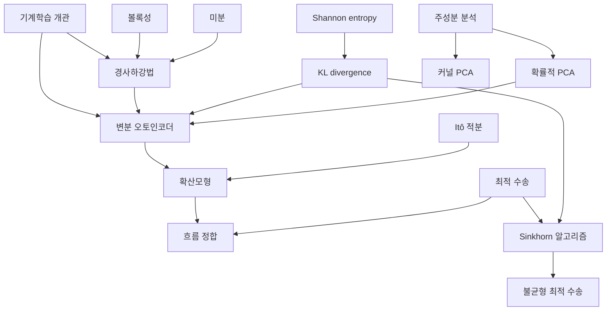

# 기계학습 개관

# 개요

기계학습은 표본에서 분포를 추정하고 그 추정으로 예측한다. 수학적으로는 세 문제가 겹쳐 있다. 어떤 함수족을 쓸지 정하는 표현, 그 안에서 손실을 최소화하는 최적화, 표본에서 얻은 값이 분포 전체에 대해서도 유효한지 묻는 일반화다.

[경사하강법](gradient-descent.md)이 최적화 쪽 진입점이다. 손실이 볼록이면 수렴률이 나오고, 볼록이 아니어도 실제 모형의 학습은 이 반복과 그 변형으로 이루어진다. 일반화 쪽은 [집중부등식](concentration-inequalities.md)이 표본평균과 기댓값의 차이를 확률로 제한한다.

표현 쪽은 [주성분 분석](principal-component-analysis.md)의 선형 부분공간에서 시작한다. 여기에 잠재변수와 잡음을 넣으면 [확률적 PCA](probabilistic-pca.md)(principal component analysis)가 되고, 잠재변수에서 관측으로 가는 사상을 신경망으로 바꾸면 [변분 오토인코더](variational-autoencoder.md)가 된다. 잠재변수를 시간에 따라 움직이면 [확산모형](diffusion-models.md)과 [흐름 정합](flow-matching.md)이 된다.

분포 사이의 거리를 무엇으로 재느냐가 모형의 손실을 정한다. [KL divergence](kl-divergence.md)(Kullback–Leibler divergence)는 밀도의 비를 평균하고, [최적 수송](optimal-transport.md)은 질량을 옮기는 비용을 잰다. 두 분포의 받침이 겹치지 않을 때 전자는 발산하고 후자는 유한하다.

# 지도

# 갈래

## 최적화와 일반화

- [경사하강법](gradient-descent.md) — 기울기 반대 방향으로 반복한다. 볼록과 강볼록에서 수렴률이 다르고 보폭이 Lipschitz 상수에 묶인다
- [집중부등식](concentration-inequalities.md) — 표본평균이 기댓값에서 벗어날 확률의 지수 한계. 일반화 오차를 표본 수로 제한하는 데 쓴다

## 표현과 차원 축소

- [주성분 분석](principal-component-analysis.md) — 공분산행렬의 고유벡터로 분산이 큰 방향을 찾는다
- [확률적 PCA](probabilistic-pca.md) — 주성분 분석을 잠재변수와 Gauss 잡음을 가진 생성모형으로 다시 쓴다
- [커널 PCA](kernel-pca.md) — 특징 사상 뒤의 공분산을 내적만으로 다룬다

## 확률적 모형

- [Bayes 추론과 사후분포](bayesian-inference.md) — 사전분포와 가능도에서 사후분포를 얻고 예측분포로 옮긴다
- [Gauss 과정](gaussian-processes.md) — 함수 위의 사전분포. 유한 차원 주변분포가 모두 Gauss 분포다

## 생성모형

- [변분 오토인코더](variational-autoencoder.md) — 사후분포를 인코더로 근사하고 증거 하한을 최대화한다
- [확산모형](diffusion-models.md) — 자료에 잡음을 더하는 확률미분방정식을 시간 역방향으로 푼다
- [흐름 정합](flow-matching.md) — 두 분포를 잇는 확률경로의 속도장을 회귀로 직접 학습한다

## 분포 사이의 거리

- [KL divergence](kl-divergence.md) — 밀도의 비를 평균한 양. 증거 하한과 변분 추론의 손실을 이 양으로 쓴다
- [최적 수송과 Wasserstein 거리](optimal-transport.md) — 질량을 옮기는 최소 비용. 받침이 겹치지 않는 분포 사이에서도 유한하다
- [Sinkhorn 알고리즘과 엔트로피 정규화](sinkhorn.md) — entropy 항을 더한 수송 문제를 행렬 스케일링 반복으로 푼다
- [불균형 최적 수송](unbalanced-optimal-transport.md) — 총질량이 다른 두 측도 사이로 수송을 확장한다

## 그래프 학습

- [논문: How Powerful are Graph Neural Networks?](gnn-expressivity.md) — 메시지 전달 신경망의 구별 능력이 Color refinement 를 넘지 못한다

# 연관 문서

## 선수지식

- [집합](sets.md)

## 더 알아보기

- [경사하강법](gradient-descent.md)
- [변분 오토인코더](variational-autoencoder.md)

#machine_learning #statistics #optimization #probability #overview
