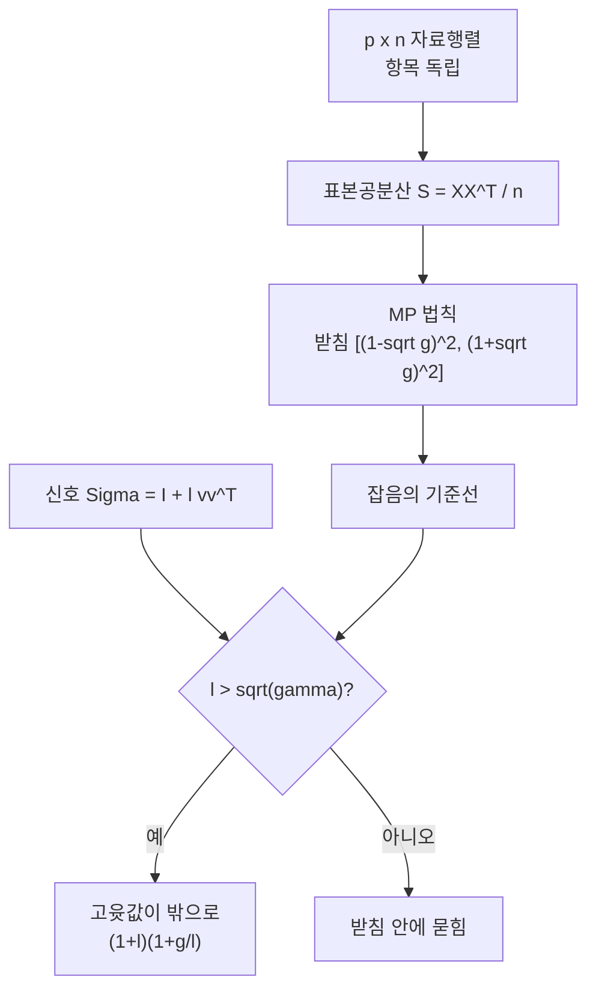

# Marchenko–Pastur 법칙

# 개요

표본 $n$ 개로 $p$ 차원 공변량의 공분산을 추정한다고 하자. 고전 통계는 $p$ 를 고정하고 $n \to \infty$ 를 보내며, 그러면 표본공분산행렬 $S$ 는 참값 $\Sigma$ 로 수렴한다. 문제는 현대의 자료가 $p$ 도 함께 커진다는 데 있다. 유전자 $2$ 만 개를 표본 $200$ 개로 재거나, 자산 $500$ 개의 상관을 두 해치 일간 수익률로 재는 상황에서는 $p/n$ 이 무시할 수 없다.

**Marchenko–Pastur 법칙**은 이 체제의 답이다. $\Sigma = I$ 인데도 $S$ 의 고윳값은 $1$ 에 모이지 않고 $\bigl[(1-\sqrt\gamma)^2,\ (1+\sqrt\gamma)^2\bigr]$ 에 퍼지며, 그 분포가 $\gamma = p/n$ 하나로 결정된다. 잡음만 있는데도 고윳값이 $\gamma = 0.5$ 에서 $0.086$ 부터 $2.91$ 까지 벌어진다.

[Wigner 반원법칙](wigner-semicircle.md)과 같은 자리에 있는 정리다. 항목이 독립인 큰 무작위 행렬의 고윳값 분포가 항목의 세부 분포와 무관하게 정해진다는 점이 같고, 대칭행렬 대신 $XX^{\mathsf T}$ 라는 곱 구조를 보기 때문에 답이 반원 대신 한쪽으로 치우친 모양이 된다. 그리고 [주성분 분석](principal-component-analysis.md)에서 "이 고윳값이 의미 있는가" 를 판정하는 영점 기준선을 준다. 잡음이 만드는 고윳값의 범위를 알아야 신호를 가려낼 수 있다.

# 직관

## 왜 퍼지는가

$\Sigma = I$ 이면 $\mathbb E[S] = I$ 이므로 고윳값의 평균은 $1$ 이다. 퍼지는 것은 $S$ 의 요동 때문이다. $S_{ij}$ 각각의 표준편차가 $n^{-1/2}$ 규모이고, 그런 항목이 $p \times p$ 개 있다. 행렬의 고윳값은 항목들의 요동을 $\sqrt p$ 배로 증폭해 받으므로, 고윳값의 퍼짐은 $\sqrt{p}\cdot n^{-1/2} = \sqrt\gamma$ 규모가 된다. 받침의 끝이 $1 \pm \sqrt\gamma$ 의 제곱으로 나오는 이유가 이 세는 방식에 들어 있다.

$\gamma \to 0$ 이면 받침이 한 점 $1$ 로 수축해 고전 극한이 돌아온다. $\gamma = 1$ 이면 왼쪽 끝이 $0$ 에 닿아 밀도가 원점에서 발산하고, $\gamma > 1$ 이면 $S$ 의 계수가 $n$ 이라 고윳값 $p - n$ 개가 정확히 $0$ 이 된다.

## 반원과 무엇이 다른가

Wigner 행렬은 대칭이고 고윳값이 양쪽으로 대칭하게 퍼진다. $S = \frac1n XX^{\mathsf T}$ 는 양의 준정부호라 고윳값이 음수가 될 수 없고, 그 한 가지 제약이 분포를 비대칭으로 만든다. 실제로 $X$ 의 특이값 $\sigma$ 가 반원 비슷한 법칙을 따르고 $S$ 의 고윳값이 $\sigma^2$ 이므로, 제곱이 오른쪽 꼬리를 늘이고 왼쪽을 원점에 밀어붙인다. 두 법칙은 같은 현상을 다른 좌표에서 본 것에 가깝다.

## 신호는 언제 보이는가

참 공분산에 방향 하나가 강조되어 있다고 하자. $\Sigma = I + \ell vv^{\mathsf T}$ 다. $\ell$ 이 크면 $S$ 의 최대 고윳값이 잡음 덩어리 밖으로 튀어나오고, 작으면 덩어리 안에 묻혀 구별되지 않는다. 결정적인 것은 그 경계가 $\ell \to 0$ 이 아니라 **유한한 문턱** $\ell = \sqrt\gamma$ 라는 사실이다. 그보다 약한 신호는 표본을 아무리 정확히 계산해도 고윳값만 보아서는 존재조차 감지되지 않는다. 자료가 부족해서가 아니라 $p$ 와 $n$ 의 비가 정해 버리는 정보의 한계다.

# 정의

## 극한 분포

$X$ 를 $p \times n$ 행렬, 항목은 평균 $0$ 분산 $1$ 로 독립동일분포라 하고 $S = \frac1n XX^{\mathsf T}$ 라 두자. $p, n \to \infty$ 이면서 $p/n \to \gamma \in (0,\infty)$ 일 때, $S$ 의 고윳값의 경험분포는 거의 확실히

$$
d\mu_\gamma(x) = \frac{\sqrt{(\lambda_+ - x)(x - \lambda_-)}}{2\pi\gamma x}\thinspace\mathbb 1_{[\lambda_-,\lambda_+]}(x)\thinspace dx
\thickspace+\thickspace\Bigl(1 - \tfrac1\gamma\Bigr)^{+}\delta_0,
\qquad \lambda_\pm = (1 \pm \sqrt\gamma)^2
$$

로 수렴한다. $\delta_0$ 항은 $\gamma > 1$ 일 때 계수 부족으로 생기는 영 고윳값의 덩어리다. 항목의 분포가 정규인지 여부는 극한에 나타나지 않는다. 네 번째 적률만 유한하면 되며, 이 보편성이 [중심극한정리](central-limit-theorem.md)의 무작위 행렬판에 해당한다.

## 적률

$\mu_\gamma$ 의 적률은 조합적으로 닫힌 꼴이다.

$$
m_k = \int x^k\thinspace d\mu_\gamma(x) = \sum_{r=0}^{k-1}\frac{1}{r+1}\binom{k}{r}\binom{k-1}{r}\gamma^{\thinspace r}
$$

계수 $\frac{1}{r+1}\binom{k}{r}\binom{k-1}{r}$ 이 Narayana 수이고, $\gamma = 1$ 에서 합이 Catalan 수 $C_k$ 가 된다. 처음 몇 개는 $m_1 = 1$ 과 $m_2 = 1+\gamma$ 와 $m_3 = 1 + 3\gamma + \gamma^2$ 이다. 적률은 $\frac1p\mathrm{tr}(S^k)$ 의 극한이므로 고윳값을 구하지 않고 행렬 곱만으로 확인할 수 있고, 아래 코드가 그렇게 한다.

## Stieltjes 변환

증명과 일반화는 Stieltjes 변환 $m(z) = \int (x-z)^{-1}d\mu(x)$ 로 한다. MP 분포의 변환은 이차방정식

$$
\gamma z\thinspace m(z)^2 + \bigl(z + \gamma - 1\bigr)m(z) + 1 = 0
$$

을 만족하고, 근을 고른 뒤 허수부를 취하면 위의 밀도가 나온다. 이차방정식이 나오는 것은 자유확률에서 $S$ 가 자유 곱셈 합성곱으로 기술되기 때문이며, $\Sigma$ 가 항등행렬이 아닌 일반적인 경우로 넘어갈 때 이 방정식이 $\Sigma$ 의 스펙트럼을 담은 적분방정식으로 바뀐다.

# 성질

## 가장자리와 요동

받침의 끝 $\lambda_+$ 근처에서 밀도가 $\sqrt{\lambda_+ - x}$ 로 사라진다. 이 제곱근 소멸이 [Tracy–Widom 분포](tracy-widom.md)가 나타나는 전형적인 가장자리이고, 실제로 최대 고윳값은

$$
\frac{\lambda_{\max} - \lambda_+}{\sigma_{p,n}} \thickspace\Longrightarrow\thickspace \text{TW}_\beta,
\qquad
\sigma_{p,n} = \frac{(1+\sqrt\gamma)^{4/3}}{\gamma^{1/6}}\thinspace n^{-2/3}
$$

를 따른다. Tracy–Widom 의 평균이 음수이므로 유한 크기에서 $\lambda_{\max}$ 는 $\lambda_+$ 보다 **체계적으로 안쪽**에 있다. 아래 수치에서 최대 고윳값이 예측값에 늘 조금 못 미치는 것이 이 편향이며, 크기는 $n^{-2/3}$ 규모다.

## BBP 전이

$\Sigma = I + \ell vv^{\mathsf T}$ 인 스파이크 모형에서 최대 고윳값의 극한은

$$
\lambda_{\max} \longrightarrow
\begin{cases}
(1+\ell)\Bigl(1 + \dfrac{\gamma}{\ell}\Bigr), & \ell > \sqrt\gamma\cr
(1+\sqrt\gamma)^2, & \ell \le \sqrt\gamma
\end{cases}
$$

이다. Baik–Ben Arous–Péché 의 이름이 붙은 이 전이는 문턱 위아래에서 요동의 종류까지 바꾼다. 아래에서는 Tracy–Widom, 위에서는 정규분포다. 고윳값이 덩어리에 갇혀 있는 동안은 여러 고윳값이 함께 밀어내는 집단 현상이고, 빠져나온 뒤에는 방향 하나의 문제가 되어 보통의 중심극한정리가 돌아오기 때문이다.

고유벡터도 같은 문턱을 공유한다. $\ell \le \sqrt\gamma$ 이면 추정된 주성분과 참 방향의 내적이 $0$ 으로 가고, 위에서는 양의 극한

$$
\lvert\langle \hat v, v\rangle\rvert^2 \longrightarrow \frac{1 - \gamma/\ell^2}{1 + \gamma/\ell}
$$

을 갖는다. 신호를 감지할 수 있는 영역에서도 방향 추정은 완전하지 않으며, 문턱 바로 위에서는 거의 직교한다는 뜻이다.

## 무엇을 고쳐 쓰는가

MP 법칙은 표본공분산의 고윳값이 체계적으로 왜곡되어 있음을 정량화한다. 큰 것은 과대, 작은 것은 과소 추정된다. 이 왜곡을 되돌리는 **축소 추정**이 실무의 표준이 되었고, 관측된 스펙트럼에서 Stieltjes 변환을 통해 참 스펙트럼을 역산하는 절차가 그 기반이다. 공분산 자체보다 그 역행렬이 필요한 포트폴리오 최적화나 판별분석에서 특히 중요한데, 작은 고윳값의 과소 추정이 역행렬에서 증폭되기 때문이다.

# 활용

## 주성분의 유의성 판정

[주성분 분석](principal-component-analysis.md)에서 몇 개의 성분을 남길지 정할 때, 고전적인 기준은 "고윳값이 $1$ 보다 큰 것" 이었다. $\Sigma = I$ 라도 고윳값이 $(1+\sqrt\gamma)^2$ 까지 올라가므로 이 기준은 $p/n$ 이 작지 않으면 잡음을 대량으로 통과시킨다. $\gamma = 0.5$ 에서 잡음 고윳값의 절반가량이 $1$ 을 넘는다.

MP 법칙이 주는 기준은 $\lambda_+ = (1+\sqrt\gamma)^2$ 이고, 가장자리 요동까지 감안하려면 Tracy–Widom 분위수를 더한다. 유전체 자료의 집단 구조 추정에서 쓰이는 Tracy–Widom 검정이 정확히 이 절차다.

## 잡음을 지우는 상관행렬

금융에서 자산 수백 개의 상관행렬을 추정하면 고윳값 대부분이 MP 받침 안에 들어온다. 그 부분은 자료가 말해 주는 것이 없는 잡음으로 보고, 받침 밖으로 나온 몇 개(시장 전체 요인, 업종 요인)만 남긴 뒤 나머지를 평평하게 눌러 재구성하는 것이 표준적인 잡음 제거다. 이렇게 고친 행렬로 포트폴리오를 구성하면 실현 위험이 눈에 띄게 줄어든다는 것이 반복해서 확인되었다.

같은 발상이 신호처리의 잡음 부분공간 판정, 뇌영상 자료의 성분 선택, 신경망 Hessian 의 스펙트럼 분석에도 쓰인다. 공통 구조는 하나다. 정보가 없을 때 스펙트럼이 어떤 모습인지 정확히 알기 때문에, 거기서 벗어난 부분만 정보로 셀 수 있다.[^1]

[^1]: Zhidong Bai, Jack W. Silverstein, *Spectral Analysis of Large Dimensional Random Matrices*, 2nd ed., Chapters 3 and 6. MP 법칙의 Stieltjes 변환 증명, 적률의 조합적 표현, 받침 밖 고윳값의 부재. 스파이크 모형은 Jinho Baik, Gérard Ben Arous, Sandrine Péché, *Phase transition of the largest eigenvalue for nonnull complex sample covariance matrices*, Annals of Probability 33 (2005), §1.

# 연관 문서

## 선수지식

- [Wigner 반원법칙](wigner-semicircle.md)
- [주성분 분석](principal-component-analysis.md)

## 더 알아보기

아직 연결한 문서가 없다.

#probability #linear_algebra #statistics #theorem
