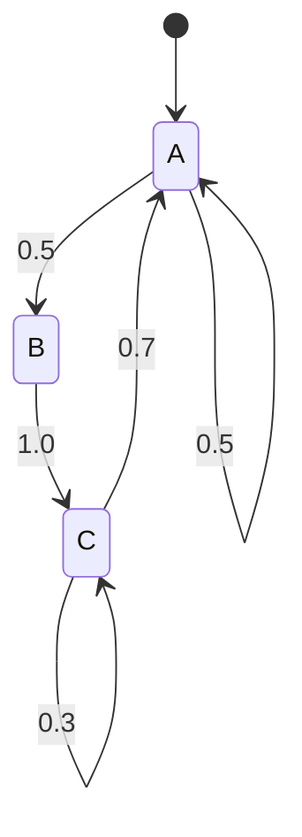

# Markov 연쇄

# 개요

Markov 연쇄는 "다음 상태의 분포가 현재 상태만으로 결정되고 그 이전의 경로와는 무관하다"는 조건을 만족하는 확률과정이다. 이 기억 없음(memorylessness) 덕분에 과정 전체가 전이확률 하나로 기술되고, 유한 상태에서는 확률벡터에 행렬을 반복 곱하는 [선형사상](linear-maps.md) 문제로 바뀐다. 그 결과 장기 거동에 관한 질문이 고유값과 고유벡터의 문제가 된다. 기약성과 비주기성이라는 두 조건 아래 유일한 정상분포가 존재하고 초기 분포와 무관하게 수렴한다는 정리가 핵심이며, PageRank와 MCMC가 이 정리를 직접 사용한다.

# 직관

세 페이지 사이를 무작위로 링크를 따라 이동하는 사람을 생각한다. 지금 어디 있는지만 알면 다음 이동 확률이 정해지고, 어떻게 여기 왔는지는 필요하지 않다. 오래 돌아다니면 각 페이지에 머무는 시간의 비율이 초기 위치와 무관한 값으로 안정된다. 그 비율이 정상분포다.

두 조건이 왜 필요한지는 반례로 보인다. 상태 공간이 서로 오갈 수 없는 두 덩어리로 나뉘면(기약이 아니면) 정상분포가 여러 개 생긴다. 두 상태를 확률 1로 왕복하면(주기 2) 분포가 홀짝으로 진동하며 수렴하지 않는다. 다만 시간 평균은 여전히 수렴한다.



# 정의

가산 상태 공간 S 위의 확률변수열을 생각한다. [확률변수](random-variables.md) 열 X_0, X_1, ...가 Markov 연쇄라는 것은 다음 조건부 독립성을 뜻한다.

$$
\Pr[X_{n+1}=j \mid X_n=i,\ X_{n-1}=i_{n-1},\dots,X_0=i_0]
=\Pr[X_{n+1}=j \mid X_n=i]
$$

오른쪽이 n에 의존하지 않으면 시간 동질(time-homogeneous)이라 하고, 전이행렬을 정의한다.

$$
P=(p_{ij}),\qquad p_{ij}=\Pr[X_{n+1}=j\mid X_n=i],\qquad
p_{ij}\ge 0,\ \ \sum_{j\in S}p_{ij}=1
$$

각 행의 합이 1인 이런 행렬을 stochastic matrix라 한다. 분포는 행벡터로 두어 오른쪽에서 곱한다.

$$
\mu_n=\mu_0 P^{\,n},\qquad (\mu_n)_j=\Pr[X_n=j]
$$

## 보조 정의

- n단계 전이확률: P의 n제곱의 (i, j) 성분을 p_{ij}^{(n)}로 쓴다.
- i에서 j로 도달 가능: 어떤 n ≥ 0에 대해 p_{ij}^{(n)} > 0. 서로 도달 가능한 관계는 [동치관계](relations.md)이며 그 동치류를 communicating class라 한다.
- 기약(irreducible): 상태 공간 전체가 하나의 communicating class다.
- 주기: 상태 i의 주기는 다음 값이고, 기약 연쇄에서는 모든 상태가 같은 주기를 가진다. 주기가 1이면 비주기적(aperiodic)이다.

$$
d(i)=\gcd\{\,n\ge 1 : p_{ii}^{(n)}>0\,\}
$$

- 첫 복귀시각과 재귀성: T_i = min{n ≥ 1 : X_n = i}로 두고, i가 재귀적이라는 것은 이 시각이 확률 1로 유한하다는 뜻이다. 기댓값까지 유한하면 양재귀적(positive recurrent)이다.
- 정상분포: 다음을 만족하는 확률분포 pi.

$$
\pi P=\pi,\qquad \pi_j\ge 0,\ \ \sum_{j\in S}\pi_j=1
$$

# 성질

## Chapman–Kolmogorov

m, n ≥ 0에 대해 중간 시점을 전개하면 행렬 곱이 나온다.

$$
p_{ij}^{(m+n)}=\sum_{k\in S}p_{ik}^{(m)}\,p_{kj}^{(n)}
\qquad\Longleftrightarrow\qquad P^{\,m+n}=P^{\,m}P^{\,n}
$$

증명은 전체확률의 법칙과 Markov 성질뿐이다. 이 등식이 "연쇄의 해석 = 행렬 거듭제곱"이라는 관점을 정당화한다.

## 정상분포의 존재와 유일성

기약이고 양재귀적인 연쇄는 유일한 정상분포를 가지며, 그 값은 평균 복귀시간의 역수다[^1].

$$
\pi_i=\frac{1}{\mathbb{E}_i[T_i]}
$$

유한 상태에서 기약이면 자동으로 양재귀적이므로 조건은 기약성만으로 충분하다. 존재는 Perron–Frobenius 정리로도 얻는다. stochastic matrix는 전부 1인 열벡터를 고유값 1의 오른쪽 고유벡터로 가지므로 1이 스펙트럼에 있고, 모든 고유값의 절댓값이 1 이하다. 기약이고 성분이 음이 아니면 고유값 1의 고유공간은 1차원이고 대응하는 왼쪽 고유벡터를 양의 성분으로 잡을 수 있다. 자세한 구조는 [고유값](eigenvalues.md)에서 다룬다.

무한 상태에서는 재귀성만으로 부족하다. 정수 위의 단순 대칭 random walk는 기약이고 재귀적이지만 영재귀적(null recurrent)이어서 정상분포가 없다. 균일 측도는 불변이지만 유한 측도가 아니다.

## 수렴 정리

기약 · 비주기 · 양재귀 연쇄에서 초기 상태와 무관하게 수렴한다[^1].

$$
\lim_{n\to\infty}p_{ij}^{(n)}=\pi_j\qquad(\forall i,j\in S)
$$

유한 상태에서는 total variation 거리로 기하급수적 수렴이 성립하고, 속도는 1 다음으로 큰 고유값의 절댓값(second largest eigenvalue modulus) lambda_2가 지배한다.

$$
\big\|\mu_0P^{\,n}-\pi\big\|_{\mathrm{TV}}\ \le\ C\,|\lambda_2|^{\,n}
$$

비주기성을 빼면 결론이 깨진다. 두 상태를 확정적으로 왕복하는 연쇄에서는 P의 제곱이 항등행렬이므로 n단계 전이확률이 0과 1 사이를 진동한다. 그래도 정상분포는 각 성분 1/2로 유일하게 존재하고, 시간 평균은 수렴한다. 이것이 ergodic 정리다. 기약 · 양재귀 연쇄에서 f가 pi에 대해 적분 가능하면 확률 1로 다음이 성립한다.

$$
\frac{1}{n}\sum_{k=0}^{n-1}f(X_k)\ \longrightarrow\ \sum_{j\in S}\pi_j\,f(j)
$$

## 가역성과 detailed balance

다음 조건을 만족하는 pi는 자동으로 정상분포다.

$$
\pi_i\,p_{ij}=\pi_j\,p_{ji}\qquad(\forall i,j)
$$

양변을 i에 대해 더하면 pi P = pi가 나온다. 역은 성립하지 않으므로 detailed balance는 충분조건일 뿐이다. 가역 연쇄에서는 P가 적절한 내적에 대해 자기수반이 되어 고유값이 모두 실수이고, 스펙트럼 이론을 그대로 쓸 수 있다. [그래프](graphs.md) 위의 단순 random walk가 대표적 예이며, 정상분포는 차수에 비례한다.

$$
\pi_v=\frac{\deg v}{2|E|}
$$

이 관계가 [그래프 Laplacian](graph-laplacian.md)과 [유효저항](effective-resistance.md)을 통해 도달시간 · 혼합시간 추정으로 이어진다.

# 활용

## 계산 예제

$$
P=\begin{pmatrix}0.5 & 0.5 & 0\\ 0 & 0 & 1\\ 0.7 & 0 & 0.3\end{pmatrix}
$$

정상분포는 pi P = pi와 성분 합 1을 연립하면 얻는다. 첫 성분 식은 0.5 pi_1 + 0.7 pi_3 = pi_1, 즉 pi_1 = 1.4 pi_3이고, 둘째 식은 0.5 pi_1 = pi_2다. 정리하면 다음이다.

$$
\pi=\tfrac{1}{31}\,(14,\ 7,\ 10)
$$

```python
import numpy as np

P = np.array([[0.5, 0.5, 0.0],
              [0.0, 0.0, 1.0],
              [0.7, 0.0, 0.3]])

# 방법 1: 거듭제곱
mu = np.array([1.0, 0.0, 0.0])
for _ in range(200):
    mu = mu @ P

# 방법 2: 왼쪽 고유벡터
w, V = np.linalg.eig(P.T)
v = np.real(V[:, np.argmax(np.real(w))])
pi = v / v.sum()
print(mu, pi)   # 둘 다 [0.4516 0.2258 0.3226]
```

## PageRank

웹 링크 그래프의 전이행렬 P는 기약이 아닐 수 있고 나가는 링크가 없는 페이지에서는 행 합이 0이 된다. 그래서 dangling 행을 균일분포로 채운 뒤 damping factor를 섞는다. J는 모든 성분이 1인 n차 정사각행렬이다.

$$
P'=\alpha P+(1-\alpha)\frac{1}{n}J,\qquad \alpha=0.85
$$

P'는 모든 성분이 양수이므로 기약이고 비주기적이다[^2]. 따라서 수렴 정리가 적용되고, PageRank는 그 유일한 정상분포다. 반복법의 수렴 속도는 lambda_2의 절댓값이 alpha 이하로 억제되어 보장된다.

## MCMC

목표 분포 pi에서 직접 표본을 뽑기 어려울 때, pi를 정상분포로 갖는 연쇄를 설계해 오래 돌린다. Metropolis–Hastings는 제안분포 q에서 후보 y를 뽑고 다음 확률로 수락한다.

$$
\alpha(x,y)=\min\!\left(1,\ \frac{\pi(y)\,q(y,x)}{\pi(x)\,q(x,y)}\right)
$$

이렇게 정의한 연쇄는 detailed balance를 만족하므로 pi가 정상분포다[^3]. 기약성과 비주기성을 확보하면 ergodic 정리에 의해 표본 평균이 pi에 대한 기댓값으로 수렴한다. 정규화 상수를 몰라도 비율만 필요하다는 점이 실용적 핵심이다. 실무에서는 lambda_2가 1에 가까울 때 혼합이 느려지는 것이 주된 어려움이다.

## 그 밖에

- 대기행렬과 재고 모형. 상태를 대기 인원으로 두고 정상분포에서 평균 대기 길이를 구한다.
- 은닉 Markov 모형. 관측이 상태의 잡음 섞인 함수일 때 전이구조를 추정한다.
- 확률적 알고리즘 분석. 무작위화 알고리즘의 상태 변화를 연쇄로 보고 혼합시간으로 실행시간을 평가한다.

[^1]: Karl Sigman, Limiting distribution for a Markov chain (Columbia IEOR 강의노트), 정상분포의 존재·유일성, 평균 복귀시간 공식, 기약·비주기·양재귀 조건 아래의 수렴 정리. http://www.columbia.edu/~ks20/stochastic-I/stochastic-I-MCII.pdf
[^2]: PageRank, Wikipedia (damping factor 0.85, dangling node 처리, 확률행렬의 유일한 정상분포로서의 정의). https://en.wikipedia.org/wiki/PageRank
[^3]: Metropolis–Hastings algorithm, Wikipedia (수락확률과 detailed balance에 의한 정상성 확인). https://en.wikipedia.org/wiki/Metropolis%E2%80%93Hastings_algorithm

# 연관 문서

## 선수지식

- [확률변수와 기댓값](random-variables.md)
- [선형사상](linear-maps.md)

## 더 알아보기

- [Random walk와 전기 네트워크](random-walks.md)
