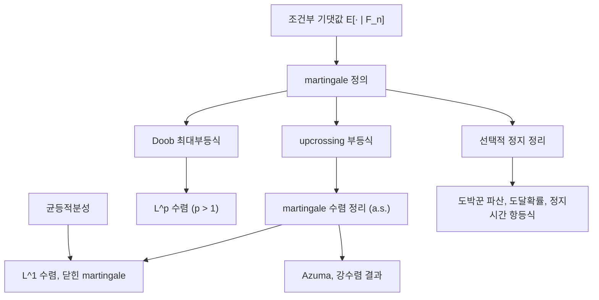

# Martingale

# 개요

Martingale 은 "공정한 게임"의 수학적 모형이다. 시간에 따라 정보가 쌓이는 상황에서, 지금까지 관측한 모든 것을 알고 있어도 다음 시각의 값에 대한 최선의 예측이 현재 값과 같은 확률과정을 말한다.

$$
E[X_{n+1} \mid \mathcal{F}_n] \;=\; X_n .
$$

이 한 줄이 주는 힘은 놀라울 정도로 크다. 겉보기에 아무 구조도 없어 보이지만, 이 조건만으로 (1) 기댓값이 시간에 대해 불변이고, (2) 적절한 조건에서 임의의 **정지시간**까지 그 불변성이 유지되며(선택적 정지 정리), (3) 최댓값의 꼬리가 제어되고(Doob 부등식), (4) 유계성 가정 아래 거의 확실하게 수렴한다(martingale 수렴 정리). 조건은 [조건부 기댓값](conditional-expectation.md)의 언어로만 쓸 수 있으므로 martingale 이론은 측도론적 조건부 기댓값 위에 바로 얹힌다.

응용 범위는 도박꾼 파산 문제와 [Markov 연쇄](markov-chains.md)의 도달 확률 계산에서 시작해, [큰 수의 법칙](law-of-large-numbers.md)의 강화, [집중부등식](concentration-inequalities.md)의 의존성 있는 버전(Azuma–Hoeffding), 확률적분과 금융 수리의 무차익 이론까지 이어진다.

# 직관

세 판돈을 생각하면 정의가 자연스럽다. 매 판 공정한 동전을 던져 $\pm1$ 을 얻는 게임에서 누적 재산 $S_n$ 은 martingale 이다. 다음 판의 기대 이득이 0 이므로 현재 재산이 곧 미래 재산의 예측값이다. 유리한 게임이면 예측값이 현재보다 크고(submartingale), 불리하면 작다(supermartingale). 이름과 부등호 방향이 반대로 느껴지는 것은 supermartingale 이 "위에서 눌리는", 즉 감소 경향을 갖는 과정이기 때문이다. 조화함수·우조화함수(superharmonic) 용법과 맞춘 관례다.

두 번째 직관은 "전략으로는 공정함을 이길 수 없다"는 것이다. 매 시각 얼마를 걸지를 과거 정보만 보고 정하는 전략 $H_n$ 을 세워도, 결과 과정

$$
(H \cdot X)_n \;=\; \sum_{k=1}^{n} H_k (X_k - X_{k-1})
$$

은 다시 martingale 이다. 판돈을 언제 그만둘지 정하는 것(정지시간) 역시 일종의 전략이므로, 유계성 조건만 갖추면 기대 이득은 여전히 0 이다. 도박 시스템의 불가능성 정리라 할 만하며, 이것이 선택적 정지 정리의 내용이다.

세 번째 직관은 수렴이다. 경로가 수렴하지 않으려면 어떤 구간 $[a,b]$ 를 무한히 여러 번 아래에서 위로 가로질러야 한다. 그런데 "구간 아래에서 사서 위에서 판다"는 전략이 만드는 이익은 가로지른 횟수에 비례하고, 공정한 게임에서는 그 기대 이익이 커질 수 없다. 따라서 가로지르기 횟수의 기댓값이 유한하고, 경로는 결국 진동을 멈춘다. Doob 의 upcrossing 논증이다.



# 정의

## Filtration 과 adapted 과정

확률공간 $(\Omega, \mathcal F, P)$ 위의 증가하는 부분 $\sigma$ -대수 열 $\mathcal F_0 \subseteq \mathcal F_1 \subseteq \dots \subseteq \mathcal F$ 를 filtration 이라 한다. $\mathcal F_n$ 은 "시각 $n$ 까지 관측 가능한 정보"다. 확률과정 $(X_n)$ 이 모든 $n$ 에 대해 $X_n$ 이 $\mathcal F_n$ 가측이면 $(X_n)$ 은 filtration 에 **adapted** 되었다고 한다. 특별한 언급이 없으면 자연 filtration $\mathcal F_n = \sigma(X_0, \dots, X_n)$ 을 쓴다.

## Martingale, submartingale, supermartingale

adapted 이고 모든 $n$ 에 대해 $E\lvert X_n \rvert < \infty$ 인 과정 $(X_n)$ 이 다음을 만족하면 각각 martingale, submartingale, supermartingale 이라 한다.

$$
E[X_{n+1} \mid \mathcal{F}_n] = X_n, \qquad
E[X_{n+1} \mid \mathcal{F}_n] \ge X_n, \qquad
E[X_{n+1} \mid \mathcal{F}_n] \le X_n .
$$

탑 성질에 의해 $m \le n$ 이면 $E[X_n \mid \mathcal F_m] = X_m$ 이 따라 나오고(부등식 버전도 동일), 특히 martingale 의 기댓값은 상수다.

$$
E[X_n] = E[X_0] \quad \text{for all } n.
$$

$(X_n)$ 이 martingale 이고 $\varphi$ 가 [볼록](convexity.md)함수이며 $E\lvert \varphi(X_n) \rvert < \infty$ 이면 조건부 Jensen 부등식으로 $(\varphi(X_n))$ 은 submartingale 이다. $\varphi(x) = \lvert x \rvert$ 나 $\varphi(x) = x^2$ 가 대표적이다.

## 예

- **랜덤워크.** $\xi_1, \xi_2, \dots$ 가 독립이고 $E[\xi_k] = 0$ 이면 $S_n = \sum_{k \le n} \xi_k$ 는 martingale 이다. $E[\xi_k] \ge 0$ 이면 submartingale 이다. [Random walk와 전기 네트워크](random-walks.md)에서 다루는 단순 대칭 랜덤워크가 여기 속한다.
- **분산 보정.** 위의 상황에서 $\operatorname{Var}(\xi_k) = \sigma^2$ 이면 $S_n^2 - n\sigma^2$ 이 martingale 이다. 전개하면 교차항이 조건부로 사라진다.
- **곱 martingale.** $\xi_k > 0$ 이 독립이고 $E[\xi_k] = 1$ 이면 $M_n = \prod_{k \le n} \xi_k$ 는 martingale 이다. 우도비(likelihood ratio)가 이 꼴이며, [측도 변환](change-of-measure.md)의 밀도과정이 바로 곱 martingale 이다.
- **Doob martingale.** 적분 가능한 $Z$ 와 임의의 filtration 에 대해 $X_n = E[Z \mid \mathcal F_n]$ 은 martingale 이다(탑 성질). 정보가 점점 드러나면서 예측이 갱신되는 과정이며, Azuma 부등식의 표준 재료다.
- **조화함수.** [Markov 연쇄](markov-chains.md)의 전이행렬 $P$ 와 $Ph = h$ 를 만족하는 조화함수 $h$ 에 대해 $h(X_n)$ 은 martingale 이다. 우조화함수면 supermartingale 이다.

## 정지시간

확률변수 $T : \Omega \to \lbrace 0, 1, \dots, \infty\rbrace$ 가 모든 $n$ 에 대해 $\lbrace T \le n\rbrace \in \mathcal F_n$ 이면 정지시간(stopping time)이라 한다. "지금 멈출지를 지금까지의 정보만으로 결정한다"는 뜻이고, 미래를 내다보는 규칙(예: 최고점에서 팔기)은 정지시간이 아니다. 정지된 과정은

$$
X_n^T \;=\; X_{T \wedge n}
$$

로 정의하며, $(X_n)$ 이 martingale 이면 $(X_{T \wedge n})$ 도 martingale 이다. 이는 예측 가능한 전략 $H_k = \mathbf 1\lbrace T \ge k\rbrace$ 에 대한 martingale 변환이기 때문이다.

# 성질

## 선택적 정지 정리

**정리 (Doob).** $(X_n)$ 이 martingale 이고 $T$ 가 정지시간일 때, 다음 중 하나가 성립하면 $E[X_T] = E[X_0]$ 이다.

1. $T$ 가 유계다. 즉 어떤 $N$ 에 대해 $T \le N$ 이 거의 확실하게 성립한다.
2. $T < \infty$ 가 거의 확실하고 $(X_{T \wedge n})$ 이 유계다.
3. $E[T] < \infty$ 이고 증분이 $\lvert X_{n+1} - X_n \rvert \le c$ 로 유계다.

*증명 스케치.* 정지된 과정이 martingale 이므로 $E[X_{T \wedge n}] = E[X_0]$ 는 모든 $n$ 에서 성립한다. 남은 일은 $n \to \infty$ 에서 극한과 기댓값을 교환하는 것뿐이고, 세 조건은 각각 즉시 성립·[지배 수렴 정리](dominated-convergence.md)·증분 합의 지배를 제공한다. 조건이 없으면 정리는 거짓이다. 대칭 랜덤워크에서 $T = \inf\lbrace n : S_n = 1\rbrace$ 은 거의 확실하게 유한하지만 $E[S_T] = 1 \neq 0 = E[S_0]$ 이다. 이른바 마팅게일 배팅 전략(두 배로 걸기)이 "확실한 이익"처럼 보이는 착시의 정체가 이것이며, 실제로는 $E[T] = \infty$ 이거나 무한한 자금이 필요하다.

## 도박꾼 파산

$S_n$ 을 대칭 단순 랜덤워크라 하고 $S_0 = k$ 와 $T = \inf\lbrace n : S_n \in \lbrace 0, N\rbrace\rbrace$ 로 둔다. $T$ 는 거의 확실하게 유한하고 $(S_{T \wedge n})$ 은 $[0, N]$ 에 유계이므로 선택적 정지 정리를 쓸 수 있다.

$$
k \;=\; E[S_T] \;=\; N \cdot P(S_T = N) \;\Rightarrow\; P(S_T = N) = \frac{k}{N}.
$$

두 번째 martingale $S_n^2 - n$ 에 같은 정리를 적용하면 기대 도달 시간이 나온다.

$$
k^2 \;=\; E[S_T^2] - E[T] \;=\; N^2 \cdot \frac{k}{N} - E[T] \;\Rightarrow\; E[T] = k(N - k).
$$

성공확률이 $p \neq 1/2$ 인 비대칭 경우에는 $(q/p)^{S_n}$ 이 martingale 이고, 같은 계산이 고전적인 파산 확률 공식을 준다.

## Doob 최대부등식

**정리.** $(X_n)$ 이 비음 submartingale 이면 임의의 $\lambda > 0$ 에 대해

$$
P\Big(\max_{0 \le k \le n} X_k \ge \lambda\Big) \;\le\; \frac{E[X_n]}{\lambda}.
$$

*증명 스케치.* $T = \inf\lbrace k : X_k \ge \lambda\rbrace$ 로 두고 사건 $A = \lbrace\max_{k \le n} X_k \ge \lambda\rbrace$ 를 $\lbrace T \le n\rbrace$ 과 동일시한다. $A$ 위에서 $X_T \ge \lambda$ 이고, submartingale 성질로 $E[X_n \mathbf 1_A] \ge E[X_T \mathbf 1_A] \ge \lambda P(A)$ 이다. Markov 부등식의 "경로 전체" 버전이며, $X_n$ 대신 최댓값을 다루면서도 대가가 없다는 점이 핵심이다.

$p > 1$ 에 대한 $L^p$ 최대부등식

$$
E\Big[\max_{k \le n} |X_k|^p\Big] \;\le\; \Big(\frac{p}{p-1}\Big)^p E\big[|X_n|^p\big]
$$

은 위 부등식과 층 공식(layer cake), Hölder 부등식으로 얻는다. $p = 2$ 인 경우가 가장 많이 쓰이며, 랜덤워크의 최대 편차 추정과 확률적분의 등거리 성질(Itô isometry)의 이산 대응물이 된다.

## Upcrossing 부등식과 수렴 정리

구간 $[a, b]$ 에 대한 upcrossing 횟수 $U_n[a, b]$ 를 시각 $n$ 까지 경로가 $a$ 아래에서 $b$ 위로 완전히 올라간 횟수로 정의한다.

**Upcrossing 부등식.** $(X_n)$ 이 supermartingale 이면

$$
(b - a)\, E\big[U_n[a,b]\big] \;\le\; E\big[(X_n - a)^-\big].
$$

*증명 스케치.* $a$ 아래로 내려가면 1 단위를 사고 $b$ 위로 올라가면 파는 예측 가능 전략 $H$ 를 만든다. 완성된 upcrossing 하나마다 최소 $b - a$ 의 이익이 나므로 $(H \cdot X)_n \ge (b-a) U_n[a,b] - (X_n - a)^-$ 이고, supermartingale 의 비음 전략 변환은 다시 supermartingale 이므로 $E[(H \cdot X)_n] \le 0$ 이다.

**Martingale 수렴 정리.** $(X_n)$ 이 submartingale 이고 $\sup_n E[X_n^+] < \infty$ 이면 $X_n \to X_\infty$ 가 거의 확실하게 성립하고 $E\lvert X_\infty \rvert < \infty$ 이다.

*증명 스케치.* 수렴하지 않는 경로는 어떤 유리수 쌍 $a < b$ 에 대해 $U_\infty[a,b] = \infty$ 를 만족한다. upcrossing 부등식과 단조수렴으로 $E[U_\infty[a,b]] < \infty$ 이므로 각 쌍마다 그 사건은 영집합이고, 유리수 쌍이 가산이므로 합집합도 영집합이다. Fatou 보조정리로 극한의 적분가능성이 나온다.

거의 확실한 수렴이 $L^1$ 수렴을 함의하지는 않는다. 반례로 $P(\xi_k = 2) = P(\xi_k = 0) = 1/2$ 인 곱 martingale $X_n = \prod \xi_k$ 는 $X_n \to 0$ 이지만 $E[X_n] = 1$ 이다. $L^1$ 수렴과 $X_n = E[X_\infty \mid \mathcal F_n]$ 형태의 표현(닫힌 martingale)을 얻으려면 [균등적분성](uniform-integrability.md)이 필요하며, 이는 Doob martingale 이 언제나 균등적분 가능하다는 사실과 짝을 이룬다. $p > 1$ 에서는 $L^p$ 유계성만으로 $L^p$ 수렴이 따르는데, 최대부등식이 지배함수를 제공하기 때문이다[^1].

# 활용

## Azuma–Hoeffding 과 집중

증분이 $\lvert X_k - X_{k-1} \rvert \le c_k$ 로 유계인 martingale 에 대해

$$
P\big(X_n - X_0 \ge t\big) \;\le\; \exp\!\left(-\frac{t^2}{2 \sum_{k=1}^n c_k^2}\right)
$$

가 성립한다(Azuma–Hoeffding). 증명은 조건부 Hoeffding 보조정리를 지수 모멘트에 반복 적용하는 것으로, 독립 합에 대한 Hoeffding 부등식의 논증을 조건부 기댓값으로 바꿔 쓴 것에 지나지 않는다. 이 관점의 실익은 독립성을 요구하지 않는다는 데 있다. 함수 $f(Z_1, \dots, Z_n)$ 에 대해 Doob martingale $X_k = E[f \mid Z_1, \dots, Z_k]$ 를 만들고 각 좌표를 바꿀 때 $f$ 의 변화가 제한된다는 조건(bounded differences)을 쓰면 McDiarmid 부등식이 나온다. 자세한 독립 경우는 [집중부등식](concentration-inequalities.md)에서 다룬다.

## 확률과정과 다른 분야

- **조화함수와 도달 확률.** [Markov 연쇄](markov-chains.md)에서 경계값 문제의 해는 $h(X_n)$ 이 martingale 이라는 사실과 선택적 정지 정리로 표현된다. [Random walk와 전기 네트워크](random-walks.md)의 전압-도달확률 대응이 이 원리의 물리적 표현이다.
- **강한 수렴 결과.** 독립 합의 [큰 수의 법칙](law-of-large-numbers.md)은 $\sum \xi_k / k$ 형태의 martingale 수렴과 Kronecker 보조정리로 증명할 수 있다. Lévy 의 0-1 법칙, Kolmogorov 0-1 법칙도 Doob martingale 의 수렴으로 나온다.
- **통계.** 순차적 검정(SPRT)의 우도비는 곱 martingale 이고, 정지 규칙의 오류 확률 경계는 선택적 정지 정리와 최대부등식에서 직접 나온다. [측도 변환](change-of-measure.md)의 Radon–Nikodym 밀도과정도 같은 구조다.
- **연속시간.** Brownian motion 에서 $B_t$ 와 $B_t^2 - t$ 그리고 $\exp(\theta B_t - \theta^2 t / 2)$ 는 모두 martingale 이며, Itô 적분은 "martingale 변환"의 연속시간 판이다. 금융의 무차익 가격결정은 할인된 가격과정을 martingale 로 만드는 측도의 존재로 서술된다.

## 계산 예제

대칭 랜덤워크의 도박꾼 파산 공식을 시뮬레이션으로 확인한다. 이론값은 도달확률 $k/N$ , 기대 시간 $k(N-k)$ 다.

```python
import random

def ruin(k, N, trials=20000, seed=0):
    rng = random.Random(seed)
    wins, steps = 0, 0
    for _ in range(trials):
        s, t = k, 0
        while 0 < s < N:
            s += 1 if rng.random() < 0.5 else -1
            t += 1
        wins += (s == N)
        steps += t
    return wins / trials, steps / trials

k, N = 3, 10
p_hat, t_hat = ruin(k, N)
print(f"P(도달 N): 시뮬 {p_hat:.3f} / 이론 {k/N:.3f}")
print(f"E[T]    : 시뮬 {t_hat:.2f} / 이론 {k*(N-k)}")
```

증분이 유계인 martingale 이므로 두 예측 모두 선택적 정지 정리의 조건 2와 3을 만족하고, 시뮬레이션 오차는 시행 횟수의 제곱근에 반비례해 줄어든다. 비대칭 경우로 바꾸면 $(q/p)^{S_n}$ 을 쓰는 공식과 비교할 수 있다[^2].

[^1]: Rick Durrett, Probability: Theory and Examples (5th ed.), Chapter 4 (Martingales), https://sites.math.duke.edu/~rtd/PTE/PTE5_011119.pdf
[^2]: Russell Lyons and Yuval Peres, Probability on Trees and Networks, Chapter 2, https://rdlyons.pages.iu.edu/prbtree/book.pdf

# 연관 문서

## 선수지식

- [조건부 기댓값](conditional-expectation.md)

## 더 알아보기

- [Brown 운동](brownian-motion.md)

#probability
