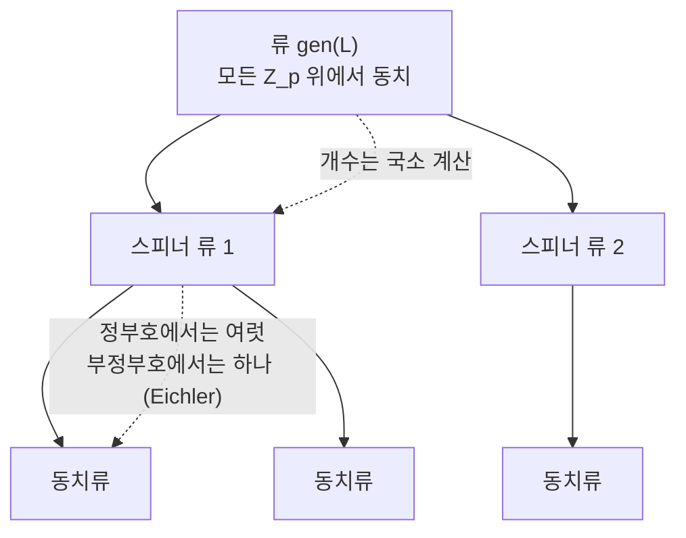

# 질량 공식과 격자의 류

# 개요

정부호 이차형식을 분류하려고 하면 곧바로 벽에 부딪힌다. 판별식과 차원을 고정해도 $\mathbb Z$ 위의 동치류가 몇 개인지 알 길이 없다. 류(genus) 안의 동치류 개수 $h$ 는 차원에 따라 불규칙하게 튀고, 이 값을 직접 주는 공식은 없다.

**질량 공식**은 개수 대신 **가중 개수**를 세면 닫힌 식이 나온다고 말한다.

$$
\operatorname{mass}(\mathrm{gen}\,L)=\sum_{[L']\in\mathrm{gen}\,L}\frac1{|\operatorname{Aut}L'|}
$$

이 합은 격자를 하나도 모른 채, 국소 데이터만으로 계산된다. Minkowski 가 낮은 차원에서 발견하고 Siegel 이 일반 차원에서 증명했다.

[Siegel–Weil 공식](siegel-weil.md)과의 관계가 이 문서를 그 아래에 두는 이유다. Siegel 공식은 류 평균 $\sum_i r_{Q_i}(n)/|\operatorname{Aut}Q_i|$ 를 국소 밀도의 곱으로 주는데, 분모에 있는 정규화 인자가 정확히 질량이다. **질량 공식은 Siegel 공식의 $n=0$ 자리**, 곧 표현수를 묻기 전에 먼저 나눠야 하는 상수다. Siegel 공식을 쓰려면 질량을 알아야 하고, 질량은 그 자체로 분류 문제의 도구가 된다.

값이 [Bernoulli 수](bernoulli-numbers.md)로 나오는 것도 우연이 아니다. 국소 인자의 곱이 $\zeta(2),\zeta(4),\dots$ 의 곱으로 모이고, 짝수 자리의 zeta 값이 Bernoulli 수이기 때문이다.

# 직관

## 왜 개수가 아니라 가중 개수인가

대칭이 많은 대상을 셀 때 하나를 하나로 세면 안 된다는 것은 군론의 오래된 교훈이다. 유한군 $G$ 가 작용하는 집합의 궤도를 셀 때 $\sum 1/|\text{안정자}|$ 를 쓰는 것과 같은 계산이다. 격자의 경우 안정자가 $\operatorname{Aut}L$ 이고, $1/|\operatorname{Aut}L|$ 로 가중한 합만이 매끄러운 양이 된다.

더 정확한 그림은 [아델](adeles.md) 쪽에 있다. 류 전체는 아델 직교군의 이중잉여류

$$
O(V)(\mathbb Q)\ \backslash\ O(V)(\mathbb A)\ /\ \prod_v O(L_v)
$$

와 대응하고, 이 이중잉여류는 유한 개다. 그 개수가 $h$ 다. 왼쪽 몫공간에 Haar 측도를 주면 각 이중잉여류가 차지하는 부피가 $1/|\operatorname{Aut}L_i|$ 에 비례한다. **질량은 개수가 아니라 부피다.** 부피는 국소 부피의 곱으로 쪼개지고, 개수는 그렇지 않다. 공식이 있는 쪽과 없는 쪽이 이렇게 갈린다.

이 관점을 끝까지 밀면 질량 공식은 $\mathrm{SO}_n$ 의 **Tamagawa 수가 2** 라는 진술과 같아진다. Weil 이 이 동치를 지적했고, 반단순군의 Tamagawa 수가 1 이라는 추측이 증명되면서 질량 공식도 그 따름정리가 되었다.

## 류와 동치류 사이

류는 국소적으로 구별되지 않는 격자를 모은 것이다. 만약 강근사(strong approximation)가 성립한다면 국소적으로 같은 것은 전역적으로도 같아져 $h=1$ 이 될 것이다. 직교군에서 강근사가 깨지는 정도가 곧 $h$ 다.

깨짐은 두 단계로 일어난다. 먼저 스피너 노름

$$
\theta:\ \mathrm{SO}(V)\longrightarrow \mathbb Q^\times/(\mathbb Q^\times)^2
$$

이 회전군을 그보다 작은 스핀군으로부터 갈라놓는다. 스핀군에는 강근사가 성립하므로, 스피너 노름이 자명한 부분만 보면 국소가 전역을 결정한다. 그 결과 류가 **스피너 류(spinor genus)** 로 갈라지고, 스피너 류의 개수는 순수한 국소 계산으로 나오는 2 의 거듭제곱이다. 두 번째 단계, 곧 스피너 류 안에서 동치류가 여럿으로 갈라지는 것은 국소 정보로는 보이지 않는다. 질량 공식이 다루는 것이 이 두 번째 단계다.



부정부호이고 계수가 3 이상이면 두 번째 단계가 일어나지 않는다. Eichler 의 정리가 각 스피너 류에 동치류가 정확히 하나라고 말한다. 그래서 부정부호 형식의 분류는 유한한 국소 계산으로 끝나고, 질량 공식이 필요한 자리는 **정부호** 쪽이다. 정부호에서는 $\operatorname{Aut}L$ 이 유한군이라 가중합이 의미를 갖는다는 사정도 같이 맞물린다.

# 정의

## 격자, 류, 스피너 류

$V$ 를 $\mathbb Q$ 위의 $n$ 차원 이차공간, $L\subset V$ 를 그 위의 격자라 한다.

- $L\cong L'$ (**동치**): $\sigma(L)=L'$ 인 $\sigma\in O(V)$ 가 있다.
- $L'\in\mathrm{gen}\thinspace L$ (**같은 류**): 모든 소수 $p$ 에 대해 $L_p\cong L'_p$ 이고 $V\otimes\mathbb R$ 위에서도 동치다.
- $L'\in\mathrm{spn}\thinspace L$ (**같은 스피너 류**): 위 조건에 더해, 국소 동치를 주는 사상들을 스피너 노름이 자명한 회전 $\sigma_p\in O'(V_p)$ 로 고를 수 있다.

포함관계는 $[L]\subset\mathrm{spn}\thinspace L\subset\mathrm{gen}\thinspace L$ 이고, 류는 유한 개의 동치류로 이루어진다.

## 질량

$$
\operatorname{mass}(\mathrm{gen}\,L)=\sum_{i=1}^{h}\frac1{|\operatorname{Aut}L_i|},
\qquad L_1,\dots,L_h\ \text{는 류의 동치류 대표}
$$

$\operatorname{Aut}L=\lbrace\sigma\in O(V):\sigma(L)=L\rbrace$ 이고 정부호에서 유한군이다.

## Smith–Minkowski–Siegel 질량 공식

질량은 표준 인자와 국소 인자의 곱으로 쪼개진다.

$$
\operatorname{mass}(\mathrm{gen}\,L)
=2\,\pi^{-n(n+1)/4}\prod_{j=1}^{n}\Gamma\!\left(\frac j2\right)\cdot\prod_{p}\frac{2}{\alpha_p(L)}
$$

여기서 $\alpha_p(L)$ 는 $L$ 이 자기 자신을 $\mathbb Z_p$ 위에서 표현하는 국소 밀도다. 앞의 상수 2 가 $\mathrm{SO}_n$ 의 Tamagawa 수이고, 거의 모든 $p$ 에서 $\alpha_p$ 가 1 에 가까워 곱이 수렴한다. Conway 와 Sloane 이 $\alpha_p$ 를 Jordan 분해로부터 직접 읽는 절차를 정리했다.

$8\mid n$ 인 **짝수 유니모듈러 격자**에서는 국소 인자가 모두 자명해져 Bernoulli 수만 남는다.

$$
\operatorname{mass}(n)=\frac{|B_{n/2}|}{n}\prod_{j=1}^{n/2-1}\frac{|B_{2j}|}{4j}
$$

$|B_{2j}|/(4j)$ 를 $\zeta(2j)\cdot(2j-1)!/(2\pi)^{2j}\cdot 2$ 로 바꿔 쓰면 이 곱이 $\zeta(2)\zeta(4)\cdots$ 의 모임임이 보인다. 국소 인자의 곱이 Euler 곱으로 모인 흔적이다.

# 성질

## 질량은 개수의 하한을 준다

모든 격자는 $-\mathrm{id}$ 를 자기동형으로 가지므로 $|\operatorname{Aut}L|\ge2$ 다. 따라서

$$
h\ \ge\ 2\operatorname{mass}(\mathrm{gen}\,L)
$$

이고, 질량이 크면 류에 격자가 많다는 것이 **분류를 시도하기 전에** 확정된다. 반대 방향의 상한은 없다. 자기동형군이 큰 격자 몇 개가 질량을 다 가져갈 수 있기 때문이다. $n=8$ 이 그런 극단으로, 격자가 $E_8$ 하나뿐인데 그 자기동형군이 위수 $696729600$ 의 Weyl 군이라 질량이 $10^{-9}$ 자리다.

그러니 하한은 질량이 1 을 넘을 때만 쓸모가 있다. 질량이 작은 쪽에서 이 공식의 용도는 하한이 아니라 **검산**이다. 목록을 다 만들었다고 생각할 때 가중합을 계산해 공식의 값과 정확히 같은지 본다.

## 차원이 커지면 질량이 폭발한다

```python
from fractions import Fraction as F

def bernoulli(n):
    """Akiyama-Tanigawa 알고리즘으로 B_n"""
    A = [F(0)] * (n + 1)
    for m in range(n + 1):
        A[m] = F(1, m + 1)
        for j in range(m, 0, -1):
            A[j - 1] = j * (A[j - 1] - A[j])
    return A[0]

def mass(n):
    """차원 n 의 짝수 유니모듈러 격자 류의 질량"""
    k = n // 2
    m = abs(bernoulli(k)) / n
    for j in range(1, k):
        m *= abs(bernoulli(2 * j)) / (4 * j)
    return m

for n in (8, 16, 24, 32):
    m = mass(n)
    print(f"n={n:2d}  mass = {float(m):.6g}   (h >= {2 * float(m):.3g})")

print("mass(24) =", mass(24))
```

```
n= 8  mass = 1.43528e-09   (h >= 2.87e-09)
n=16  mass = 2.48859e-18   (h >= 4.98e-18)
n=24  mass = 7.93678e-15   (h >= 1.59e-14)
n=32  mass = 4.03092e+07   (h >= 8.06e+07)
mass(24) = 1027637932586061520960267/129477933340026851560636148613120000000
```

$n=24$ 까지는 질량이 1 보다 훨씬 작아 하한이 아무것도 말해주지 않는다. 자기동형군이 워낙 커서 그렇다. 그래도 마지막 줄의 분수는 쓸모가 크다. Niemeier 의 24 개 목록에서 자기동형군 위수를 하나씩 넣어 만든 가중합이 이 분수와 **글자 하나까지** 같아야 하고, 실제로 같다.

$n=32$ 에서 상황이 뒤집힌다. 질량이 사천만을 넘으므로 격자가 적어도 팔천만 개다. **완전한 목록을 만드는 일이 원리적으로 불가능해진다.** [Niemeier 의 24 차원 분류](niemeier-lattices.md)가 마지막으로 가능한 분류인 이유가 이 한 줄의 계산에 들어 있다.

## Eichler 의 정리

$V$ 가 부정부호이고 $n\ge3$ 이면 각 스피너 류는 정확히 하나의 동치류를 담는다. 따라서 부정부호 격자의 류 안 동치류 개수는 국소 계산으로 결정되고, 대개 $h=1$ 이다. 정수 이차형식 분류에서 부정부호 쪽이 정부호 쪽보다 압도적으로 쉬운 이유다.

## 스피너 예외

표현수 쪽에도 스피너 류가 그림자를 남긴다. 어떤 정수 $n$ 은 류의 모든 형식이 국소적으로는 표현하는데, 실제로는 특정 스피너 류의 형식만 표현한다. 이런 $n$ 을 **스피너 예외 정수**라 한다. Siegel 공식이 류 평균만 통제하고 개별 형식을 통제하지 못하는 틈이 여기서도 드러난다.

# 활용

## 분류의 완결성 검산

류 전체를 열거하는 표준 절차는 **Kneser 의 이웃법**이다. 격자 $L$ 과 소수 $p$ 에 대해 $[L:L\cap L']=[L':L\cap L']=p$ 인 $L'$ 를 $p$ 이웃이라 하고, 이웃 관계로 그래프를 만들면 한 스피너 류가 연결성분 하나가 된다. 그래프를 탐색해 새 동치류를 모으다가

$$
\sum_{\text{찾은 }L_i}\frac1{|\operatorname{Aut}L_i|}\ =\ \operatorname{mass}
$$

가 되는 순간 멈춘다. **질량은 탐색의 종료 조건이다.** 이 조건이 없으면 빠진 격자가 있는지 알 방법이 없다. Niemeier 의 24 개 목록도, Conway 와 Sloane 이 낮은 차원에서 만든 표들도 모두 이 검산을 통과한 것이다.

## 부호 쪽의 같은 계산

길이 $n$ 인 이진 자기쌍대 [부호](error-correcting-codes.md)에도 같은 모양의 공식이 있다. 동치를 좌표 치환군 $S_n$ 의 작용으로 잡으면

$$
\sum_{[C]}\frac{n!}{|\operatorname{Aut}C|}=\prod_{i=1}^{n/2-1}(2^i+1)
$$

이다. 우변은 자기쌍대 부호의 총 개수이고, 좌변이 동치류 위의 가중합이다. Mallows 와 Sloane 이 이 질량 공식으로 짧은 길이의 자기쌍대 부호 분류를 검산했다. 격자와 부호가 구성 $A$ 로 이어져 있으니 두 질량 공식이 같은 이야기의 두 판본이다.

## 사원수 쪽의 질량

Eichler 의 질량 공식은 확정 사원수 대수의 좌이념류에 같은 가중합을 쓴다. 유한체 위 [초특이 곡선](supersingular-isogeny-graphs.md)을 자기동형군 크기로 가중해 세면 $(p-1)/24$ 가 나온다는 진술이 그것이고, 이는 [사원수 대수와 모듈러 형식의 대응](jacquet-langlands.md)에서 무게 2 첨점형식의 차원 공식으로 이어진다. 직교군 대신 사원수 대수의 곱셈군을 쓴 것뿐, 아델 부피를 이중잉여류에 나눠준다는 뼈대는 동일하다.

## 무게를 가진 판본

$\sum 1/|\operatorname{Aut}L_i|$ 대신 각 격자에 조화 다항식 값을 곱해 더하면 **가중 질량**이 되고, 이것이 곧 theta 급수의 류 평균이다. Siegel 공식의 오른쪽에 있는 Eisenstein 급수의 계수가 그 값이다. 질량 공식은 이 가족에서 상수항 하나를 떼어 본 것에 해당한다.

[^1]: 일반 공식과 국소 밀도의 계산 절차는 J. Conway–N. Sloane, *Low-dimensional lattices IV: the mass formula*, Proc. R. Soc. Lond. A 419 (1988). 짝수 유니모듈러 판과 자기동형군 위수 표는 같은 저자의 *Sphere Packings, Lattices and Groups* (3판, 1999) 16 장. 스피너 류와 Eichler 의 정리는 J. Cassels, *Rational Quadratic Forms* (1978) 11 장. Tamagawa 수와의 동치는 A. Weil, *Adeles and Algebraic Groups* (1982). 부호 쪽 질량 공식은 C. Mallows–N. Sloane, *An upper bound for self-dual codes*, Inform. and Control 22 (1973). 본문의 질량 값은 위 코드로 직접 계산한 것이다.

# 연관 문서

## 선수지식

- [Siegel–Weil 공식과 이차형식의 표현수](siegel-weil.md)
- [Bernoulli 수와 von Staudt–Clausen 정리](bernoulli-numbers.md)

## 더 알아보기

- [Niemeier 격자와 24 차원 분류](niemeier-lattices.md)

#number_theory #linear_algebra #theorem
