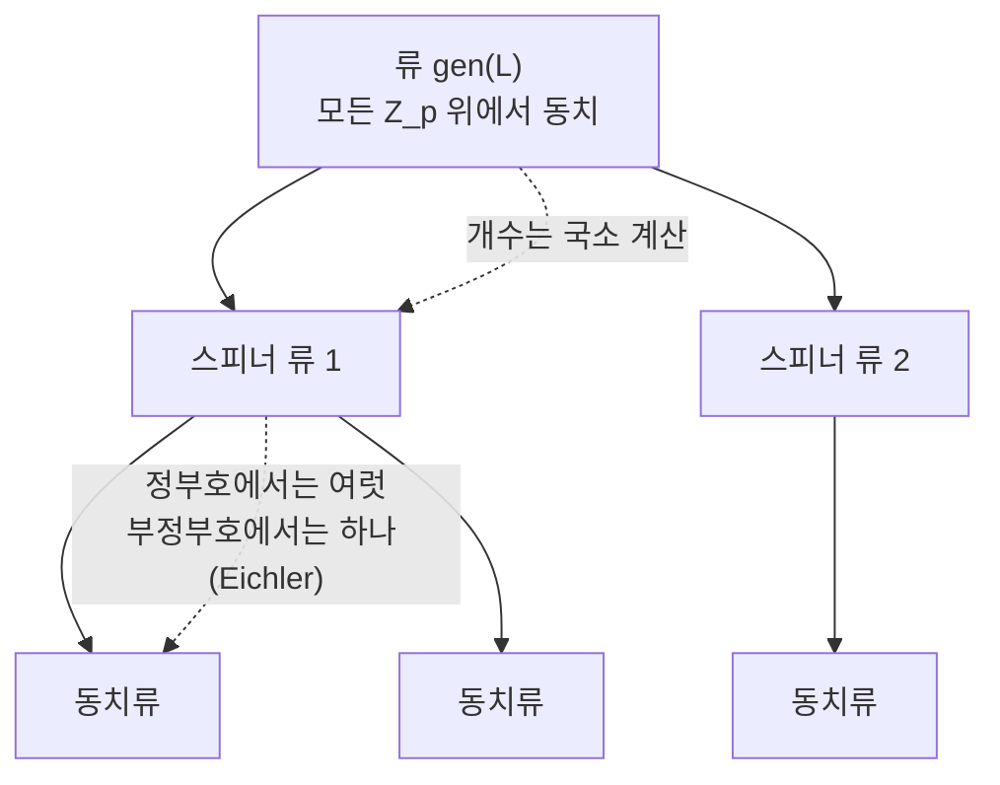

# 질량 공식과 격자의 류

# 개요

정부호 이차형식의 분류에서 판별식과 차원을 고정해도 $\mathbb Z$ 위의 동치류 개수 $h$ 는 알 수 없다. $h$ 는 차원에 따라 불규칙하게 튀고 이 값을 주는 닫힌 공식은 없다.

**질량 공식**은 개수 대신 가중 개수에 닫힌 식을 준다[^1].

$$
\mathrm{mass}(\mathrm{gen}\thinspace L)=\sum_{[L']\in\mathrm{gen}\thinspace L}\frac1{|\mathrm{Aut}L'|}
$$

이 합은 격자를 하나도 모른 채 국소 데이터만으로 계산된다. Minkowski 가 낮은 차원에서 발견하고 Siegel 이 일반 차원에서 증명했다.

[Siegel–Weil 공식](siegel-weil.md)은 류 평균 $\sum_i r_{Q_i}(n)/|\mathrm{Aut}Q_i|$ 를 국소 밀도의 곱으로 주는데, 그 분모의 정규화 인자가 질량이다. 질량 공식은 Siegel 공식의 $n=0$ 자리, 곧 표현수를 묻기 전에 나눠야 하는 상수다.

값이 [Bernoulli 수](bernoulli-numbers.md)로 나오는 것은 국소 인자의 곱이 $\zeta(2),\zeta(4),\dots$ 의 곱으로 모이고 짝수 자리의 zeta 값이 Bernoulli 수이기 때문이다.

# 직관

## 가중 개수와 아델 부피

유한군 $G$ 가 작용하는 집합의 궤도를 셀 때 $\sum 1/|\text{안정자}|$ 를 쓴다. 격자에서 안정자는 $\mathrm{Aut}L$ 이고 $1/|\mathrm{Aut}L|$ 로 가중한 합만이 매끄러운 양이 된다.

[아델](adeles.md) 쪽에서 류 전체는 아델 직교군의 이중잉여류

$$
O(V)(\mathbb Q)\ \backslash\ O(V)(\mathbb A)\ /\ \prod_v O(L_v)
$$

와 대응하고 이 이중잉여류는 유한 개이며 그 개수가 $h$ 다. 왼쪽 몫공간에 Haar 측도를 주면 각 이중잉여류의 부피가 $1/|\mathrm{Aut}L_i|$ 에 비례한다. 질량은 개수가 아니라 부피이고, 부피는 국소 부피의 곱으로 쪼개지지만 개수는 그렇지 않다.

이 관점에서 질량 공식은 $\mathrm{SO}\_n$ 의 Tamagawa 수가 2 라는 진술과 같다. Weil 이 이 동치를 지적했고, 반단순군의 Tamagawa 수가 1 이라는 추측이 증명되면서 질량 공식이 그 따름정리가 되었다.

## 류와 동치류 사이

류는 국소적으로 구별되지 않는 격자를 모은 것이다. 강근사(strong approximation)가 성립하면 국소적으로 같은 것이 전역적으로도 같아져 $h=1$ 이 된다. 직교군에서 강근사가 깨지는 정도가 $h$ 다.

깨짐은 두 단계다. 스피너 노름

$$
\theta:\ \mathrm{SO}(V)\longrightarrow \mathbb Q^\times/(\mathbb Q^\times)^2
$$

이 회전군을 스핀군으로부터 갈라놓는다. 스핀군에는 강근사가 성립하므로 스피너 노름이 자명한 부분에서는 국소가 전역을 결정하고, 류가 **스피너 류(spinor genus)** 로 갈라진다. 스피너 류의 개수는 국소 계산으로 나오는 2 의 거듭제곱이다. 스피너 류 안에서 동치류가 여럿으로 갈라지는 둘째 단계는 국소 정보로 보이지 않으며, 질량 공식이 다루는 것이 이 단계다.

부정부호이고 계수가 3 이상이면 Eichler 의 정리에 의해 각 스피너 류에 동치류가 정확히 하나다. 부정부호 형식의 분류는 유한한 국소 계산으로 끝나므로 질량 공식이 필요한 자리는 정부호 쪽이고, 정부호에서만 $\mathrm{Aut}L$ 이 유한군이라 가중합이 정의된다.

# 정의

## 격자, 류, 스피너 류

$V$ 를 $\mathbb Q$ 위의 $n$ 차원 이차공간, $L\subset V$ 를 그 위의 격자라 한다.

- $L\cong L'$ (**동치**): $\sigma(L)=L'$ 인 $\sigma\in O(V)$ 가 있다.
- $L'\in\mathrm{gen}\thinspace L$ (**같은 류**): 모든 소수 $p$ 에 대해 $L_p\cong L'\_p$ 이고 $V\otimes\mathbb R$ 위에서도 동치다.
- $L'\in\mathrm{spn}\thinspace L$ (**같은 스피너 류**): 위에 더해 국소 동치를 주는 사상들을 스피너 노름이 자명한 회전 $\sigma_p\in O'(V_p)$ 로 고를 수 있다.

포함관계는 $[L]\subset\mathrm{spn}\thinspace L\subset\mathrm{gen}\thinspace L$ 이고, 류는 유한 개의 동치류로 이루어진다.

## 질량

$$
\mathrm{mass}(\mathrm{gen}\thinspace L)=\sum_{i=1}^{h}\frac1{|\mathrm{Aut}L_i|},
\qquad L_1,\dots,L_h\ \text{는 류의 동치류 대표}
$$

$\mathrm{Aut}L=\lbrace\sigma\in O(V):\sigma(L)=L\rbrace$ 이고 정부호에서 유한군이다.

## Smith–Minkowski–Siegel 질량 공식

질량은 표준 인자와 국소 인자의 곱이다.

$$
\mathrm{mass}(\mathrm{gen}\thinspace L)
=2\thinspace\pi^{-n(n+1)/4}\prod_{j=1}^{n}\Gamma\negthinspace\left(\frac j2\right)\cdot\prod_{p}\frac{2}{\alpha_p(L)}
$$

$\alpha_p(L)$ 는 $L$ 이 자기 자신을 $\mathbb Z_p$ 위에서 표현하는 국소 밀도다. 앞의 상수 2 가 $\mathrm{SO}\_n$ 의 Tamagawa 수이고, 거의 모든 $p$ 에서 $\alpha_p$ 가 1 에 가까워 곱이 수렴한다. Conway 와 Sloane 이 $\alpha_p$ 를 Jordan 분해에서 읽는 절차를 정리했다.

$8\mid n$ 인 **짝수 유니모듈러 격자**에서는 국소 인자가 모두 자명해져 Bernoulli 수만 남는다.

$$
\mathrm{mass}(n)=\frac{|B_{n/2}|}{n}\prod_{j=1}^{n/2-1}\frac{|B_{2j}|}{4j}
$$

$|B_{2j}|/(4j)$ 를 $\zeta(2j)\cdot(2j-1)!/(2\pi)^{2j}\cdot 2$ 로 바꾸면 이 곱이 $\zeta(2)\zeta(4)\cdots$ 의 모임이 된다.

# 성질

## 동치류 개수의 하한

모든 격자는 $-\mathrm{id}$ 를 자기동형으로 가지므로 $|\mathrm{Aut}L|\ge2$ 이고, 따라서 다음이 성립한다.

$$
h\ \ge\ 2\mathrm{mass}(\mathrm{gen}\thinspace L)
$$

반대 방향의 상한은 없다. 자기동형군이 큰 격자 몇 개가 질량을 거의 다 가져갈 수 있다. $n=8$ 에서는 격자가 $E_8$ 하나뿐인데 자기동형군이 위수 $696729600$ 의 Weyl 군이라 질량이 $10^{-9}$ 자리다.

질량이 1 보다 작으면 하한은 쓸모가 없고, 그때 이 공식의 용도는 검산이다. 목록을 다 만들었다고 생각할 때 가중합이 공식의 값과 같은지 본다.

## 차원에 따른 질량의 증가

$n=24$ 까지는 자기동형군이 커서 질량이 1 보다 훨씬 작고 하한이 아무것도 주지 않는다. 24 차원의 질량 $1027637932586061520960267/129477933340026851560636148613120000000$ 은 Niemeier 의 24 개 목록에서 자기동형군 위수로 만든 가중합과 정확히 일치한다.

$n=32$ 에서는 질량이 사천만을 넘으므로 격자가 적어도 팔천만 개이고 완전한 목록을 만들 수 없다. [Niemeier 의 24 차원 분류](niemeier-lattices.md)가 마지막으로 가능한 분류인 근거가 이 계산이다.

## Eichler 의 정리

$V$ 가 부정부호이고 $n\ge3$ 이면 각 스피너 류는 정확히 하나의 동치류를 담는다. 부정부호 격자의 류 안 동치류 개수는 국소 계산으로 결정되고 대개 $h=1$ 이다.

## 스피너 예외

어떤 정수 $n$ 은 류의 모든 형식이 국소적으로 표현하지만 실제로는 특정 스피너 류의 형식만 표현한다. 이런 $n$ 이 **스피너 예외 정수**다. Siegel 공식이 류 평균만 통제하고 개별 형식을 통제하지 못하는 틈이 여기서 드러난다.

# 활용

## 분류의 종료 조건

류 전체를 열거하는 표준 절차는 **Kneser 의 이웃법**이다. 격자 $L$ 과 소수 $p$ 에 대해 $[L:L\cap L']=[L':L\cap L']=p$ 인 $L'$ 를 $p$ 이웃이라 하고, 이웃 관계로 [그래프](graphs.md)를 만들면 한 스피너 류가 연결성분 하나가 된다. 그래프를 탐색해 새 동치류를 모으다가

$$
\sum_{\text{찾은 }L_i}\frac1{|\mathrm{Aut}L_i|}\ =\ \mathrm{mass}
$$

가 되면 멈춘다. 이 조건이 없으면 빠진 격자가 있는지 확인할 방법이 없다. Niemeier 의 24 개 목록과 Conway–Sloane 의 낮은 차원 표들이 이 검산을 통과한 것이다.

## 부호의 질량 공식

길이 $n$ 인 이진 자기쌍대 [부호](error-correcting-codes.md)에도 같은 모양의 공식이 있다. 동치를 좌표 치환군 $S_n$ 의 작용으로 잡으면 다음이 성립한다.

$$
\sum_{[C]}\frac{n!}{|\mathrm{Aut}C|}=\prod_{i=1}^{n/2-1}(2^i+1)
$$

우변은 자기쌍대 부호의 총 개수이고 좌변이 동치류 위의 가중합이다. Mallows 와 Sloane 이 이 공식으로 짧은 길이의 자기쌍대 부호 분류를 검산했다. 격자와 부호는 구성 $A$ 로 이어져 있다.

## 사원수 대수의 질량

Eichler 의 질량 공식은 확정 사원수 대수의 좌이념류에 같은 가중합을 쓴다. [유한체](finite-fields.md) 위 [초특이 곡선](supersingular-isogeny-graphs.md)을 자기동형군 크기로 가중해 세면 $(p-1)/24$ 가 나오고, 이것이 [사원수 대수와 모듈러 형식의 대응](jacquet-langlands.md)에서 무게 2 첨점형식의 차원 공식으로 이어진다. 직교군 대신 사원수 대수의 곱셈군을 쓴 것이며 아델 부피를 이중잉여류에 나눈다는 구조는 같다.

## 가중 질량

$\sum 1/|\mathrm{Aut}L_i|$ 대신 각 격자에 조화 다항식 값을 곱해 더하면 가중 질량이 되고, 이것이 [theta 급수](theta-series.md)의 류 평균이다. Siegel 공식 우변의 [Eisenstein 급수](eisenstein-series.md) 계수가 그 값이며, 질량 공식은 이 가족의 상수항에 해당한다.

[^1]: 일반 공식과 국소 밀도의 계산 절차는 J. Conway–N. Sloane, *Low-dimensional lattices IV: the mass formula*, Proc. R. Soc. Lond. A 419 (1988). 짝수 유니모듈러 판과 자기동형군 위수 표는 같은 저자의 *Sphere Packings, Lattices and Groups* (3판, 1999) 16 장. 스피너 류와 Eichler 의 정리는 J. Cassels, *Rational Quadratic Forms* (1978) 11 장. Tamagawa 수와의 동치는 A. Weil, *Adeles and Algebraic Groups* (1982). 부호 쪽 질량 공식은 C. Mallows–N. Sloane, *An upper bound for self-dual codes*, Inform. and Control 22 (1973).

# 연관 문서

## 선수지식

- [Siegel–Weil 공식과 이차형식의 표현수](siegel-weil.md)
- [Bernoulli 수와 von Staudt–Clausen 정리](bernoulli-numbers.md)

## 더 알아보기

- [Niemeier 격자](niemeier-lattices.md)

#number_theory #linear_algebra #theorem
