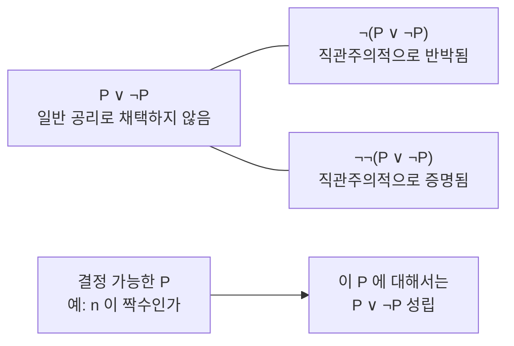

# 수학적 직관주의

# 개요

수학의 대상은 어디에 있는가. [수학적 플라톤주의](mathematical-platonism.md)는 우리와 무관하게 존재하는 추상적 대상을 가리키고, [형식주의](formalism-hilbert-program.md)는 기호 조작의 규칙만 있으면 된다고 답한다. Brouwer 의 직관주의는 셋째 답을 준다. 수학적 대상은 수학자의 정신이 시간 안에서 수행하는 구성의 산물이며, 그 구성 바깥에 수학적 사실은 없다.

이 입장은 [명제와 증명](proofs.md)이 무엇인지를 바꾼다. "존재한다" 는 구성을 제시했다는 뜻이고, "참이다" 는 증명을 가졌다는 뜻이다. 그러면 아직 증명도 반증도 없는 명제는 참도 거짓도 아니며, 배중률을 모든 명제에 무조건 적용할 근거가 사라진다.

주의할 구분이 하나 있다. 직관주의는 철학적 입장이고, [직관주의 논리](intuitionistic-logic.md)는 그 입장과 어울리는 형식 체계다. 후자는 전자에서 자라났지만 전자와 같지 않다. Brouwer 자신은 논리를 수학의 기초로 보지 않았고 형식화에 회의적이었다.

# 직관

## 참은 증명에 의존한다

고전적 그림에서 명제는 우리가 알든 모르든 이미 참이거나 거짓이다. Goldbach 추측은 지금 이 순간 둘 중 하나다. 직관주의는 이 그림을 거부한다. 증명을 얻기 전까지 그 명제는 아직 아무 진리값도 가지지 않는다.

그래서 $P \lor \lnot P$ 를 일반 원리로 주장할 수 없다. 이 식을 주장하려면 둘 중 어느 쪽인지를 제시해야 하는데, 미해결 명제에 대해 그럴 수 없기 때문이다. 배중률은 "모든 수학적 문제가 원리적으로 해결 가능하다" 는 형이상학적 전제를 몰래 쓰고 있다는 것이 Brouwer 의 진단이다.

## 무한은 완결되지 않는다

자연수 전체를 한꺼번에 주어진 완결된 집합으로 보는 대신, 언제까지나 이어 갈 수 있는 구성 과정으로 본다. 이것이 잠재적 무한이다. 완결된 무한 집합 위에서 "모든 원소에 대해 성립하거나 아니거나" 를 말하는 순간 배중률이 다시 들어온다.

실수는 더 극적이다. 직관주의의 실수는 유한한 시점에서는 유한한 정보만 가지는 수열이고, 그 수열의 다음 항이 무엇일지 미리 정해져 있지 않아도 된다. 이를 선택수열이라 한다.

## 배중률을 부정하는 것이 아니다

흔한 오해다. 직관주의는 $P \lor \lnot P$ 를 공리로 채택하지 않을 뿐, $\lnot(P \lor \lnot P)$ 를 주장하지 않는다. 오히려 후자는 직관주의적으로 반박된다.

즉 배중률은 금지된 것이 아니라 공짜가 아닌 것이다. 결정 절차가 있는 명제에 대해서는 언제든 쓸 수 있다.

# 정의

## Brouwer 의 두 행위

Brouwer 는 수학의 원천을 두 가지로 놓았다.

첫째 행위는 수학을 언어와 논리에서 분리하고, 시간 경험의 원초적 직관 위에 세우는 것이다. 한 순간이 둘로 나뉘는 경험에서 둘이 나오고, 이를 반복해 자연수가 나온다. 수학은 이 정신적 구성이지 그것을 적은 기호가 아니다.

둘째 행위는 이미 구성된 대상들의 무한 수열을 새 대상으로 허용하는 것이다. 이때 수열은 법칙으로 완전히 결정되지 않아도 되고, 각 시점에 유한한 항만 정해져 있으면 된다. 여기서 선택수열과 연속체가 나온다.

## BHK 해석

증명의 의미를 연결사별로 규정한다. Brouwer, Heyting, Kolmogorov 의 이름을 땄다.

| 명제 | 증명이 제시해야 하는 것 |
|---|---|
| $A \land B$ | $A$ 의 증명과 $B$ 의 증명 |
| $A \lor B$ | 어느 쪽인지의 지정과 그쪽의 증명 |
| $A \to B$ | $A$ 의 증명을 $B$ 의 증명으로 바꾸는 구성 |
| $\lnot A$ | $A$ 의 증명에서 모순을 얻는 구성, 즉 $A \to \bot$ |
| $\exists x \in D.\ A(x)$ | 원소 $d \in D$ 와 $A(d)$ 의 증명 |
| $\forall x \in D.\ A(x)$ | 각 $d \in D$ 에 $A(d)$ 의 증명을 주는 구성 |

존재와 선언에서 실제 증거를 요구하는 것이 핵심이다. 이 해석은 "구성" 이라는 말을 형식적으로 정의하지 않으므로 그 자체로 완결된 의미론이 아니다. 정확한 반례 제시 도구는 [Kripke 의미론](kripke-semantics.md)이 제공한다.

## 선택수열과 연속성 원리

$\alpha$ 가 자연수의 선택수열이면, 어느 시점에도 $\alpha$ 의 유한한 앞부분만 알려져 있다. 따라서 $\alpha$ 에 대한 판단은 그 유한한 앞부분만으로 내려져야 한다. 이것이 연속성 원리다.

$$
\forall\alpha\,\exists n\,A(\alpha,n)\quad\Longrightarrow\quad\forall\alpha\,\exists m\,\exists n\,\forall\beta\,\big(\bar\alpha m=\bar\beta m\to A(\beta,n)\big)
$$

여기서 $\bar\alpha m$ 은 $\alpha$ 의 첫 $m$ 항이다. 모든 수열에 어떤 값을 대응시키는 방법이 있다면, 그 값은 유한한 앞부분만 보고 정해져야 한다는 뜻이다.

# 성질

## 이중부정 배중률

배중률을 채택하지 않으면서도 다음은 증명된다.

$$
\neg\neg(P\lor\neg P)
$$

$\lnot(P \lor \lnot P)$ 를 가정한다. $P$ 가 있으면 왼쪽 선언지로 $P \lor \lnot P$ 를 얻어 모순이므로, $P \to \bot$ 즉 $\lnot P$ 를 구성했다. 그런데 이 $\lnot P$ 로 오른쪽 선언지를 만들면 다시 $P \lor \lnot P$ 이므로 모순이다. 따라서 $\lnot\lnot(P \lor \lnot P)$ 다.

여기서 이중부정을 제거해 배중률로 가는 단계가 바로 직관주의가 채택하지 않는 원리다. 이 비대칭이 고전 논리와의 거리를 정확히 보여 준다.

## 고전 논리와의 거리는 부정에만 있다

$\lnot\lnot P \to P$ 를 추가하면 고전 논리 전체가 복원된다. 반대로 부정이 개입하지 않는 영역, 예컨대 Harrop 식 명제나 결정 가능한 술어에 대한 유한 범위 양화에서는 두 논리가 같은 정리를 증명한다. 산술에서도 Gödel–Gentzen 번역이 고전 산술의 모든 정리를 직관주의 산술의 정리로 옮긴다. 잃는 것은 증명 가능성이 아니라 증명의 정보량이다.

## 구성적 존재의 이득

직관주의 산술은 존재 성질을 가진다. $\exists x.\ A(x)$ 가 증명되면 구체적인 항 $t$ 와 $A(t)$ 의 증명을 증명에서 뽑아낼 수 있다. 선언 성질도 마찬가지다. $A \lor B$ 가 증명되면 둘 중 어느 쪽이 증명되는지 결정된다. 고전 산술은 이 성질을 가지지 않는다.

이것이 형식 증명에서 프로그램을 추출하는 기술의 논리적 근거이며, [Curry–Howard 대응](curry-howard.md)으로 정확히 표현된다.

## Brouwer 의 연속성 정리

연속성 원리와 둘째 행위를 받아들이면 놀라운 결과가 나온다. 닫힌 구간 $[0,1]$ 에서 정의된 모든 전함수는 연속이다.

고전적으로는 명백히 거짓으로 보인다. 계단 함수가 있지 않은가. 그러나 직관주의의 실수는 선택수열이므로, $x < 1/2$ 인지 $x \ge 1/2$ 인지를 유한한 정보로 판정할 수 없다. 그런 판정을 요구하는 함수는 전함수가 아니다. 즉 정의역이 좁아져서 반례가 사라진다.

이 정리는 직관주의가 고전 수학의 부분 체계가 아니라는 것을 보여 준다. 고전적으로 거짓인 명제를 정리로 가진다. 이 점에서 직관주의는 배중률만 뺀 약한 수학이 아니라 다른 수학이다.

## 비교

| 입장 | 수학적 대상 | 증명의 역할 |
|---|---|---|
| [플라톤주의](mathematical-platonism.md) | 우리와 독립적으로 존재 | 이미 있는 사실의 발견 |
| [논리주의](logicism.md) | 논리적 개념으로 환원 | 논리에서의 도출 |
| [형식주의](formalism-hilbert-program.md) | 규칙이 지배하는 기호 | 무모순성이 보장하는 조작 |
| 직관주의 | 정신의 구성 | 대상과 참을 만들어 내는 활동 |

# 활용

## 증명의 의존성 점검

어떤 정리를 볼 때 그 증명이 배중률이나 [선택공리](axiom-of-choice.md)에 의존하는지를 묻는 습관이 여기서 나온다. 해가 없다고 가정해 모순을 얻은 증명과, 해를 만들고 조건을 확인한 증명을 구분하면 후자에서만 알고리즘이 나온다.

역수학은 이 물음을 체계화한 분야로, 각 정리가 정확히 어떤 원리와 동치인지를 측정한다.

## 증명 보조 도구의 기초

Coq, Agda, Lean 같은 도구의 핵심 논리는 직관주의적이다. 배중률은 필요하면 공리로 따로 추가하며, 추가하지 않은 증명에서는 실행 가능한 프로그램을 자동으로 추출할 수 있다. BHK 해석이 그대로 타입 규칙이 된다.

## 구성적 수학의 여러 갈래

Bishop 의 구성적 해석학은 Brouwer 의 선택수열과 연속성 원리를 받아들이지 않으면서 배중률만 쓰지 않는다. 그래서 고전 수학과 직관주의 수학 양쪽의 부분 체계가 된다. Markov 의 러시아 구성주의는 구성을 [계산 가능성](computability.md)과 동일시한다. "구성적" 이라는 말이 여러 입장을 가리킨다는 점을 염두에 두어야 한다[^1].

[^1]: Rosalie Iemhoff, *Intuitionism in the Philosophy of Mathematics*, Stanford Encyclopedia of Philosophy, https://plato.stanford.edu/entries/intuitionism/. §2 의 두 행위, §3 의 연속성 정리, §5 의 구성주의 여러 입장 비교.

# 연관 문서

## 선수지식

- [명제와 증명](proofs.md)

## 더 알아보기

- [직관주의 논리](intuitionistic-logic.md)

#philosophy_of_math #foundations
