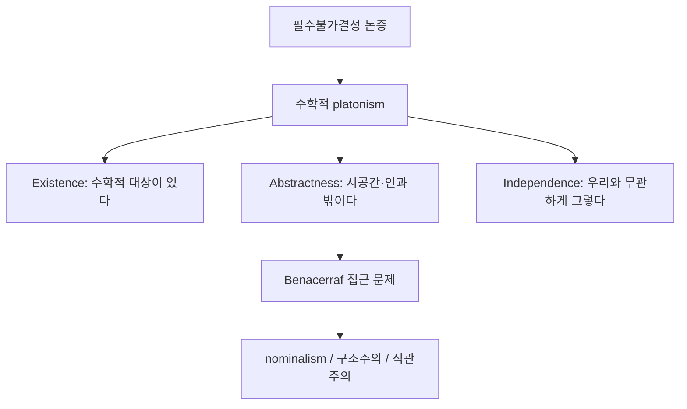

# 수학적 플라톤주의

# 개요

수학적 platonism은 수 · 집합 · 함수 같은 수학적 대상이 실제로 존재하며, 그것이 추상적이고 우리의 언어 · 사고 · 관행과 독립적이라고 보는 존재론적 입장이다. 표준적으로 Existence, Abstractness, Independence의 세 주장으로 정리된다[^1]. 수학자의 일상적 화법("소수가 무한히 많이 존재한다")을 문자 그대로 읽으면 가장 자연스러운 입장이지만, 그 대가로 인과적으로 접근할 수 없는 대상에 대한 지식을 설명해야 한다. 이 부담이 Benacerraf 딜레마이고, 이를 피하려는 시도에서 [직관주의](mathematical-intuitionism.md), [구조주의](mathematical-structuralism.md), nominalism이 갈라져 나온다. 수학의 내용을 바꾸는 주장이 아니라 수학의 대상과 정당화에 관한 해석이라는 점이 중요하다.

# 직관

물리학자가 전자를 믿는 이유는 전자가 관측 결과를 설명하기 때문이다. 그런데 그 설명은 미분방정식과 Hilbert 공간을 경유한다. 전자는 믿고 실수는 믿지 않는 태도가 일관적인가? 이것이 Quine–Putnam 필수불가결성 논증의 출발점이다.

반대 방향의 직관도 강하다. 어떤 실험도 "7이 소수다"를 흔들지 못한다. 7은 어디에도 위치하지 않고 아무것도 하지 않으므로, 우리 감각과 인과적으로 연결될 길이 없다. 그런데도 우리는 7에 관해 안다.

# 정의

platonism의 세 주장을 명제로 적는다. 대상의 영역을 M이라 하자[^1].

$$
\textbf{Existence:}\quad \exists x\,(x \in M)
$$

$$
\textbf{Abstractness:}\quad \forall x \in M\ (x \text{ is not spatiotemporal and not causally active})
$$

$$
\textbf{Independence:}\quad \forall x \in M\ (\text{존재와 성질이 인간의 언어·사고·관행에 의존하지 않는다})
$$

세 주장을 모두 받아들이면 platonism, Existence를 부정하면 nominalism, Independence를 약화시키면 여러 형태의 구성주의 · 관념론이 된다. 대상 대신 구조만을 일차적 실재로 보는 입장은 ante rem structuralism이라 불리며, Abstractness와 Independence는 유지한다.

전통적 platonism은 여기에 object realism, 즉 M의 원소가 집합이나 수 같은 개별 대상이라는 주장을 더한다. plenitudinous(full-blooded) platonism은 무모순적인 어떤 수학적 이론이든 그것이 기술하는 대상 영역이 존재한다고 본다.

# 성질

## 필수불가결성 논증

Quine–Putnam 논증의 표준 형태는 세 단계다[^2].

1. 최선의 과학 이론에 필수불가결하게 등장하는 존재자에는 존재론적으로 개입해야 한다 (confirmational holism + naturalism).
2. 수학적 대상은 최선의 과학 이론에 필수불가결하다.
3. 따라서 수학적 대상은 존재한다.

가장 유명한 반론은 Field의 nominalization 기획이다. Newton 중력 이론을 실수 · 함수에 대한 양화 없이 재구성할 수 있다면 전제 2가 무너진다. Field는 시공간 점들 사이의 관계만 쓰는 체계를 제시하고, 수학은 참이 아니라 보수적(conservative)인 도구일 뿐이라고 주장했다. 양자역학까지 같은 방식으로 처리할 수 있는지는 논쟁 중이다. 다른 반론은 전제 1을 겨눈다. 수학은 설명에 기여하는 것이 아니라 표현을 압축하는 인덱스 역할만 한다는 것이다.

## Benacerraf 딜레마

Benacerraf의 "Mathematical Truth"는 두 요구가 동시에 충족되기 어렵다고 지적한다[^1].

- 의미론적 요구: 수학적 진리는 다른 담화의 진리와 같은 방식(Tarski식 지시와 만족)으로 설명되어야 한다.
- 인식론적 요구: 수학적 지식은 일반적인 지식 이론과 양립해야 한다.

첫째 요구는 지시 대상을 요구하므로 platonism에 유리하다. 그러나 그 대상이 인과적으로 불활성이면 우리 믿음이 그 대상의 사정과 어떻게 신뢰성 있게 상관되는지 설명할 수 없다. 인과적 지식 이론을 버려도 문제는 남는다. Field의 재정식화는 "우리의 수학적 믿음이 수학적 사실과 일치하는 경향이 있다는 점을 platonist는 설명할 수 없다"는 신뢰성(reliability) 문제로 표현한다.

## 동일화 문제

Benacerraf의 다른 논문 "What Numbers Could Not Be"는 자연수를 집합으로 구현하는 방식이 여러 가지임을 지적한다. von Neumann 순서수와 Zermelo 표현은 모두 Peano 공리를 만족한다.

$$
0=\varnothing,\quad n+1=n\cup\{n\}
\qquad\text{vs.}\qquad
0=\varnothing,\quad n+1=\{n\}
$$

산술만으로는 둘 중 어느 것이 "진짜 2"인지 결정할 수 없고, 결정할 필요도 없어 보인다. 이는 개별 대상보다 구조가 본질적이라는 결론으로 이어지며 구조주의의 주요 동기다. platonist의 대응은 두 가지다. 어느 한쪽이 실제 자연수라고 인정하되 우리가 알 수 없다고 보거나 (agnostic platonism), 자연수를 구조 안의 위치로 재해석한다.

## 반례가 아닌 것

독립적 명제의 존재는 platonism에 대한 반례가 아니다. 연속체 가설이 ZFC에서 증명도 반증도 되지 않는다는 사실[^3]은 platonist에게 "우리 공리계가 실재를 완전히 포착하지 못한다"는 뜻이고, formalist에게는 "질문 자체가 체계에 상대적"이라는 뜻이다. 같은 수학적 사실이 두 해석 모두와 양립한다. 철학적 입장 차이는 정리로 판정되지 않는다.

# 활용

철학적 입장은 실제 수학적 실천에 다음과 같이 드러난다.

- 공리 채택의 정당화. 큰 기수 공리나 사영 결정성을 받아들일 이유를 묻는 자리에서 platonist는 "집합 우주의 참인 성질"을, formalist는 "체계의 유용성과 무모순성"을 근거로 든다.
- 존재 증명의 읽기. 비구성적 존재 증명을 완결된 지식으로 볼지 아니면 증거 추출이 남은 상태로 볼지가 갈린다. [명제와 증명](proofs.md)의 고전적 추론 규칙을 무제한으로 쓸 수 있는지에 대한 태도 차이다.
- 기초 이론의 선택. [집합](sets.md) 기반 기초와 범주론 · 타입 이론 기반 기초 중 무엇이 "옳은" 기초인지 묻는 질문 자체가 platonism을 전제한다. 도구주의적 입장에서는 목적에 따라 다른 기초를 쓰면 된다.

정리하면 platonism은 수학의 객관성과 응용 가능성을 가장 단순하게 설명하지만 인식론적 부담을 진다. 경쟁 입장들은 그 부담을 덜면서 객관성 설명을 약화시킨다. 어느 쪽도 결정적 승리를 거두지 못한 상태다.

[^1]: Øystein Linnebo, Platonism in the Philosophy of Mathematics, Stanford Encyclopedia of Philosophy, §1 (Existence/Abstractness/Independence), §4 (Benacerraf의 인식론적 논증), §5. https://plato.stanford.edu/entries/platonism-mathematics/
[^2]: Mark Colyvan, Indispensability Arguments in the Philosophy of Mathematics, Stanford Encyclopedia of Philosophy, §1–§4 (논증의 표준 형태와 Field·Maddy의 반론). https://plato.stanford.edu/entries/mathphil-indis/
[^3]: Peter Koellner, The Continuum Hypothesis, Stanford Encyclopedia of Philosophy, §1 (Gödel 1938, Cohen 1963의 독립성 결과). https://plato.stanford.edu/entries/continuum-hypothesis/

# 연관 문서

## 선수지식

- [집합](sets.md)
- [명제와 증명](proofs.md)

## 더 알아보기

- [논리주의와 Frege 프로그램](logicism.md)

#philosophy_of_math
