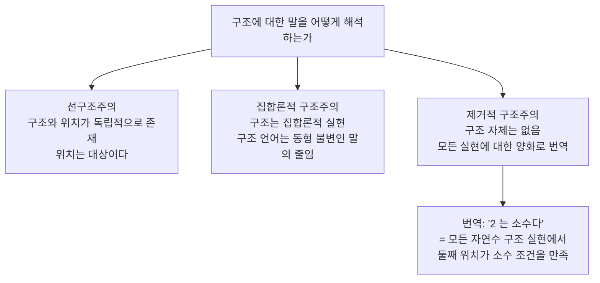

# 수학적 구조주의

# 개요

수 $2$ 는 무엇인가. 집합론으로 자연수를 만들 때 von Neumann 은 $2 = \lbrace\emptyset, \lbrace\emptyset\rbrace\rbrace$ 라 하고 Zermelo 는 $2 = \lbrace\lbrace\emptyset\rbrace\rbrace$ 라 한다. 두 정의 모두 산술 전체를 재현하지만 서로 다른 집합이다. 그렇다면 $2 \in 3$ 이라는 물음은 참인가. 한쪽에서는 참이고 다른 쪽에서는 거짓이다.

이 물음이 무의미하게 느껴진다면 이미 구조주의자다. 구조주의는 수학적 대상이 그것이 무엇으로 만들어졌는지가 아니라 구조 안에서 차지하는 자리로 결정된다고 본다. $2$ 는 어떤 집합이 아니라 자연수 구조에서 $1$ 다음이고 $3$ 앞인 위치다.

이 관점은 [동치관계](relations.md)로 표현을 뭉개는 수학의 일상적 습관을 철학으로 끌어올린 것이다. [군](groups.md)을 다룰 때 원소가 행렬인지 치환인지 묻지 않고 동형이면 같다고 하는 태도가 그 습관이다. 구조주의는 그 태도를 존재론으로 읽으면 무엇이 따라오는지를 묻는다.

# 직관

## 야구팀의 유격수

구조주의의 표준 비유다. 야구팀에는 투수, 포수, 유격수 같은 자리가 있다. 유격수라는 자리는 특정 선수와 동일하지 않다. 누가 그 자리에 서든 자리 자체는 다른 자리들과의 관계로 정의된다.

자연수 구조에서 $2$ 는 유격수 같은 자리다. $\lbrace\emptyset, \lbrace\emptyset\rbrace\rbrace$ 는 그 자리를 채운 선수 중 하나일 뿐이다. "유격수의 키는 몇인가" 가 자리 자체에 대한 물음으로는 답이 없듯이, "$2$ 의 원소가 몇 개인가" 도 자리에 대한 물음으로는 답이 없다.

## 구조가 먼저인가 실현이 먼저인가

비유가 답하지 않는 물음이 남는다. 아무도 서 있지 않은 유격수 자리가 존재하는가.

세 갈래는 수학을 다르게 하지 않는다. 같은 수학적 실천에 대한 다른 해석이다. 그래서 구조주의는 하나의 학설이 아니라 입장들의 가족이다.

# 정의

## 구조와 동형사상

구조는 밑바탕 집합에 연산, 관계, 지정된 원소를 얹은 것이다. 같은 종류의 두 구조 사이에서 이 정보를 전부 보존하는 전단사를 동형사상이라 한다.

두 군 $G$ 와 $H$ 사이의 전단사 $f$ 가 동형사상이라는 조건은 다음이다.

$$
\forall a,b\in G:\quad f(ab)=f(a)f(b)
$$

왼쪽 곱은 $G$ 의 연산이고 오른쪽 곱은 $H$ 의 연산이다. 순서구조라면 $a \le b \iff f(a) \le f(b)$ 를, 위상구조라면 양방향 연속성을 요구한다. 무엇을 보존할지는 처음에 무엇을 구조로 지정했는지에 달려 있다.

## 두 층위

방법론적 구조주의는 연구 태도다. 동형인 표현 사이에서 보존되는 성질에만 주목하고, 표현에 딸린 우연한 사실은 수학의 내용으로 치지 않는다. 이것은 존재론적 주장을 담지 않으며, 거의 모든 현대 수학자가 실천에서 받아들인다.

형이상학적 구조주의는 여기서 한 걸음 더 간다. 그 태도가 옳다면 수학적 대상이란 무엇이어야 하는지를 묻는다. 위 다이어그램의 세 갈래는 이 층위에서 갈린다.

## 구조 성질

성질 $P$ 가 구조적이라는 것은 동형사상으로 보존된다는 것이다.

$$
G\cong H\quad\Longrightarrow\quad \big(P(G)\iff P(H)\big)
$$

"위수가 6 이다", "가환이다", "연결되어 있다" 는 구조적이다. "원소 중에 공집합이 있다", "꼭짓점 이름이 $a$ 다" 는 구조적이지 않다. 구조주의는 수학의 내용이 구조 성질로 이루어진다고 주장한다.

# 성질

## 표현의 차이와 수학적 차이

세 꼭짓점의 이름을 바꾸어도 삼각형 그래프의 연결 관계는 같으므로 동형이고, 구조주의적으로 같은 대상이다. 반면 간선 하나를 지우면 동형이 아니므로 다른 대상이다. 무엇이 유의미한 차이인지를 동형사상이 결정한다.

이 기준은 절대적이지 않고 지정한 구조에 상대적이다. 두 집합이 집합으로서 전단사라 해도 거리, 덧셈, 위상을 보존하는 대응이 있다는 뜻은 아니다. $\mathbb R$ 과 $\mathbb R^2$ 는 집합으로서 같은 크기지만 위상공간으로도 벡터공간으로도 다르다.

## 구현은 정체성을 정하지 않는다

어떤 대상이 특정 집합으로 구현될 수 있다는 사실만으로 그 대상이 본질적으로 그 집합이라는 결론은 나오지 않는다. 서로 다른 구현이 똑같이 정당하면 어느 하나를 정체성으로 고를 근거가 없기 때문이다. 이 논증은 Benacerraf 가 자연수의 집합론적 구현을 두고 제시했고, 구조주의의 표준적 출발점이 되었다[^1].

## 선구조주의의 난점

위치를 대상으로 인정하면 곤란한 사례가 생긴다. 복소수체 $\mathbb C$ 에서 $i$ 와 $-i$ 는 구조적으로 구별되지 않는다. 둘을 맞바꾸는 켤레 사상이 체 동형사상이기 때문이다. 그런데 둘은 서로 다른 두 대상이다. 구조 성질만으로 결정되지 않는 구별이 남는다.

같은 일이 어디에나 있다. 구조에 자기동형사상이 있으면 서로 옮겨지는 위치들은 구조적으로 구별할 수 없다. 위치가 대상이라면 구별 불가능한 서로 다른 대상들이 있어야 하고, 이것이 선구조주의가 답해야 할 지점이다. 자연수 구조에 자기동형사상이 항등뿐이라는 점이 산술에서 이 문제가 보이지 않는 이유다.

## 수학적 실천과의 대조

| 실천 | 구조주의적 독해 |
|---|---|
| "동형인 것은 같은 것으로 본다" | 동형사상이 정체성의 기준 |
| 좌표를 고르고 계산한 뒤 좌표 무관함을 확인 | 좌표는 실현, 결론은 구조 성질 |
| 보편성질로 대상을 특징짓기 | 구현이 아니라 관계로 정의 |
| 유일성을 "동형을 무시하면 유일" 로 말하기 | 위치까지만 결정됨 |

마지막 두 줄은 [범주](category.md)론의 언어와 정확히 겹친다. 대상 내부를 보지 않고 사상으로만 말한다는 규율은 구조주의를 수학 안에서 실행한 것이라고 볼 수 있다. 다만 범주론은 수학 이론이고 구조주의는 그 실천에 대한 해석이므로 둘을 동일시하지는 않는다.

# 활용

## 기초 체계의 선택을 읽기

집합론을 기초로 삼으면 모든 대상이 집합으로 구현되고, 구현에 딸린 우연한 사실이 언어 안에 남는다. $2 \in 3$ 이 뜻을 가지는 것이 그 흔적이다. 구조적 집합론이나 타입 이론 기반의 기초는 처음부터 그런 물음을 말할 수 없게 언어를 설계한다. 어느 쪽이 나은지가 아니라 무엇을 말할 수 있게 하는지가 구조주의가 던지는 물음이다.

동형인 대상이 같은 성질을 가진다는 것을 공리로 못 박는 시도도 이 계열이다. 이때 "동형을 무시하면 유일" 이 메타 수준의 관찰이 아니라 체계 내부의 정리가 된다.

## 철학적 결론과 수학적 사실의 분리

구조주의의 실용적 효용은 경계를 긋는 데 있다. "자연수는 집합으로 구현된다" 는 수학적 사실이고 "자연수는 집합이다" 는 철학적 주장이다. 전자에서 후자는 따라오지 않는다.

거꾸로 철학적 입장 차이가 수학의 내용을 바꾸지 않는다는 점도 분명히 해 둘 만하다. 선구조주의자와 제거적 구조주의자는 같은 정리를 증명한다.

## 왜 동형이 옳은 기준인지 되묻기

구조주의를 받아들여도 남는 실천적 물음이 있다. 어떤 맥락에서 무엇을 구조로 지정할 것인가. 같은 집합에 어떤 구조를 얹느냐에 따라 같음의 기준이 달라지므로, 문제에 맞는 구조를 고르는 일 자체가 수학의 내용이 된다. 위상적 분류와 미분구조 분류가 다른 답을 주는 상황이 그 예다.

[^1]: Paul Benacerraf, *What Numbers Could Not Be* (1965). 구조주의 전반은 Stanford Encyclopedia of Philosophy, *Structuralism in the Philosophy of Mathematics*, https://plato.stanford.edu/entries/structuralism-mathematics/ 의 §1 방법론적/형이상학적 구분과 §4 의 여러 입장 비교를 따랐다.

# 연관 문서

## 선수지식

- [동치관계와 동치류](relations.md)
- [군](groups.md)
- [수학기초론 개관](foundations-overview.md)

## 더 알아보기

- [구조적 집합론과 동형 불변성](structural-set-theory.md)

#philosophy_of_math #foundations
