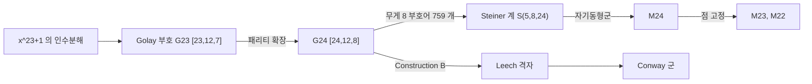

# Mathieu 군과 Golay 부호

# 개요

[유한 단순군 분류](finite-simple-groups.md)의 26 개 산재군 가운데 다섯 개가 1861–1873 년에 Mathieu 가 발견한 것들이다.

$$
M_{11},\ M_{12},\ M_{22},\ M_{23},\ M_{24}
$$

나머지 21 개보다 100 년 가까이 앞섰고, 한동안 이들이 유일한 예외인 줄 알았다. Mathieu 가 찾던 것은 **다중추이 순열군**이었다. `k`-중 추이란 서로 다른 점 `k` 개를 서로 다른 점 `k` 개로 보내는 군원소가 항상 있다는 뜻으로, `k` 가 커질수록 군이 커야 하므로 조건이 가혹해진다.

실제로 분류 정리의 따름정리로 알려진 사실이 이렇다.

> 4-중 추이 유한 순열군은 `S_n`, `A_n` 과 `M_{11},M_{12},M_{23},M_{24}` 뿐이다. 5-중 추이인 것은 `M_{12}` 와 `M_{24}` 뿐이다.

`M_{24}` 가 24 개 점에 5-중 추이로 작용한다는 사실 하나가 이 군의 존재를 거의 규정한다.

이 군들이 어디서 오는가에 대한 가장 깔끔한 답은 [오류정정부호](error-correcting-codes.md)다. 길이 24 의 이진 **Golay 부호** `\mathcal G_{24}` 의 자기동형군이 정확히 `M_{24}` 이고, 나머지 네 개는 점을 고정해 가며 얻는 부분군이다. 조합적으로 완벽한 부호 하나가 산재군 다섯 개를 낳고, 거기서 Leech 격자와 Conway 군을 거쳐 [괴물 달빛](monstrous-moonshine.md)까지 이어진다.

# 직관

## 완전 부호는 거의 없다

길이 `n`, 최소거리 `2t+1` 인 이진 부호가 `t` 개의 오류를 고친다. 각 부호어 주변의 반지름 `t` 공이 서로 겹치지 않으므로

$$
|\mathcal C|\cdot\sum_{i=0}^{t}\binom ni\le2^n
$$

이 성립한다. 등호가 되는 부호를 **완전 부호**라 한다. 공간에 빈틈이 전혀 없다는 뜻이고, 그런 배치는 극히 드물다. 자명한 것을 빼면 Hamming 부호족과 Golay 부호 두 개(이진 `[23,12,7]`, 삼진 `[11,6,5]`)가 전부다.

`\mathcal G_{23}` 의 경우를 보자.

$$
2^{12}\left(\binom{23}0+\binom{23}1+\binom{23}2+\binom{23}3\right)=2^{12}\cdot2048=2^{12}\cdot2^{11}=2^{23}
$$

딱 맞는다. `1+23+253+1771=2048` 이 하필 2 의 거듭제곱이라는 산술적 우연이 없으면 이 부호는 존재할 수 없다. 완전성이 남기는 여유 없는 구조가 큰 대칭군을 강제한다.

## 부호에서 디자인으로, 디자인에서 군으로

`\mathcal G_{24}` 의 무게 8 짜리 부호어가 759 개 있다. 각각을 24 개 자리 중 8 개의 집합으로 보면 **옥타드**라 부르는 블록이 되고, 이 759 개 블록이 놀라운 성질을 가진다.

> 24 개 점 중 임의의 5 개를 고르면, 그 5 개를 모두 포함하는 옥타드가 **정확히 하나** 있다.

이런 구조를 Steiner 계 `S(5,8,24)` 라 한다. 블록 수를 세는 것은 간단하다. 5 원소 부분집합이 `\binom{24}5` 개이고 각 옥타드가 `\binom85` 개를 담으므로

$$
\frac{\binom{24}5}{\binom85}=\frac{42504}{56}=759
$$

로 앞의 숫자와 맞는다. 그리고 `M_{24}` 는 이 Steiner 계의 자기동형군이다. 5 개 점을 아무렇게나 옮겨도 구조가 보존되어야 하므로 5-중 추이성이 자연스럽게 나온다.



# 정의

## Golay 부호

`\mathbb F_2[x]` 에서 `x^{23}+1` 은 `(x+1)g_1(x)g_2(x)` 로 인수분해되고, 두 인수는 11 차다.

$$
g_1(x)=x^{11}+x^9+x^7+x^6+x^5+x+1
$$

`g_1` 이 생성하는 길이 23 의 순환부호가 **이진 Golay 부호** `\mathcal G_{23}` 이고 매개변수가 `[23,12,7]` 이다. 여기에 전체 패리티 비트를 붙인 것이 **확장 Golay 부호** `\mathcal G_{24}`, 매개변수 `[24,12,8]` 이다.

`\mathcal G_{24}` 는 자기쌍대다. 곧 `\mathcal C=\mathcal C^\perp` 이고, 모든 부호어의 무게가 4 의 배수다.

## Mathieu 군

- `M_{24}=\operatorname{Aut}(\mathcal G_{24})`, 24 개 좌표의 순열 중 부호를 보존하는 것들. 위수 `244823040`.
- `M_{23}` 은 `M_{24}` 에서 한 점의 안정자. 위수 `10200960`.
- `M_{22}` 는 두 점의 안정자. 위수 `443520`.
- `M_{12}`, `M_{11}` 은 길이 12 의 삼진 Golay 부호 `[12,6,6]` 에서 같은 방식으로 얻는다. 위수 `95040`, `7920`.

다섯 개 모두 단순군이다. `M_{24}` 의 위수는 5-중 추이성에서 곧바로 읽힌다.

$$
|M_{24}|=24\cdot23\cdot22\cdot21\cdot20\cdot|M_{24}|_{(5\text{점 고정})}=24\cdot23\cdot22\cdot21\cdot20\cdot48
$$

5 개 점을 고정한 부분군의 위수가 48 로 작다는 것이 이 군의 조밀함을 보여 준다.

# 성질

## 부호를 실제로 만들어 보기

생성다항식에서 순환부호를 만들고 무게 분포를 센다.

```python
from collections import Counter
from math import comb

# g(x) = x^11 + x^9 + x^7 + x^6 + x^5 + x + 1, 비트로 표현
g = sum(1 << e for e in [11, 9, 7, 6, 5, 1, 0])

def polymul(a, b):
    r = 0
    while b:
        if b & 1:
            r ^= a
        a <<= 1
        b >>= 1
    return r

def polymod(a, m):
    dm = m.bit_length() - 1
    while a and a.bit_length() - 1 >= dm:
        a ^= m << (a.bit_length() - 1 - dm)
    return a

print(polymod((1 << 23) | 1, g) == 0)      # True : g 가 x^23+1 을 나눈다

wt = lambda x: bin(x).count("1")
words = [polymul(m, g) for m in range(1 << 12)]     # <g> 의 원소 4096 개
print(sorted(Counter(map(wt, words)).items()))
# [(0, 1), (7, 253), (8, 506), (11, 1288), (12, 1288), (15, 506), (16, 253), (23, 1)]

ext = [(w << 1) | (wt(w) & 1) for w in words]       # 패리티 비트 확장
print(sorted(Counter(map(wt, ext)).items()))
# [(0, 1), (8, 759), (12, 2576), (16, 759), (24, 1)]

print(comb(24, 5) // comb(8, 5))                     # 759
print(sum(comb(23, i) for i in range(4)) * 2**12 == 2**23)   # True : 완전 부호
```

확장 부호의 무게가 `0,8,12,16,24` 뿐이다. 최소거리가 8 이고 모든 무게가 4 의 배수라는 것이 한눈에 보이며, 무게 8 짜리가 759 개로 Steiner 계의 블록 수와 정확히 일치한다. 무게 분포가 `w\leftrightarrow24-w` 로 대칭인 것은 전체 1 벡터가 부호에 속하기 때문이다.

`\mathcal G_{23}` 쪽에서는 마지막 줄이 완전성을 확인한다. 반지름 3 인 공들이 `\mathbb F_2^{23}` 을 빈틈없이 덮는다.

## 왜 대칭이 큰가

`\mathcal G_{24}` 의 자기동형군이 크다는 것은 무게 분포가 극도로 성기다는 데서 예감할 수 있다. 4096 개 부호어가 다섯 개의 무게에만 몰려 있으므로, 좌표를 섞어도 부호가 유지될 여지가 많다.

실제 값 `|M_{24}|=244823040=2^{10}\cdot3^3\cdot5\cdot7\cdot11\cdot23` 은 24 개 좌표의 순열 전체 `24!\approx6.2\times10^{23}` 에 비하면 극히 작은 부분군이지만, 산재군으로서는 충분히 크다. 11 과 23 이 소인수로 들어가는 것이 순환부호의 길이 23 에서 온 흔적이다.

## Leech 격자로

`\mathcal G_{24}` 에서 24 차원 [격자](lattices.md)를 만드는 방법이 Construction B 다. 대략적으로

$$
\Lambda=\frac1{\sqrt8}\left\{x\in\mathbb Z^{24}:x\bmod2\in\mathcal G_{24},\ \textstyle\sum x_i\equiv0\ (\mathrm{mod}\ 4)\right\}
$$

에 보정 벡터를 더한 것이 **Leech 격자**다. Golay 부호의 최소거리 8 이 격자의 최소노름 4 로 번역되고, 노름 2 인 벡터가 없다는 성질이 여기서 나온다. 이 성질이 [theta 급수](theta-functions.md)와 [구 채우기](sphere-packing.md)에서 결정적이었고, [정점작용소대수](vertex-operator-algebras.md) `V^\natural` 의 구성에서도 같은 자리를 차지한다.

Leech 격자의 자기동형군이 Conway 군 `\mathrm{Co}_0` 이고, 그 몫과 안정자에서 산재군 여러 개가 더 나온다. 산재군 26 개 중 12 개가 Leech 주변에 모여 있다.

# 활용

## 우주 탐사

보이저 1 호와 2 호가 목성과 토성의 사진을 보낼 때 확장 Golay 부호 `[24,12,8]` 을 썼다. 전송률이 절반으로 떨어지는 대신 3 비트까지 오류를 고칠 수 있고, 부호율과 정정 능력의 균형이 당시 심우주 통신 조건에 잘 맞았다. 순수 조합론의 예외적 구조가 실제 공학 규격이 된 사례다.

이후 더 나은 부호(Reed–Solomon, 터보, LDPC)가 나와 지금은 쓰이지 않지만, 짧은 길이에서 완전 부호라는 성질은 대체 불가능하다.

## 산재군의 첫 층

`M_{24}` 는 Conway 군과 함께 "행복한 가족" 의 첫 두 층을 이룬다. 괴물군의 부분몫으로 나타나는 20 개의 산재군 중 상당수가 `\mathcal G_{24}` 의 조합에서 출발한다. 24 라는 숫자가 부호, 격자, 모듈러 형식, 산재군에 반복해 나타나는 현상의 출발점이 여기다.

## Mathieu 달빛

2010 년에 Eguchi, Ooguri, Tachikawa 가 K3 곡면의 타원 종수를 `\mathcal N=4` 지표로 분해하다가, 계수들이 `M_{24}` 의 기약표현 차원으로 분해된다는 것을 관찰했다. 괴물 달빛과 같은 구조가 `M_{24}` 에서도 일어난 것이다.

이것이 23 개의 Niemeier 격자 각각에 대한 사례로 확장된 것이 umbral moonshine 이고, Duncan–Griffin–Ono 가 존재를 증명했다. `M_{24}` 는 Leech 격자를 뺀 24 차원 짝수 유니모듈러 격자 하나에 딸린 경우다.

[^1]: 부호와 디자인, Leech 격자까지의 경로는 J. Conway, N. Sloane, *Sphere Packings, Lattices and Groups* (3판, 1999) 10, 11 장. 완전 부호의 분류와 Golay 부호의 유일성은 F. MacWilliams, N. Sloane, *The Theory of Error-Correcting Codes* (1977) 20 장. 군 자료는 J. Conway 외, *ATLAS of Finite Groups* (1985). 본문의 계산은 직접 한 것이다.

# 연관 문서

## 선수지식

- [유한 단순군 분류](finite-simple-groups.md)
- [오류정정부호](error-correcting-codes.md)

## 더 알아보기

- [Umbral moonshine 과 Mathieu 달빛](umbral-moonshine.md)

#group_theory #combinatorics #information_theory
