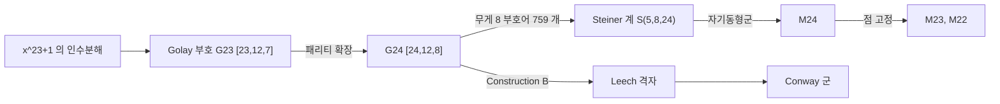

# Mathieu 군과 Golay 부호

# 개요

[유한 단순군 분류](finite-simple-groups.md)의 26 개 산재군 가운데 다섯 개를 Mathieu 가 1861–1873 년에 발견했다.

$$
M_{11},\ M_{12},\ M_{22},\ M_{23},\ M_{24}
$$

나머지 21 개보다 100 년 가까이 앞선다. Mathieu 가 찾던 것은 **다중추이 순열군**이다. $k$ 중 추이란 서로 다른 점 $k$ 개를 서로 다른 점 $k$ 개로 보내는 군원소가 항상 있다는 뜻이고, $k$ 가 커질수록 조건이 가혹해진다.

분류 정리의 따름정리가 다음이다.

> 4-중 추이 유한 순열군은 $S_n$ 과 $A_n$ 과 $M_{11},M_{12},M_{23},M_{24}$ 뿐이다. 5-중 추이인 것은 $M_{12}$ 와 $M_{24}$ 뿐이다.

이 군들의 출처는 [오류정정부호](error-correcting-codes.md)다. 길이 24 의 이진 **Golay 부호** $\mathcal G_{24}$ 의 자기동형군이 $M_{24}$ 이고, 나머지 네 개는 점을 고정해 얻는 부분군이다. 부호 하나에서 산재군 다섯 개가 나오고, 거기서 Leech 격자와 Conway 군을 거쳐 [괴물 달빛](monstrous-moonshine.md)으로 이어진다.

# 직관

## 완전 부호

길이가 $n$ 이고 최소거리가 $2t+1$ 인 이진 부호는 $t$ 개의 오류를 고친다. 각 부호어 주변의 반지름 $t$ 공이 겹치지 않으므로 다음이 성립한다.

$$
|\mathcal C|\cdot\sum_{i=0}^{t}\binom ni\le2^n
$$

등호가 되는 부호가 **완전 부호**다. 자명한 것을 빼면 Hamming 부호족과 Golay 부호 두 개, 곧 이진 $[23,12,7]$ 과 삼진 $[11,6,5]$ 가 전부다.

$\mathcal G_{23}$ 에서 등호는 다음으로 확인된다.

$$
2^{12}\left(\binom{23}0+\binom{23}1+\binom{23}2+\binom{23}3\right)=2^{12}\cdot2048=2^{12}\cdot2^{11}=2^{23}
$$

$1+23+253+1771=2048$ 이 2 의 거듭제곱이라는 산술이 이 부호의 존재 조건이다. 여유 없는 배치가 큰 대칭군을 강제한다.

## 부호에서 디자인으로

$\mathcal G_{24}$ 의 무게 8 짜리 부호어 759 개를 24 개 자리 중 8 개의 집합으로 보면 **옥타드**라는 블록이 된다.

> 24 개 점 중 임의의 5 개를 고르면 그 5 개를 모두 포함하는 옥타드가 정확히 하나 있다.

이런 구조가 Steiner 계 $S(5,8,24)$ 다. 5 원소 부분집합이 $\binom{24}5$ 개이고 각 옥타드가 $\binom85$ 개를 담으므로 블록 수가 다음과 같다.

$$
\frac{\binom{24}5}{\binom85}=\frac{42504}{56}=759
$$

$M_{24}$ 는 이 Steiner 계의 자기동형군이다. 5 개 점을 아무렇게나 옮겨도 구조가 보존되므로 5-중 추이성이 따라온다.

# 정의

## Golay 부호

$\mathbb F_2[x]$ 에서 $x^{23}+1$ 은 $(x+1)g_1(x)g_2(x)$ 로 인수분해되고 두 인수는 11 차다.

$$
g_1(x)=x^{11}+x^9+x^7+x^6+x^5+x+1
$$

$g_1$ 이 생성하는 길이 23 의 순환부호가 **이진 Golay 부호** $\mathcal G_{23}$ 이고 매개변수가 $[23,12,7]$ 이다. 전체 패리티 비트를 붙인 것이 **확장 Golay 부호** $\mathcal G_{24}$ 이고 매개변수가 $[24,12,8]$ 이다.

$\mathcal G_{24}$ 는 자기쌍대이고($\mathcal C=\mathcal C^\perp$ ) 모든 부호어의 무게가 4 의 배수다.

## Mathieu 군

- $M_{24}=\mathrm{Aut}(\mathcal G_{24})$ 는 24 개 좌표의 순열 중 부호를 보존하는 것들이고 위수가 $244823040$ 이다.
- $M_{23}$ 은 $M_{24}$ 에서 한 점의 안정자이고 위수가 $10200960$ 이다.
- $M_{22}$ 는 두 점의 안정자이고 위수가 $443520$ 이다.
- $M_{12}$ 와 $M_{11}$ 은 길이 12 의 삼진 Golay 부호 $[12,6,6]$ 에서 같은 방식으로 얻고 위수가 각각 $95040$ 과 $7920$ 이다.

다섯 개 모두 단순군이다. $M_{24}$ 의 위수는 5-중 추이성에서 읽힌다.

$$
|M_{24}|=24\cdot23\cdot22\cdot21\cdot20\cdot|M_{24}|\_{(5\text{점 고정})}=24\cdot23\cdot22\cdot21\cdot20\cdot48
$$

5 개 점을 고정한 부분군의 위수가 48 이다.

# 성질

## 무게 분포

생성다항식에서 순환부호를 만들고 무게 분포를 센다.

확장 부호의 무게는 $0,8,12,16,24$ 뿐이다. 최소거리가 8 이고 모든 무게가 4 의 배수이며, 무게 8 짜리 759 개가 Steiner 계의 블록 수와 일치한다. 무게 분포가 $w\leftrightarrow24-w$ 로 대칭인 것은 전체 1 벡터가 부호에 속하기 때문이다.

## 자기동형군의 크기

4096 개 부호어가 다섯 개의 무게에만 몰려 있으므로 좌표를 섞어도 부호가 유지될 여지가 크다.

$|M_{24}|=244823040=2^{10}\cdot3^3\cdot5\cdot7\cdot11\cdot23$ 은 $24!\approx6.2\times10^{23}$ 에 비하면 작은 부분군이지만 산재군으로는 크다. 소인수 11 과 23 이 순환부호의 길이 23 에서 온다.

## Leech 격자

$\mathcal G_{24}$ 에서 24 차원 [격자](lattices.md)를 만드는 방법이 Construction B 다.

$$
\Lambda=\frac1{\sqrt8}\left\lbrace x\in\mathbb Z^{24}:x\bmod2\in\mathcal G_{24},\ \textstyle\sum x_i\equiv0\ (\mathrm{mod}\ 4)\right\rbrace
$$

에 보정 벡터를 더한 것이 **Leech 격자**다. Golay 부호의 최소거리 8 이 격자의 최소노름 4 로 번역되고 노름 2 인 벡터가 없다. 이 성질이 [theta 급수](theta-series.md)와 [구 채우기](sphere-packing.md)에서 쓰이고 [정점작용소대수](vertex-operator-algebras.md) $V^\natural$ 의 구성에서도 같은 자리에 있다.

Leech 격자의 자기동형군이 Conway 군 $\mathrm{Co}\_0$ 이고 그 몫과 안정자에서 산재군 여러 개가 나온다. 산재군 26 개 중 12 개가 Leech 주변에 모여 있다.

# 활용

## 심우주 통신

보이저 1 호와 2 호가 목성과 토성의 사진을 보낼 때 확장 Golay 부호 $[24,12,8]$ 을 썼다. 전송률이 절반으로 떨어지는 대신 3 비트까지 오류를 고치며, 부호율과 정정 능력의 균형이 당시 심우주 통신 조건에 맞았다. 이후 Reed–Solomon, 터보, LDPC(low-density parity-check) 부호로 대체되었다.

## 산재군의 첫 층

$M_{24}$ 는 Conway 군과 함께 행복한 가족의 첫 두 층을 이룬다. 괴물군의 부분몫으로 나타나는 20 개 산재군 중 상당수가 $\mathcal G_{24}$ 의 조합에서 출발한다. 24 라는 숫자가 부호, 격자, [모듈러 형식](modular-forms.md), 산재군에 반복해 나타나는 지점이다.

## Mathieu 달빛

2010 년에 Eguchi, Ooguri, Tachikawa 가 K3 곡면의 타원 종수를 $\mathcal N=4$ 지표로 분해하면서 계수들이 $M_{24}$ 의 기약표현 차원으로 분해됨을 관찰했다. 괴물 달빛과 같은 구조다.

이것을 23 개 Niemeier 격자 각각의 사례로 확장한 것이 umbral moonshine 이고, Duncan–Griffin–Ono 가 존재를 증명했다. $M_{24}$ 는 Leech 격자를 뺀 24 차원 짝수 유니모듈러 격자 하나에 딸린 경우다.[^1]

[^1]: 부호와 디자인, Leech 격자까지의 경로는 J. Conway, N. Sloane, *Sphere Packings, Lattices and Groups* (3판, 1999) 10, 11 장. 완전 부호의 분류와 Golay 부호의 유일성은 F. MacWilliams, N. Sloane, *The Theory of Error-Correcting Codes* (1977) 20 장. 군 자료는 J. Conway 외, *ATLAS of Finite Groups* (1985).

# 연관 문서

## 선수지식

- [유한 단순군 분류](finite-simple-groups.md)
- [오류정정부호](error-correcting-codes.md)

## 더 알아보기

- [Umbral moonshine 과 Mathieu 달빛](umbral-moonshine.md)

#group_theory #combinatorics #information_theory
