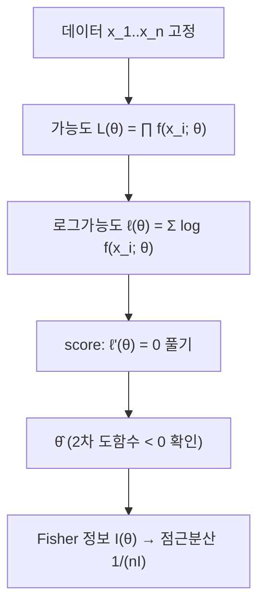

# 최대가능도 추정

# 개요

최대가능도 추정(maximum likelihood estimation, MLE)은 관측된 데이터를 가장 그럴듯하게 만드는 모수를 고르는 추정법이다. 모수를 변수로, 데이터를 고정으로 보는 관점 전환 하나가 방법의 전부이며, 그다음은 미분해서 최대화하는 계산 문제가 된다. 이 방법이 표준이 된 이유는 일반성과 점근적 최적성이다. 정칙 조건 아래 MLE는 일치성과 점근정규성을 가지며, 점근분산이 Cramér–Rao 하한과 같아 점근적으로 효율적이다. 최소제곱법, 로지스틱 회귀, 대부분의 머신러닝 손실함수가 특정 모형의 MLE로 다시 읽힌다.

# 직관

동전을 10번 던져 앞면이 7번 나왔다. 앞면 확률 p가 0.1이라면 이 결과가 나올 확률은 매우 작고, p가 0.7이면 상대적으로 크다. p마다 "이 데이터가 나올 확률"을 계산해 가장 큰 p를 고르는 것이 MLE다. 여기서 p에 대한 함수인 가능도는 확률분포가 아니다. p에 대해 적분해서 1이 되지 않으며, 값 자체의 크기는 의미가 없고 p들 사이의 비율만 의미가 있다.

로그를 취하는 이유는 두 가지다. 독립 표본의 곱이 합으로 바뀌어 미분이 쉬워지고, 매우 작은 확률들의 곱에서 생기는 수치적 언더플로가 사라진다. 로그는 단조증가하므로 최대점은 바뀌지 않는다.

# 정의

모수 공간 $\Theta$ 에 대해 모형이란 확률밀도 또는 확률질량함수의 족 $f(x;\theta)$ 다. 관측값 $x_1,\dots,x_n$ 이 이 모형에서 독립으로 나왔다고 가정할 때 가능도(likelihood)와 로그가능도를 다음으로 정의한다. 가능도는 데이터를 고정하고 $\theta$ 의 함수로 본 것이다.

$$
L(\theta)=\prod_{i=1}^{n} f(x_i;\theta),
\qquad
\ell(\theta)=\log L(\theta)=\sum_{i=1}^{n}\log f(x_i;\theta)
$$

최대가능도 추정량은 로그가능도를 최대화하는 점이다. 존재하지 않거나 유일하지 않을 수 있으므로 argmax는 집합으로 이해한다.

$$
\hat\theta=\mathop{\mathrm{arg\thinspace max}}\_{\theta\in\Theta}\ \ell(\theta)
$$

## score와 Fisher 정보

로그가능도의 모수에 대한 도함수를 score라 한다. 미분과 적분의 교환이 허용되는 정칙 조건 아래 score의 기댓값은 $0$ 이다.

$$
s(\theta;x)=\frac{\partial}{\partial\theta}\log f(x;\theta),
\qquad
\mathbb E_\theta\big[s(\theta;X)\big]=0
$$

Fisher 정보는 score의 분산이며, 같은 조건 아래 로그가능도의 2차 도함수의 기댓값의 음수와 같다.

$$
I(\theta)=\mathbb E_\theta\negthinspace\left[s(\theta;X)^2\right]
=-\thinspace\mathbb E_\theta\negthinspace\left[\frac{\partial^2}{\partial\theta^2}\log f(X;\theta)\right]
$$

다변수 모수에서는 $I(\theta)$ 가 행렬이 되고, [고윳값](eigenvalues.md)이 모든 방향의 정보량을 알려 준다.

## 정칙 조건

점근 결과가 성립하기 위한 표준적 가정은 다음을 포함한다[^1]. 분포의 지지집합이 $\theta$ 에 의존하지 않는다. 참값이 $\Theta$ 의 내부점이고 모형이 식별가능하다(서로 다른 $\theta$ 가 서로 다른 분포를 준다). 로그밀도가 $\theta$ 에 대해 충분히 매끄럽고 미분과 적분의 교환이 허용된다. Fisher 정보가 유한하고 $0$ 이 아니다. 모수의 개수가 $n$ 과 함께 늘어나지 않는다.

# 성질

## 1차 조건

$\Theta$ 가 열린 구간이고 로그가능도가 미분가능하면 내부 최대점에서 score 방정식이 성립한다. 이는 필요조건일 뿐이므로, 2차 도함수가 음수임을 확인하거나 경계값과 비교해야 한다.

$$
\ell'(\hat\theta)=\sum_{i=1}^{n}\frac{\partial}{\partial\theta}\log f(x_i;\hat\theta)=0
$$

최대점이 경계에 놓이는 경우도 흔하다. 균등분포 $U(0,\theta)$ 에서 가능도는 $\theta$ 가 모든 관측값 이상인 구간에서 $\theta^{-n}$ 에 비례하므로 미분으로는 극점이 없고 최대점은 관측값의 최댓값이다. score 방정식을 기계적으로 쓰면 틀린다.

## 변환 불변성

$g$ 가 단사함수일 때, $g(\theta)$ 의 MLE는 MLE의 상이다. 증명은 한 줄이다. $\theta$ 를 $g(\theta)$ 로 재매개화하면 가능도의 값 집합이 바뀌지 않으므로 최대를 주는 점이 대응된다.

$$
\widehat{g(\theta)}=g(\hat\theta)
$$

불편성은 이런 불변성을 갖지 않는다. $\theta$ 의 불편추정량을 비선형 $g$ 로 보낸 값은 일반적으로 $g(\theta)$ 의 불편추정량이 아니다. 실제로 MLE는 대체로 편향되어 있으며, 정규분포 분산의 MLE는 표본을 $n$ 으로 나눈 값이어서 불편추정량보다 작다.

## 일치성

모형이 식별가능하고 정칙 조건이 만족되면 MLE는 참값으로 확률수렴한다. 증명의 골격은 다음이다. [큰 수의 법칙](law-of-large-numbers.md)에 의해 $1/n$ 을 곱한 로그가능도가 참값 $\theta_0$ 에서의 기댓값으로 수렴한다.

$$
\frac1n\ell(\theta)\thinspace\xrightarrow{\thinspace P\thinspace}\thinspace
\mathbb E_{\theta_0}\negthinspace\left[\log f(X;\theta)\right]
=-H(\theta_0)-D_{\mathrm{KL}}\negthinspace\left(f_{\theta_0}\thinspace\Vert\thinspace f_\theta\right)
$$

Kullback–Leibler divergence는 음이 아니고 두 분포가 같을 때만 $0$ 이므로, 극한 목적함수는 $\theta_0$ 에서 유일하게 최대다. 여기에 최대점의 수렴을 보장하는 균등수렴 조건을 더하면 일치성이 나온다. MLE가 사실상 KL divergence를 최소화하고 있다는 이 해석은 [Shannon entropy](entropy.md)와 직접 연결된다.

## 점근정규성

정칙 조건 아래 다음이 성립한다[^2].

$$
\sqrt n\thinspace(\hat\theta-\theta_0)\ \xrightarrow{\ d\ }\ N\negthinspace\left(0,\ I(\theta_0)^{-1}\right)
$$

증명 개요: score를 참값 주위에서 1차 Taylor 전개한다.

$$
0=\ell'(\hat\theta)\approx\ell'(\theta_0)+\ell''(\theta_0)(\hat\theta-\theta_0)
\thinspace\Longrightarrow\thinspace
\sqrt n(\hat\theta-\theta_0)\approx
\frac{n^{-1/2}\ell'(\theta_0)}{-n^{-1}\ell''(\theta_0)}
$$

분자는 평균 $0$ , 분산 $I(\theta_0)$ 인 i.i.d. score의 표준화된 합이므로 [중심극한정리](central-limit-theorem.md)에 의해 정규분포로 수렴하고, 분모는 큰 수의 법칙에 의해 $I(\theta_0)$ 로 수렴한다. 두 결과를 Slutsky 정리로 합치면 결론이 나온다. 나머지항의 통제에 일치성과 3차 미분의 국소적 유계성이 쓰인다.

점근분산이 Cramér–Rao 하한(불편추정량의 분산은 표본 전체의 Fisher 정보 $nI(\theta)$ 의 역수 이상)과 일치하므로 MLE는 점근적으로 효율적이다. 다만 유한 표본에서는 MLE보다 평균제곱오차가 작은 추정량이 존재할 수 있다.

## 실패 사례

모형이 잘못 지정되면 MLE는 참 분포가 아니라 모형족 안에서 KL divergence가 가장 작은 분포로 수렴한다. 혼합모형에서는 가능도가 무계일 수 있고(한 성분의 분산을 0으로 보내면 발산), 모수 개수가 표본 크기와 함께 커지는 경우 일치성이 깨진다. Neyman–Scott 문제가 후자의 표준 반례다.

# 활용

## Bernoulli

n번의 독립 시행에서 성공 횟수를 k라 하면 로그가능도와 그 도함수는 다음과 같다.

$$
\ell(p)=k\log p+(n-k)\log(1-p),
\qquad
\ell'(p)=\frac{k}{p}-\frac{n-k}{1-p}
$$

0으로 두고 풀면 표본비율이 나온다. Fisher 정보도 직접 계산된다.

$$
\hat p=\frac kn,\qquad I(p)=\frac{1}{p(1-p)}
$$

따라서 표본비율의 점근분산은 $p(1-p)/n$ 이고, 비율에 대한 신뢰구간 공식을 이 분산에서 얻는다.

## 정규분포

평균과 분산을 모두 모를 때 로그가능도를 두 모수로 각각 편미분해 0으로 두고 풀면 다음을 얻는다.

$$
\hat\mu=\overline x,
\qquad
\hat\sigma^2=\frac1n\sum_{i=1}^{n}(x_i-\overline x)^2
$$

분산의 MLE는 n−1이 아니라 n으로 나눈 값이므로 편향되어 있다. 평균이 알려진 경우와 달리, 평균을 데이터에서 추정하면서 자유도 하나를 잃기 때문이다. 한편 평균만 모르는 정규 모형에서 MLE를 구하는 문제는 제곱합 최소화와 같으므로, 최소제곱법은 정규 오차 가정 아래의 MLE다.

## 수치 최적화

닫힌 해가 없으면 score 방정식을 수치적으로 푼다. Newton–Raphson은 2차 도함수를 쓰고, 그 자리에 Fisher 정보를 넣은 변형이 Fisher scoring이다. 로그가능도가 오목하면(예: 지수족의 자연매개화) 전역해가 보장되고 [볼록성](convexity.md) 기반의 [경사하강법](gradient-descent.md)이 그대로 적용된다.

## 다른 추론 방식과의 관계

가능도에 사전분포를 곱해 최대화하면 최대사후확률(MAP) 추정이 되고, 사전분포가 균등하면 MLE와 같다. 이 관계는 [Bayes 정리](bayes.md)에서 직접 읽힌다. 정규분포 사전분포를 쓴 MAP는 제곱 벌점(ridge)과 같고, Laplace 사전분포는 절댓값 벌점(lasso)과 같다. 가능도비를 검정통계량으로 쓰면 [가설검정과 p-값](hypothesis-testing.md)의 가능도비 검정이 되며, Wilks 정리가 그 점근분포를 준다.

[^1]: Michal Kulich, "Maximum Likelihood Estimation Theory", NMST432 lecture notes, Charles University (정칙 조건, score, Fisher 정보, 점근 결과). https://www.karlin.mff.cuni.cz/~kulich/vyuka/glm/doc/mle_summary.pdf
[^2]: Gregory Gundersen, "Asymptotic Normality of Maximum Likelihood Estimators" (Taylor 전개 증명 개요와 Fisher 정보의 역수 형태 점근분산). https://gregorygundersen.com/blog/2019/11/28/asymptotic-normality-mle/

# 연관 문서

## 선수지식

- [확률변수와 기댓값](random-variables.md)
- [미분](derivative.md)
- [통계 개관](statistics-overview.md)

## 더 알아보기

- [가설검정과 p-값](hypothesis-testing.md)
- [선형회귀와 최소제곱법](linear-regression.md)
- [지수족과 충분통계량](exponential-families.md)

#statistics #probability #optimization
