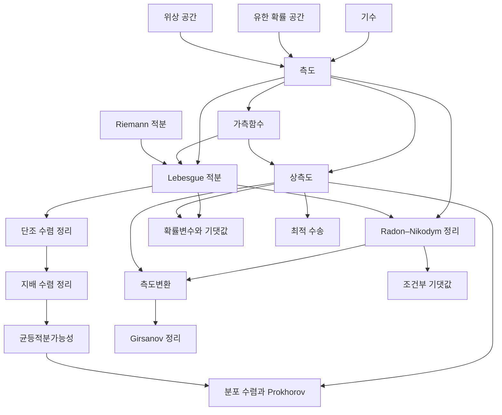

# 측도론 개관

# 개요

측도론은 집합에 크기를 매기는 방법과 그 크기로 정의한 적분을 다룬다. 물음은 "어떤 집합에 길이나 넓이를 일관되게 줄 수 있고, 그 위에서 극한과 적분을 언제 바꿔칠 수 있는가" 다. 답은 가산가법성을 만족하는 $\sigma$ 대수 위의 측도, 그 측도로 세운 Lebesgue 적분, 그리고 극한과 적분의 교환을 보장하는 수렴정리로 나온다.

측도론의 갈래는 세 줄기다. 측도와 가측성을 세우는 기초, 적분과 세 수렴정리, 그리고 한 측도를 다른 측도로 옮기거나 견주는 상측도와 Radon–Nikodym 도함수다. 확률론의 기반이 여기 있고, 극한정리와 확률과정은 [확률론 개관](probability-overview.md)에 있다.

시작은 [측도](measure.md)다. 거기서 [가측함수](measurable-functions.md)를 거쳐 [Lebesgue 적분](lebesgue-integral.md)으로 가면 [단조 수렴 정리](monotone-convergence.md)와 [지배 수렴 정리](dominated-convergence.md)가 나오고, [상측도](pushforward-measure.md)와 [Radon–Nikodym 정리](radon-nikodym.md)에서 확률론과 통계로 갈라진다.

# 지도

# 갈래

## 측도와 가측성

- [측도](measure.md): $\sigma$ 대수, 가산가법성, Lebesgue 측도와 비가측 집합
- [가측함수](measurable-functions.md): 원상이 가측인 함수, 극한에 닫힌 성질

## 적분과 수렴정리

- [Lebesgue 적분](lebesgue-integral.md): 단순함수의 극한으로 세운 적분, Riemann 적분과의 관계
- [단조 수렴 정리](monotone-convergence.md): 증가하는 비음 함수열에서 극한과 적분의 교환
- [지배 수렴 정리](dominated-convergence.md): 적분가능한 지배함수 아래에서의 교환, Fatou 보조정리
- [균등적분가능성](uniform-integrability.md): $L^1$ 수렴을 개별 수렴에서 끌어내는 조건, Vitali 수렴정리

## 측도 사이의 비교

- [상측도](pushforward-measure.md): 가측사상이 옮기는 측도, 변수변환 공식
- [Radon–Nikodym 정리](radon-nikodym.md): 절대연속인 두 측도의 도함수, Lebesgue 분해
- [측도변환](change-of-measure.md): Radon–Nikodym 도함수로서의 우도비, 중요도 표본추출
- [유계변동 함수](bounded-variation.md): Jordan 분해, 절대연속과 미적분의 기본정리, Cantor 함수

## 확률론과 최적수송

- [확률변수](random-variables.md): 가측함수로서의 확률변수, 적분으로서의 기댓값
- [조건부 기댓값](conditional-expectation.md): Radon–Nikodym 정리로 정의하는 부분 $\sigma$ 대수 위의 사영
- [분포 수렴과 Prokhorov 정리](weak-convergence.md): 측도의 약수렴과 tightness
- [최적 수송과 Wasserstein 거리](optimal-transport.md): 두 측도를 잇는 결합과 수송비용
- [Girsanov 정리](girsanov.md): 측도변환이 Brown 운동의 표류항을 바꾸는 방식

# 연관 문서

## 선수지식

- [집합](sets.md)

## 더 알아보기

- [측도](measure.md)
- [Radon–Nikodym 정리](radon-nikodym.md)

#measure_theory #probability #analysis #statistics #overview
