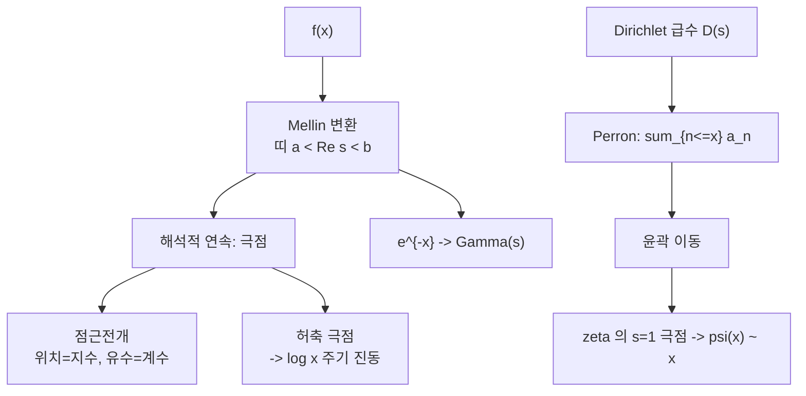

# Mellin 변환과 Perron 공식

# 개요

$$
\tilde f(s)=\int_0^{\infty}f(x)\,x^{s-1}dx,
\qquad
f(x)=\frac1{2\pi i}\int_{c-i\infty}^{c+i\infty}\tilde f(s)\,x^{-s}\,ds
$$

$x=e^{u}$ 로 바꾸면 이것은 그냥 Fourier 변환이다. 다른 점은 **덧셈군 $\mathbb R$ 대신 곱셈군 $(0,\infty)$ 위에서 한다**는 것뿐이고, 그 차이가 쓸모의 전부를 만든다. 곱셈이 자연스러운 대상—$n^{-s}$ 꼴의 항, 스케일이 $2$ 배씩 늘어나는 합, $x\to0$ 과 $x\to\infty$ 에서 거듭제곱으로 행동하는 함수—을 다룰 때 Mellin 변환은 계산을 **극점 찾기로 바꿔 준다**.

핵심은 한 문장으로 요약된다.

> $\tilde f$ 의 극점 하나가 $f$ 의 점근전개 항 하나다. 극점의 위치가 지수, 유수가 계수, 극점의 차수가 $\log$ 의 거듭제곱을 준다.

역변환의 윤곽을 왼쪽이나 오른쪽으로 밀면서 지나치는 극점의 유수를 줍는 것이 계산의 전부다. [감마 함수](gamma-function.md)가 늘 등장하는 것도 우연이 아니다. $\Gamma$ 는 $e^{-x}$ 의 Mellin 변환이고, 그 극점들이 $e^{-x}$ 의 Taylor 계수를 그대로 담고 있다.

수론 쪽 판본이 Perron 공식이다. Dirichlet 급수 $D(s)=\sum a_nn^{-s}$ 에 대해

$$
\sum_{n\le x}a_n=\frac1{2\pi i}\int_{c-i\infty}^{c+i\infty}D(s)\,\frac{x^{s}}{s}\,ds
$$

이고, 여기서 윤곽을 왼쪽으로 밀면 $D$ 의 극점이 계수합의 주도항을 준다. [소수 정리](prime-number-theorem.md)의 증명이 바로 이 절차이며, $\zeta$ 의 $s=1$ 극점이 $\psi(x)\sim x$ 를 낳는다.

# 직관

## 곱셈군 위의 Fourier 변환

$x=e^{u}$ 와 $s=c+it$ 로 두면

$$
\tilde f(c+it)=\int_{-\infty}^{\infty}f(e^{u})e^{cu}\,e^{itu}\,du
$$

이므로 $\tilde f$ 는 $f(e^{u})e^{cu}$ 의 Fourier 변환이다. 그러므로 Mellin 변환에 대한 모든 정리는 Fourier 이론의 번역이고, [Poisson 합](poisson-summation.md)이 덧셈격자 $\mathbb Z$ 에 대해 했던 일을 Mellin 은 곱셈적 스케일에 대해 한다. **어떤 대칭을 쓰느냐의 차이일 뿐**이다.

## 띠가 정의역이다

적분 $\int_0^\infty f\thinspace x^{s-1}dx$ 가 수렴하려면 $x\to0$ 에서 $f=O(x^{-a})$ 이고 $x\to\infty$ 에서 $f=O(x^{-b})$ 일 때 $a<\operatorname{Re}s<b$ 가 필요하다. Mellin 변환의 자연스러운 정의역은 점이 아니라 **수직 띠**이고, 띠의 양 끝을 정하는 것이 $f$ 의 양 끝 거동이다. 해석적 연속으로 띠 바깥으로 나가면 극점을 만나는데, 그 극점이 정확히 원래 함수의 전개 항에 대응한다.

## 극점과 점근항의 사전

$x\to0$ 에서 $f(x)\sim\sum_k c_kx^{\alpha_k}$ 이면 $\tilde f$ 는 $s=-\alpha_k$ 에서 유수 $c_k$ 의 단순극점을 갖는다. 역방향도 성립하므로 **사전처럼 쓸 수 있다**.

$$
\tilde f\ \text{의}\ s=s_0\ \text{에서의 단순극점, 유수}\ r
\ \longleftrightarrow\
f(x)\ \text{에}\ r\,x^{-s_0}\ \text{항}
$$

2 차 극점이면 $x^{-s_0}\log(1/x)$ 가 나오고, 허축 위의 극점이면 $x^{-it}=e^{-it\log x}$ 라 **$\log x$ 에 대한 진동항**이 나온다. 마지막 경우가 알고리즘 분석에서 흔히 보이는 작은 주기 변동의 정체다.

## Perron 은 계단함수의 변환이다

$$
\frac1{2\pi i}\int_{c-i\infty}^{c+i\infty}\frac{y^{s}}{s}ds=
\begin{cases}1,&y>1\\ \tfrac12,&y=1\\ 0,&0<y<1\end{cases}
$$

이 적분이 $n\le x$ 라는 조건을 해석적으로 표현한다. $y=x/n$ 을 넣고 $n$ 에 대해 더하면 Perron 공식이 된다. **셈의 조건을 윤곽적분으로 바꾸는 것**이 요점이고, 그 순간 조합적 문제가 복소해석 문제가 된다.



# 정의

## 변환과 역변환

$f$ 가 $(0,\infty)$ 에서 국소적분가능하고 띠 $a<\operatorname{Re}s<b$ 에서 적분이 절대수렴하면 $\tilde f$ 는 그 띠에서 정칙이다. 역변환은 $a<c<b$ 인 임의의 $c$ 에서

$$
f(x)=\frac1{2\pi i}\int_{(c)}\tilde f(s)x^{-s}ds
$$

이고 값은 $c$ 에 의존하지 않는다. 기본 예는 다음 둘이다.

$$
\int_0^{\infty}e^{-x}x^{s-1}dx=\Gamma(s)\ (0<\operatorname{Re}s),
\qquad
\int_0^{\infty}\frac{x^{s-1}}{e^{x}-1}dx=\Gamma(s)\zeta(s)\ (1<\operatorname{Re}s)
$$

## 조화합

$$
F(x)=\sum_k\lambda_k\,f(\mu_kx)
\quad\Longrightarrow\quad
\tilde F(s)=\Big(\sum_k\lambda_k\mu_k^{-s}\Big)\tilde f(s)
$$

같은 함수를 여러 스케일로 겹쳐 놓은 합을 **조화합**이라 한다. 변환이 Dirichlet 급수와 기본 변환의 곱으로 깨끗하게 갈라지는 것이 결정적이다. 오른쪽 두 인자의 극점을 모으면 $F$ 의 점근이 나온다.

## Perron 공식

$D(s)=\sum a_nn^{-s}$ 가 $\operatorname{Re}s>\sigma_a$ 에서 절대수렴하고 $c>\sigma_a$ 면

$$
{\sum_{n\le x}}'\,a_n=\frac1{2\pi i}\int_{(c)}D(s)\frac{x^{s}}{s}ds
$$

(프라임은 $n=x$ 항을 절반만 센다는 뜻이다.) 실제 계산에서는 적분을 $|t|\le T$ 로 자른 유효판을 쓰고, 잘라낸 꼬리를 명시적 오차항으로 평가한다.

# 성질

## 사전의 정확한 진술

$\tilde f$ 가 띠 바깥으로 유리형으로 이어지고 수직선 위에서 충분히 빨리 감쇠하면, 윤곽을 왼쪽으로 $\operatorname{Re}s=d$ 까지 밀어

$$
f(x)=\sum_{d<\operatorname{Re}s_0<c}\operatorname*{Res}_{s=s_0}\big(\tilde f(s)x^{-s}\big)+O\!\left(x^{-d}\right)
$$

를 얻는다. **점근전개를 얻는 작업이 유수 계산으로 완전히 기계화된다**. 차수 $m$ 의 극점에서 나오는 항은 $x^{-s_0}$ 곱하기 $\log x$ 의 $m-1$ 차 다항식이다.

## 곱셈 정리

$$
\int_0^{\infty}f(x)g(x)\frac{dx}x=\frac1{2\pi i}\int_{(c)}\tilde f(s)\,\tilde g(1-s)\,ds
$$

Fourier 의 Parseval 등식에 해당한다. $dx/x$ 가 곱셈군의 Haar 측도이므로 이 꼴이 자연스럽다. 수론에서 $\zeta$ 의 적률을 다룰 때 표준 도구다.

## 예: $2$ 의 거듭제곱으로 겹친 합

$$
S(x)=\sum_{k\ge0}e^{-x2^{k}}
\quad\Longrightarrow\quad
\tilde S(s)=\frac{\Gamma(s)}{1-2^{-s}}
$$

극점이 셋 있다. $s=0$ 에서 $\Gamma$ 의 극점과 분모의 영점이 겹쳐 2 차 극점, $s=-n$ 에서 $\Gamma$ 의 극점, 그리고 $k\ne0$ 인 $s=\chi_k=2\pi ik/\log2$ 에서 분모가 만드는 단순극점이다. 유수를 모으면 $x\to0$ 에서

$$
S(x)=\frac{\log(1/x)}{\log2}+\frac12-\frac{\gamma}{\log2}
+\sum_{n\ge1}\frac{(-1)^{n}}{n!\,(1-2^{n})}x^{n}
+\frac1{\log2}\sum_{k\ne0}\Gamma(\chi_k)x^{-\chi_k}
$$

마지막 합이 $\log_2x$ 에 대해 주기 1 로 진동하는 항이고, 진폭이

$$
\frac2{\log2}\left|\Gamma\!\left(\frac{2\pi i}{\log2}\right)\right|=\frac{2}{\log 2}\sqrt{\frac{\pi}{y\sinh\pi y}}\Big|_{y=2\pi/\log2}=1.573\times10^{-6}
$$

로 아주 작다. **평균적으로는 $\log_2(1/x)$ 인데 백만 분의 일 수준의 주기 떨림이 얹혀 있다**는 결론이다.

```python
from math import exp, log, pi, factorial, sinh, sqrt
g, L = 0.5772156649015329, log(2)
S = lambda x: sum(exp(-x * 2 ** k) for k in range(300))

def main(x, N=6):                                   # 진동항을 뺀 주도부
    v = log(1 / x) / L - g / L + 0.5
    for n in range(1, N + 1):
        v += (-1) ** n / factorial(n) / (1 - 2.0 ** n) * x ** n
    return v

for e in (5, 8, 11, 14, 17):                        # 남는 것은 진동항뿐
    print(e, "%.3e" % (S(2.0 ** -e) - main(2.0 ** -e)))
# 5 -1.205e-06 / 8 -1.205e-06 / 11 -1.205e-06 / 14 -1.205e-06 / 17 -1.205e-06

for j in range(8):                                  # log2 x 한 주기를 훑는다
    x = 1e-6 * 2 ** (j / 8)
    print("%.3f %.3e" % (j / 8, S(x) - main(x)))
# 0.000 -1.517e-06 / 0.250 -4.168e-07 / 0.500 1.517e-06 / 0.750 4.168e-07

y = 2 * pi / L
print("예측 진폭 %.3e" % (2 * sqrt(pi / (y * sinh(pi * y))) / L))   # 1.573e-06
```

$x$ 를 $2$ 배 할 때마다 오차가 정확히 같은 값으로 돌아오고, 한 주기를 훑으면 예측한 진폭만큼 흔들린다. **극점 하나하나가 수치에서 그대로 보인다**.

# 활용

## 소수 정리의 뼈대

$-\zeta'(s)/\zeta(s)=\sum\Lambda(n)n^{-s}$ 에 Perron 을 적용하면

$$
\psi(x)=\sum_{n\le x}\Lambda(n)=\frac1{2\pi i}\int_{(c)}\left(-\frac{\zeta'(s)}{\zeta(s)}\right)\frac{x^{s}}{s}ds
$$

윤곽을 왼쪽으로 밀면 $s=1$ 의 극점이 유수 $x$ 를 주고, $\zeta$ 의 비자명 영점 $\rho$ 마다 $-x^{\rho}/\rho$ 가 나온다.

$$
\psi(x)=x-\sum_{\rho}\frac{x^{\rho}}{\rho}-\log2\pi-\tfrac12\log(1-x^{-2})
$$

**영점의 실수부가 오차항의 크기를 정한다**는 명제가 이 한 줄에서 읽힌다. $\operatorname{Re}\rho<1$ 을 임계선 위에서 보이는 것이 소수 정리이고, $\operatorname{Re}\rho=\tfrac12$ 이면 오차가 $O(x^{1/2+\varepsilon})$ 로 떨어진다. Mellin 의 사전이 **"영점 ↔ 소수 분포의 진동"** 이라는 형태로 나타난 것이다.

## 알고리즘 분석

이진 트라이의 평균 깊이, 자릿수 기반 자료구조의 비용, 해시의 충돌 횟수처럼 **크기가 2 배씩 갈라지는 구조**의 평균 비용은 대부분 조화합으로 쓰인다. 그 Mellin 변환에는 위의 예처럼 $\chi_k=2\pi ik/\log2$ 극점이 생기고, 결과는 "$\log_2n$ 의 주요항 + 아주 작은 주기 변동" 이 된다. 실험에서 보이는 미세한 톱니 무늬가 측정 오차가 아니라 이론이 예측한 항이라는 점이 이 기법의 인상적인 성과다.

## 특수함수의 점근

$\Gamma$ 와 Bessel 함수와 초기하함수의 점근전개를 얻는 표준 절차가 Mellin–Barnes 표현이다. 피적분함수를 감마 함수의 비로 써 놓고 윤곽을 미는 것이므로, [Laplace 방법](laplace-method.md)이 안장점으로 하던 일을 극점으로 한다. 두 방법은 서로 보완적이다. 지수에 큰 매개변수가 곱해져 있으면 안장점이 편하고, 거듭제곱 꼴의 전개가 필요하면 Mellin 이 편하다.

## 함수방정식의 다른 증명

$\theta$ 의 변환식을 Mellin 으로 읽으면 $\zeta$ 의 함수방정식이 나온다는 것은 Poisson 합 문서에서 본 그대로다. 거꾸로, Mellin 변환이 띠에서 정칙이고 양쪽 끝 거동이 대칭이면 함수방정식이 따라온다는 관점도 가능하다. 이 시각을 아델 위로 올린 것이 [Tate 논문](tate-thesis.md)이며, 거기서는 각 소수 자리마다 국소 Mellin 변환을 하고 전부 곱한다. **감마 인자가 무한대 자리의 Mellin 변환**이라는 말이 그때 정확한 의미를 얻는다.[^1]

[^1]: 표준 참고는 P. Flajolet, X. Gourdon, P. Dumas, *Mellin transforms and asymptotics: harmonic sums*, Theoret. Comput. Sci. 144 (1995) 와 H. Iwaniec, E. Kowalski, *Analytic Number Theory* 5 장. Perron 공식의 유효판과 오차항은 H. Montgomery, R. Vaughan, *Multiplicative Number Theory I* 5 장에 정리되어 있다. 본문의 수치는 직접 실행해 확인했다.

# 연관 문서

## 선수지식

- [감마 함수와 Stirling 근사](gamma-function.md)
- [Poisson 합 공식](poisson-summation.md)

## 더 알아보기

- 아직 연결한 문서가 없다.

#analysis #number_theory #computation
