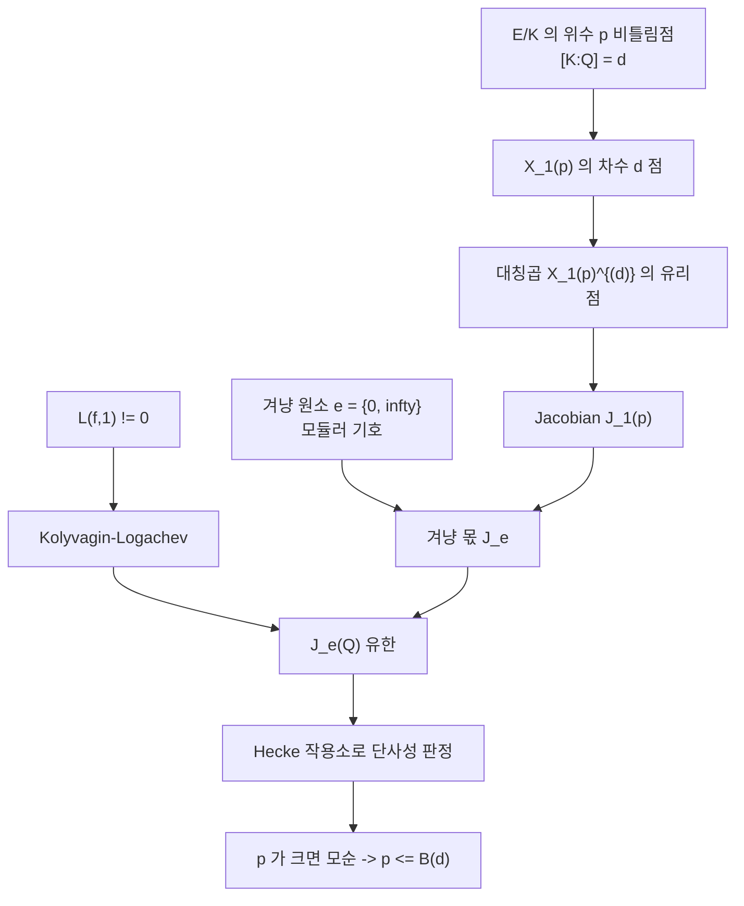

# Merel 의 일양 유계성 정리

# 개요

[Mazur](eisenstein-ideal.md)는 $\mathbb Q$ 위 타원곡선의 비틀림군이 15 가지뿐임을 보였다. 체의 차수만 고정했을 때도 비틀림군의 크기가 유계인지가 다음 물음이다.

> **정리(Merel, 1996).** $d\ge1$ 에 대해 상수 $B(d)$ 가 있어, 차수 $d$ 인 임의의 수체 $K$ 와 임의의 타원곡선 $E/K$ 에 대해 $|E(K)\_{\mathrm{tors}}|\le B(d)$ 이다.

차수 $d$ 인 수체는 무한히 많고 판별식에 제한도 없는데 그 전부에 통하는 상수 하나가 존재한다. 이 성질을 **일양(uniform)** 유계성이라 한다.

증명의 형태는 Mazur 의 논법을 한 단계 올린 것이다. 비틀림점을 모듈러 곡선의 점으로 바꾸는 것은 같고, 유리점이 아니라 차수 $d$ 의 점이므로 $d$ 차 대칭곱 $X_1(p)^{(d)}$ 를 본다. Jacobian 으로 보낸 뒤 [모듈러 기호](modular-symbols.md)가 만드는 겨냥 원소로 잘라낸 몫에서 유리점의 유한성을 쓴다. 잘라내는 도구는 $L$ 값의 비소멸이라는 해석적 사실이고 결론은 기하적이다.

# 직관

## 차수 $d$ 점으로의 번역

위수 $p$ 의 점을 가진 타원곡선은 모듈러 곡선 $X_1(p)$ 의 점에 대응한다. $E/K$ 가 차수 $d$ 체 위에 있으면 그 점은 $X_1(p)$ 의 차수 $d$ 점이므로, 다음을 보이면 된다.

$$
p\ \text{가 크면}\ X_1(p)\ \text{에 차수}\ d\ \text{의 점이 없다}
$$

차수 $d$ 점은 대칭곱 $X_1(p)^{(d)}$ 의 유리점으로 다룬다. 갈루아 켤레 $d$ 개를 모으면 순서 없는 $d$ 개 점의 모임이 되고 그것이 $X^{(d)}(\mathbb Q)$ 의 원소다.

## 겨냥 몫의 선택

$X^{(d)}\to J$ 의 상이 유한집합에 들어감을 보이려면 유리점이 유한한 아벨 다양체 몫이 필요하다. Mazur 는 첨점군과 Eisenstein 아이디얼로 그런 몫을 만들었고 그 방법은 $\mathbb Q$ 위에서만 충분히 작다.

Merel 은 모듈러 기호 $e=\lbrace 0,\infty\rbrace$ 가 만드는 겨냥 몫 $J_e$ 를 쓴다. 이 원소가 골라내는 성분은 $L(f,1)\ne0$ 인 새형식들에 대응하므로 Kolyvagin–Logachev 에 의해 그 몫의 Mordell–Weil 군이 유한하다.

## 단사성의 선형대수

몫으로 보내는 사상이 차수 $d$ 점들 위에서 단사이면 모순이 나온다. 단사성 판정은 Hecke 작용소 $T_\ell$ 을 겨냥 원소에 작용시켜 얻은 벡터들의 일차독립성으로 환원된다. Kamienny 의 착상이고, Merel 은 $p$ 가 $d$ 에 비해 충분히 크면 그 독립성이 항상 성립하도록 명시적으로 제어했다.

# 정의

## 일양 유계성

$$
B(d)=\sup\big\lbrace|E(K)\_{\mathrm{tors}}|\ :\ [K:\mathbb Q]=d,\ E/K\ \text{타원곡선}\big\rbrace
$$

Merel 의 정리는 $B(d)\lt\infty$ 라는 진술이다. 동치로, 차수 $d$ 체 위의 타원곡선이 위수 $p$ 의 점을 가지면 $p$ 가 $d$ 에만 의존하는 유계를 넘지 않는다.

## 겨냥 원소와 겨냥 몫

$X_0(p)$ 의 호몰로지에서 0 과 $\infty$ 를 잇는 경로가 정하는 원소

$$
e=\lbrace 0,\infty\rbrace\in H_1\big(X_0(p),\mathbb Q\big)
$$

가 **겨냥 원소**다. 새형식 $f$ 에 대한 그 성분의 크기가 $L(f,1)$ 에 비례한다는 것이 모듈러 기호의 기본 사실이다. Hecke 대수에서 $e$ 를 소멸시키는 아이디얼 $I_e$ 로 몫을 취한

$$
J_e=J_0(p)/I_eJ_0(p)
$$

가 **겨냥 몫**이고, 여기 나타나는 것은 $L(f,1)\ne0$ 인 성분들뿐이다.

## Kamienny 판정

차수 $d$ 점에서 나오는 $X_1(p)^{(d)}\to J_e$ 의 단사성을 겨냥 원소에 Hecke 작용소를 적용해 얻은 원소들

$$
T_1e,\ T_2e,\ \dots,\ T_de\ \in\ \mathbb T\thinspace e
$$

의 일차독립성으로 판정한다. 독립이면 차수 $d$ 점이 존재할 수 없다. 기하적 진술이 유한차원 벡터공간의 계수 계산이 되므로 작은 $d$ 에서는 직접 계산으로 확인된다.

# 성질

## 명시적 상한

Merel 의 원 논문은 $p\lt d^{3d^{2}}$ 를 준다. Oesterlé 가 같은 방법을 다듬어

$$
p\le\big(3^{d/2}+1\big)^{2}
$$

까지 내렸고 Parent 가 소수 멱 $p^{n}$ 에 대한 유계로 확장했다. $d=1$ 에서 Oesterlé 의 식은 $p\le(3^{1/2}+1)^{2}\approx7.46$ 을 주어 Mazur 의 $p\le7$ 과 맞닿는다.

## 알려진 것과 모르는 것

| 물음 | 상태 |
| --- | --- |
| $B(d)\lt\infty$ | 해결 (Merel) |
| $d=1$ 명시적 목록 | 15 개 군 (Mazur) |
| $d=2$ 명시적 목록 | 26 개 군 (Kamienny, Kenku–Momose) |
| $d=3$ 명시적 목록 | 해결 (Derickx–Etropolski–van Hoeij–Morrow–Zureick-Brown) |
| $d\ge4$ | 부분적 |
| $B(d)$ 의 참 크기 | 확정되지 않음. 상한은 지수, 하한은 $d\log\log d$ 규모[^1] |

상한과 하한 사이의 간극이 크다. 하한은 CM 곡선을 적당한 체 위에서 관찰해 얻는다.

## 유계와 분류의 거리

정리가 주는 것은 상수의 존재이고 어떤 군이 실제로 나타나는지는 말하지 않는다. 명시적 목록을 얻으려면 각 $p$ 마다 $X_1(p)^{(d)}$ 의 유리점을 결정해야 하고 이 계산은 $d$ 가 커지면 급격히 무거워진다.

## $\mathbb Q$ 위의 도구와 일양성

겨냥 몫의 유리점이 유한하다는 사실은 Kolyvagin–Logachev, 곧 [Euler 계](euler-systems.md)에 의존하고 이 도구는 $\mathbb Q$ 위와 허수이차체 위에서만 충분히 강하다. Merel 의 논법에서 모듈러 곡선과 Jacobian 은 언제나 $\mathbb Q$ 위에 있고 체가 바뀌는 것은 점의 차수뿐이다. 대칭곱으로 올린 덕분에 해석적 도구를 $\mathbb Q$ 위에서만 쓰고도 모든 차수 $d$ 체를 한꺼번에 다루며, 이 구조가 일양성을 만든다.

# 활용

- **계산 수론.** 타원곡선 데이터베이스에서 비틀림군을 확정할 때 후보의 유한성이 탐색의 종료를 보장한다. $d\le3$ 에서는 명시적 목록으로 판정하고 더 높은 차수에서는 Merel 의 유계가 탐색 범위를 준다. [BSD](birch-swinnerton-dyer.md) 공식의 비틀림 항과 하강 계산의 전처리가 이 정보를 쓴다.
- **동종의 일양 유계성.** 소수 차수 동종에 대응하는 유계는 차수 $d$ 수체 위에서 증명되어 있지 않다. $E/K$ 가 CM 이 아니면 $\bmod\ p$ [Galois 표현](galois-representations.md)이 $p$ 가 클 때 전사인지를 묻는 Serre 의 일양성 문제가 같은 계열이다[^2].
- **방법론.** 대칭곱으로 올리고, 해석적 비소멸로 유한 몫을 만들고, Hecke 작용소의 선형대수로 단사성을 판정하는 세 단계가 이후 모듈러 곡선의 유리점 문제에서 반복해 쓰였다. [모듈러 기호](modular-symbols.md)는 정의가 구체적이고 Hecke 작용을 명시적으로 계산할 수 있어 존재 증명이 알고리즘이 된다.[^1]

[^1]: L. Merel, *Bornes pour la torsion des courbes elliptiques sur les corps de nombres*, Invent. Math. **124** (1996), 437–449. 상한 개선은 J. Oesterlé 의 미출판 원고와 P. Parent, J. reine angew. Math. **506** (1999). $d=2$ 는 S. Kamienny, Invent. Math. **109** (1992) 와 M. Kenku, F. Momose, Nagoya Math. J. **109** (1988). $d=3$ 은 M. Derickx, A. Etropolski, M. van Hoeij, J. Morrow, D. Zureick-Brown, Algebra & Number Theory (2021).
[^2]: J-P. Serre, "Propriétés galoisiennes des points d'ordre fini des courbes elliptiques", Inventiones Mathematicae 15 (1972), 259–331. §4.3 이 일양성 문제를 제기하며 답이 없음을 밝힌다.

# 연관 문서

## 선수지식

- [Eisenstein 아이디얼과 Mazur 의 비틀림점 정리](eisenstein-ideal.md)
- [모듈러 기호](modular-symbols.md)
- [Kolyvagin–Logachev 정리와 겨냥 몫](kolyvagin-logachev.md)

## 더 알아보기

- 아직 연결한 문서가 없다.

#number_theory #theorem
