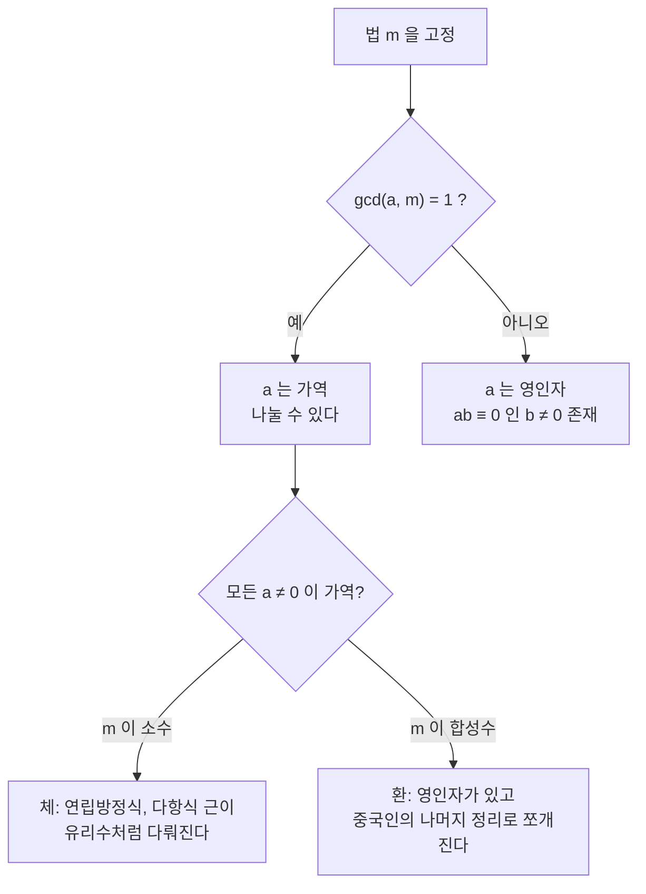

# 정수의 합동과 나머지 연산

# 개요

시계는 12 시 다음에 13 시가 아니라 1 시로 돌아간다. 요일은 7 일마다, 각도는 360 도마다 제자리로 온다. 이렇게 "일정 주기로 되돌아오는 세계" 의 산술을 정수 위에서 정확히 세운 것이 합동이다.

핵심은 무한한 정수 집합을 유한 개의 부류로 줄이되 덧셈과 곱셈은 그대로 물려받는다는 데 있다. 이것은 [동치관계](relations.md)에서 다룬 몫 구성의 가장 구체적이고 유용한 사례이며, "대표원을 바꿔도 답이 같은가" 라는 잘 정의됨 검사가 실제로 통과하는 모습을 볼 수 있다. 여기서 얻은 유한 구조가 [환](rings.md)과 [유한체](finite-fields.md)의 첫 예가 되고, [RSA](rsa-cryptosystem.md)를 비롯한 공개키 암호의 계산 무대가 된다.

# 직관

## 나머지만 들고 다니기

$(a+b)\bmod m$ 을 구할 때 $a$ 와 $b$ 를 먼저 줄여도 결과가 같다. 곱셈도 마찬가지다. 그래서 큰 수를 다룰 때 매 연산마다 나머지를 취하면 값이 절대 커지지 않는다. 이 성질이 없다면 $2^{1000}\bmod7$ 같은 계산은 1000 자리 수를 먼저 만들어야 했을 것이다.

반대로 뺄셈과 덧셈, 곱셈은 살아남지만 나눗셈은 그렇지 않다. 정보를 버렸기 때문이다. $\bmod 6$ 에서 $2 \times 2 = 4$ 이고 $2 \times 5 = 10 \equiv 4$ 이므로, $4$ 를 $2$ 로 나눈 답이 $2$ 인지 $5$ 인지 알 수 없다. 어떤 수로는 나눌 수 있고 어떤 수로는 없다는 이 비대칭이 이 이론의 대부분을 결정한다.

## 법이 소수일 때와 아닐 때



법이 소수면 $0$ 이 아닌 모든 원소가 역원을 가져 사칙연산이 온전히 돌아간다. 합성수면 역원이 없는 원소가 생기지만 대신 법을 소인수의 거듭제곱으로 쪼갤 수 있다. 두 경우가 각각 [유한체](finite-fields.md)와 [중국인의 나머지 정리](chinese-remainder-theorem.md)로 이어진다.

# 정의

## 합동

$m$ 을 양의 정수, $a$ 와 $b$ 를 정수라 하자. $a-b$ 가 $m$ 의 정수배이면 $a$ 와 $b$ 가 $m$ 을 법으로 합동이라 한다.

$$
a\equiv b\pmod m\iff m\mid(a-b)
$$

기호 $m\mid a$ 는 어떤 정수 $k$ 에 대해 $a=mk$ 임을 뜻한다. 합동은 동치관계이며 동치류는 나머지 $0$ 부터 $m-1$ 까지 정확히 $m$ 개다. 이 동치류들의 집합을 $\mathbb Z/m\mathbb Z$ 로 쓴다.

## 잉여류환

$\mathbb Z/m\mathbb Z$ 위의 덧셈과 곱셈을 대표원으로 정의한다.

$$
[a]+[b]=[a+b],\qquad [a]\cdot[b]=[ab]
$$

이 정의가 대표원 선택과 무관하다는 것이 아래 성질에서 증명된다. 확인되고 나면 $\mathbb{Z}/m\mathbb{Z}$ 는 항등원을 가진 가환환이고, 몫사상 $\mathbb{Z} \to \mathbb{Z}/m\mathbb{Z}$ 는 환 준동형이다.

## 역원과 오일러 함수

$ab \equiv 1 \pmod m$ 인 $b$ 가 있으면 $a$ 는 법 $m$ 에서 가역이고 $b$ 를 역원이라 한다. 가역인 원소들의 집합을 $(\mathbb{Z}/m\mathbb{Z})^\times$ 로 쓰며 곱셈에 대해 [군](groups.md)을 이룬다. 그 크기를 오일러 함수 $\varphi(m)$ 이라 한다.

$$
\varphi(m)=m\prod_{p\mid m}\left(1-\frac1p\right)
$$

# 성질

## 연산이 잘 정의된다

$a \equiv b$ , $c \equiv d \pmod m$ 이면 다음이 성립한다.

$$
\begin{aligned}
a+c&\equiv b+d\pmod m\cr
ac&\equiv bd\pmod m
\end{aligned}
$$

덧셈은 차를 각각 $m$ 의 배수로 쓰면 바로 나오고, 곱셈은 차를 $ac-bd=a(c-d)+d(a-b)$ 로 분해하면 두 항 모두 $m$ 의 배수다. 따라서 대표원을 바꾸어도 결과의 동치류가 같다.

거듭제곱도 곱셈의 반복이므로 보존된다. 다만 지수 자리는 다르다. $a^e \bmod m$ 에서 $e$ 를 $\bmod m$ 으로 줄이면 틀린다. 지수는 $\varphi(m)$ 을 법으로 줄여야 하고 그 근거가 [Euler 정리](fermat-euler-theorem.md)다. 밑과 지수의 법이 다르다는 이 사실이 초보자가 가장 자주 틀리는 지점이다.

## 소거와 가역성

$m \ge 2$ 일 때 $a$ 가 법 $m$ 에서 역원을 갖는 것과 $\gcd(a, m) = 1$ 인 것은 동치다.

역원이 있으면 $ab=1+km$ 이므로 $a$ 와 $m$ 의 공약수는 $1$ 을 나누어야 한다. 역으로 $\gcd(a,m)=1$ 이면 Bézout 항등식에 의해 $ax+my=1$ 인 정수 $x,y$ 가 있고, 양변을 $\bmod m$ 으로 보면 $x$ 가 역원이다. 이 $x$ 를 실제로 구하는 절차가 확장 [유클리드 알고리즘](euclidean-algorithm.md)이다.

$\gcd(c, m) = d$ 일 때 $ca \equiv cb \pmod m$ 에서 $c$ 를 소거하려면 법도 함께 줄여야 한다.

$$
ca\equiv cb\pmod m\iff a\equiv b\pmod{m/d}
$$

$\bmod 6$ 에서 $2 \cdot 2 \equiv 2 \cdot 5$ 이지만 $2 \not\equiv 5$ 였던 이유가 $d = 2$ 라서 법이 $3$ 으로 줄기 때문이다. 실제로 $2 \equiv 5 \pmod 3$ 이다.

## 빠른 거듭제곱

지수를 이진 전개하면 곱셈 횟수가 $O(\log e)$ 로 줄고, 매 단계 나머지를 취하므로 중간값이 $m^2$ 를 넘지 않는다.

```python
def powmod(a, e, m):
    result, a = 1 % m, a % m
    while e > 0:
        if e & 1:
            result = result * a % m
        a = a * a % m
        e >>= 1
    return result


assert powmod(2, 1000, 7) == pow(2, 1000, 7)
assert powmod(3, 5, 7) == 5      # 3^5 = 243 = 34*7 + 5
```

이 절차 하나로 Fermat 소수판정, RSA 의 암복호화, 이산로그 기반 프로토콜이 모두 계산 가능한 비용 안에 들어온다.

## 구조의 분해

$m = m_1 m_2$ 이고 $\gcd(m_1, m_2) = 1$ 이면 환 동형

$$
\mathbb{Z}/m\mathbb{Z}\thickspace\cong\thickspace\mathbb{Z}/m_1\mathbb{Z}\times\mathbb{Z}/m_2\mathbb{Z}
$$

이 성립한다. 이것이 [중국인의 나머지 정리](chinese-remainder-theorem.md)의 구조적 형태이고, $\varphi$ 가 곱셈적이라는 사실이 여기서 따라 나온다. 법이 소수 $p$ 일 때는 $0$ 이 아닌 모든 원소가 가역이므로 $\mathbb{Z}/p\mathbb{Z}$ 는 체이며, $(\mathbb{Z}/p\mathbb{Z})^\times$ 는 크기 $p-1$ 의 순환군이다.

# 활용

## 주기와 인덱스

원형 버퍼, 해시 테이블의 버킷 선택, 요일 계산, 유한한 각도 표현은 모두 나머지 연산이다. 이때 음수의 나머지 부호가 언어마다 다르다는 점을 조심해야 한다. Python 의 `%` 는 법과 같은 부호를 주지만 C 계열은 피제수의 부호를 따르므로, 항상 `((x % m) + m) % m` 으로 정규화하는 편이 안전하다.

## 검산과 오류 검출

큰 수의 계산을 작은 법으로 줄여 확인하는 것이 구거법이다. 같은 발상이 체크섬, ISBN 과 계좌번호의 검사숫자, CRC 로 확장된다. 나머지가 다르면 확실히 틀렸고 같다고 해서 맞는 것은 아니라는 점에서 이들은 모두 필요조건 검사다.

## 암호

법 $m$ 에서의 곱셈은 쉽지만 역연산에 해당하는 이산로그와 큰 수의 소인수분해는 어렵다고 믿어진다. 이 비대칭 위에 [RSA](rsa-cryptosystem.md)와 Diffie–Hellman 이 세워졌다. 암호에서 지수 연산의 정확성은 Euler 정리가, 실행 가능성은 위의 빠른 거듭제곱이 보장한다.

## 법을 밝히지 않으면 계산이 아니다

서로 다른 법에서 얻은 결과를 섞어 쓸 수 없고, 역원의 존재 여부도 법에 따라 달라진다. 합동식을 쓸 때 법을 명시하는 것은 표기의 관례가 아니라 문장의 일부다.[^1]

[^1]: MIT 6.042J, *Number Theory I: GCDs*. 정수 나눗셈, 최대공약수, Bézout 항등식과 법 연산의 기초. https://ocw.mit.edu/courses/6-042j-mathematics-for-computer-science-spring-2015/mit6_042js15_session12.pdf

# 연관 문서

## 선수지식

- [동치관계와 동치류](relations.md)
- [정수론 개관](number-theory-overview.md)

## 더 알아보기

- [유클리드 알고리즘](euclidean-algorithm.md)
- [환](rings.md)
- [이산로그와 Diffie–Hellman](discrete-logarithm.md)
- [중국인의 나머지 정리](chinese-remainder-theorem.md)
- [Fermat 소정리와 Euler 정리](fermat-euler-theorem.md)
- [유한체](finite-fields.md)
- [p 진수와 부치](p-adic-numbers.md)

#number_theory
