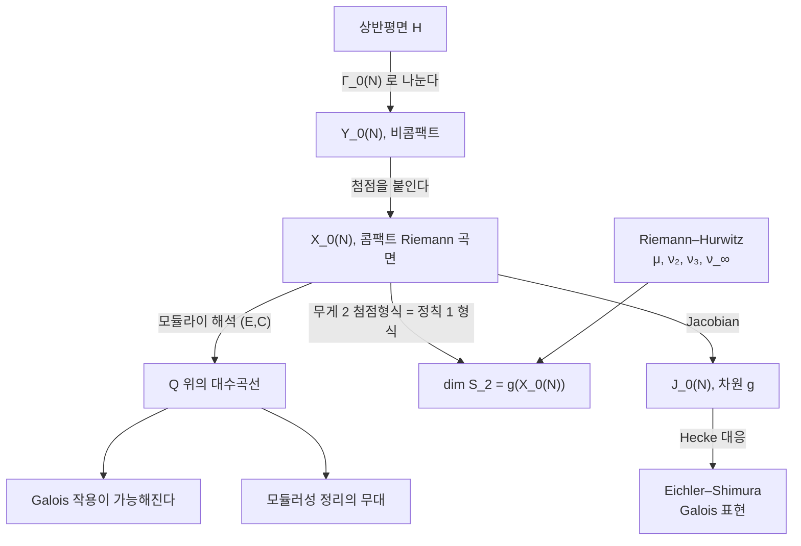

# 모듈러 곡선

# 개요

[모듈러 형식](modular-forms.md)은 상반평면 $\mathbb H$ 위의 함수이지만 변환 규칙 때문에 몫공간 $\Gamma\backslash\mathbb H$ 위의 대상이다. 이 몫이 **모듈러 곡선**이고 첨점을 채워 콤팩트화하면 $X_0(N)$ 이다.

이 곡선은 해석적으로 Riemann 곡면이고 대수적으로 $\mathbb Q$ 위에서 정의된 대수곡선이며, 모듈라이 해석을 갖는다. $X_0(N)$ 의 점이 [타원곡선](elliptic-curves.md)과 그 위의 위수 $N$ 순환 부분군의 쌍을 분류한다.

$$
Y_0(N)=\Gamma_0(N)\backslash\mathbb H\ \longleftrightarrow\ \lbrace(E,C):C\subset E\ \text{순환},\ |C|=N\rbrace/\negthinspace\cong
$$

무게 2 첨점형식이 $X_0(N)$ 의 정칙 미분형식이므로 $\dim S_2(\Gamma_0(N))$ 이 곡선의 **종수**와 같고, 종수는 군의 지표와 타원점, 첨점 개수로 계산된다.

$$
g\big(X_0(N)\big)=1+\frac\mu{12}-\frac{\nu_2}4-\frac{\nu_3}3-\frac{\nu_\infty}2
$$

$\mathbb Q$ 위에서 정의된다는 사실이 Galois 작용을 가능하게 하고, 모듈러성 정리가 그 위에서 서술된다.

# 직관

## 몫이 곡선이 되는 과정

$\Gamma_0(N)$ 이 $\mathbb H$ 에 불연속으로 작용하므로 몫이 Riemann 곡면이 된다. 콤팩트하지 않다는 것과 안정자군이 자명하지 않은 점이 있다는 것이 두 문제다.

첫 문제는 **첨점**으로 해결한다. $\mathbb Q\cup\lbrace\infty\rbrace$ 의 $\Gamma_0(N)$ 궤도를 유한 개의 점으로 추가하면 $X_0(N)=\Gamma_0(N)\backslash(\mathbb H\cup\mathbb Q\cup\lbrace\infty\rbrace)$ 가 콤팩트하다.

둘째 문제는 **타원점**이다. 안정자가 위수 2 또는 3 인 점에서 몫이 국소적으로 $z\mapsto z^2$ 또는 $z\mapsto z^3$ 처럼 접히므로 좌표를 그만큼 늘려야 매끄럽다. 위수 2 와 3 만 나오는 것은 $\mathrm{SL}_2(\mathbb Z)$ 의 유한 위수 원소가 위수 4 와 6 뿐이기 때문이다.

두 보정이 Riemann–Hurwitz 공식에 들어가 종수 공식을 만든다. $\mu=[\mathrm{SL}\_2(\mathbb Z):\Gamma_0(N)]$ 가 덮개의 차수이고 $\nu_2,\nu_3,\nu_\infty$ 가 분기 자료다.

## 모듈라이 해석

$\tau\in\mathbb H$ 에 격자 $L_\tau=\mathbb Z+\mathbb Z\tau$ 와 타원곡선 $E_\tau=\mathbb C/L_\tau$ 를 대응시킨다. $\mathrm{SL}_2(\mathbb Z)$ 의 작용은 격자의 기저를 바꾸므로 $E_\tau$ 를 바꾸지 않고, $\mathrm{SL}_2(\mathbb Z)\backslash\mathbb H$ 가 타원곡선의 동형류 전체, 곧 $j$ 불변량의 값들이다.

$\Gamma_0(N)$ 으로 좁히면 부분군 $\langle1/N\rangle\subset E_\tau$ 를 보존하는 변환만 남으므로 $\Gamma_0(N)\backslash\mathbb H$ 의 점이 쌍 $(E,C)$ 를 분류한다.

이 해석이 $\mathbb Q$ 유리성을 준다. 타원곡선과 위수 $N$ 순환 부분군의 쌍이라는 조건은 대수적으로 쓸 수 있으므로 $X_0(N)$ 이 $\mathbb Q$ 위의 곡선으로 실현된다. 해석적 정의만으로는 $\mathbb Q$ 계수의 출처를 알 수 없다.

## 미분형식과 무게 2

$f\in S_2(\Gamma_0(N))$ 에 대해 $\omega=f(\tau)\thinspace d\tau$ 를 둔다. $\gamma=\begin{pmatrix}a&b\cr c&d\end{pmatrix}$ 에 대해 $d(\gamma\tau)=(c\tau+d)^{-2}d\tau$ 이므로 무게 2 변환 규칙과 상쇄된다.

$$
f(\gamma\tau)\thinspace d(\gamma\tau)=(c\tau+d)^2f(\tau)\cdot(c\tau+d)^{-2}d\tau=f(\tau)\thinspace d\tau
$$

$\omega$ 가 $\Gamma_0(N)$ 불변이므로 $X_0(N)$ 위의 미분형식으로 내려오고, 첨점형식 조건이 첨점에서 극을 갖지 않는다는 조건이 된다.

$$
S_2(\Gamma_0(N))\ \cong\ \Omega^1\big(X_0(N)\big),\qquad \dim S_2(\Gamma_0(N))=g\big(X_0(N)\big)
$$

무게 2 에서만 이 대응이 성립한다. 다른 무게에서는 미분형식이 아니라 그 거듭제곱의 절편이 된다.

# 정의

## 첨점과 타원점

$\Gamma_0(N)$ 의 지표는 곱 공식으로 주어진다.

$$
\mu=[\mathrm{SL}_2(\mathbb Z):\Gamma_0(N)]=N\prod_{p\mid N}\Big(1+\frac1p\Big)
$$

**첨점의 개수**는 약수마다 센다.

$$
\nu_\infty=\sum_{d\mid N}\varphi\big(\gcd(d,N/d)\big)
$$

$N$ 이 소수이면 $\nu_\infty=2$ 로 $0$ 과 $\infty$ 두 개다.

**타원점의 개수**는 이차 지표로 주어진다. $\left(\frac{-1}\cdot\right)$ 와 $\left(\frac{-3}\cdot\right)$ 는 각각 법 4, 법 3 의 이차 지표다.

$$
\nu_2=\begin{cases}0&4\mid N\cr \prod_{p\mid N}\big(1+\left(\frac{-1}p\right)\big)&\text{그 외}\end{cases}
\qquad
\nu_3=\begin{cases}0&9\mid N\cr \prod_{p\mid N}\big(1+\left(\frac{-3}p\right)\big)&\text{그 외}\end{cases}
$$

위수 2 의 타원점은 허수곱이 $\mathbb Z[i]$ 인 $j=1728$ 에서, 위수 3 의 타원점은 허수곱이 $\mathbb Z[\omega]$ 인 $j=0$ 에서 온다. 지표가 나오는 것은 $\mathbb Z[i]$ 와 $\mathbb Z[\omega]$ 에서 $N$ 이 쪼개지는 방식을 세기 때문이다.

## 종수 공식

> $N>1$ 에 대해
> $$
> g\big(X_0(N)\big)=1+\frac\mu{12}-\frac{\nu_2}4-\frac{\nu_3}3-\frac{\nu_\infty}2
> $$

$X_0(1)=\mathbb P^1$ 의 종수가 $0$ 이라는 사실에서 Riemann–Hurwitz 로 끌어낸 것이다[^1]. $\mu/12$ 가 덮개의 차수에서 오는 주항이고 나머지 세 항이 분기 보정이다.

## Jacobian 과 Hecke 대응

$J_0(N)=\mathrm{Jac}(X_0(N))$ 은 차원 $g$ 의 아벨다양체이고 $\mathbb Q$ 위에서 정의된다. Hecke 작용소 $T_p$ 는 $X_0(N)$ 위의 **대응**으로 실현되어 $J_0(N)$ 의 자기준동형을 준다.

$$
X_0(Np)\ \xrightarrow{\ \alpha\ }\ X_0(N),\qquad
X_0(Np)\ \xrightarrow{\ \beta\ }\ X_0(N),\qquad
T_p=\beta_*\alpha^*
$$

모듈라이로 읽으면 $(E,C)\mapsto\sum_{D}(E/D,\thinspace(C+D)/D)$ 로 위수 $p$ 부분군 전부에 걸친 합이다. [Hecke 작용소](hecke-operators.md)의 격자 정의가 곡선 위의 기하로 번역된 것이다.

# 성질

## 종수가 작은 레벨

$g=0$ 인 $N$ 은 유한하다.

$$
g\big(X_0(N)\big)=0\iff N\in\lbrace 1,\dots,10,12,13,16,18,25\rbrace
$$

이때 $X_0(N)\cong\mathbb P^1$ 이라 유리점이 무한히 많고, 위수 $N$ 의 순환 부분군을 갖는 $\mathbb Q$ 위의 타원곡선도 무한히 많다.

$g=1$ 인 $N$ 은 $11,14,15,17,19,20,21,24,27,32,36,49$ 의 12 개다. 이때 $X_0(N)$ 자체가 타원곡선이고 $N=11$ 이 가장 작다. $X_0(11)$ 은 도체 11 의 타원곡선 $y^2+y=x^3-x^2$ 이고 대응하는 무게 2 새형식이 $\eta(\tau)^2\eta(11\tau)^2$ 다.

이 유한성이 **Mazur 의 정리**로 이어진다. $\mathbb Q$ 위 타원곡선의 비틀림 부분군이 15 가지뿐이라는 정리이고, 증명의 핵심이 $g\ge2$ 인 $X_0(N)$ 에서 $\mathbb Q$ 유리점이 첨점밖에 없음을 보이는 것이다. Mazur 는 Faltings 정리보다 앞서 $J_0(N)$ 의 Eisenstein 아이디얼로 결론을 얻었다.

## 유리점과 모듈러성

$X_0(N)(\mathbb Q)$ 의 점은 첨점, 허수곱을 갖는 곡선에서 오는 점, 나머지 세 종류다. 셋째 종류의 존재 여부를 묻는 것이 **Serre 의 균등성 문제**이고 $N$ 이 충분히 크면 없다는 것이 추측이다.

도체 $N$ 의 타원곡선 $E$ 가 모듈러라는 것은 $\mathbb Q$ 위에서 정의된 전사 사상

$$
\varphi\colon X_0(N)\longrightarrow E
$$

가 있다는 뜻이고, 이 사상의 차수인 **모듈러 차수**가 BSD 추측의 정량적 형태에 나타난다.

## 계산 도구

$X_0(N)$ 의 $\mathbb Q$ 위 방정식은 $j$ 와 $j_N=j(N\tau)$ 사이의 **모듈러 다항식** $\Phi_N(x,y)$ 로 얻지만 계수가 폭발적으로 커져 실제로는 다른 모형을 쓴다.

$J_0(N)$ 의 Hecke 작용을 유한 계산으로 다루는 표준 도구는 **모듈러 기호**다. 첨점 두 개를 잇는 경로의 호몰로지류를 형식적으로 다루어 $H_1(X_0(N),\mathbb Z)$ 의 기저와 그 위의 Hecke 행렬을 정수 선형대수로 계산하며, 새형식 표가 이 방법으로 만들어진다.

# 활용

## 종수 공식의 계산

$\mu$ , $\nu_2$ , $\nu_3$ , $\nu_\infty$ 는 서로 무관한 방식으로 계산되지만 그 조합은 언제나 12 로 나누어떨어진다. Riemann–Hurwitz 가 그 관계를 강제한다.

$N=11$ 에서 $g=1$ 이므로 $\dim S_2(\Gamma_0(11))=1$ 이고, 그 1 차원 공간의 생성원이 $\eta(\tau)^2\eta(11\tau)^2$ 다. $N=37$ 은 $g=2$ 인 가장 작은 소수 레벨이며, 도체 37 의 타원곡선이 계수 1 을 갖는 가장 작은 곡선이라는 사실과 짝을 이룬다.

## 도구로서의 쓰임

- **비틀림점의 분류.** Mazur 의 정리와 그 일반화가 $X_0(N)$ 이나 $X_1(N)$ 의 유리점 계산이다.
- **모듈러성과 Fermat.** Frey 곡선이 레벨 2 의 새형식에서 와야 하는데 $g(X_0(2))=0$ 이라 그런 형식이 없고, 이것이 모순의 마지막 고리다.
- **새형식 계산.** 모듈러 기호로 $H_1(X_0(N))$ 과 Hecke 행렬을 구해 새형식을 열거하며, 행렬의 크기를 종수 공식이 미리 준다.
- **Galois 표현.** $J_0(N)$ 의 $\ell$ 진 Tate 가군이 2 차원 Galois 표현들의 곳간이고 Eichler–Shimura 관계가 $T_p$ 와 Frobenius 를 잇는다.

[^1]: 종수 공식과 첨점·타원점의 개수는 F. Diamond, J. Shurman, *A First Course in Modular Forms* (2005) 3.7절. 모듈라이 해석은 같은 책 1.5절과 8장. 종수 0 과 1 인 레벨 목록은 같은 책의 표와 B. Birch, W. Kuyk 편, *Modular Functions of One Variable IV* (1975) 에 있다. Mazur 의 정리는 B. Mazur, *Modular curves and the Eisenstein ideal*, Publ. IHÉS 47 (1977).

# 연관 문서

## 선수지식

- [모듈러 형식](modular-forms.md)
- [타원곡선과 군 구성](elliptic-curves.md)
- [Riemann 곡면과 균일화 정리](riemann-surfaces.md)

## 더 알아보기

- [Schoof–Elkies–Atkin 알고리즘](sea-algorithm.md)
- [Eisenstein 아이디얼과 Mazur 의 비틀림점 정리](eisenstein-ideal.md)
- [모듈러 기호](modular-symbols.md)
- [Fontaine–Mazur 추측](fontaine-mazur.md)
- [Heegner 점과 Gross–Zagier 공식](heegner-points.md)

#number_theory #complex_analysis #algebraic_topology
