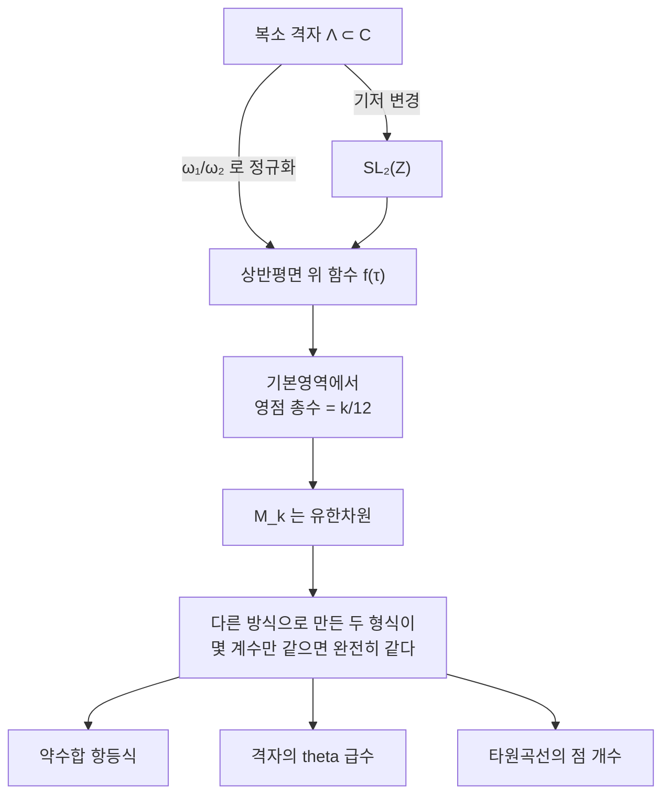

# 모듈러 형식

# 개요

상반평면 `\mathbb H=\{z:\mathrm{Im}\,z>0\}` 위의 [정칙함수](holomorphic-functions.md) 가운데, 무한군 `\mathrm{SL}_2(\mathbb Z)` 의 [작용](group-actions.md)에 대해 정해진 방식으로 변하는 것을 모듈러 형식이라 한다.

$$
f\Big(\frac{az+b}{cz+d}\Big)=(cz+d)^kf(z)\qquad
\begin{pmatrix}a&b\\c&d\end{pmatrix}\in\mathrm{SL}_2(\mathbb Z)
$$

조건이 지나치게 강해 보인다. 무한히 많은 변환 각각에 대한 등식이고, 게다가 정칙성까지 요구한다. 그런데 해가 0 만 있는 것이 아니다. 각 무게 `k` 마다 유한차원 벡터공간이 정확히 남는다.

**유한차원이라는 사실 자체가 도구다.** 전혀 다른 방식으로 만든 두 모듈러 형식이 같은 작은 공간에 살면, 몇 개의 계수만 맞춰 봐도 둘이 같다는 결론이 나온다. 그러면 나머지 무한히 많은 계수의 항등식이 공짜로 따라온다. 약수 함수의 합성곱 항등식, 분할수의 점근식, 격자의 theta 급수, 타원곡선의 점 개수가 모두 이 방식으로 연결된다.

이 대칭이 `\mathrm{GL}_2` 자기동형 표현의 고전적 얼굴이며, [Langlands 강령](langlands-program.md)에서 Galois 표현과 짝지어지는 쪽이 바로 여기다.

# 직관

## 원래는 격자의 함수였다

`\mathbb C` 의 격자 `\Lambda=\mathbb Z\omega_1+\mathbb Z\omega_2` 에 수를 대응시키는 함수 `F(\Lambda)` 를 생각하자. 자연스러운 요구는 크기 조정에 대한 동차성이다.

$$
F(\lambda\Lambda)=\lambda^{-k}F(\Lambda)
$$

`\Lambda` 를 `\omega_2` 로 나눠 정규화하면 `\mathbb Z\tau+\mathbb Z`(`\tau=\omega_1/\omega_2\in\mathbb H`) 가 되므로, `F` 는 `\mathbb H` 위의 함수 `f(\tau)` 로 바뀐다. 그런데 같은 격자를 주는 기저는 여럿이고, 기저 변경은 정확히 `\mathrm{SL}_2(\mathbb Z)` 다. `(\omega_1,\omega_2)` 를 `(a\omega_1+b\omega_2,\ c\omega_1+d\omega_2)` 로 바꾸면 `\tau\mapsto\frac{a\tau+b}{c\tau+d}` 이고 정규화 인자가 `(c\tau+d)` 만큼 바뀐다. 변환 규칙 `f(\gamma\tau)=(c\tau+d)^kf(\tau)` 가 여기서 나온다.

그러니 모듈러 형식의 이상해 보이는 정의는 "격자의 함수를 좌표로 쓴 것" 이다. [격자](lattices.md) 자체는 기저에 무관한 대상이고, 인자 `(c\tau+d)^k` 는 좌표를 고른 대가다.

## 왜 유한차원인가

`\mathrm{SL}_2(\mathbb Z)` 의 기본영역은 `|\tau|\ge1`, `|\mathrm{Re}\,\tau|\le\frac12` 인 영역이다. 이 영역이 위쪽으로 열려 있으므로 `\tau\to i\infty` 에서의 거동을 따로 규정해야 하고, 그 조건이 "첨점에서 정칙" 이다.

`f` 가 무게 `k` 의 모듈러 형식이면 유수 정리를 기본영역의 경계에 적용해 영점의 총수가 정확히 `k/12` 임을 얻는다.

$$
\mathrm{ord}_\infty(f)+\tfrac12\mathrm{ord}_i(f)+\tfrac13\mathrm{ord}_\rho(f)+\sum_{\text{나머지}}\mathrm{ord}_P(f)=\frac k{12}
$$

`1/2` 과 `1/3` 은 `i` 와 `\rho=e^{2\pi i/3}` 에서 고정자군이 자명하지 않아 붙는 가중치다. 영점의 개수가 유계라는 것은 곧 함수가 그만큼의 자유도밖에 못 갖는다는 뜻이고, 차원이 유한해진다. `k<0` 이면 우변이 음수라 형식이 없고, `k=2` 에서도 없다.



## 유한차원성이 항등식을 낳는다

무게 8 의 모듈러 형식 공간은 1 차원이다. 그런데 `E_8` 도 무게 8 이고 `E_4^2` 도 무게 8 이다. 둘 다 상수항이 1 이므로 같을 수밖에 없다.

$$
E_4(\tau)^2=E_8(\tau)
$$

양변의 `q` 전개를 비교하면 약수 함수의 비자명한 항등식이 나온다.

$$
\sigma_7(n)=\sigma_3(n)+120\sum_{m=1}^{n-1}\sigma_3(m)\sigma_3(n-m)
$$

초등적으로 증명하려면 상당히 번거로운 이 등식이, 두 함수가 1 차원 공간에 있다는 관찰 하나로 끝난다. 이것이 모듈러 형식이 정수론에서 쓰이는 전형적인 방식이다.

# 정의

## 상반평면 위의 작용

`\gamma=\begin{pmatrix}a&b\\c&d\end{pmatrix}\in\mathrm{SL}_2(\mathbb R)` 가 `\gamma\tau=\frac{a\tau+b}{c\tau+d}` 로 `\mathbb H` 에 작용한다. 핵심 등식은

$$
\mathrm{Im}(\gamma\tau)=\frac{\mathrm{Im}\,\tau}{|c\tau+d|^2}
$$

이고, 이것이 `\mathbb H` 가 보존됨을 보장한다. `\pm I` 가 자명하게 작용하므로 실제로 작용하는 것은 `\mathrm{PSL}_2` 다.

**합동 부분군**은 `\mathrm{SL}_2(\mathbb Z)` 의 유한지표 부분군 중 어떤 `N` 에 대해 `\Gamma(N)=\ker(\mathrm{SL}_2(\mathbb Z)\to\mathrm{SL}_2(\mathbb Z/N))` 를 포함하는 것이다. 가장 많이 쓰는 것이

$$
\Gamma_0(N)=\Big\{\begin{pmatrix}a&b\\c&d\end{pmatrix}\in\mathrm{SL}_2(\mathbb Z):c\equiv0\ (\mathrm{mod}\ N)\Big\}
$$

이고, `N` 을 **레벨**이라 한다.

## 모듈러 형식과 첨점형식

`\Gamma\subseteq\mathrm{SL}_2(\mathbb Z)` 가 합동 부분군일 때, 다음 셋을 만족하는 `f\colon\mathbb H\to\mathbb C` 를 무게 `k` 레벨 `\Gamma` 의 모듈러 형식이라 한다.

1. `f` 가 `\mathbb H` 에서 정칙이다.
2. 모든 `\gamma\in\Gamma` 에서 `f(\gamma\tau)=(c\tau+d)^kf(\tau)` 다.
3. 모든 첨점에서 정칙이다.

`\begin{pmatrix}1&1\\0&1\end{pmatrix}\in\Gamma` 이므로 `f(\tau+1)=f(\tau)` 이고, `q=e^{2\pi i\tau}` 로 두면 `f` 가 `q` 의 함수가 된다. 조건 3 은 그 전개가 `q` 의 음수 거듭제곱을 갖지 않는다는 뜻이다.

$$
f(\tau)=\sum_{n\ge0}a_nq^n
$$

모든 첨점에서 `a_0=0` 이면 **첨점형식**이라 하고 `S_k(\Gamma)` 로 쓴다. `M_k(\Gamma)` 는 모듈러 형식 전체이며, 둘 다 유한차원이다.

## 표준적인 예

**Eisenstein 급수.** `k\ge4` 가 짝수일 때 격자 위의 합 `G_k(\Lambda)=\sum_{0\ne\lambda\in\Lambda}\lambda^{-k}` 가 무게 `k` 의 형식을 주고, 상수항을 1 로 정규화하면

$$
E_k(\tau)=1-\frac{2k}{B_k}\sum_{n\ge1}\sigma_{k-1}(n)q^n
$$

이다. `E_4=1+240\sum\sigma_3(n)q^n`, `E_6=1-504\sum\sigma_5(n)q^n` 이다.

**판별식 형식.** 무게 12 의 첨점형식

$$
\Delta=\frac{E_4^3-E_6^2}{1728}=q\prod_{n\ge1}(1-q^n)^{24}=\sum_{n\ge1}\tau(n)q^n
$$

이 `\mathbb H` 에서 영점을 갖지 않는다. 계수 `\tau(n)` 이 Ramanujan 의 tau 함수다.

**`j` 불변량.** `j=E_4^3/\Delta` 는 무게 0 이고 `\mathbb H` 에서 정칙이지만 첨점에서 극을 갖는다. `\mathrm{SL}_2(\mathbb Z)` 불변 함수의 체를 생성하며, 격자의 동형류를 완전히 분류한다.

`\mathrm{SL}_2(\mathbb Z)` 전체에 대한 형식들의 등급환은 자유 다항식환이다.

$$
\bigoplus_kM_k(\mathrm{SL}_2(\mathbb Z))=\mathbb C[E_4,E_6]
$$

## Hecke 작용소

`M_k` 위에 작용하는 가환 연산자족이 있다. 소수 `p` 에서 `q` 전개로 쓰면 간단하다.

$$
(T_pf)_n=a_{np}+p^{k-1}a_{n/p}\qquad(p\nmid n \text{ 이면 둘째 항은 0})
$$

`T_m` 들이 서로 교환하고 자기수반이므로 동시 고유벡터의 기저가 있다. 그런 `f` 를 **Hecke 고유형식**이라 하고 `a_1=1` 로 정규화하면 고유값이 곧 계수가 된다. 그러면 계수가 곱셈적이 되고 `L` 함수가 Euler 곱을 갖는다.

$$
L(s,f)=\sum_{n\ge1}\frac{a_n}{n^s}=\prod_p\Big(1-a_pp^{-s}+p^{k-1-2s}\Big)^{-1}
$$

# 성질

## 차원

`\mathrm{SL}_2(\mathbb Z)` 에서 짝수 `k\ge0` 에 대해

$$
\dim M_k=\begin{cases}\lfloor k/12\rfloor&k\equiv2\pmod{12}\\ \lfloor k/12\rfloor+1&\text{그 외}\end{cases}
$$

이고 홀수 `k` 에서는 0 이다. `-I` 가 `(-1)^k` 를 곱하기 때문이다. `k=4,6,8,10` 에서 차원이 1 이고 `k=12` 에서 처음 2 가 된다. `S_{12}` 가 1 차원이라 `\Delta` 가 상수배를 빼고 유일한 무게 12 첨점형식이다.

차원이 작다는 것이 계속 쓰인다. 무게 `k` 의 두 형식이 `\lfloor k/12\rfloor+1` 개의 계수에서 일치하면 완전히 같다는 뜻이기 때문이다. 이 논법을 **Sturm 한계**라 하고, 항등식의 기계적 증명 절차가 된다.

## Ramanujan 의 `\tau`

`\Delta` 가 유일한 무게 12 첨점형식이므로 자동으로 Hecke 고유형식이고, `\tau` 가 곱셈적이다.

$$
\tau(mn)=\tau(m)\tau(n)\ (\gcd(m,n)=1),\qquad \tau(p^{r+1})=\tau(p)\tau(p^r)-p^{11}\tau(p^{r-1})
$$

크기에 대한 Ramanujan 의 추측 `|\tau(p)|\le2p^{11/2}` 는 훨씬 깊다. Deligne 이 Weil 추측을 증명하면서 따라 나왔다. 유한체 위 다양체의 점 개수에 대한 정리가 복소해석적 대상의 Fourier 계수를 통제한 것이다.

합동 관계도 풍부하다. 무게 12 의 Eisenstein 급수 `E_{12}` 의 계수에 691 이 분모로 등장하는 데서

$$
\tau(n)\equiv\sigma_{11}(n)\pmod{691}
$$

이 나온다. 이런 합동이 Galois 표현의 환원으로 설명된다는 것이 Serre 와 Deligne 의 관점이며, Iwasawa 이론과 Serre 추측으로 이어진다.

## 모듈러 곡선

`Y_0(N)=\Gamma_0(N)\backslash\mathbb H` 는 Riemann 곡면이고, 첨점을 더해 콤팩트화한 것이 `X_0(N)` 이다. 이 곡면 위에서 무게 2 의 첨점형식이 정칙 미분형식 `f(\tau)d\tau` 와 정확히 대응한다.

$$
\dim S_2(\Gamma_0(N))=g\big(X_0(N)\big)
$$

`N=11` 에서 종수가 1 이라 `X_0(11)` 자체가 타원곡선이 되고, 그에 대응하는 유일한 무게 2 첨점형식이 `\eta(\tau)^2\eta(11\tau)^2` 다. [Langlands 강령](langlands-program.md) 문서에서 이 형식의 계수가 곡선의 점 개수와 일치함을 확인했다.

`X_0(N)` 이 대수곡선이라는 사실이 결정적이다. 해석적으로 정의된 대상이 `\mathbb Q` 위에서 정의된 대수다양체가 되고, 그 위의 Galois 작용을 볼 수 있게 된다. 모듈러성 정리의 무대가 여기다.

## 준모듈러와 유사모듈러

`E_2=1-24\sum\sigma_1(n)q^n` 은 무게 2 의 모듈러 형식이 아니다. 정의하는 급수가 절대수렴하지 않아 변환식에 보정항이 붙는다.

$$
E_2\Big(\frac{-1}\tau\Big)=\tau^2E_2(\tau)+\frac{12\tau}{2\pi i}
$$

이런 대상을 준모듈러 형식이라 한다. 보정항이 있어도 쓸모가 많다. `\Delta` 의 로그미분이 `E_2` 이고, Ramanujan 의 미분 관계식

$$
q\frac{dE_4}{dq}=\frac{E_2E_4-E_6}3,\qquad q\frac{dE_6}{dq}=\frac{E_2E_6-E_4^2}2
$$

가 등급환을 미분에 대해 닫아 준다. 비슷하게 조화적 Maass 형식은 Ramanujan 의 유사 theta 함수를 설명하며, 분할수의 합동을 다루는 현대적 틀이 된다.

# 활용

## 항등식을 계수로 확인한다

```python
from math import gcd

N = 40
sigma = lambda k, n: sum(d**k for d in range(1, n+1) if n % d == 0)

def eisenstein(k, N):
    """정규화된 Eisenstein 급수 E_k = 1 - (2k/B_k) Σ σ_{k-1}(n) qⁿ."""
    c = {4: 240, 6: -504, 8: 480, 10: -264}[k]
    return [1] + [c*sigma(k - 1, n) for n in range(1, N + 1)]

def mul(a, b, N):
    out = [0]*(N + 1)
    for i, ai in enumerate(a):
        if ai:
            for j in range(0, N - i + 1):
                out[i + j] += ai*b[j]
    return out

E4, E6, E8 = eisenstein(4, N), eisenstein(6, N), eisenstein(8, N)
print("M_8 이 1 차원이므로  E4² = E8 :", mul(E4, E4, N) == E8)
print("  따라나오는 약수합 항등식 :",
      all(sigma(7, n) == sigma(3, n)
          + 120*sum(sigma(3, m)*sigma(3, n - m) for m in range(1, n))
          for n in range(1, 15)))

# Δ = (E4³ - E6²)/1728 = q ∏ (1-qⁿ)²⁴
delta = [(x - y)//1728 for x, y in zip(mul(mul(E4, E4, N), E4, N), mul(E6, E6, N))]
eta24 = [0]*(N + 1); eta24[0] = 1
for n in range(1, N + 1):
    for _ in range(24):
        for j in range(N, n - 1, -1):
            eta24[j] -= eta24[j - n]
eta24 = [0] + eta24[:N]                              # 앞의 q
print("\nΔ = (E4³-E6²)/1728 = q∏(1-qⁿ)²⁴ :", delta == eta24)

tau = delta
print("τ(1..10) =", tau[1:11])
print("τ(n) ≡ σ11(n) (mod 691) :", all((tau[n] - sigma(11, n)) % 691 == 0
                                       for n in range(1, N + 1)))
print("τ 가 곱셈적 :", all(tau[m]*tau[n] == tau[m*n] for m in range(1, 7)
                       for n in range(1, 7) if gcd(m, n) == 1 and m*n <= N))
print("τ(p²) = τ(p)² - p¹¹ :", all(tau[p*p] == tau[p]**2 - p**11 for p in (2, 3, 5)))

# M_8 이 1 차원이므로  E4² = E8 : True
#   따라나오는 약수합 항등식 : True
#
# Δ = (E4³-E6²)/1728 = q∏(1-qⁿ)²⁴ : True
# τ(1..10) = [1, -24, 252, -1472, 4830, -6048, -16744, 84480, -113643, -115920]
# τ(n) ≡ σ11(n) (mod 691) : True
# τ 가 곱셈적 : True
# τ(p²) = τ(p)² - p¹¹ : True
```

`\Delta` 를 정의하는 두 방식 — Eisenstein 급수의 다항식과 무한곱 — 은 겉보기에 아무 관계가 없다. 둘이 같은 1 차원 공간에 있고 첫 계수가 같다는 것만으로 모든 계수가 일치한다. `\tau` 의 곱셈성도 Hecke 작용소의 고유벡터라는 사실에서 따라 나올 뿐, 계수의 정의에서는 전혀 보이지 않는다.

## 격자의 theta 급수

격자 `\Lambda` 의 theta 급수 `\Theta_\Lambda(\tau)=\sum_{v\in\Lambda}q^{|v|^2/2}` 는 `\Lambda` 가 짝수 유니모듈러면 무게 `\dim\Lambda/2` 의 모듈러 형식이 된다. 계수는 주어진 길이의 벡터 개수를 센다.

차원 8 에서 짝수 유니모듈러 격자는 `E_8` 하나뿐이고, `M_4` 가 1 차원이므로 `\Theta_{E_8}=E_4` 다. 그래서 `E_8` 격자에서 길이 제곱이 `2n` 인 벡터의 개수가 `240\sigma_3(n)` 이다. 길이 `\sqrt2` 인 최소 벡터가 `240` 개라는 [구 채우기](sphere-packing.md)의 출발점이 여기서 나온다. 차원 16 에서는 `M_8` 이 여전히 1 차원이라 서로 동형이 아닌 두 격자의 theta 급수가 같아지는 현상까지 설명된다.

## 분할수와 생성함수

`\prod(1-q^n)^{-1}` 이 분할수의 [생성함수](generating-functions.md)이고, `\eta(\tau)=q^{1/24}\prod(1-q^n)` 과 무게 `1/2` 의 변환 규칙으로 연결된다. 이 변환 규칙이 `q\to1` 근방의 거동을 통제하므로 원법을 적용할 수 있고,

$$
p(n)\sim\frac1{4n\sqrt3}\exp\Big(\pi\sqrt{\tfrac{2n}3}\Big)
$$

라는 Hardy–Ramanujan 점근식이 나온다. Rademacher 는 같은 방법을 끝까지 밀어 `p(n)` 을 정확히 주는 수렴급수를 얻었다. 순수하게 조합적인 양이 모듈러 대칭으로 계산되는 사례다.

Ramanujan 의 합동 `p(5n+4)\equiv0\pmod5`, `p(7n+5)\equiv0\pmod7`, `p(11n+6)\equiv0\pmod{11}` 도 같은 틀에서 설명된다.

## 산술 대상과의 대응

무게 2 의 고유형식이 타원곡선과 대응하고(모듈러성 정리), 무게 1 의 고유형식이 2 차원 Artin 표현과 대응한다. 일반적으로 무게 `k\ge2` 의 고유형식마다 2 차원 `\ell` 진 Galois 표현이 있고 `a_p` 가 Frobenius 의 대각합이 된다.

이 대응이 `\mathrm{GL}_2` Langlands 의 고전적 서술이다. 계수 `a_p` 하나가 복소해석적 대상의 Fourier 계수이면서 동시에 유한체 위의 점 개수이고 Galois 군 원소의 대각합이라는 점이 요점이다. 서로 다른 세 세계가 같은 수열을 공유한다.

# 연관 문서

## 선수지식

- [정칙함수와 Cauchy 적분 정리](holomorphic-functions.md)
- [군 작용](group-actions.md)

## 더 알아보기

- [Langlands 강령](langlands-program.md)
- [분할수와 원법](partitions.md)

#number_theory #complex_analysis #group_theory
