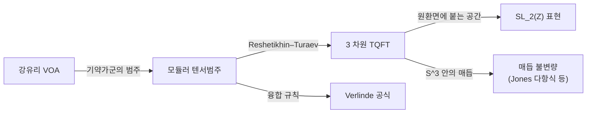

# 모듈러 텐서범주와 3 차원 TQFT

# 개요

[Zhu 대수](zhu-algebra.md) 문서에서 강유리 정점작용소대수의 기약가군들이 두 가지를 동시에 갖는 것을 보았다. 서로 곱해지는 **융합 구조**와, 지표의 모듈러 변환에서 나오는 $S$ 행렬이다. 그리고 Verlinde 공식이 둘을 묶었다.

이 자료를 정점작용소대수에서 떼어내 공리로 세운 것이 **모듈러 텐서범주**(modular tensor category, MTC)다. [범주](category.md) 하나에 다음이 얹힌다.

- 대상의 [텐서곱](tensor-products.md)과 유한개의 단순대상. 곱이 단순대상의 직합으로 분해된다.
- **꼬임**(braiding) $c_{X,Y}:X\otimes Y\to Y\otimes X$ 는 대칭이 아니어도 된다. 두 번 꼬으면 제자리로 돌아오지 않아도 된다.
- 그 꼬임이 **비퇴화**하다는 조건. 동치로 $S$ 행렬이 가역이다.

마지막 조건이 이름의 $modular$ 를 설명한다. $S$ 와 $T$ 가 $\mathrm{SL}_2(\mathbb Z)$ 의 표현을 이루기 때문이다.

$$
S=\begin{pmatrix}0&-1\\1&0\end{pmatrix},\qquad T=\begin{pmatrix}1&1\\0&1\end{pmatrix}
$$

그런데 이 공리계에서 나오는 결과가 예상 밖이다. **MTC 하나가 3 차원 위상적 장론(TQFT) 하나와 같다.** Reshetikhin–Turaev 구성이 MTC 에서 3 차원 다양체와 그 안의 매듭에 대한 불변량을 만들어 내고, 역으로 3 차원 TQFT 에서 원환면에 붙는 벡터공간과 그 위의 $\mathrm{SL}_2(\mathbb Z)$ 작용이 MTC 를 복원한다.

$$
\{\text{MTC}\}\ \longleftrightarrow\ \{\text{3 차원 TQFT}\}
$$

대수적 공리 몇 줄이 위상수학의 불변량을 낳는다. Jones 다항식이 이 구성의 가장 작은 예이고, 위상적 양자계산이 그 응용이다.

# 직관

## 왜 꼬임이 3 차원인가

벡터공간의 텐서곱에서는 $V\otimes W\cong W\otimes V$ 이고 이 동형을 두 번 하면 항등이다. 대칭 모노이달 범주의 성질이고, 우리가 아는 대수의 기본이다.

그런데 세계선을 생각하면 사정이 달라진다. 평면 위의 두 점을 서로 맞바꾸는 과정을 시간 방향을 세워 3 차원에서 그리면 두 가닥이 꼬인다. 시계방향으로 바꾸는 것과 반시계방향으로 바꾸는 것이 다른 꼬임이고, 그 둘을 이어 붙여도 풀리지 않는다.

$$
c_{Y,X}\circ c_{X,Y}\neq\mathrm{id}_{X\otimes Y}
$$

곧 **꼬임은 2 공간차원 + 1 시간차원의 대칭**이고, 대칭성(두 번 하면 항등)은 3 공간차원 이상에서만 강제된다. 3 차원에서는 두 입자의 세계선을 풀 수 있는 여유가 있어 교환이 $\pm1$ 로만 나타나고(보손과 페르미온), 2 차원에서는 그럴 여유가 없어 임의의 위상인자나 행렬이 나올 수 있다. 이런 준입자를 **애니온**이라 부른다.

이것이 "MTC 가 3 차원 TQFT 와 같다" 는 말의 기하적 출처다. 꼬임을 그리려면 정확히 한 차원이 더 필요하고, 그렇게 그린 그림이 3 차원 다양체 안의 얽힌 고리다.

## 모듈러 조건이 말하는 것

꼬임이 있는 범주에서 단순대상 $X$ 가 **투명하다**는 것은 모든 $Y$ 에 대해 꼬임을 두 번 한 것이 항등이라는 뜻이다. 곧 $X$ 는 다른 어떤 것과도 실질적으로 얽히지 않는다.

$$
c_{Y,X}\circ c_{X,Y}=\mathrm{id}\quad\forall Y
$$

단위대상 $\mathbf1$ 은 언제나 투명하다. **모듈러**란 투명한 단순대상이 $\mathbf1$ 뿐이라는 조건이다. 얽힘이 퇴화하지 않았다, 곧 정보를 잃는 방향이 없다는 뜻이다.

이 조건이 $S$ 행렬의 가역성과 같다. $S_{ij}$ 는 두 고리 $i,j$ 를 한 번 걸어 놓은 그림(Hopf 고리)의 불변량이고, $X_i$ 가 투명하면 그 행이 다른 행에 종속되어 $S$ 가 퇴화한다. 반대로 $S$ 가 가역이면 서로를 구별할 만큼 충분히 얽혀 있다는 뜻이다.

## 원환면과 $\mathrm{SL}_2(\mathbb Z)$

3 차원 TQFT 는 곡면마다 벡터공간을 붙인다. 원환면 $T^2$ 에 붙는 공간의 차원이 단순대상의 개수이고, 기저가 "원환면의 속을 채우는 고체원환의 심에 라벨 $i$ 를 넣은 상태" 다.

원환면의 자기동상사상군(mapping class group)이 $\mathrm{SL}_2(\mathbb Z)$ 이므로, 그 군이 이 벡터공간에 작용한다. $S$ 는 두 주기를 맞바꾸는 사상이고 $T$ 는 한 쪽을 비트는 사상이다. Zhu 정리에서 지표가 $\mathrm{SL}_2(\mathbb Z)$ 표현을 이루던 것과 같은 작용이고, 양쪽에서 같은 행렬이 나온다. 등각장론의 해석적 사실과 위상수학의 사상류군이 여기서 만난다.

# 정의

## 융합범주에서 모듈러까지

$\mathbb C$ 위의 범주 $\mathcal C$ 가 다음을 만족하면 **융합범주**다.

- $\mathbb C$ 선형이고 반단순이며 유한개의 단순대상 $X_0=\mathbf1,X_1,\dots,X_{n-1}$ 을 갖는다.
- 결합적 텐서곱과 단위대상이 있고 각 대상의 쌍대 $X^*$ 가 있다.

단순대상의 곱을 분해한 계수를 **융합 규칙**이라 한다.

$$
X_i\otimes X_j\cong\bigoplus_kN_{ij}^kX_k,\qquad N_{ij}^k\in\mathbb Z_{\ge0}
$$

여기에 꼬임 $c_{X,Y}$ 와 정합적인 비틀림 $\theta_X$ (리본 구조)를 얹으면 **리본범주**가 되고, 각 단순대상에 두 수가 붙는다.

$$
d_i=\text{양자 차원},\qquad \theta_i=\text{비틀림 고유값}
$$

$S$ 행렬과 $T$ 행렬을 다음으로 정의한다.

$$
S_{ij}=\frac1{\mathcal D}\sum_kN_{i^*j}^k\frac{\theta_k}{\theta_i\theta_j}d_k,\qquad T_{ij}=\delta_{ij}\theta_i,\qquad \mathcal D=\sqrt{\sum_id_i^2}
$$

$S_{ij}$ 는 도형으로 보면 라벨 $i,j$ 를 단 두 고리를 한 번 걸어 놓은 그림의 값이다.

> **정의.** 리본 융합범주가 **모듈러**라는 것은 $S$ 가 가역이라는 뜻이다. 이때 $S,T$ 가 $\mathrm{SL}_2(\mathbb Z)$ 의 사영표현을 준다.

## Verlinde 공식

모듈러 조건이 있으면 융합 규칙이 $S$ 로 완전히 결정된다.

$$
N_{ij}^k=\sum_m\frac{S_{im}S_{jm}\overline{S_{km}}}{S_{0m}}
$$

동치인 형태가 더 인상적이다. 융합 행렬 $(N_i)\_{jk}=N_{ij}^k$ 들이 서로 가환이고, $S$ 가 그것들을 **동시에 대각화한다**. 곧 융합 규칙이라는 정수 자료가 한 행렬의 고유벡터 자료로 바뀐다.

# 성질

## 예와 분류

| MTC | 단순대상 수 | 비고 |
|---|---|---|
| $\mathrm{Vec}$ | 1 | 자명 |
| 준-Ising 곧 $\mathrm{SU}(2)_2$ | 3 | $\mathbf1,\sigma,\psi$ 이고 $\sigma^2=\mathbf1\oplus\psi$ |
| Fibonacci ($\mathrm{SU}(2)_3$ 의 부분) | 2 | $\tau^2=\mathbf1\oplus\tau$ 이고 $d_\tau=\varphi$ 는 황금비 |
| $\mathrm{SU}(2)_k$ | $k+1$ | 위의 예 |
| $\mathcal Z(\mathrm{Vec}_G)$ | $G$ 의 켤레류 자료 | 유한군 $G$ 의 Drinfeld 중심 |

Fibonacci 범주에서 $d_\tau$ 가 황금비라는 것은 $d_\tau^2=1+d_\tau$ 에서 나온다. 양자 차원이 정수가 아니어도 된다는 점이 보통의 표현론과 갈리는 지점이고, 애니온 하나가 차원 $\varphi$ 를 갖는다는 물리적 진술이 된다.

분류 문제에서 중요한 결과가 하나 있다.

> **랭크 유한성 정리 (Bruillard–Ng–Rowell–Wang, 2016).** 단순대상 개수를 고정하면 MTC 는 동치를 빼고 유한개다.

증명은 $S,T$ 가 $\mathrm{SL}_2(\mathbb Z)$ 의 표현을 이루며 그 핵이 유한 지표라는 사실(Ng–Schauenburg 의 Galois 대칭)에서 나온다. 모듈러성이 분류를 가능하게 만드는 유한성을 공급한다. 랭크 5 까지 완전한 목록이 알려져 있다.[^1]

## 3 차원 TQFT 로의 번역

Reshetikhin–Turaev 구성은 MTC 에서 다음을 만든다.

- 닫힌 곡면 $\Sigma$ 에 벡터공간 $Z(\Sigma)$ 가 붙는다. 원환면이면 차원이 단순대상 개수다.
- 3 차원 다양체 $M$ 에 수 $Z(M)\in\mathbb C$ 가 붙는다. 경계가 있으면 $Z(\partial M)$ 의 벡터가 된다.
- $M$ 안의 라벨 붙은 매듭에 수.

3 차원 다양체가 매듭을 따라 수술하면 얻어진다는 사실(Lickorish–Wallace)과, 수술 표현이 Kirby 이동으로 연결된다는 사실을 쓴다. 매듭 불변량을 정의한 뒤 Kirby 이동에 불변임을 확인하면 다양체 불변량이 되고, 그 확인에 필요한 것이 정확히 $S$ 의 가역성이다. **모듈러 조건이 없으면 매듭 불변량은 만들어도 3 차원 다양체 불변량으로 올라가지 못한다.**

# 활용

## 매듭 불변량

$\mathrm{SU}(2)_k$ 에서 라벨 1 곧 스핀 $1/2$ 를 단 매듭의 불변량이 Jones 다항식을 $q=e^{2\pi i/(k+2)}$ 에서 평가한 값이다. Jones 가 1984 년에 작용소 대수에서 발견한 다항식이 왜 매듭을 구별하는지에 대해, Witten 이 3 차원 Chern–Simons 이론의 Wilson 고리 기댓값이라는 물리적 설명을 주었고, Reshetikhin–Turaev 가 그것을 수학적으로 구성했다. MTC 는 그 구성의 대수적 입력이다.

라벨을 바꾸면 색 Jones 다항식이 나오고, 다른 Lie 군을 쓰면 HOMFLY 나 Kauffman 다항식이 나온다. 매듭 다항식의 동물원이 MTC 의 목록으로 정리된다.

## 위상적 양자계산

애니온 여러 개를 평면에 놓으면 그 상태공간이 $Z$ 로 주어지고, 애니온을 서로 돌려 위치를 바꾸는 것이 그 공간 위의 유니터리 연산이 된다. 연산이 경로의 위상만으로 정해지므로 국소적 잡음에 강하다. 양자계산을 잡음으로부터 보호하는 방법으로 제안된 이유다.

Fibonacci 애니온의 꼬임 연산이 유니터리 군에서 조밀한 부분군을 생성하므로 이것만으로 보편 양자계산이 가능하다. 반면 $\mathrm{SU}(2)_2$ 의 Ising 애니온은 Clifford 군만 주어 보편적이지 않고 추가 연산이 필요하다. **범주의 대수적 성질이 계산 능력을 결정한다.**

## 정점작용소대수와의 왕복

강유리 VOA 의 가군 범주가 MTC 라는 것(Huang)이 두 이론을 잇는다. 이 다리로 양쪽 문제가 서로 옮겨간다. VOA 쪽에서 [Zhu 정리](zhu-algebra.md)가 준 $S$ 행렬이 범주 쪽 $S$ 행렬과 같고, 거꾸로 MTC 의 분류 결과가 어떤 VOA 가 존재할 수 있는지를 제한한다. 주어진 MTC 를 실현하는 VOA 가 항상 있는지는 열린 문제다.

[^1]: 기초 구성은 N. Reshetikhin–V. Turaev, *Invariants of 3-manifolds via link polynomials and quantum groups*, Invent. Math. 103 (1991) 와 V. Turaev, *Quantum Invariants of Knots and 3-Manifolds* (1994). 물리적 기원은 E. Witten, *Quantum field theory and the Jones polynomial*, Commun. Math. Phys. 121 (1989). 랭크 유한성은 P. Bruillard, S.-H. Ng, E. Rowell, Z. Wang, *Rank-finiteness for modular categories*, J. Amer. Math. Soc. 29 (2016). 위상적 양자계산은 Z. Wang, *Topological Quantum Computation* (2010). 본문의 Verlinde 계산은 직접 한 것이다.

# 연관 문서

## 선수지식

- [Zhu 대수와 모듈러 불변성](zhu-algebra.md)
- [범주](category.md)
- [텐서곱](tensor-products.md)

## 더 알아보기

- [Reshetikhin–Turaev 불변량](reshetikhin-turaev.md)
- [애니온과 위상적 양자계산](anyons.md)

#category_theory #algebra #topology
