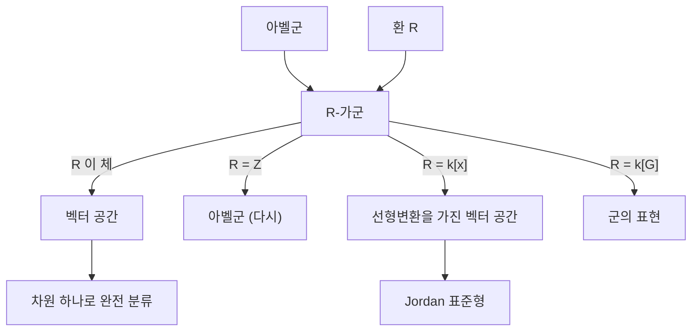

# 가군

# 개요

가군(module)은 [벡터 공간](vector-spaces.md)의 스칼라를 [체](fields.md) 대신 [환](rings.md)으로 바꾼 구조다. 정의에 등장하는 공리는 벡터 공간과 글자 그대로 같지만, 스칼라를 나눌 수 없게 되는 순간 이론의 성격이 크게 달라진다. 기저가 없는 가군이 흔해지고, 부분가군이 직합 인자로 떨어져 나오지 않으며, 원소가 스칼라에 의해 소멸될 수 있다.

가군은 대수 전반의 공통 언어이기도 하다. 아벨군은 정수환 위의 가군이고, 아이디얼과 몫환은 환 자신을 가군으로 본 부분가군과 몫가군이며, [군](groups.md)의 표현은 군환 위의 가군이다. 서로 다른 분야에서 따로 배운 분류 정리들이 "PID 위 유한생성 가군 구조 정리" 하나로 합쳐지는 것도 이 언어 덕분이다.

# 직관

## 스칼라를 나눌 수 없다는 것

벡터 공간에서는 $0$ 이 아닌 스칼라로 항상 나눌 수 있다. 이 하나의 사실이 기저 존재, 차원의 유일성, 모든 부분공간의 직합 보완, 모든 짧은 정확열의 분해를 전부 떠받친다. 환에서는 역원이 없는 원소가 있으므로 이 기둥이 사라진다.

정수환 위의 가군, 즉 아벨군에서 무슨 일이 벌어지는지 보면 충분하다.

- $\mathbb{Z}/6\mathbb{Z}$ 의 원소 $2$ 는 $0$ 이 아니지만 $3 \cdot 2 = 0$ 이다. 이런 원소를 torsion이라 한다. 벡터 공간에는 없다.
- $\mathbb Z/2\mathbb Z$ 는 $\mathbb Z$ 위에서 생성원 하나로 생성되지만, 그 생성원은 일차독립이 아니다. 따라서 기저가 없다.
- $2\mathbb{Z} \subset \mathbb{Z}$ 는 부분가군이지만 $\mathbb{Z} = 2\mathbb{Z} \oplus M$ 을 만족하는 $M$ 은 없다.

## 환을 스스로에게 작용시키기

가장 기본적인 가군은 환 $R$ 자신이다. 곱셈을 스칼라 곱으로 쓰면 $R$ 은 $R$ 가군이고, 이때 부분가군이 정확히 [아이디얼](ideals-quotient-rings.md)이다. 즉 아이디얼 이론은 "환을 가군으로 볼 때의 부분구조 이론" 이다. 몫환 $R/I$ 도 $R$ 가군이며, 이 관점에서 환론의 여러 계산이 선형대수처럼 보이기 시작한다.

## 두 방향의 일반화

가군은 두 방향에서 동시에 일반화다. 벡터 공간에서 보면 스칼라를 약화한 것이고, 아벨군에서 보면 작용을 추가한 것이다.



이 그림의 마지막 두 줄이 가군 언어의 값어치를 보여 준다. 선형변환의 분류와 군 표현의 분해가 각각 특정 환 위의 가군론으로 흡수된다.

# 정의

## 좌가군

환 $R$ 이 단위원 $1$ 을 가진다고 하자. 아벨군 $(M,+)$ 과 사상

$$
R \times M \to M, \qquad (r, m) \mapsto rm
$$

이 다음 네 조건을 만족하면 $M$ 을 좌 $R$ 가군이라 한다.

$$
r(m + n) = rm + rn, \qquad (r + s)m = rm + sm
$$

$$
(rs)m = r(sm), \qquad 1 \cdot m = m
$$

우가군은 스칼라를 오른쪽에서 곱하고 $(rs)$ 의 순서가 $m(rs)=(mr)s$ 가 되도록 한 구조다. $R$ 이 가환이면 좌우 구별은 형식적이다. 아래에서 환은 별말이 없으면 가환이고 가군은 좌가군이다.

동치인 서술 하나가 유용하다. $M$ 이 $R$ 가군이라는 것은 환 준동형

$$
\rho : R \to \operatorname{End}_{\mathbb{Z}}(M)
$$

가 주어진 것과 같다. 즉 가군은 "아벨군의 자기준동형환으로 가는 환 준동형" 이고, 이는 군 작용을 "대칭군으로 가는 준동형" 으로 보는 [군 작용](group-actions.md)의 관점과 정확히 평행하다.

## 기본 예

- 임의의 아벨군 $A$ 는 유일한 $\mathbb{Z}$ -가군이다. $n \cdot a$ 를 $a$ 의 $n$ 번 덧셈으로 정의하는 것 외에 선택지가 없기 때문이다.
- 체 $k$ 위의 $k$ 가군은 $k$ 벡터 공간이다.
- 환 $R$ 자신, 그리고 임의의 아이디얼 $I$, 그리고 몫 $R/I$.
- [다항식환](polynomial-rings.md) $k[x]$ 가군은 "벡터 공간 $V$ 와 선형변환 $T$ 의 쌍" 과 같다. $x$ 의 작용을 $T$ 로 정하면 된다.
- 군환 $k[G]$ 가군은 $G$ 의 $k$ 위 선형표현이다. [군의 표현과 지표](group-representations.md)에서 다룬다.

## 부분가군, 몫, 준동형

부분집합 $N \subseteq M$ 이 덧셈에 대해 부분군이고 $rN \subseteq N$ 이면 부분가군이다. 이때 몫 아벨군 $M/N$ 에 $r(m + N) = rm + N$ 로 스칼라 곱을 주면 몫가군이 된다.

사상 $f:M\to N$ 이 $f(m+m')=f(m)+f(m')$, $f(rm)=rf(m)$ 을 만족하면 $R$ 준동형이라 하고, 그 전체를 $\mathrm{Hom}_R(M,N)$ 으로 쓴다. $R$ 이 가환이면 $\mathrm{Hom}_R(M,N)$ 자체가 다시 $R$ 가군이다. 체 위에서는 이것이 [선형사상](linear-maps.md)의 공간이다.

## 동형정리

[군](groups.md)이나 [환](rings.md)에서와 같은 형태가 그대로 성립한다. $f:M\to N$ 이 준동형이면

$$
M / \ker f \;\cong\; \operatorname{im} f
$$

이고, 부분가군 $A, B \subseteq M$ 과 $N \subseteq L \subseteq M$ 에 대해

$$
(A + B)/B \cong A/(A \cap B), \qquad (M/N)\big/(L/N) \cong M/L
$$

가 성립한다. 증명은 아벨군에서의 증명에 스칼라 곱이 잘 정의됨을 확인하는 한 줄을 더한 것뿐이다.

## 생성, 자유가군, 계수

부분집합 $S \subseteq M$ 이 생성하는 부분가군은 유한 합 $\sum r_i s_i$ 전체다. 어떤 유한집합이 $M$ 을 생성하면 $M$ 을 유한생성이라 한다.

$S$ 가 생성집합이면서 일차독립, 즉 $\sum r_i s_i = 0$ 이 모든 $r_i = 0$ 을 강제하면 $S$ 는 기저이고 $M$ 은 자유가군이다. 자유가군은 직합

$$
M \cong R^{(S)} = \bigoplus_{s \in S} R
$$

과 동형이며, 다음 보편성질로 특징지어진다. 집합 사상 $S\to N$ 은 $R$ 준동형 $R^{(S)}\to N$ 으로 유일하게 확장된다. 이것이 자유가군 functor와 망각 functor의 [adjunction](adjunctions.md)이다.

가환환 위에서는 자유가군의 계수(rank)가 잘 정의된다. $R^m \cong R^n$ 이면 극대 아이디얼 $\mathfrak{m}$ 하나를 잡아 $R/\mathfrak{m}$ 를 텐서하면 체 위 벡터 공간의 차원 비교가 되어 $m = n$ 이다.

## 소멸자와 torsion

원소 $m \in M$ 의 소멸자는

$$
\operatorname{Ann}(m) = \{ r \in R : rm = 0 \}
$$

이고, 이는 $R$ 의 아이디얼이다. $R$ 이 정역일 때 $\mathrm{Ann}(m) \ne 0$ 인 원소를 torsion 원소라 하고, 그 전체 $T(M)$ 은 부분가군이 된다. $T(M) = 0$ 이면 torsion-free, $T(M) = M$ 이면 torsion 가군이다. 벡터 공간에서는 항상 $T(M) = 0$ 이므로 이 개념 자체가 비어 있다.

# 성질

## 벡터 공간과의 차이

| 성질 | 체 위 벡터 공간 | 일반 환 위 가군 |
| --- | --- | --- |
| 기저 | 항상 존재 | 대체로 없음 ($\mathbb Z/2\mathbb Z$ 는 $\mathbb Z$ 위에서 비자유) |
| 부분구조 | 항상 직합 인자 | 아님 ( $2\mathbb{Z} \subset \mathbb{Z}$ ) |
| 생성집합 | 기저로 축소 가능 | 축소 불가능할 수 있음 |
| 유한생성 부분구조 | 항상 유한생성 | 비Noether 환에서는 실패 |
| 불변량 | 차원 하나 | 계수 + torsion 구조 |

세 번째 줄은 실제로 자주 발목을 잡는다. $\mathbb Z$ 위에서 $\mathbb Q$ 는 어떤 유한집합으로도 생성되지 않으면서 torsion-free다.

## 짧은 정확열과 분해

$$
0 \to A \xrightarrow{\ f\ } B \xrightarrow{\ g\ } C \to 0
$$

가 정확하다는 것은 $f$ 가 단사, $g$ 가 전사, $\mathrm{im}\thinspace f = \ker g$ 라는 뜻이다. 체 위에서는 이런 열이 항상 분해되어 $B \cong A \oplus C$ 이지만, 일반 환에서는 그렇지 않다. 예를 들어

$$
0 \to \mathbb{Z}/2\mathbb{Z} \to \mathbb{Z}/4\mathbb{Z} \to \mathbb{Z}/2\mathbb{Z} \to 0
$$

는 분해되지 않는다. $\mathbb{Z}/4\mathbb{Z}$ 는 $\mathbb{Z}/2\mathbb{Z} \oplus \mathbb{Z}/2\mathbb{Z}$ 와 동형이 아니기 때문이다. 분해가 자동으로 일어나는 가군을 사영(projective) 가군이라 하고, 이것이 호몰로지 대수의 출발점이다.

## PID 위 유한생성 가군 구조 정리

$R$ 이 주 아이디얼 정역(PID)이면 사정이 매우 좋아진다.

**정리.** $R$ 이 PID이고 $M$ 이 유한생성 $R$ -가군이면, 유일하게 정해지는 계수 $n \ge 0$ 과 비단원 원소 $d_1 \mid d_2 \mid \cdots \mid d_k$ 가 존재하여

$$
M \;\cong\; R^{n} \oplus R/(d_1) \oplus R/(d_2) \oplus \cdots \oplus R/(d_k)
$$

가 성립한다. $d_i$ 를 불변인자라 한다. 각 $R/(d_i)$ 를 소원소 거듭제곱으로 쪼개면 초등인자 형태

$$
M \;\cong\; R^{n} \oplus \bigoplus_{j} R/(p_j^{e_j})
$$

도 얻는다. 두 분해의 데이터는 서로를 결정하며 $M$ 의 동형류를 완전히 결정한다.[^1]

*증명 스케치.* $M$ 이 $n$ 개로 생성되면 전사 $R^n \to M$ 이 있고 그 핵 $K$ 는 PID 위 자유가군의 부분가군이므로 다시 자유이며 계수가 $n$ 이하다. $K \subseteq R^n$ 의 포함을 행렬로 적고 행·열 기본변형을 가하면, PID에서의 gcd 계산([유클리드 알고리즘](euclidean-algorithm.md)이 있는 경우 그대로)이 대각행렬 $\mathrm{diag}(d_1, \ldots, d_k)$ 를 만든다. 이것이 Smith 표준형이고, 몫을 취하면 위 분해가 나온다. 유일성은 $M/pM$ 의 차원과 $p^i M$ 의 크기 같은 불변량을 비교해 얻는다. ∎

## 두 따름정리

- $R=\mathbb Z$ 로 두면 유한생성 아벨군의 분류가 된다. 모든 유한생성 아벨군은 $\mathbb Z^n$ 과 순환군들의 직합이다.
- $R=k[x]$ 로 두고 $M$ 을 선형변환 $T$ 를 가진 유한차원 벡터 공간으로 보면, 초등인자가 곧 $T$ 의 Jordan 블록이다. [고윳값과 고유벡터](eigenvalues.md)의 이론과 유리 표준형, Jordan 표준형이 이 정리의 특수한 경우다.

## Noether 조건

부분가군의 증가열이 항상 멈추는 가군을 Noether 가군이라 한다. $R$ 이 Noether 환이면 유한생성 $R$ 가군은 Noether이고, 따라서 부분가군도 유한생성이다. 이 조건은 위 구조 정리처럼 "유한한 데이터로 기술한다" 는 모든 논증의 배경 가정이다.

# 활용

## 유한생성 아벨군 계산

구조 정리의 계산판은 정수 행렬의 Smith 표준형이다. 관계행렬이 주어진 아벨군의 분해를 다음처럼 얻는다.

```python
from sympy import Matrix
from sympy.matrices.normalforms import smith_normal_form

# 생성원 3개, 관계 2개인 아벨군 Z^3 / im(A)
A = Matrix([[2, 4, 4],
            [-6, 6, 12]])
S = smith_normal_form(A)          # 대각 불변인자
d = [S[i, i] for i in range(min(S.shape))]
print(d)                          # [2, 6] 형태의 불변인자

rank = A.shape[1] - len([x for x in d if x != 0])
torsion = [x for x in d if abs(x) not in (0, 1)]
print("자유 계수:", rank, "/ torsion:", torsion)
# 결과: Z^1 (+) Z/2 (+) Z/6
```

여기서 자유 계수는 생성원 수에서 $0$ 이 아닌 불변인자 수를 뺀 값이고, 단원인 불변인자는 인자를 만들지 않는다.

## 아이디얼과 환론

아이디얼을 부분가군으로 보면 환론의 기본 구성이 모두 가군 연산이 된다. 아이디얼의 합과 곱, 몫환 $R/I$, 그리고 [소 아이디얼과 극대 아이디얼](prime-ideals.md)의 성질이 대응하는 가군의 단순성으로 번역된다. 예를 들어 $I$ 가 극대 아이디얼인 것과 $R/I$ 가 단순 가군인 것은 같은 말이다. 분모를 허용해 새 환을 만드는 [국소화](localization-rings.md)도 가군에 그대로 적용되어, 국소적 성질을 보고 전역 성질을 판정하는 표준 기법을 만든다.

## 선형대수의 일반화

[텐서곱](tensor-products.md)은 두 가군에서 쌍선형 사상을 선형화하는 구성이고, 그 결과 $\mathrm{Hom}_R(M \otimes N, P) \cong \mathrm{Hom}_R(M, \mathrm{Hom}_R(N, P))$ 라는 adjunction이 생긴다. 스칼라 확장 $S \otimes_R M$ 은 계수환을 바꿔 가면서 같은 대상을 다르게 보는 장치로, 실수 표현을 복소수로 확장하거나 정수 격자를 유리수 공간에 넣는 조작이 모두 여기에 해당한다.

## 표현론과 그 너머

군환 $k[G]$ 위의 가군은 [군의 표현과 지표](group-representations.md)의 대상이고, $\operatorname{char}k$ 가 $|G|$ 를 나누지 않을 때 이 환 위의 모든 가군이 단순가군의 직합이 된다는 것이 Maschke 정리다. 이는 "가군 범주가 벡터 공간 범주처럼 행동하는 조건" 을 묻는 일반적 질문의 한 사례다.[^2]

대수기하에서는 환 위의 가군이 공간 위의 벡터다발 비슷한 대상으로 해석되고, 호몰로지 대수에서는 가군의 정확열이 불변량을 계산하는 도구가 된다. [단체 호몰로지](homology.md)의 사슬군은 처음부터 $\mathbb Z$ 가군이며, 구조 정리 덕분에 호몰로지군이 자유 부분과 torsion 부분으로 갈린다.

[^1]: Wikipedia, Structure theorem for finitely generated modules over a principal ideal domain, https://en.wikipedia.org/wiki/Structure_theorem_for_finitely_generated_modules_over_a_principal_ideal_domain
[^2]: Wikipedia, Semisimple module, https://en.wikipedia.org/wiki/Semisimple_module

# 연관 문서

## 선수지식

- [환](rings.md)
- [벡터 공간](vector-spaces.md)

## 더 알아보기

- [텐서곱](tensor-products.md)

#ring_theory #algebra
