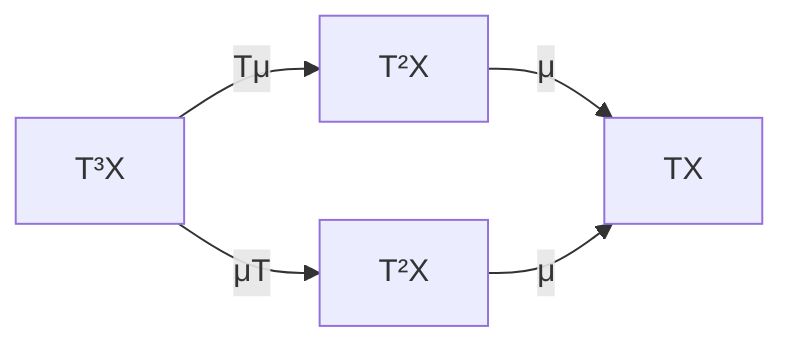

# Monad

# 개요

Monad는 한 범주 $\mathcal C$ 위에서 "무언가를 형식적으로 덧붙였다가 두 겹으로 쌓인 것을 한 겹으로 평탄화하는" 구조다. 데이터는 자기 functor $T : \mathcal C \to \mathcal C$ 와 두 [자연변환](natural-transformations.md) $\eta : \mathrm{id} \Rightarrow T$ 와 $\mu : T^2 \Rightarrow T$ 세 개뿐이고, 조건도 결합법칙과 단위법칙 두 줄뿐이다.

Monad가 중요한 이유는 [adjunction](adjunctions.md)과의 관계에 있다. 모든 수반 $F \dashv G$ 는 $T = GF$ 로 monad를 남기고, 거꾸로 모든 monad는 그것을 낳는 수반으로 분해된다. 즉 monad는 수반이 한쪽 범주에 남긴 그림자이고, 그 그림자만 보고 원래 수반을 복원하는 방법이 두 가지(Kleisli, Eilenberg–Moore) 있다. 수반을 먼저 읽어야 하는 이유가 여기에 있다.

# 직관

## 붙이고 평탄화하기

집합 $X$ 에 그 원소들의 유한 리스트 전체를 대응시키는 $T(X) = \mathrm{List}(X)$ 를 보자. $\eta_X$ 는 원소를 길이 1 리스트로 만들고, $\mu_X$ 는 리스트의 리스트를 이어 붙여 한 겹으로 만든다.

$$
\eta_X(x)=[x],\qquad \mu_X\big([[1,2],[\,],[3]]\big)=[1,2,3]
$$

$\mu$ 가 지켜야 할 것은 두 가지다. 세 겹을 두 겹으로 줄이는 순서가 달라도 결과가 같아야 하고(결합법칙), 중간에 $\eta$ 로 한 겹을 끼워 넣었다가 평탄화하면 아무 일도 없어야 한다(단위법칙). 이것은 모노이드의 곱과 항등원이 만족하는 조건과 글자 그대로 같은 모양이다. 실제로 monad는 "자기 functor들의 범주 안의 모노이드" 라고 요약된다.

## 문맥을 품은 계산

$T(X)$ 를 "$X$ 의 값을 어떤 문맥 안에 담은 것" 으로 읽으면 $\eta$ 는 순수한 값을 문맥에 넣는 일, $\mu$ 는 문맥이 이중으로 쌓인 것을 하나로 합치는 일이다.

| $T$ | 문맥 | $\mu$ 가 하는 일 |
|---|---|---|
| `List` | 비결정적 결과 여러 개 | 가능성의 가능성을 펼쳐 모은다 |
| `Maybe` | 실패할 수 있음 | 실패의 실패는 실패다 |
| $X \mapsto (X \times S)^S$ | 상태를 읽고 쓰기 | 상태 변화를 순서대로 잇는다 |
| $X \mapsto$ 확률분포 | 무작위성 | 분포의 혼합을 하나의 분포로 |
| $X \mapsto$ 자유군 | 형식적 낱말 | 낱말의 낱말을 펼쳐 쓴다 |

$f : X \to T(Y)$ 꼴의 사상을 이으려면 $f$ 를 적용한 뒤 $T(g)$ 를 적용하고 $\mu$ 로 평탄화한다. 이 합성이 결합적이라는 것이 결국 monad 법칙이고, 프로그래밍에서 `bind` 가 잘 작동하는 이유다.

# 정의

## 세 쌍 (T, η, μ)

범주 $\mathcal C$ 위의 monad는 functor $T : \mathcal C \to \mathcal C$ 와 자연변환 $\eta : \mathrm{id}_{\mathcal C} \Rightarrow T$ 와 $\mu : T \circ T \Rightarrow T$ 로, 다음 두 등식을 모든 대상에서 만족하는 것이다.

$$
\mu\circ T\mu=\mu\circ\mu T,\qquad \mu\circ T\eta=\operatorname{id}_T=\mu\circ\eta T
$$

$T\mu$ 는 성분이 $T(\mu_X)$ 인 자연변환이고 $\mu T$ 는 성분이 $\mu_{T(X)}$ 인 자연변환이다. 같은 $T^3(X) \to T(X)$ 를 만드는 두 방법이 일치해야 한다는 뜻이다.

## Kleisli 형태의 동치 정의

$\mu$ 대신 확장 연산 $(-)^*$ 를 쓰는 정의도 있다. 대상마다 $\eta_X : X \to T(X)$ 를 주고, 각 사상 $f : X \to T(Y)$ 에 $f^\ast : T(X) \to T(Y)$ 를 대응시키되 다음을 요구한다.

$$
f^*\circ\eta_X=f,\qquad \eta_X^*=\operatorname{id}_{T(X)},\qquad (g^*\circ f)^*=g^*\circ f^*
$$

이 데이터에서 $T(f) = (\eta \circ f)^\ast$ 와 $\mu = (\mathrm{id}\_{T(X)})^\ast$ 를 정의하면 앞의 정의가 복원되고, 반대로 $f^* = \mu \circ T(f)$ 로 가면 이쪽이 복원된다. 프로그래밍 언어의 `return` 과 `bind` 가 정확히 $\eta$ 와 $(-)^*$ 다.

## T-대수

Monad $T$ 에 대한 대수는 대상 $A$ 와 사상 $a : T(A) \to A$ 로, 다음을 만족한다.

$$
a\circ\eta_A=\operatorname{id}_A,\qquad a\circ\mu_A=a\circ T(a)
$$

"형식적으로 쌓아 둔 것을 실제로 계산해 내는 방법" 이 대수이고, 두 조건은 그 계산이 $\eta$ 와 $\mu$ 에 모순되지 않는다는 뜻이다. $T$ 가 자유 monoid monad 인 `List` 이면 $T$ 대수는 정확히 monoid 다. 리스트를 하나의 값으로 접는 방법이 곧 결합적 곱과 항등원이기 때문이다. $T$ 대수와 그 사이의 사상들이 이루는 범주를 Eilenberg–Moore 범주 $\mathcal C^T$ 라 한다.

# 성질

## 모든 수반은 monad를 낳는다

$F \dashv G$ 에 unit $\eta$ 와 counit $\varepsilon$ 이 있으면 $T = GF$ 와 $\mu = G\varepsilon F$ 가 monad 법칙을 만족한다. 삼각항등식이 그대로 단위법칙이 되고, $\varepsilon$ 의 자연성이 결합법칙이 된다. [자유군](groups.md) 수반의 monad는 "집합에 형식적 낱말을 붙이는" 연산, [가군](modules.md)의 자유 수반의 monad는 "형식적 선형결합을 취하는" 연산이다.

## 모든 monad는 수반에서 나온다

역방향은 유일하지 않고, 분해의 양 끝이 존재한다.

- **Kleisli 범주** $\mathcal C_T$ 는 대상이 $\mathcal C$ 와 같고, $X$ 에서 $Y$ 로 가는 사상은 $\mathcal C$ 의 사상 $X \to T(Y)$ 다. 합성은 위의 $g^* \circ f$ 다. 자유 functor $\mathcal C \to \mathcal C_T$ 와 망각 functor가 이루는 수반이 $T$ 를 준다.
- **Eilenberg–Moore 범주** $\mathcal C^T$ 는 위의 $T$ 대수 범주다. 망각 functor $\mathcal C^T \to \mathcal C$ 는 자유대수 functor의 right adjoint이고, 이 수반도 $T$ 를 준다.

$T$ 를 주는 모든 수반의 범주에서 Kleisli는 시작대상, Eilenberg–Moore는 종단대상이다. Kleisli 범주는 $\mathcal C^T$ 의 충만한 부분범주로서 자유대수들만 모은 것과 동치다.

## monad는 대수 이론이다

집합의 범주 위의 monad 가운데 유한 항수의 연산과 등식으로 주어지는 것들은 대수 구조와 일대일로 대응한다. monoid, 군, 환, 가군, 볼록결합 등이 모두 어떤 monad의 대수 범주다. 그래서 "무엇이 대수 구조인가" 라는 질문을 monad 하나로 바꿔 물을 수 있다. 반면 체는 이런 식으로 나오지 않는다. 역원을 부분적으로만 취할 수 있어 등식만으로 서술되지 않기 때문이다.

## 쌍대 개념

화살표를 뒤집으면 comonad $(W, \varepsilon : W \Rightarrow \mathrm{id}, \delta : W \Rightarrow W^2)$ 가 된다. monad가 "값을 문맥에 넣는" 쪽이라면 comonad는 "문맥에서 값을 꺼내고 문맥을 복제하는" 쪽이고, 스트림·이웃을 보는 계산이 대표적인 예다.

# 활용

## 계산 효과의 구조화

순수 함수만 있는 언어에서 예외, 상태, 입출력, 비결정성 같은 효과를 다루는 표준 방법이 monad다. 효과가 다른 두 계산을 잇는 일이 Kleisli 합성이 되고, 결합법칙 덕분에 "어디서 끊어 읽어도 같다" 가 보장되어 프로그램 변형이 안전해진다. `do` 표기법은 Kleisli 합성을 순차 실행처럼 보이게 쓴 문법이다.

## 확률과 측도

집합에 그 위의 [확률분포](random-variables.md) 전체를 대응시키면 monad가 된다. $\eta$ 는 한 점에 질량을 몰아 주는 분포, $\mu$ 는 "분포에서 분포를 뽑아 섞기" 다. [Markov 연쇄](markov-chains.md)의 한 걸음은 $X \to T(X)$ 꼴 Kleisli 사상이고, 여러 걸음을 잇는 일이 Chapman–Kolmogorov 관계식과 같은 내용이 된다.

## 자유 구성의 일반 이론

자유군, 자유가군, 다항식환처럼 "생성원만 주고 관계식은 최소한만 넣는" 구성은 전부 어떤 monad의 자유대수다. 개별 구성마다 보편성질을 새로 증명하는 대신 monad 하나를 확인하면 대수 범주, 몫, 표현이 한꺼번에 따라온다.

# 연관 문서

## 선수지식

- [Adjunction](adjunctions.md)

## 더 알아보기

- [Kleisli 범주와 Eilenberg–Moore 범주](kleisli-eilenberg-moore.md)

#category_theory #construction
