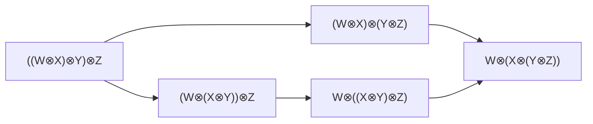

# 모노이드 범주

# 개요

모노이드 범주는 두 대상에 대상 하나를 주는 곱 $\otimes$ 와 단위 대상 $I$ 를 갖고, 결합법칙과 단위법칙이 등식 대신 자연동형으로 성립하는 범주다. 벡터공간과 텐서곱이 모형이다.

자연동형으로 약화한 대가로 공리가 하나 늘어난다. 괄호를 옮기는 동형을 여러 번 합성하는 두 경로가 같은 사상을 주어야 하고, 그 조건이 오각형 등식이다. Mac Lane 의 연접 정리가 이 등식 하나로 모든 경로의 일치를 보장한다.

# 직관

벡터공간 셋의 텐서곱에서 $(U\otimes V)\otimes W$ 와 $U\otimes(V\otimes W)$ 는 같은 집합이 아니다. 앞의 것은 $(u\otimes v)\otimes w$ 꼴 원소가 생성하고 뒤의 것은 $u\otimes(v\otimes w)$ 꼴 원소가 생성한다. 그런데 계산에서는 괄호를 적지 않고 $U\otimes V\otimes W$ 라 쓴다.

괄호를 지울 수 있는 근거는 두 공간 사이의 동형이다. $(u\otimes v)\otimes w\mapsto u\otimes(v\otimes w)$ 가 선형동형 $a\_{U,V,W}$ 를 주고, 이것이 $U,V,W$ 에 대해 자연스럽다. 괄호가 다른 두 공간은 다르지만 표준적인 동형으로 이어진다.

대상이 넷이면 사정이 달라진다. 넷을 묶는 방법은 $((U\otimes V)\otimes W)\otimes X$ 부터 $U\otimes(V\otimes(W\otimes X))$ 까지 다섯 가지이고, 첫 것에서 마지막 것으로 가는 길이 두 개 있다. 하나는 결합자를 세 번, 다른 하나는 두 번 쓴다. 두 길이 같은 동형을 준다는 보장이 정의에 없다.

두 길이 같다는 것을 공리로 요구한다. 그것이 오각형 등식이고, 그 하나만 요구하면 대상이 몇 개든 괄호를 옮기는 임의의 두 경로가 같은 사상을 준다. 그래서 괄호를 지우고 쓸 수 있다.

# 정의

**모노이드 범주**는 다음을 갖춘 범주 $\mathcal C$ 다.

- 함자 $\otimes:\mathcal C\times\mathcal C\to\mathcal C$.
- 대상 $I$.
- 자연동형 $a\_{X,Y,Z}:(X\otimes Y)\otimes Z\to X\otimes(Y\otimes Z)$.
- 자연동형 $l_X:I\otimes X\to X$ 와 $r_X:X\otimes I\to X$.

이들이 두 등식을 만족한다. 하나는 네 대상의 결합자가 이루는 오각형 등식이고, 다른 하나는 단위자와 결합자가 이루는 삼각형 등식 $(\mathrm{id}\_X\otimes l_Y)\circ a\_{X,I,Y}=r_X\otimes\mathrm{id}\_Y$ 다.

위 다이어그램의 두 경로가 같은 사상을 준다는 것이 **오각형 등식**이다.

## 엄격 모노이드 범주

$a$, $l$, $r$ 이 모두 항등사상이면 **엄격**하다고 한다. 집합의 모노이드는 한 대상만 가진 엄격 모노이드 범주이고, 작은 범주들과 함자 합성도 엄격하다.

## 꼬임과 대칭

자연동형 $c\_{X,Y}:X\otimes Y\to Y\otimes X$ 가 두 개의 육각형 등식을 만족하면 **꼬임 모노이드 범주**라 한다. $c\_{Y,X}\circ c\_{X,Y}=\mathrm{id}$ 까지 성립하면 **대칭 모노이드 범주**다.

## 쌍대 대상

대상 $X$ 에 대해 $X^{\ast}$ 와 사상 $\varepsilon:X^{\ast}\otimes X\to I$, $\eta:I\to X\otimes X^{\ast}$ 가 있어 둘을 합성한 것이 항등이 되면 $X^{\ast}$ 를 $X$ 의 쌍대 대상이라 한다. 모든 대상이 쌍대를 가지면 **강직**하다고 한다.

# 성질

## 연접 정리

대상들과 $\otimes$, $I$ 로 만든 두 표현식 사이에서 결합자와 단위자를 합성해 얻는 사상은 유일하다. 곧 그런 사상이 둘 있으면 둘은 같다.[^1]

증명의 요지는 엄격화다. $\mathcal C$ 를 괄호를 지운 표현식들의 범주로 옮기는 모노이드 함자를 만들면 그것이 모노이드 동치이고, 옮긴 쪽이 엄격하므로 모든 결합자가 항등이 된다. 따라서 모든 모노이드 범주는 엄격 모노이드 범주와 모노이드 동치다.

## 단위 대상의 자기사상

$\mathrm{End}(I)$ 는 가환 모노이드다. $f,g:I\to I$ 에 대해 $f\otimes g$ 를 단위자로 두 번 옮기면 $f\circ g$ 와 $g\circ f$ 가 모두 나오기 때문이다.

벡터공간의 범주에서 $\mathrm{End}(I)$ 는 바탕체이고, 이 때문에 선형범주의 사상 집합이 그 체 위의 벡터공간이 된다.

## 모노이드 대상

$\mathcal C$ 의 대상 $M$ 과 사상 $m:M\otimes M\to M$, $e:I\to M$ 이 결합법칙과 단위법칙의 가환도를 만족하면 $M$ 을 $\mathcal C$ 의 **모노이드 대상**이라 한다.

바탕 범주를 바꾸면 익숙한 대수 구조가 나온다. 집합과 직적에서는 모노이드, 벡터공간과 텐서곱에서는 결합대수, 아벨군과 텐서곱에서는 환이다. 한 범주의 자기함자들이 합성으로 이루는 엄격 모노이드 범주에서의 모노이드 대상이 [모나드](monads.md)다.

## 꼬임과 Yang–Baxter 방정식

꼬임 모노이드 범주에서 육각형 등식은 $c$ 가 세 대상의 곱 위에서 Yang–Baxter 방정식

$$(c\otimes\mathrm{id})(\mathrm{id}\otimes c)(c\otimes\mathrm{id})=(\mathrm{id}\otimes c)(c\otimes\mathrm{id})(\mathrm{id}\otimes c)$$

를 만족한다는 것을 준다. 그러므로 대상 $X$ 의 $n$ 중 곱 위에 [땋임군](braid-groups.md) $B_n$ 의 표현이 생긴다.[^2]

[^1]: Saunders Mac Lane, *Categories for the Working Mathematician*, 2판, Springer, 1998, 7 장. 오각형 등식, 연접 정리, 엄격화가 여기 있다.
[^2]: Christian Kassel, *Quantum Groups*, Springer, 1995, 11 장과 15 장. 꼬임 모노이드 범주, Yang–Baxter 방정식, 땋임군 표현의 대응이 여기 있다.

# 활용

- **표현론.** 군 $G$ 의 표현들은 텐서곱으로 대칭 모노이드 범주를 이루고, 쌍대표현이 쌍대 대상이다. 유한군의 표현 범주를 모노이드 범주로 복원하는 것이 Tannaka 쌍대성이다.
- **모듈러 텐서범주.** 꼬임과 쌍대와 반정형 구조를 더하고 꼬임 행렬이 비퇴화인 것이 [모듈러 텐서범주](modular-tensor-categories.md)이고, 그 데이터가 3 차원 위상적 장론을 결정한다.
- **양자군.** 양자군의 표현 범주는 꼬임을 갖지만 대칭이 아니다. 꼬임이 주는 땋임군 표현에서 Jones 다항식이 나온다.
- **텐서곱의 보편성질.** [텐서곱](tensor-products.md)이 쌍선형사상을 선형사상으로 바꾸는 보편성질로 정의되고, 그 구성이 모노이드 구조의 전형이다.

# 연관 문서

## 선수지식

- [자연변환](natural-transformations.md)

## 더 알아보기

- [모듈러 텐서범주](modular-tensor-categories.md)

#category_theory #algebra #topology
