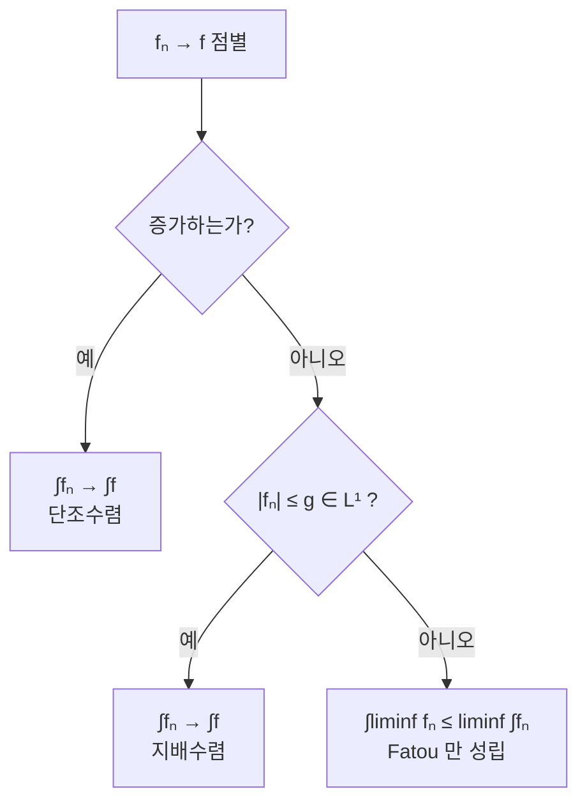

# 단조 수렴 정리

# 개요

[Lebesgue 적분](lebesgue-integral.md)의 정의는 "아래에 놓인 단순함수들의 상한" 이었다. 이 정의는 우아하지만 그 자체로는 계산 도구가 아니다. 선형성조차 정의에서 곧바로 나오지 않는다.

단조 수렴 정리는 정의를 도구로 바꾸는 첫 번째 다리다. 음이 아닌 함수열이 점마다 증가하기만 하면 극한과 적분을 무조건 교환할 수 있다고 말한다. 가정에 균등성도, 지배함수도, 유한성도 없다. 이 관대함 덕분에 적분의 선형성, 급수와 적분의 교환, Fatou 보조정리, 그리고 [지배수렴 정리](dominated-convergence.md)가 차례로 따라 나온다. 측도론의 수렴 정리 체계 전체가 이 하나에서 출발한다.

# 직관

## 쌓아 올리기만 하면 새지 않는다

$f_n$ 이 증가하며 $f$ 로 간다는 것은 적분값도 증가하며 어딘가로 간다는 뜻이다. 문제는 그 도달점이 $\int f$ 보다 작을 수 있는가다.

질량이 새어 나가려면 어딘가로 흘러야 한다. 그런데 $f_n \le f$ 이고 각 점에서 값이 줄지 않으므로, 질량이 옆으로 도망가거나 무한대로 달아날 방법이 없다. 각 점에서 값이 제자리이거나 올라가기만 하기 때문이다. 단조성이 하는 일이 바로 이 봉쇄이며, 그래서 다른 가정이 필요 없다.

## 단조성이 빠지면 곧바로 무너진다

$(0,1]$ 에서 $f_n = n \cdot \mathbf 1_{(0,1/n)}$ 을 보자. 모든 점에서 $0$ 으로 수렴하지만 각 적분은 $1$ 이다. 점점 좁아지는 구간에 점점 높은 봉우리를 세우면 질량이 원점으로 달아나 버린다.



$f_n = n \cdot \mathbf 1_{(0,1/n)}$ 은 증가하지도 않고 적분 가능한 지배함수도 없어 오른쪽 아래로 떨어진다. Fatou 부등식 $0 \le 1$ 은 여전히 맞다.

# 정의

## 진술

측도 공간 $(X, \Sigma, \mu)$ 에서 각 $n$ 에 대해 $f_n : X \to [0,\infty]$ 가 가측이고 모든 $x$ 에서

$$
0\le f_1(x)\le f_2(x)\le\cdots
$$

라 하자. 점별 극한을 $f(x) = \lim f_n(x)$ 로 두면

$$
\lim_{n\to\infty}\int_X f_n\,d\mu=\int_X f\,d\mu
$$

가 성립한다. 양변에 $\infty$ 도 허용한다. 극한 $f$ 는 가측함수의 점별 극한이므로 자동으로 가측이고, 적분값의 수열은 단조성으로 증가하므로 극한이 항상 존재한다. 즉 정리의 양변이 늘 정의된다.

# 성질

## 증명

적분의 단조성에서 $\int f_n \le \int f$ 이므로 왼쪽 극한은 오른쪽 이하다.

반대 부등식이 핵심이다. $f$ 아래의 음이 아닌 단순함수 $s$ 를 하나 고정하고 $0 < c < 1$ 을 잡아

$$
E_n=\{x: f_n(x)\ge c\,s(x)\}
$$

라 두자. $f_n$ 이 증가하므로 $E_n$ 은 증가하고, $c < 1$ 이므로 $s$ 가 양수인 모든 점이 언젠가 $E_n$ 에 들어가 $\bigcup E_n = X$ 다. 그러면

$$
\int_X f_n\,d\mu\ge\int_{E_n}f_n\,d\mu\ge c\int_{E_n}s\,d\mu
$$

이고, $s$ 가 단순함수이므로 오른쪽은 유한 개 집합의 측도의 합이라 측도의 아래로부터 연속성을 쓸 수 있다. $n \to \infty$ 를 취하면

$$
\lim_{n\to\infty}\int_X f_n\,d\mu\ge c\int_X s\,d\mu
$$

를 얻는다. $c \to 1$ 로 보내고 $f$ 아래의 모든 단순함수 $s$ 에 대해 상한을 취하면 정의에 의해 $\int f$ 가 나온다.

증명이 쓰는 것은 측도의 아래로부터 연속성뿐이다. 정리가 사실상 그 성질을 함수 층위로 옮긴 것임을 보여 준다.

## 측도의 연속성

거꾸로 증가하는 가측집합 $E_1 \subseteq E_2 \subseteq \cdots$ 에 $f_n = \mathbf 1_{E_n}$ 을 적용하면

$$
\mu\Bigl(\bigcup_{n=1}^{\infty}E_n\Bigr)=\lim_{n\to\infty}\mu(E_n)
$$

를 얻는다. 정리와 측도의 연속성이 서로를 함의하는 셈이다.

## Fatou 보조정리와 지배수렴

$g_n = \inf_{k \ge n} f_k$ 로 두면 $g_n$ 이 증가하고 $g_n \le f_n$ 이므로 단조수렴 정리를 적용해

$$
\int_X\liminf_n f_n\,d\mu\le\liminf_n\int_X f_n\,d\mu
$$

를 얻는다. 이것이 Fatou 보조정리이고, 음이 아니라는 가정만 있으면 성립한다. 여기에 지배함수를 더해 $g - f_n$ 과 $g + f_n$ 양쪽에 적용하면 지배수렴 정리가 나온다. 세 정리가 하나의 사슬로 이어진다.

## 적분의 선형성

음이 아닌 가측함수 $f$ 와 $g$ 에 대해 $\int(f+g) = \int f + \int g$ 를 보이는 표준적인 방법도 이 정리다. 단순함수로 근사하는 열 $s_n \uparrow f$ 와 $t_n \uparrow g$ 를 잡으면 $s_n + t_n \uparrow f + g$ 이고, 단순함수에서는 선형성이 자명하므로 양변에 정리를 적용하면 된다.

정의에서 곧바로 나오지 않는 기본 성질조차 이 정리를 거쳐야 한다는 점이, 왜 이것이 "첫 번째 정리" 로 불리는지를 설명한다.

## 하강하는 경우는 다르다

감소하는 열에는 같은 결론이 성립하지 않는다. $f_n = \mathbf 1_{[n,\infty)}$ 은 $0$ 으로 감소하지만 각 적분이 $\infty$ 다. 감소하는 경우에는 $\int f_1 < \infty$ 라는 조건이 추가로 필요하며, 그때는 지배수렴 정리로 처리된다.

```python
def integral_grid(f, lo, hi, n=400000):
    h = (hi - lo) / n
    return h * sum(f(lo + (i + 0.5) * h) for i in range(n))


# 단조증가: 교환이 성립한다
def f_inc(n):
    return lambda x: min(1 / x ** 0.5, n) if x > 0 else 0

for n in (10, 100, 1000):
    print("증가열", n, integral_grid(f_inc(n), 0, 1))
print("극한 적분", 2.0)          # ∫₀¹ x^{-1/2} = 2

# 단조성 없음: 교환이 깨진다
def spike(n):
    return lambda x: n if 0 < x < 1 / n else 0

for n in (10, 100, 1000):
    print("봉우리", n, integral_grid(spike(n), 0, 1))
print("점별 극한의 적분", 0.0)
```

증가열은 `2` 로 올라가고 봉우리열은 항상 `1` 인데 점별 극한의 적분은 `0` 이다. 단조성이 유일한 차이다.

# 활용

## 급수와 적분의 교환

부분합 $F_N = \sum_{n \le N} g_n$ 은 각 $g_n \ge 0$ 이면 증가하므로 정리를 그대로 적용해

$$
\int_X\sum_{n=1}^{\infty}g_n\,d\mu=\sum_{n=1}^{\infty}\int_X g_n\,d\mu
$$

를 얻는다. 음이 아니기만 하면 조건 없이 교환된다는 점이 강력하다. 이 결과가 Tonelli 정리로 이어지고, 이중급수의 순서 교환과 Fubini 정리의 음이 아닌 판본을 준다. 부호가 섞이면 절댓값의 적분이 유한한지 먼저 확인해야 하며, 그 확인 자체를 이 정리로 한다는 것이 실무의 순서다.

## 확률에서의 쓰임

증가하는 사건열의 확률이 합집합의 확률로 수렴한다는 사실, 음이 아닌 확률변수를 유계 확률변수로 잘라 근사해도 기댓값이 보존된다는 사실, 꼬리합 공식

$$
\mathbb{E}[X]=\int_0^\infty P(X>t)\,dt\qquad(X\ge0)
$$

가 모두 이 정리에서 나온다. 마팅게일 수렴 정리와 조건부 기댓값의 성질을 세울 때도 반복해서 쓰인다.

## 구성의 정당화

측도나 적분을 단조 근사로 정의하는 모든 구성이 이 정리에 기댄다. 외측도에서 측도를 만드는 Carathéodory 구성, 곱측도의 존재, 적분을 단순함수의 상한으로 정의한 것 자체가 그렇다. "아래에서 쌓아 올린 것이 원하는 대상이 맞다" 를 보장하는 것이 이 정리의 역할이다.[^1]

[^1]: Terence Tao, *245A Notes 3: Integration on abstract measure spaces and the convergence theorems*, Theorem 14 와 Corollary 15. 단조 수렴 정리의 진술과 증명, 급수 교환 따름정리. https://terrytao.wordpress.com/2010/09/25/245a-notes-3-integration-on-abstract-measure-spaces-and-the-convergence-theorems/

# 연관 문서

## 선수지식

- [Lebesgue 적분](lebesgue-integral.md)

## 더 알아보기

- [지배 수렴 정리](dominated-convergence.md)

#measure_theory #theorem
