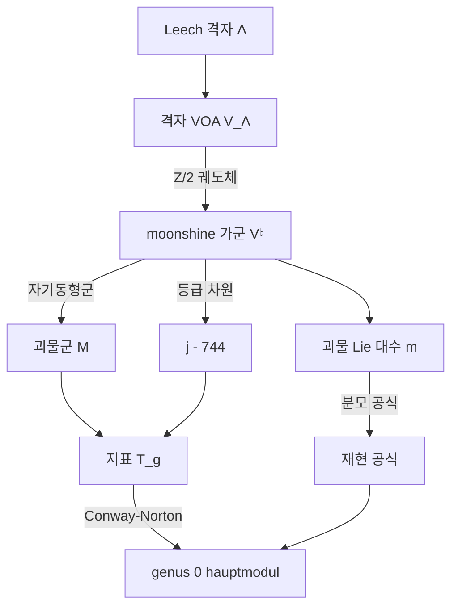
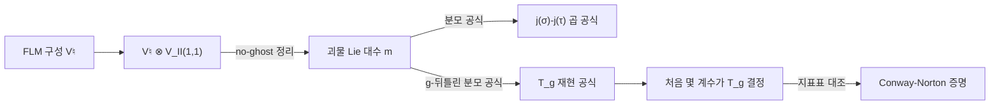

# 괴물 달빛 추측

# 개요

[유한 단순군 분류](finite-simple-groups.md)의 끝에 26 개의 **산재군**(sporadic group)이 남는다. 어떤 무한 계열에도 속하지 않는 예외들이고, 그 중 가장 큰 것이 **괴물군**(Monster) $\mathbb M$ 이다. 위수가

$$
|\mathbb M|=2^{46}3^{20}5^97^611^213^3\cdot17\cdot19\cdot23\cdot29\cdot31\cdot41\cdot47\cdot59\cdot71\approx8\times10^{53}
$$

이고, 켤레류가 194 개이므로 [기약표현](group-representations.md)도 194 개다. 자명표현 다음으로 작은 기약표현의 차원이 $196883$ 이다.

반대편에 [모듈러 형식](modular-forms.md) 쪽의 $j$ 불변량이 있다. $\mathrm{SL}_2(\mathbb Z)$ 의 상반평면 몫이 구면이고, 그 구면의 좌표 하나를 주는 함수가 $j$ 다. $q$ 전개는

$$
j(\tau)=q^{-1}+744+196884\,q+21493760\,q^2+864299970\,q^3+\cdots
$$

1978 년에 McKay 가 $196884=196883+1$ 을 알아챘다. 유한군 지표표의 숫자와 모듈러 함수의 Fourier 계수는 서로 아무 관계가 없어야 할 두 세계의 데이터인데, 첫 계수가 두 기약표현 차원의 합으로 딱 떨어졌다. 우연으로 넘기려다 Thompson 이 다음 계수를 확인했다.

$$
21493760=1+196883+21296876
$$

우연이 아니었다. **괴물 달빛**(monstrous moonshine)은 이 대응이 $\mathbb M$ 의 원소 전체로 확장된다는 Conway–Norton (1979) 의 추측이고, Borcherds 가 1992 년에 증명했다. 다리를 놓은 것은 [theta 급수](theta-functions.md)에서 예고한 대로 Leech 격자에서 만든 [정점작용소대수](vertex-operator-algebras.md) $V^\natural$ 다. 이 무한차원 등급 벡터공간은 $\mathbb M$ 의 표현이면서 동시에 등급 차원의 생성함수가 $j-744$ 다. 증명의 결정적 도구는 여기서 만든 무한차원 Lie 대수이고, 그 분모 공식이 $j$ 의 계수들을 서로 묶는다.

$moonshine$ 은 Conway 가 고른 단어다. 밀주라는 뜻과 달빛이라는 뜻이 겹쳐 있고, "달빛에 홀린 헛소리처럼 보이지만 실체가 있다" 는 당시의 분위기를 그대로 담았다.

# 직관

## 계수가 차원의 합이라는 말의 뜻

수열 $\{c(n)\}$ 의 각 항이 어떤 군 $G$ 의 기약표현 차원들의 음이 아닌 정수 조합으로 쓰인다는 것은, 사실 **등급 표현**이 하나 있다는 말과 같다. $G$-표현 $V_n$ 들을 모아

$$
V=\bigoplus_{n\ge-1}V_n,\qquad \dim V_n=c(n)
$$

으로 두면 된다. 여기까지는 내용이 없다. 차원만 맞추는 표현은 언제나 만들 수 있기 때문이다.

내용은 **다른 원소에서도 맞는가**를 물을 때 생긴다. 표현 $V$ 가 진짜로 있다면 항등원뿐 아니라 모든 $g\in\mathbb M$ 에 대해 지표를 취할 수 있다.

$$
T_g(\tau)=\sum_{n\ge-1}\operatorname{tr}(g\mid V_n)\,q^{n}
$$

$g=e$ 이면 $\operatorname{tr}(e\mid V_n)=\dim V_n$ 이라 $T_e=j-744$ 다. $g\ne e$ 이면 지표값은 차원보다 훨씬 작은 수들이고, 아무 이유 없이 좋은 함수가 될 까닭이 없다. 그런데 Conway 와 Norton 이 추측한 것은 이것이다.

> 모든 $g\in\mathbb M$ 에 대해 $T_g$ 는 어떤 이산부분군 $\Gamma_g<\mathrm{SL}_2(\mathbb R)$ 의 **hauptmodul** 이다.

hauptmodul 은 $\Gamma_g$ 에 의한 상반평면의 몫이 구면(genus 0)일 때 그 구면의 좌표를 주는 유일한 함수다. 194 개의 켤레류 각각에 대해 이런 군이 존재한다는 것이 추측의 내용이고, 이 조건이 극도로 강하다. genus 0 인 모듈러 곡선은 드물기 때문이다.

## 왜 놀라운가

두 숫자 목록이 맞아떨어지는 현상은 보통 셋 중 하나다. 우연이거나, 한쪽이 다른 쪽의 정의를 우회한 것이거나, 둘 다 세 번째 대상의 그림자거나.

첫 계수 하나만 보면 우연이 그럴듯하다. $196884$ 근처에 기약표현 차원이 있을 확률은 낮지 않다. 하지만 계수 다섯 개가 모두 **작은 음이 아닌 정수 계수**로 분해되고, 나아가 194 개의 켤레류 전부에서 genus 0 이 나오는 것은 우연의 범위 밖이다.

세 번째 가능성이 답이었다. $V^\natural$ 이 그 세 번째 대상이다. 대칭군 $\mathbb M$ 은 $V^\natural$ 의 자기동형군으로 나타나고, 모듈러성은 $V^\natural$ 이 등각장론의 공리를 만족하는 데서 나온다. 양쪽이 같은 대상의 두 얼굴이었다.



## Ogg 의 위스키

1975 년에 Ogg 가 전혀 다른 맥락에서 소수 $p$ 를 하나씩 조사하고 있었다. [모듈러 곡선](modular-curves.md) $X_0(p)$ 를 Fricke 대합 $w_p$ 로 더 나눈 곡선 $X_0(p)^+$ 가 언제 genus 0 인가를 물었고, 답은 15 개의 소수였다.

$$
2,3,5,7,11,13,17,19,23,29,31,41,47,59,71
$$

같은 해 $|\mathbb M|$ 의 소인수 목록이 발표되었는데 정확히 이 15 개였다. Ogg 는 강연에서 이 일치를 설명하는 사람에게 Jack Daniel's 한 병을 주겠다고 했다. 달빛 추측에서 보면 이것은 따름정리다. $p$ 위수 원소 $g$ 의 $T_g$ 가 hauptmodul 이려면 $\Gamma_g$ 가 genus 0 이어야 하고, 소수 위수에서 $\Gamma_g$ 가 $\Gamma_0(p)^+$ 로 나오기 때문이다.

# 정의

## McKay–Thompson 급수

$\mathbb M$-등급 가군 $V=\bigoplus_{n\ge-1}V_n$ 이 주어졌을 때 각 $g\in\mathbb M$ 에 대해

$$
T_g(\tau)=\sum_{n\ge-1}\operatorname{tr}\!\left(g\mid V_n\right)q^n,\qquad q=e^{2\pi i\tau}
$$

를 $g$ 의 **McKay–Thompson 급수**라 한다. 지표는 켤레류의 함수이므로 $T_g$ 는 켤레류에만 의존하고, 194 개의 켤레류에서 실제로 서로 다른 급수는 171 개다.

## moonshine 가군

**정점작용소대수**(VOA)는 등각장론의 대칭을 공리화한 대수 구조다. 등급 벡터공간 $V=\bigoplus_n V_n$ 과 각 상태 $a\in V$ 에 형식적 급수

$$
Y(a,z)=\sum_{n\in\mathbb Z}a_{(n)}z^{-n-1},\qquad a_{(n)}\in\operatorname{End}(V)
$$

를 대응시키는 사상, 진공 $\mathbf 1$, Virasoro 원소 $\omega$ 가 주어지고 국소성 공리를 만족한다. $\omega$ 의 모드가 중심전하 $c$ 의 Virasoro 대수를 이루며 $L_0$ 의 고유값이 등급을 준다.

**moonshine 가군** $V^\natural$ 은 Frenkel–Lepowsky–Meurman 이 구성한 중심전하 $24$ 의 VOA로, 다음을 만족한다.

$$
\operatorname{Aut}(V^\natural)\cong\mathbb M,\qquad \sum_{n\ge-1}(\dim V^\natural_n)\,q^n=j(\tau)-744
$$

구성은 두 단계다. Leech 격자 $\Lambda$ 에서 격자 VOA $V_\Lambda$ 를 만들고, $\Lambda$ 의 $-1$ 자기동형이 유도하는 $\mathbb Z/2$ 작용의 **궤도체**(orbifold)를 취한다. 고정부분공간 $V_\Lambda^+$ 에 뒤틀린 부분 $V_\Lambda^{T,+}$ 를 더한 것이 $V^\natural$ 이다.

$$
V^\natural=V_\Lambda^+\oplus V_\Lambda^{T,+}
$$

$\dim V^\natural_1=0$ 인 것이 결정적이다. 격자 VOA 는 무게 1 자리에 Lie 대수를 갖는데, 궤도체가 그것을 지워 버린다. 그래서 $j$ 의 상수항 $744$ 가 빠진 $j-744$ 가 나온다. 무게 2 자리 $V^\natural_2$ 는 차원 $196884$ 이고, 진공을 뺀 $196883$ 차원 부분이 **Griess 대수**다.

## 괴물 Lie 대수

$V^\natural$ 에 쌍곡격자 $\mathrm{II}_{1,1}$ 의 VOA 를 텐서하고 끈 이론의 no-ghost 정리를 적용하면 **일반화된 Kac–Moody 대수**(Borcherds 대수) $\mathfrak m$ 을 얻는다. $\mathbb Z^2$ 로 등급이 매겨지고, 근공간의 차원이

$$
\dim\mathfrak m_{(m,n)}=c(mn),\qquad c(n)=\dim V^\natural_n
$$

이다. 여기서 $(m,n)\ne(0,0)$ 이고 $c(-1)=1$, $c(0)=0$, $c(1)=196884$ 다. 보통의 Kac–Moody 대수와 달리 허근(imaginary simple root)을 허용하는 것이 일반화의 내용이다.

# 성질

## 분모 공식

Borcherds 대수에는 Weyl–Kac 분모 공식의 일반화가 있다. $\mathfrak m$ 에 적용하면 놀랍도록 깔끔한 항등식이 나온다.

$$
j(\sigma)-j(\tau)=p^{-1}\prod_{m>0,\;n\in\mathbb Z}\left(1-p^mq^n\right)^{c(mn)},\qquad p=e^{2\pi i\sigma},\ q=e^{2\pi i\tau}
$$

왼쪽은 두 모듈러 함수의 차이고 오른쪽은 무한곱이다. 이 항등식 하나에 $c(n)$ 들 사이의 무한히 많은 관계가 들어 있다. 양변의 $p^mq^n$ 계수를 비교하면 가장 단순한 것부터

$$
c(4)=c(3)+\frac{c(1)^2-c(1)}{2}
$$

같은 재귀식이 쏟아진다. 실제로 $864299970+\frac{196884^2-196884}{2}=20245856256$ 이다. 이런 관계가 충분히 많아서, 결과적으로 $c(1),c(2),c(3),c(5)$ 네 개만 알면 나머지 계수가 전부 결정된다.

## 재현 공식과 증명의 마무리

$g\in\mathbb M$ 에 대해 $\mathfrak m$ 의 $g$-뒤틀린 분모 공식을 쓰면 $T_g$ 의 계수에 대한 같은 형태의 관계식이 나온다. 이것을 **재현 공식**(replication formula)이라 한다. 결론은

> $T_g$ 는 재현 가능(replicable)하다. 곧 처음 몇 개의 계수가 함수 전체를 결정한다.

Conway 와 Norton 이 추측한 hauptmodul 들도 재현 가능하고 재현 공식을 만족한다는 것이 따로 확인되어 있었다. 그러면 증명은 유한한 대조 작업으로 줄어든다. 각 켤레류에서 $T_g$ 의 처음 몇 계수를 $\mathbb M$ 의 지표표에서 계산해 Conway–Norton 목록의 hauptmodul 과 비교하면, 재현 가능성이 나머지를 보증한다.



Borcherds 는 이 업적으로 1998 년 Fields 메달을 받았다. 정점작용소대수, 일반화된 Kac–Moody 대수, 끈 이론의 no-ghost 정리를 유한군 지표표에 대한 명제로 수렴시킨 증명이다.

## 계수 분해를 직접 확인하기

$j$ 의 계수를 [Eisenstein 급수](eisenstein-series.md)에서 계산하고, $\mathbb M$ 의 기약표현 차원으로 분해되는지 확인한다.

```python
N = 8  # q^N 까지

def mul(a, b):
    c = [0] * N
    for i, ai in enumerate(a):
        if ai == 0:
            continue
        for k in range(N - i):
            c[i + k] += ai * b[k]
    return c

def sigma(k, n):
    return sum(d**k for d in range(1, n + 1) if n % d == 0)

# E_4 = 1 + 240 Σ σ_3(n) q^n
E4 = [1] + [240 * sigma(3, n) for n in range(1, N)]

# Δ / q = Π (1-q^n)^24  (q 한 칸을 미리 뺀 형태)
D = [1] + [0] * (N - 1)
for n in range(1, N):
    factor = [0] * N
    factor[0] = 1
    if n < N:
        factor[n] = -1
    for _ in range(24):
        D = mul(D, factor)

# j = E_4^3 / Δ 이므로 q·j = E_4^3 / (Δ/q) 를 나눗셈으로 구한다
num = mul(mul(E4, E4), E4)
qj = [0] * N
for n in range(N):
    s = num[n] - sum(qj[i] * D[n - i] for i in range(n))
    qj[n] = s // D[0]

# qj[n] 이 j 의 q^{n-1} 계수다
c = {n - 1: qj[n] for n in range(N)}
print([c[n] for n in range(-1, 5)])
# [1, 744, 196884, 21493760, 864299970, 20245856256]

# 괴물군 기약표현 차원 (작은 것부터)
chi = [1, 196883, 21296876, 842609326, 18538750076, 19360062527]

# 알려진 head character 분해
decomp = {
    1: [(1, 0), (1, 1)],
    2: [(1, 0), (1, 1), (1, 2)],
    3: [(2, 0), (2, 1), (1, 2), (1, 3)],
    4: [(2, 0), (3, 1), (2, 2), (1, 3), (1, 5)],
}
for n, terms in decomp.items():
    total = sum(m * chi[i] for m, i in terms)
    print(n, total, c[n], total == c[n])
# 1 196884 196884 True
# 2 21493760 21493760 True
# 3 864299970 864299970 True
# 4 20245856256 20245856256 True

# 분모 공식이 주는 가장 단순한 재귀식
print(c[4] == c[3] + (c[1]**2 - c[1]) // 2)
# True
```

$n=4$ 에서 $\chi_5=18538750076$ 은 쓰이지 않고 $\chi_6=19360062527$ 이 쓰인다. 분해가 "작은 것부터 욕심껏 채우기" 가 아니라는 증거이고, 실제 표현이 배후에 있다는 신호다.

## genus 0 성질

추측의 핵심이자 가장 설명하기 어려운 부분이 genus 0 이다. 모듈러 함수가 나오는 것까지는 VOA 의 모듈러 불변성으로 이해되지만, 나오는 군이 하필 전부 genus 0 이라는 사실은 그것만으로 따라오지 않는다.

Borcherds 의 증명은 이것을 재현 공식을 거쳐 간접적으로 확인한다. 곧 "genus 0 이 되는 이유" 를 개념적으로 설명하지 않고, 두 목록이 같음을 보인다. 개념적 설명은 그 뒤에 끈 이론 쪽에서 나왔다. Duncan–Frenkel 은 $\mathfrak m$ 의 Rademacher 합 표현을 통해, Paquette–Persson–Volpato 는 $\mathbb M$-궤도체 끈 이론의 물리적 스펙트럼에서 genus 0 을 유도했다. 여전히 순수 대수적인 설명은 없다.

# 활용

## 정점작용소대수 이론

역방향으로 보면 달빛이 VOA 이론의 출발점이다. $V^\natural$ 을 구성하려는 시도가 정점작용소대수의 공리를 낳았고, 그것이 2 차원 등각장론의 수학적 기초가 되었다. 지금은 모듈러 텐서범주, 양자군, 3 차원 위상적 장론과 엮여 독립된 분야다.

## 일반화된 달빛과 umbral moonshine

- **일반화된 달빛.** Norton 은 켤레류 하나가 아니라 교환하는 쌍 $(g,h)$ 에 모듈러 함수를 대응시키는 확장을 제안했고, Carnahan 이 증명했다. $V^\natural$ 의 $g$-뒤틀린 가군 위에서 $h$ 의 지표를 보는 것이다.
- **Mathieu 달빛.** Eguchi–Ooguri–Tachikawa (2010) 가 K3 곡면의 타원 종수를 $\mathcal N=4$ 지표로 분해하면서, 계수가 산재군 $M_{24}$ 의 기약표현 차원으로 분해됨을 관찰했다.
- **umbral moonshine.** Cheng–Duncan–Harvey 가 Mathieu 달빛을 23 개의 Niemeier 격자 각각에 대한 사례로 확장했다. $M_{24}$ 는 Leech 를 뺀 24 차원 짝수 유니모듈러 격자 중 하나에 딸린 경우다. Duncan–Griffin–Ono 가 존재를 증명했다.

$M_{24}$ 와 Niemeier 격자가 다시 나오는 데서 보이듯, 24 차원 격자의 분류가 이 현상들의 공통 바탕이다.

## 물리와 양자 중력

$V^\natural$ 은 중심전하 $24$ 의 등각장론이고, $\mathbb M$ 은 그 대칭군이다. Witten 은 이것을 $\mathrm{AdS}_3$ 순수 양자 중력의 경계 이론 후보로 제안했다. 계수 $c(n)$ 이 BTZ 블랙홀의 상태 수를 세고 있다는 해석이고, 확정되지는 않았지만 genus 0 의 물리적 유도를 끌어낸 계기가 되었다.

## 산재군을 보는 관점

26 개의 산재군은 오랫동안 "분류 정리에 남은 예외 목록" 이었다. 달빛은 그 중 상당수가 하나의 구조에서 나온다는 것을 보였다. 괴물의 부분몫으로 얻어지는 20 개를 "행복한 가족" 이라 부르고, 나머지 6 개를 "파리아" 라 부른다. 예외들이 왜 그 개수만큼 있는지는 여전히 모르지만, 적어도 대부분이 서로 무관하지 않다는 것은 알게 되었다.

[^1]: 원 추측은 J. Conway, S. Norton, "Monstrous Moonshine", *Bull. LMS* 11 (1979). 증명은 R. Borcherds, "Monstrous moonshine and monstrous Lie superalgebras", *Invent. Math.* 109 (1992). $V^\natural$ 의 구성은 I. Frenkel, J. Lepowsky, A. Meurman, *Vertex Operator Algebras and the Monster* (1988). 개괄로는 T. Gannon, *Moonshine Beyond the Monster* (2006) 이 읽을 만하다. umbral moonshine 은 M. Cheng, J. Duncan, J. Harvey, "Umbral Moonshine", *Commun. Number Theory Phys.* 8 (2014). 본문의 계수 계산은 직접 한 것이다.

# 연관 문서

## 선수지식

- [theta 급수와 Dedekind eta](theta-functions.md)
- [유한 단순군 분류](finite-simple-groups.md)
- [정점작용소대수](vertex-operator-algebras.md)

## 더 알아보기

- [Umbral moonshine 과 Mathieu 달빛](umbral-moonshine.md)

#number_theory #group_theory #complex_analysis
