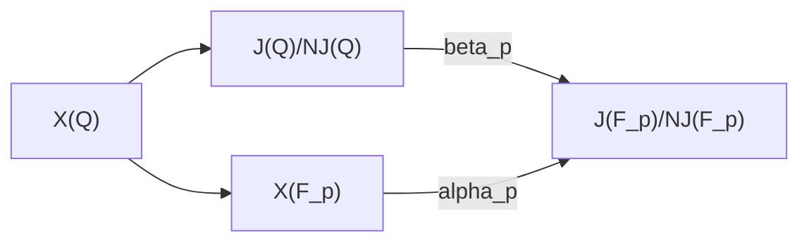

# Mordell–Weil 시브

# 개요

[Chabauty 방법](chabauty-method.md)은 종수 $2$ 이상 곡선의 유리점을 품는 $p$ 진 유한집합을 내놓지만, 그 집합의 어느 점이 유리점인지는 가리지 않는다.

**Mordell–Weil 시브**는 유리점이 Jacobi 다양체의 유리점군에서 갖는 잉여류를 소수마다 걸러 좁히는 절차다. 남은 잉여류가 이미 찾은 점들로 모두 설명되면 유리점의 목록이 완결되고, 남은 잉여류가 없으면 유리점이 없다.

# 직관

곡선 $X$ 의 유리점 $P_0$ 를 기준으로 잡고 $P\mapsto\lbrack P-P_0\rbrack$ 으로 [Jacobi 다양체](jacobian-variety.md) $J$ 에 넣으면 $X(\mathbb Q)\subseteq J(\mathbb Q)$ 다. $J(\mathbb Q)$ 의 계수가 $1$ 이고 생성원이 $D$ 이면 유리점 $P$ 마다 $P-P_0=nD$ 인 정수 $n$ 이 하나 정해지고, 어느 $n$ 이 $X$ 위의 점을 주는지 묻는 문제가 된다. $n$ 에 상한이 없으니 하나씩 대입할 수 없다.

$X$ 가 좋은 환원을 갖는 소수 $p$ 로 환원하면 $J(\mathbb F_p)$ 가 유한군이고 $D$ 의 상은 위수 $m_p$ 를 갖는다. 그러면 $nD$ 의 환원은 $n$ 을 $m_p$ 로 나눈 나머지로만 정해지고, 그 점은 $X(\mathbb F_p)$ 의 점이어야 한다. $X(\mathbb F_p)$ 의 점마다 $J(\mathbb F_p)$ 에서의 상을 계산해 $m_p$ 개의 나머지 가운데 허용되는 것만 남기고, 소수를 여러 개 쓰면 $n$ 은 각 $m_p$ 에 대한 합동을 동시에 만족해야 한다. 교차한 나머지 집합이 비면 유리점이 없다.

# 정의

## Abel–Jacobi 삽입

$X$ 가 $\mathbb Q$ 위의 종수 $g\ge2$ 곡선이고 유리점 $P_0$ 를 가질 때

$$
\iota: X\to J,\qquad P\mapsto\lbrack P-P_0\rbrack
$$

는 $\mathbb Q$ 위에서 정의된 닫힌 삽입이다. 이 삽입으로 $X(\mathbb Q)$ 를 $J(\mathbb Q)$ 의 부분집합으로 본다. Mordell–Weil 정리로 $J(\mathbb Q)$ 는 유한생성이고, 그 생성원은 [하강](selmer-tate-shafarevich.md)으로 구한다.

## 시브 도형

$N$ 을 양의 정수, $p$ 를 $X$ 가 좋은 환원을 갖고 $N$ 을 나누지 않는 소수라 한다. 환원 사상과 몫 사상이 다음 도형을 가환으로 만든다.

$\alpha_p$ 는 $X(\mathbb F_p)$ 의 점을 $J(\mathbb F_p)/NJ(\mathbb F_p)$ 로 보내고, $\beta_p$ 는 $J(\mathbb Q)/NJ(\mathbb Q)$ 를 같은 군으로 보낸다. 유리점 $P$ 의 잉여류는 두 경로로 같은 원소를 주므로 $\beta_p(\lbrack P\rbrack)$ 가 $\alpha_p$ 의 상에 든다.

## 허용 잉여류 집합

소수들의 유한집합 $S$ 와 양의 정수 $N$ 에 대해

$$
A(N,S)=\bigcap_{p\in S}\beta_p^{-1}\lbrack\alpha_p(X(\mathbb F_p))\rbrack\subseteq J(\mathbb Q)/NJ(\mathbb Q)
$$

를 **허용 잉여류 집합**이라 한다. $X(\mathbb Q)$ 의 모든 점의 잉여류가 $A(N,S)$ 에 든다.

## 깊이

$N$ 을 키우는 것을 시브의 **깊이**를 늘린다고 한다. 계수가 $r$ 이면 $J(\mathbb Q)/NJ(\mathbb Q)$ 의 크기는 $N^r$ 에 비틀림에서 오는 인수를 곱한 것이고, $\beta_p$ 의 계산량이 이 크기에 비례한다. 소수 $p$ 는 $\char35{}J(\mathbb F_p)$ 가 $N$ 의 소인수로 많이 나뉘는 것을 고른다.

# 성질

## 시브의 건전성

**정리.** $A(N,S)=\varnothing$ 이면 $X(\mathbb Q)=\varnothing$ 이다.

유리점 $P$ 가 있으면 그 잉여류가 모든 $p\in S$ 에서 $\beta_p(\lbrack P\rbrack)=\alpha_p(\bar P)$ 를 만족한다. $\bar P$ 는 $P$ 의 $\mathbb F_p$ 환원이다. 따라서 $\lbrack P\rbrack\in A(N,S)$ 이고 $A(N,S)$ 가 비지 않는다. ∎

## 유리점 목록의 완결

**정리.** 알려진 유리점들의 잉여류가 $A(N,S)$ 와 같고, $J(\mathbb Q)/NJ(\mathbb Q)$ 의 각 잉여류에 유리점이 하나 넘게 들지 않으면 $X(\mathbb Q)$ 는 그 점들로 끝난다.

잉여류가 같은 두 점이 있는 경우를 배제하는 데 Chabauty 방법이 쓰인다. 잔차 원판마다 [Coleman 적분](coleman-integration.md)의 영점 개수가 $1$ 로 눌리면 그 원판의 유리점이 하나 이하이고, 같은 잉여류의 두 점은 같은 원판에 놓이므로 일치한다.[^1]

## 조건부 완전성

**정리.** $\text{Ш}(J)$ 의 나눌 수 있는 부분군이 자명하다고 가정한다. $X(\mathbb Q)=\varnothing$ 이고 유리점의 부재가 유한 하강 장애로 설명되면, 어떤 $N$ 과 어떤 유한집합 $S$ 에 대해 $A(N,S)=\varnothing$ 이다.[^2]

유한 하강 장애는 $J$ 의 $N$ 분할 덮개에서 오는 국소 조건의 모임이고, $A(N,S)$ 가 그 조건을 $S$ 의 소수에서 유한 번 확인한 것과 같다. 가정은 $J(\mathbb Q)$ 의 $N$ 진 완비화가 $\text{Ш}$ 의 원소를 섞지 않게 한다.

# 활용

- **종수 $2$ 곡선의 유리점 부재.** 계수가 종수와 같거나 큰 곡선은 Chabauty 조건이 깨져 $p$ 진 적분을 쓸 수 없다. 이때 시브만으로 $A(N,S)=\varnothing$ 을 보여 유리점이 없음을 증명한다.[^1]
- **일반화 Fermat 방정식.** $x^2+y^3=z^7$ 의 원시해는 $X(7)$ 의 뒤틀림 곡선 열 개의 유리점에 대응하고, 각 곡선에서 Chabauty 방법과 시브를 함께 써서 해를 전부 결정했다.[^3]
- **Chabauty–Kim 방법의 마지막 단계.** [Chabauty–Kim 방법](chabauty-kim.md)은 깊이 $2$ 의 절단에서 $X(\mathbb Q_p)\_2$ 를 계산하고, 그 가운데 유리점이 아닌 점을 시브로 걸러낸다. 준수 $13$ 의 분해 Cartan [모듈러 곡선](modular-curves.md)의 유리점 결정이 이 조합으로 끝났다.[^4]
- **생성원 계산의 전제.** $\beta_p$ 를 계산하려면 $J(\mathbb Q)$ 의 생성원이 명시적으로 있어야 하므로, 하강으로 [Selmer 군](selmer-tate-shafarevich.md)을 구해 계수와 생성원을 확정하는 단계가 먼저 온다.

[^1]: N. Bruin, M. Stoll, "The Mordell–Weil sieve: proving non-existence of rational points on curves", *LMS J. Comput. Math.* **13** (2010).
[^2]: M. Stoll, "Finite descent obstructions and rational points on curves", *Algebra & Number Theory* **1** (2007).
[^3]: B. Poonen, E. Schaefer, M. Stoll, "Twists of $X(7)$ and primitive solutions to $x^2+y^3=z^7$", *Duke Math. J.* **137** (2007).
[^4]: J. Balakrishnan, N. Dogra, J. Müller, J. Tuitman, J. Vonk, "Explicit Chabauty–Kim for the split Cartan modular curve of level 13", *Ann. of Math.* **189** (2019).

# 연관 문서

## 선수지식

- [Chabauty 방법](chabauty-method.md)
- [Selmer 군과 Tate–Shafarevich 군](selmer-tate-shafarevich.md)

## 더 알아보기

아직 연결한 문서가 없다.

#number_theory #algebra #computation
