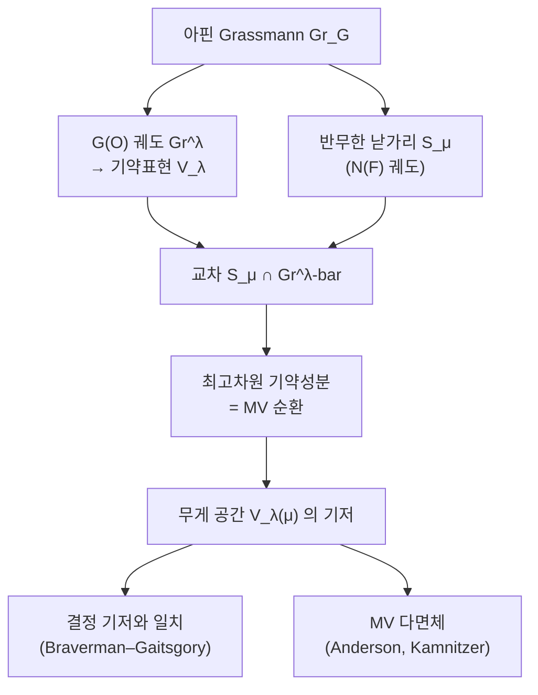

# MV 순환과 무게 기저의 기하

# 개요

[기하학적 Satake 대응](geometric-satake.md)은 아핀 Grassmann 다양체 위의 퍼버스 층의 [범주](category.md)가 쌍대군의 표현 범주와 같다고 말한다.

$$
\mathrm{Perv}\_{G(\mathcal O)}(\mathrm{Gr}\_G)\ \simeq\ \mathrm{Rep}(\widehat G)
$$

동치가 있으면 양쪽의 모든 것이 옮겨진다. 그러면 표현의 무게 공간이 [층](sheaves.md) 쪽에서 무엇인지 묻게 된다.

Mirković–Vilonen 은 반무한 낟가리라 부르는 궤도와 층으로 답했다. 그렇게 자르면 무게 공간 $V_\lambda(\mu)$ 의 기저가 어떤 대수적 순환들의 집합으로 나온다.

$$
\dim V_\lambda(\mu)=\char35{}\lbrace\text{무게 }\mu\text{ 의 MV 순환}\rbrace
$$

[Weyl 지표 공식](weyl-character-formula.md)은 무게 중복도를 교대합으로 준다. Kostant 중복도 공식이 그 한 형태이고, 부호가 엇갈리는 합이라 값이 왜 음이 아닌지가 공식만 보아서는 보이지 않는다. MV(Mirkovic–Vilonen) 순환은 그 수를 **세는 대상**으로 바꾼다. 교대합 대신 집합이 놓이므로 음이 아님이 자명해진다.

같은 일을 하는 조합론적 장치가 여럿 있다. 대각표, Gelfand–Tsetlin 패턴, Littelmann 경로, Lusztig–Kashiwara 의 결정 기저. MV 순환은 그것들의 **기하적 실현**이고, 다른 장치들이 왜 같은 수를 세는지에 대한 통일된 이유를 준다.

# 직관

## 반무한 궤도와 무게 분해

$\mathrm{Gr}\_G$ 위에서 $G(\mathcal O)$ 궤도는 지배적 여무게 $\lambda$ 로 매겨지고, 그 궤도의 닫힘 위의 교차 코호몰로지 층 $\mathcal{IC}\_\lambda$ 가 기약표현 $V_\lambda$ 에 대응한다. 여기까지가 기하학적 Satake다.

무게 분해를 얻으려면 표현을 쌍대 토러스 $\widehat T$ 로 제한해야 하고, 층 쪽에서 그것에 해당하는 조작이 다른 부분군의 궤도로 자르는 것이다. $N$ 을 멱단 부분군이라 할 때 그 궤도 $S_\mu=N(F)\cdot t^\mu$ 를 **반무한 낟가리**(semi-infinite cell)라 한다. 이름 그대로 무한차원이면서 여차원도 무한이다.

$$
V_\lambda(\mu)\ \cong\ H^{\bullet}\_c\bigl(S_\mu\cap\overline{\mathrm{Gr}^\lambda},\ \mathcal{IC}\_\lambda\bigr)
$$

핵심은 이 교차가 **순수 차원**이라는 것이다. 차원이 고르므로 최고차원 기약성분들이 코호몰로지의 기저를 곧바로 준다. 그 성분들의 닫힘이 **MV 순환**이다.

## Kostant 공식과의 대비

Kostant 중복도 공식은 이렇다.

$$
m_\lambda(\mu)=\sum_{w\in W}(-1)^{\ell(w)}\thinspace\mathcal P\bigl(w(\lambda+\rho)-(\mu+\rho)\bigr)
$$

$\mathcal P$ 는 Kostant 분할 함수다. Weyl 군의 크기만큼 항이 있고 부호가 엇갈린다. $A_2$ 면 항이 여섯 개이고, 큰 군에서는 항 수가 폭발하면서 각 항이 답보다 훨씬 커진다. 답이 3 인데 항들이 수백 단위로 오가며 상쇄되는 일이 예사다.

상쇄가 일어나면 세는 대상이 잘못된 것이다. 올바른 대상을 세면 상쇄가 없어야 한다. MV 순환은 그 올바른 대상이고, 기하가 그것이 실제로 존재함을 보증한다. 조합론 쪽의 대각표나 Littelmann 경로도 같은 역할을 하지만, 그것들은 손으로 만든 규칙이라 왜 맞는지가 따로 증명되어야 한다. MV 순환은 정의부터 표현론적이다.

## MV 다면체

MV 순환 하나에 모멘트 사상을 씌우면 다면체가 나온다. Anderson 과 Kamnitzer 가 보인 것은 그 다면체가 순환을 완전히 결정한다는 것이다.

$$
\lbrace\text{MV 순환}\rbrace\ \longleftrightarrow\ \lbrace\text{MV 다면체}\rbrace
$$

MV 다면체는 꼭짓점이 $W\lambda$ 의 부분집합이고 면의 위치가 부등식 자료(Berenstein–Zelevinsky 자료)로 주어지는 볼록다면체다. 곧 무한차원 다양체의 기하가 **유한한 볼록기하**로 압축된다. 계산이 가능해지는 지점이고, 결정 기저의 조합론과 맞물리는 지점이기도 하다.

# 정의

## 아핀 Grassmann 다양체와 Borel

$G$ 를 복소 환원군, $F=\mathbb C((t))$ 와 $\mathcal O=\mathbb C[[t]]$ 로 두고 아핀 Grassmann 다양체를 $\mathrm{Gr}\_G=G(F)/G(\mathcal O)$ 라 한다. $T\subset B=TN$ 을 극대 토러스와 Borel 이라 하자.

여무게 $\mu\in X_\ast(T)$ 에 대해 $t^\mu\in\mathrm{Gr}\_G$ 를 대응하는 점이라 하고 두 종류의 궤도를 둔다.

$$
\mathrm{Gr}^\lambda=G(\mathcal O)\cdot t^\lambda\ (\lambda\ \text{지배적}),\qquad
S_\mu=N(F)\cdot t^\mu
$$

앞의 것은 유한차원이고 그 닫힘이 사영다양체다. 뒤의 것이 **반무한 낟가리**다.

## MV 순환

> **정리 (Mirković–Vilonen).** $\lambda$ 가 지배적이고 $\mu\le\lambda$ 이면
> $$
> \dim\bigl(S_\mu\cap\overline{\mathrm{Gr}^\lambda}\bigr)=\langle\rho,\lambda+\mu\rangle
> $$
> 이고, 이 교차는 순수 차원이다. 그 최고차원 기약성분들의 닫힘을 **MV 순환**이라 한다.

> **따름정리.** 무게 $\mu$ 의 MV 순환들의 기본류가 $V_\lambda(\mu)$ 의 기저를 이룬다. 특히
> $$
> \dim V_\lambda(\mu)=\char35{}\lbrace\lambda\ \text{에 대한 무게 }\mu\text{ 의 MV 순환}\rbrace
> $$

순수 차원이라는 것이 증명의 핵심이고, 그것이 있어야 기약성분과 코호몰로지 기저가 일대일로 대응한다.

## MV 다면체

$T$ 작용의 모멘트 사상 $\Phi:\mathrm{Gr}\_G\to X_\ast(T)\otimes\mathbb R$ 를 MV 순환 $Z$ 에 제한해 상의 볼록포를 취한 것이 **MV 다면체** $\mathrm{Pol}(Z)$ 다. 대응 $Z\mapsto\mathrm{Pol}(Z)$ 는 단사이고, 상이 Berenstein–Zelevinsky 부등식으로 기술된다.

# 성질

## 결정 기저와의 관계

MV 순환들의 집합에 결정(crystal) 구조가 들어간다. 곧 $\tilde e_i,\tilde f_i$ 연산자가 순환들 사이에서 정의되고, 그 결과가 Kashiwara–Lusztig 의 결정 기저와 동형이다.

> **정리 (Braverman–Gaitsgory, Kamnitzer).** MV 순환의 결정은 $B(\lambda)$ 와 동형이다.

대각표, Littelmann 경로, Lusztig 의 표준 단항식은 모두 같은 결정의 다른 실현이므로 같은 수를 센다. MV 순환은 그 결정의 기하적 실현이다. 결정 기저는 양자군의 $q\to0$ 극한에서 나온 대수적 대상이고, 기하 쪽에서 같은 대상이 독립적으로 구성되었다.

MV 순환이 주는 것은 기저이지 표준적인 하나의 기저가 아니다. 기본류를 쓰려면 각 순환에 방향을 주어야 하고 그 선택에 모호성이 있다. 결정 구조는 그 모호성에 영향받지 않는 층위의 자료다.

# 활용

## 기하학적 Satake 의 정련

기하학적 Satake 는 범주 동치를 준다. MV 이론은 그 동치를 무게 수준까지 정련해, $\mathrm{Rep}(\widehat G)$ 의 대상뿐 아니라 그 대상의 무게 분해까지 층 쪽에서 읽게 한다. 텐서곱의 분해인 [Littlewood–Richardson 계수](littlewood-richardson.md)도 MV 순환들의 교차 자료로 표현되며, 포화 정리의 기하적 증명이 이 표현을 쓴다.

## 아핀 Grassmann 다양체의 특이점

$\overline{\mathrm{Gr}^\lambda}$ 는 일반적으로 특이점을 갖고, 그 특이점의 성격이 표현론의 자료로 읽힌다. $\mathcal{IC}$ 층의 국소 코호몰로지 차원이 [Kazhdan–Lusztig 다항식](kazhdan-lusztig.md)(아핀판)으로 주어지고, MV 순환은 그 층을 자른 조각이다. 특이점을 푸는 문제와 무게 중복도를 세는 문제가 같은 대상의 두 면이다.

## 게이지 이론, 적분가능계, 산술

- **Coulomb 가지와 대칭 쌍대성**: 물리에서 나온 3 차원 게이지 이론의 Coulomb 가지가 $\mathrm{Gr}\_G$ 의 변종으로 구성되고, MV 이론의 기법이 그대로 쓰인다.
- **적분가능계**: MV 다면체의 조합론이 Berenstein–Zelevinsky 의 tropical 자료, 나아가 cluster 대수와 이어진다.
- **산술 쪽으로의 되돌림**: [Casselman–Shalika 공식](casselman-shalika.md)처럼 함수 수준에서 계산되던 것들이 층 수준 진술에서 점을 센 결과로 이해된다. $\mathbb F_q$ 점을 세면 다시 $p$ 진 적분이 나온다.

[기하학적 Satake](geometric-satake.md) 에서 함수를 층으로 올리고 MV 이론에서 무게까지 내리면, Kostant 공식이 교대합으로 주던 무게 중복도가 세는 대상을 갖는다.

# 연관 문서

## 선수지식

- [기하학적 Satake 대응](geometric-satake.md)
- [Weyl 지표 공식과 최고무게 이론](weyl-character-formula.md)

## 더 알아보기

아직 연결한 문서가 없다.

#number_theory #group_theory #combinatorics #algebraic_topology
