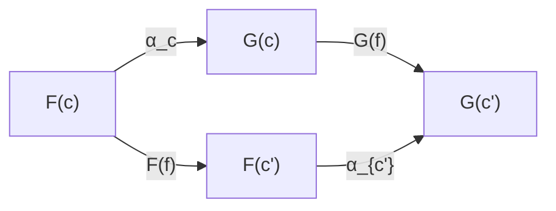

# 자연변환

# 개요

자연변환은 같은 두 범주 사이를 잇는 두 [functor](functors.md) 를 비교하는 방법이다. $F$ 와 $G$ 가 대상마다 내놓는 결과를 사상 하나로 잇되 그 이음이 원래 범주의 모든 사상과 양립해야 한다.

이 조건이 "자연스럽다" 는 말에 정확한 뜻을 준다. 유한차원 벡터 공간과 그 쌍대공간은 차원이 같아 동형이지만 그 동형은 기저를 골라야 정해진다. 벡터 공간과 이중쌍대공간 사이의 동형은 아무것도 고르지 않고 만들어진다. 임의의 선택 없이 모든 사상과 동시에 어울리는 대응만이 자연변환이다.

# 직관

## 선택 없이 만들어지는 대응

$V$ 에서 $V^\ast$ 로 가려면 기저를 정해야 하고 기저를 바꾸면 대응도 바뀌므로 이 동형은 선형사상들과 일관되게 어울리지 않는다. $V$ 에서 $V^{\ast\ast}$ 로 가는 대응은 $v$ 를 $\varphi \mapsto \varphi(v)$ 로 보내면 되고 선택이 필요 없다. 전자는 자연동형이 아니고 후자는 자연동형이다.

## naturality 사각형

$C$ 의 사상 $f$ 를 먼저 따라간 뒤 옮기는 것과, 옮긴 뒤 $D$ 쪽에서 따라가는 것이 같아야 한다.



대상마다 아무 사상이나 고르면 이 사각형이 닫히지 않는다. 사각형이 모든 $f$ 에 대해 닫힌다는 것은 대응이 각 대상을 따로 보고 정해진 것이 아니라 구조 전체를 보고 정해졌다는 뜻이다.

# 정의

## 성분과 naturality

$C$ 와 $D$ 를 범주, $F, G : C \to D$ 를 functor 라 하자. 자연변환 $\alpha : F \Rightarrow G$ 는 $C$ 의 각 대상 $c$ 마다 $D$ 의 사상 $\alpha_c : F(c) \to G(c)$ 를 지정하되 $C$ 의 모든 사상 $f : c \to c'$ 에 대해 다음을 만족하는 것이다.

$$
\alpha_{c'}\circ F(f)=G(f)\circ\alpha_c
$$

$\alpha_c$ 가 $\alpha$ 의 $c$ 성분이다. 모든 성분이 동형사상이면 $\alpha$ 가 자연동형이고, 이때 성분별 역 $\alpha_c^{-1}$ 도 naturality 를 만족해 $G \Rightarrow F$ 인 역 자연변환이 된다.

## 두 가지 합성

- **수직 합성.** $\alpha : F \Rightarrow G$ 와 $\beta : G \Rightarrow H$ 에 대해 $(\beta \circ \alpha)_c = \beta_c \circ \alpha_c$ 로 정의한다. 두 naturality 사각형을 옆으로 붙이면 합성의 naturality 가 나온다.
- **수평 합성.** $C \to D$ 위의 $\alpha : F \Rightarrow G$ 와 $D \to E$ 위의 $\beta : H \Rightarrow K$ 에 대해 $(\beta \ast \alpha)\_c = K(\alpha_c) \circ \beta_{F(c)} = \beta_{G(c)} \circ H(\alpha_c)$ 로 정의한다. 두 표현이 같다는 것이 $\beta$ 의 naturality 다.

두 합성은 교환법칙(interchange law)으로 맞물리고, 이 구조가 범주·functor·자연변환을 2-범주로 만든다.

## Functor 범주

$C$ 에서 $D$ 로 가는 functor 들을 대상으로, 자연변환들을 사상으로, 수직 합성을 합성으로 삼으면 범주 $[C, D]$ 가 된다. 항등 자연변환은 각 성분이 항등사상인 것이고 이 범주에서의 동형이 자연동형이다.

# 성질

## 자연동형과 범주의 동치

Functor $F : C \to D$ 와 $G : D \to C$ 에 대해 $GF \cong \mathrm{id}_C$ 이고 $FG \cong \mathrm{id}_D$ 인 자연동형이 있으면 두 범주는 동치다. 대상이 일대일 대응하는 동형보다 약하지만 실제로 쓰이는 것은 거의 언제나 동치이고, 사상까지 포함해 같음을 재는 방식이다.

## 예와 반례

- **멱집합.** 집합 $X$ 를 $P(X)$ 로, 함수를 직접상으로 보내는 functor $P$ 에 대해 $\eta_X(x) = \lbrace x\rbrace$ 는 항등 functor 에서 $P$ 로 가는 자연변환이다. $P(h)(\eta_X(x)) = \lbrace h(x)\rbrace = \eta_Y(h(x))$ 이므로 사각형이 닫힌다.
- **이중쌍대.** $V \mapsto V^{\ast\ast}$ 는 유한차원 벡터 공간 위에서 항등 functor 와 자연동형이다. $V \mapsto V^\ast$ 는 반변 functor 라 항등 functor 와 비교할 수 없고, 차원이 같다는 사실로 만든 동형은 기저 선택에 의존해 naturality 가 깨진다.
- **행렬식.** 가환환 $R$ 에 $\mathrm{GL}\_n(R)$ 을 대응시키는 functor 와 단원군 $R^\times$ 를 대응시키는 functor 사이에서 $\det$ 은 자연변환이다. 환 준동형을 성분별로 적용한 뒤 행렬식을 재나 행렬식을 잰 뒤 준동형을 적용하나 같다. 행렬식 공식이 환에 의존하지 않는다는 말의 정확한 형태다.
- **역행렬.** $A \mapsto A^{-1}$ 은 $\mathrm{GL}\_n$ 에서 $\mathrm{GL}\_n$ 으로 가는 자연변환이 아니다. 순서를 뒤집으므로 반변으로 놓아야 한다.

## 다형성과 naturality

리스트를 뒤집는 연산은 원소가 무엇인지 보지 않고 위치만 다루므로 `map f (reverse xs) = reverse (map f xs)` 가 항상 성립한다. 값을 들여다보는 연산은 그렇지 않다.

```python
fmap = lambda f, xs: [f(x) for x in xs]      # List functor 의 사상 대응

rev    = lambda xs: xs[::-1]                 # 후보 1: 위치만 본다
picky  = lambda xs: [x for x in xs if x > 1] # 후보 2: 값을 들여다본다

xs = [0, 1, 2]
f = lambda x: x + 10

for alpha in (rev, picky):
    print(fmap(f, alpha(xs)) == alpha(fmap(f, xs)))
# True    reverse 는 List ⇒ List 자연변환
# False   [12] vs [10, 11, 12]
```

`picky` 가 깨지는 것은 원소를 `f` 로 옮기고 나면 조건을 만족하는 원소가 달라지기 때문이다. 자연변환은 무엇이 들어 있는지 묻지 않고 구조만 다루는 연산이며, 타입 변수에 대해 다형인 함수가 대체로 자연변환인 것도 같은 이유다.

## 상위 이론으로 가는 입구

- [Yoneda lemma](yoneda-lemma.md)는 hom functor 에서 나가는 자연변환 전체를 한 원소로 분류한다.
- [Adjunction](adjunctions.md)의 unit 과 counit 은 자연변환이고 삼각항등식은 그들의 합성에 대한 조건이다.
- [제한과 쌍대제한](limits-colimits.md)의 원뿔은 상수 functor 에서 도형 functor 로 가는 자연변환이다.

세 주제 모두 자연변환을 셀 수 있게 만든다.

# 활용

- **구성의 일관성.** 이 동형이 표준적이다, 이 공식은 좌표에 의존하지 않는다, 이 최적화는 언제나 안전하다 같은 문장이 모두 어떤 자연변환의 naturality 로 번역된다. 증명할 것이 사각형 하나로 고정된다.
- **이론 사이의 번역.** 호몰로지 이론의 연결 준동형, 대수적 구성의 표준 사상, 표현론의 지표 대응이 자연변환으로 서술된다. 사상이 모든 경우에 동시에 정의된다는 점이 정리의 진술을 짧게 만든다.
- **프로그램 변환.** 컨테이너의 구조만 바꾸는 함수(뒤집기, 앞뒤 자르기, 리스트를 옵션으로 바꾸기)는 자연변환이고 naturality 등식이 컴파일러의 재작성 규칙이 된다. `map` 을 자연변환 앞으로 옮기거나 뒤로 미루는 변환이 그래서 안전하다.[^1]

[^1]: Emily Riehl, *Category Theory in Context*, §1.4 (Definition 1.4.1·1.4.3, Example 1.4.4). 자연변환, 자연동형, singleton 및 double-dual 예시. https://emilyriehl.github.io/files/context.pdf

# 연관 문서

## 선수지식

- [Functor](functors.md)

## 더 알아보기

- [Yoneda lemma](yoneda-lemma.md)
- [Adjunction](adjunctions.md)
- [제한과 쌍대제한](limits-colimits.md)

#category_theory
